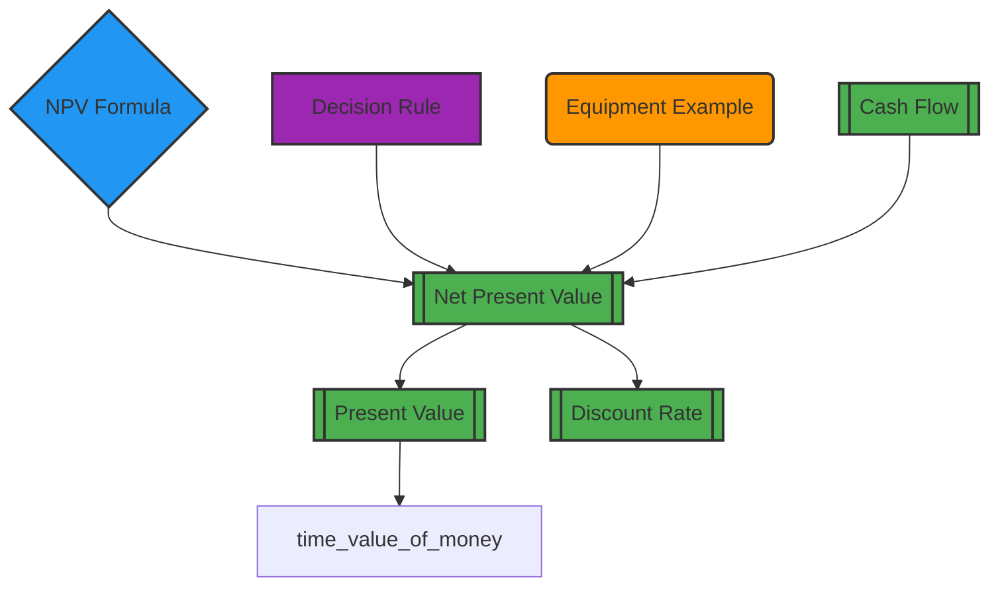
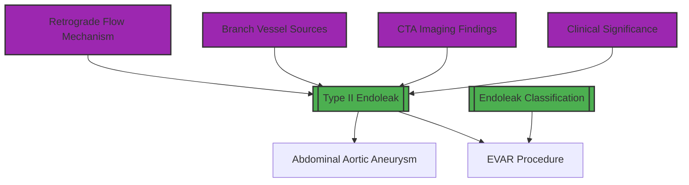
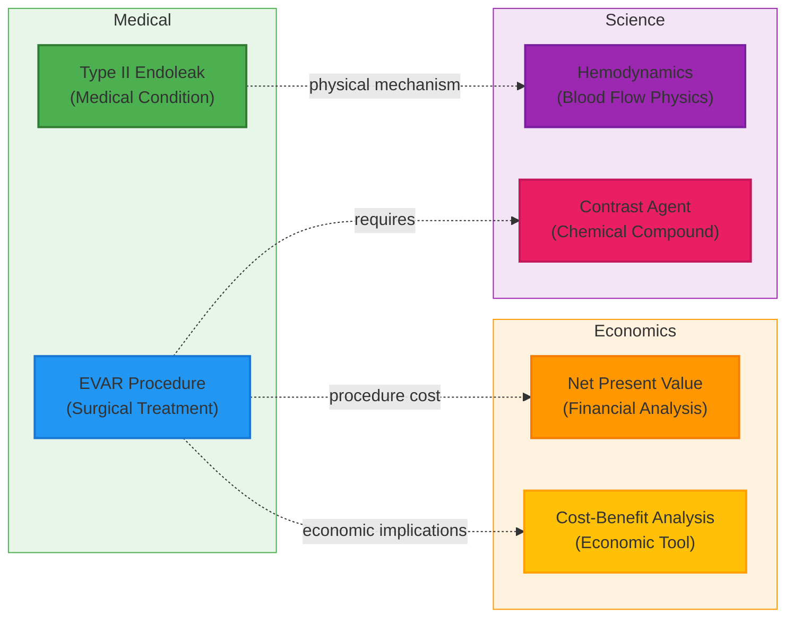
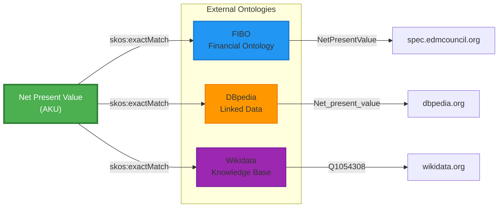

# Ontology Relationship Visualization Examples

**Date**: 2025-12-28  
**Purpose**: Sample visualizations of SKOS relationships and ontology structures in WorldSMEGraphs

---

## Overview

This document provides visual examples of how the ontology integration system represents knowledge relationships using SKOS (Simple Knowledge Organization System) standards.

---

## Example 1: Single Concept Hierarchy (NPV)

### ASCII Tree View

```
======================================================================
CONCEPT: Net Present Value
ID: aku-001-npv-definition
======================================================================

📈 BROADER CONCEPTS (Parents):
  ↑ time-value-of-money
  ↑ present-value-concept
  ↑ discount-rate-definition
  ↑ cash-flow-concept

🎯 CURRENT: Net Present Value

📉 NARROWER CONCEPTS (Children):
  ↓ npv-decision-rule
  ↓ capital-budgeting
  ↓ project-comparison
  ↓ investment-selection

🔗 RELATED CONCEPTS (Siblings/Associates):
  ↔ internal-rate-of-return
  ↔ profitability-index
  ↔ payback-period
  ↔ discounted-payback

🌐 EXTERNAL ONTOLOGY LINKS:
  → FIBO: https://spec.edmcouncil.org/fibo/ontology/FBC/DebtAndEquities/Debt/NetPresentValue
  → DBpedia: http://dbpedia.org/resource/Net_present_value
  → Wikidata: http://www.wikidata.org/entity/Q1054308

======================================================================
```

### Mermaid Diagram

```mermaid
graph TD
    %% SKOS Concept Hierarchy for: Net Present Value
    aku_001_npv_definition["Net Present Value"]
    style aku_001_npv_definition fill:#4CAF50,stroke:#2E7D32,stroke-width:3px,color:#fff
    time_value_of_money["Time Value Of Money"]
    time_value_of_money -->|skos:broader| aku_001_npv_definition
    style time_value_of_money fill:#2196F3,stroke:#1976D2,stroke-width:2px,color:#fff
    present_value_concept["Present Value Concept"]
    present_value_concept -->|skos:broader| aku_001_npv_definition
    style present_value_concept fill:#2196F3,stroke:#1976D2,stroke-width:2px,color:#fff
    discount_rate_definition["Discount Rate Definition"]
    discount_rate_definition -->|skos:broader| aku_001_npv_definition
    style discount_rate_definition fill:#2196F3,stroke:#1976D2,stroke-width:2px,color:#fff
    cash_flow_concept["Cash Flow Concept"]
    cash_flow_concept -->|skos:broader| aku_001_npv_definition
    style cash_flow_concept fill:#2196F3,stroke:#1976D2,stroke-width:2px,color:#fff
    npv_decision_rule["Npv Decision Rule"]
    aku_001_npv_definition -->|skos:narrower| npv_decision_rule
    style npv_decision_rule fill:#FF9800,stroke:#F57C00,stroke-width:2px,color:#fff
    capital_budgeting["Capital Budgeting"]
    aku_001_npv_definition -->|skos:narrower| capital_budgeting
    style capital_budgeting fill:#FF9800,stroke:#F57C00,stroke-width:2px,color:#fff
    project_comparison["Project Comparison"]
    aku_001_npv_definition -->|skos:narrower| project_comparison
    style project_comparison fill:#FF9800,stroke:#F57C00,stroke-width:2px,color:#fff
    investment_selection["Investment Selection"]
    aku_001_npv_definition -->|skos:narrower| investment_selection
    style investment_selection fill:#FF9800,stroke:#F57C00,stroke-width:2px,color:#fff
    internal_rate_of_return["Internal Rate Of Return"]
    aku_001_npv_definition -.->|skos:related| internal_rate_of_return
    style internal_rate_of_return fill:#9C27B0,stroke:#7B1FA2,stroke-width:2px,color:#fff
    profitability_index["Profitability Index"]
    aku_001_npv_definition -.->|skos:related| profitability_index
    style profitability_index fill:#9C27B0,stroke:#7B1FA2,stroke-width:2px,color:#fff
    payback_period["Payback Period"]
    aku_001_npv_definition -.->|skos:related| payback_period
    style payback_period fill:#9C27B0,stroke:#7B1FA2,stroke-width:2px,color:#fff
    discounted_payback["Discounted Payback"]
    aku_001_npv_definition -.->|skos:related| discounted_payback
    style discounted_payback fill:#9C27B0,stroke:#7B1FA2,stroke-width:2px,color:#fff
```



**Color Legend**:
- 🟢 Green: Current concept (focus)
- 🔵 Blue: Broader concepts (parents)
- 🟠 Orange: Narrower concepts (children)
- 🟣 Purple: Related concepts (siblings/associates)

---

## Example 2: Economics Domain Overview



**Shape Legend**:
- `[[ ]]` Rectangle with double borders: Definition concepts
- `{ }` Diamond: Formula/calculation concepts
- `( )` Rounded: Example/application concepts
- `[ ]` Rectangle: Other concept types

---

## Example 3: Medical Domain Overview



---

## Example 4: Cross-Domain Connections



**Domains**:
- 🟢 Green: Medical knowledge
- 🟠 Orange: Economic/financial knowledge
- 🟣 Purple: Scientific knowledge
- Dotted lines: Cross-domain relationships

---

## Example 5: External Ontology Linkage



---

## Example 6: SKOS Relationship Types

```mermaid
graph TD
    %% SKOS Relationship Types Explained
    
    general["General Concept"]
    specific["Specific Concept"]
    sibling1["Related Concept A"]
    sibling2["Related Concept B"]
    
    general -->|skos:narrower<br/>"has specific instance"| specific
    specific -->|skos:broader<br/>"is type of"| general
    specific -.->|skos:related<br/>"associated with"| sibling1
    specific -.->|skos:related<br/>"associated with"| sibling2
    
    style general fill:#2196F3,stroke:#1976D2,stroke-width:2px
    style specific fill:#4CAF50,stroke:#2E7D32,stroke-width:2px
    style sibling1 fill:#9C27B0,stroke:#7B1FA2,stroke-width:2px
    style sibling2 fill:#9C27B0,stroke:#7B1FA2,stroke-width:2px
```

**Relationship Types**:
- **skos:broader**: Points to more general/parent concepts
- **skos:narrower**: Points to more specific/child concepts
- **skos:related**: Points to associated concepts at similar level
- **skos:exactMatch**: Identical concept in external ontology
- **skos:closeMatch**: Very similar concept in external ontology
- **skos:broadMatch**: More general concept in external ontology

---

## Generating Your Own Visualizations

### Tool: `visualize_relationships.py`

**Location**: `.project/agents/quality-assurance/tools/visualize_relationships.py`

**Usage**:

```bash
# Visualize single AKU
python visualize_relationships.py path/to/aku.json

# Visualize directory
python visualize_relationships.py --directory domain/social-sciences/economics/

# Generate domain-wide graphs
python visualize_relationships.py --graph-all

# Save to file
python visualize_relationships.py path/to/aku.json --output visualization.md
```

**Output Formats**:
- ASCII tree view (text-based hierarchy)
- Mermaid diagrams (render in GitHub, GitLab, or VS Code)
- Domain maps (showing multiple concepts)

### Viewing Mermaid Diagrams

Mermaid diagrams can be viewed in:
1. **GitHub/GitLab**: Automatically rendered in markdown files
2. **VS Code**: Install "Markdown Preview Mermaid Support" extension
3. **Online**: https://mermaid.live/ (paste diagram code)
4. **Documentation sites**: Docusaurus, MkDocs, etc.

---

## Key Benefits

### 1. **Visual Understanding**
- See concept hierarchies at a glance
- Understand prerequisite relationships
- Identify knowledge gaps

### 2. **Quality Assurance**
- Verify relationships are correct
- Detect circular dependencies
- Ensure proper SKOS usage

### 3. **Navigation**
- Find related concepts quickly
- Trace learning paths
- Explore domain structure

### 4. **Communication**
- Share knowledge structure with team
- Document domain architecture
- Present to stakeholders

---

## Best Practices

### For Creating Visualizations

1. **Start with single concepts** to understand relationships
2. **Use domain maps** to see the big picture
3. **Check external links** are displayed correctly
4. **Verify color coding** matches relationship types
5. **Test rendering** in target platform (GitHub, docs site, etc.)

### For Maintaining Visualizations

1. **Regenerate after changes** to AKU relationships
2. **Update documentation** when adding new domains
3. **Keep examples current** with actual knowledge base
4. **Use version control** for visualization configs

---

## Future Enhancements

**Planned Features**:
- Interactive HTML visualizations with D3.js
- 3D knowledge graphs for complex domains
- Animated relationship traversal
- Filtering by relationship type
- Export to GraphML, DOT, and other formats
- Integration with graph databases (Neo4j)

---

**Last Updated**: 2025-12-28  
**Tool Version**: 1.0  
**Status**: Production Ready
