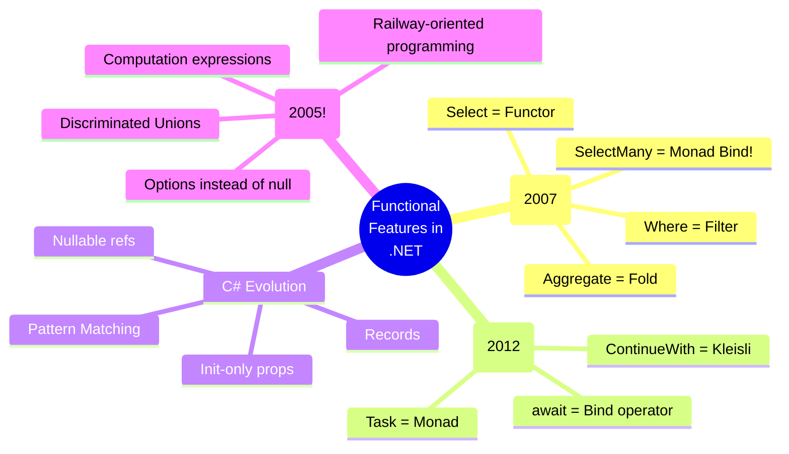
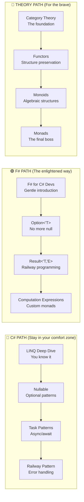
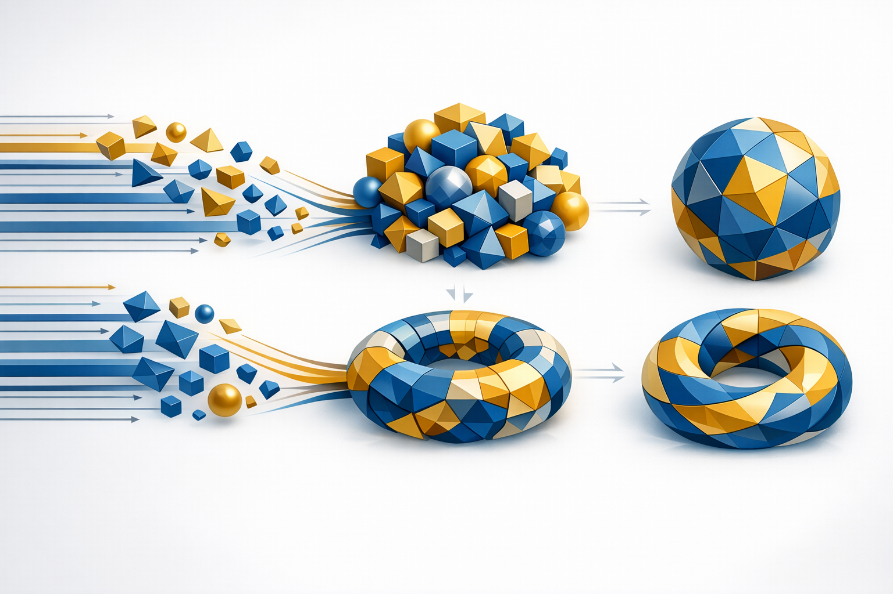
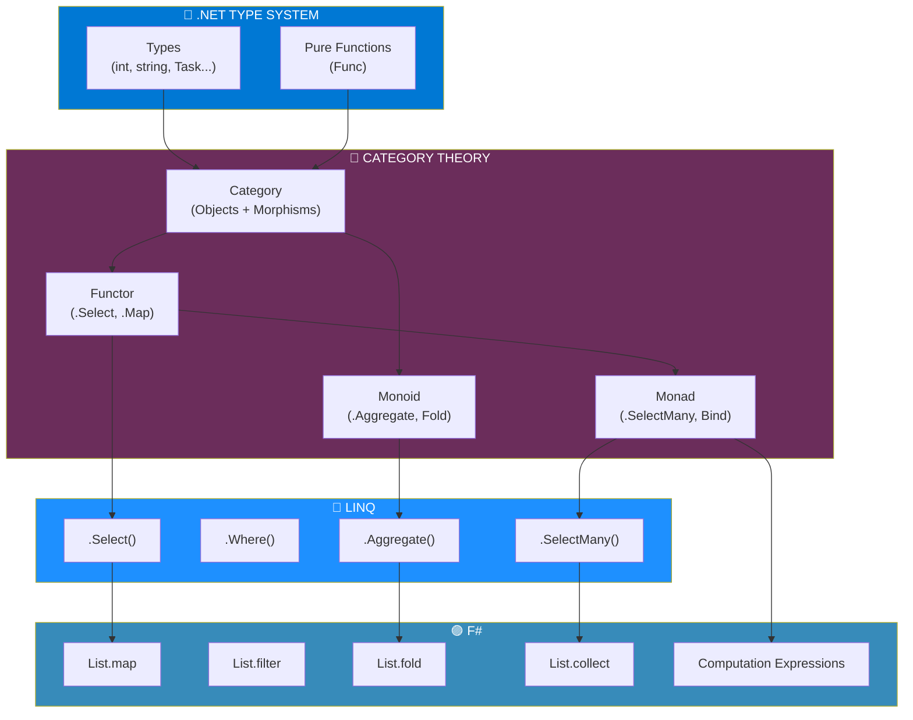

# 🪟 Functional Theory for the Microsoft Developer
## Or: How I Learned to Stop Writing Enterprise Java and Love the Lambda

<!-- SLIDE BACKGROUND: Use title_slide image -->


```
╔══════════════════════════════════════════════════════════════════╗
║                                                                  ║
║    ╭─────────────────────────────────────────────────────────╮   ║
║    │                                                         │   ║
║    │   ████████╗██╗  ██╗███████╗    ███╗   ██╗███████╗████████╗  ║
║    │      ██╔══╝██║  ██║██╔════╝    ████╗  ██║██╔════╝╚══██╔══╝  ║
║    │      ██║   ███████║█████╗      ██╔██╗ ██║█████╗     ██║     ║
║    │      ██║   ██╔══██║██╔══╝      ██║╚██╗██║██╔══╝     ██║     ║
║    │      ██║   ██║  ██║███████╗    ██║ ╚████║███████╗   ██║     ║
║    │      ╚═╝   ╚═╝  ╚═╝╚══════╝    ╚═╝  ╚═══╝╚══════╝   ╚═╝     ║
║    │                                                         │   ║
║    │         DEVELOPER'S GUIDE TO FUNCTIONAL THEORY          │   ║
║    ╰─────────────────────────────────────────────────────────╯   ║
║                                                                  ║
║              "Because Even C# Developers Deserve Monads"         ║
║                                                                  ║
║     ┌─────────────┐    ┌─────────────┐    ┌─────────────┐       ║
║     │    LINQ     │ ──▶│  Option<T>  │ ──▶│   Task<T>   │       ║
║     │ (Functor!)  │    │  (Maybe!)   │    │  (IO!)      │       ║
║     └─────────────┘    └─────────────┘    └─────────────┘       ║
║           │                  │                   │               ║
║           │    "You've been  │    "Null? Never  │               ║
║           │   doing FP all   │    heard of her" │               ║
║           │   along!"        │                   │               ║
║           ▼                  ▼                   ▼               ║
║                        ┌─────────────┐                           ║
║                        │   F# 🎉     │                           ║
║                        │ "Where it   │                           ║
║                        │  all makes  │                           ║
║                        │   sense"    │                           ║
║                        └─────────────┘                           ║
║                                                                  ║
╚══════════════════════════════════════════════════════════════════╝
```

> **27 AKUs** | **4 Core Concepts** | **1 Unified Theory** | **∞ var Keywords**

**Warning**: This presentation contains actual F# code. Side effects may include understanding why people won't shut up about functional programming.

---

# 📑 Table of Contents

| Slide | Topic | C# Translation | F# Enlightenment Level |
|-------|-------|----------------|----------------------|
| 1-2 | Title & TOC | "This is going to be weird" | 🌱 |
| 3-5 | Why FP in .NET? | "Wait, I already do some of this?" | 🌱 |
| 6-10 | Category Theory | "It's like interfaces but for mathematicians" | 🌿 |
| 11-15 | Functors | "Oh! It's .Select()!" | 🌳 |
| 16-19 | Monoids | "So THAT'S why .Aggregate() works" | 🌳 |
| 20-25 | Monads | "nullable reference types make more sense now" | 🌲 |
| 26-28 | Grand Unification | "I need to lie down" | 🏔️ |
| 29-30 | F# Migration Path | "Maybe I should try F#..." | ✨ |

### The Microsoft Developer's FP Journey

```
┌────────────────────────────────────────────────────────────────────┐
│               THE .NET DEVELOPER'S FP ENLIGHTENMENT                │
├────────────────────────────────────────────────────────────────────┤
│                                                                    │
│  2005: "LINQ? What sorcery is this .Select().Where() business?"   │
│                                                                    │
│  2012: "Async/await is pretty nice for not blocking threads..."   │
│                                                                    │
│  2017: "Pattern matching in C# 7? Yes please!"                     │
│                                                                    │
│  2020: "Nullable reference types = Maybe? 🤔"                      │
│                                                                    │
│  2023: *opens F# for the first time* "Wait, why is everything     │
│         an expression? Where are my semicolons?!"                  │
│                                                                    │
│  2024: "Discriminated unions are AMAZING. Why doesn't C# have-"   │
│         *checks roadmap* "FINALLY!"                                │
│                                                                    │
│  2026: "A monad is just a monoid in the category of endofunctors" │
│         *nods knowingly* 😎                                        │
│                                                                    │
│  TODAY'S GOAL: Skip the pain, get the enlightenment                │
│                                                                    │
└────────────────────────────────────────────────────────────────────┘
```

---

# 🗺️ Slide 3: Why Functional Programming in .NET?

## You're Already Doing It (Sort Of)
### Evidence That Microsoft Has Been Sneaking FP Into Your Code Since 2007



**The Good News for C# Developers:**
- 🟢 **LINQ**: You've been using functors and monads since 2007
- 🟢 **Async/Await**: Task<T> is literally the IO monad
- 🟢 **Pattern Matching**: Category theory in disguise
- 🟡 **F#**: It's been there all along, waiting patiently

**The Awkward Truth:**
> "C# has been slowly becoming F# while pretending it's still Java."  
> — Anonymous Microsoft Developer, probably

---

# 📚 Slide 4: The LINQ Revelation

## Everything You Need to Know, You Learned From LINQ
### (You Just Didn't Know the Names Yet)

```csharp
// You've been writing this for years:
var result = customers
    .Where(c => c.IsActive)           // Filter (Predicate)
    .Select(c => c.Name)              // Functor Map!
    .SelectMany(n => n.Split(' '))    // Monad Bind!
    .Aggregate("", (a, b) => a + b);  // Monoid Fold!

// What you didn't know:
// - Select is a Functor operation (fmap in Haskell)
// - SelectMany is Monad Bind (>>= in Haskell)  
// - Aggregate is a Monoid fold (mconcat in Haskell)

// You're basically writing Haskell with curly braces.
// Don't tell anyone.
```

### The Rosetta Stone

| C# LINQ | F# | Haskell | What It Actually Is |
|---------|-----|---------|---------------------|
| `.Select()` | `List.map` | `fmap` | **Functor map** |
| `.Where()` | `List.filter` | `filter` | Predicate filter |
| `.SelectMany()` | `List.collect` | `>>=` (bind) | **Monad bind** |
| `.Aggregate()` | `List.fold` | `foldl` | **Monoid fold** |
| `from x in xs` | `for x in xs` | `do` notation | **Monad comprehension** |

**Mind = Blown?** Let's go deeper.

---

# 🎯 Slide 5: The Path to Enlightenment

## Three Learning Paths for .NET Developers



**Recommended for Microsoft Developers:**
1. **Quick Win**: Take the C# path → understand what you already know
2. **Next Level**: Try F# → see these concepts in their natural habitat
3. **Full Understanding**: Learn the theory → know WHY everything works

---

# 📚 Slide 6: Category Theory - Core Components

<!-- SLIDE IMAGE: Category Theory visualization -->


## What IS a Category?
### (Like Interfaces, But for Everything)

```
╔═══════════════════════════════════════════════════════════════════╗
║                    A CATEGORY C CONSISTS OF:                       ║
║        (Think of it as a really abstract interface definition)     ║
╠═══════════════════════════════════════════════════════════════════╣
║                                                                    ║
║  ┌─────────────────┐                                               ║
║  │   1. OBJECTS    │  Like Types: int, string, Customer, Task<T>  ║
║  │    (Types!)     │  In C#: Every type is an "object" here       ║
║  └─────────────────┘                                               ║
║           │                                                        ║
║           ▼                                                        ║
║  ┌─────────────────┐                                               ║
║  │  2. MORPHISMS   │  Like Methods: Func<A, B> is an arrow A → B  ║
║  │  (Functions!)   │  In C#: Every pure function is a morphism    ║
║  └─────────────────┘                                               ║
║           │                                                        ║
║           ▼                                                        ║
║  ┌─────────────────┐                                               ║
║  │ 3. COMPOSITION  │  Like method chaining: f.AndThen(g)          ║
║  │   (Chaining!)   │  In C#: (g ∘ f)(x) = g(f(x))                 ║
║  └─────────────────┘                                               ║
║           │                                                        ║
║           ▼                                                        ║
║  ┌─────────────────┐                                               ║
║  │   4. IDENTITY   │  Like x => x or the identity function        ║
║  │  (Do Nothing!)  │  In C#: Func<T, T> Id = x => x;              ║
║  └─────────────────┘                                               ║
║                                                                    ║
║  "It's like an interface contract for the entire .NET type system"║
║                                                                    ║
╚═══════════════════════════════════════════════════════════════════╝
```

### C# Example: The Category of .NET Types

```csharp
// Objects: int, string, Person, IEnumerable<T>, Task<T>...
// Morphisms: Pure functions between types

Func<int, string> intToString = x => x.ToString();     // int → string
Func<string, int> stringLength = s => s.Length;        // string → int

// Composition: Chain them together
Func<int, int> composed = x => stringLength(intToString(x)); // int → int

// Identity: The "do nothing" function
Func<int, int> identity = x => x;  

// Laws (these MUST hold):
// 1. (h ∘ g) ∘ f = h ∘ (g ∘ f)  -- Associativity
// 2. id ∘ f = f                  -- Left identity
// 3. f ∘ id = f                  -- Right identity
```

---

# 🔄 Slide 11: Functors - It's Just .Select()!

<!-- SLIDE IMAGE: Functor visualization -->


## Structure-Preserving Maps
### (The Fancy Name for What LINQ Does)

```
╔══════════════════════════════════════════════════════════════════╗
║                         FUNCTOR = .Select()                       ║
║        "Apply a function to values INSIDE a container"            ║
╠══════════════════════════════════════════════════════════════════╣
║                                                                   ║
║   C# CODE:                        F# CODE:                        ║
║   ════════                        ════════                        ║
║                                                                   ║
║   // List functor                 // List functor                 ║
║   list.Select(x => x * 2)         list |> List.map (fun x -> x*2)║
║                                                                   ║
║   // Nullable functor             // Option functor               ║
║   nullable?.Transform(f)          option |> Option.map f         ║
║                                                                   ║
║   // Task functor                 // Async functor                ║
║   task.ContinueWith(t => f(t))    async { let! x = a; return f x}║
║                                                                   ║
║   ┌───────────────────────────────────────────────────────────┐   ║
║   │  FUNCTOR LAW 1: .Select(x => x) === original             │   ║
║   │  "Selecting identity gives back the same thing"          │   ║
║   │                                                           │   ║
║   │  FUNCTOR LAW 2: .Select(f).Select(g) === .Select(x=>g(f(x)))│
║   │  "Two selects = one select with composed function"        │   ║
║   └───────────────────────────────────────────────────────────┘   ║
║                                                                   ║
╚══════════════════════════════════════════════════════════════════╝
```

### The Functor Zoo in .NET

```csharp
// All of these are Functors! 🎉

// IEnumerable<T> - The OG functor
IEnumerable<int> numbers = new[] { 1, 2, 3 };
IEnumerable<string> strings = numbers.Select(n => n.ToString());

// Nullable<T> - The "maybe there's a value" functor
int? maybeNumber = 5;
string? maybeString = maybeNumber?.ToString(); // Functor map!

// Task<T> - The "will have a value later" functor  
Task<int> asyncNumber = Task.FromResult(5);
Task<string> asyncString = asyncNumber.ContinueWith(t => t.Result.ToString());

// Lazy<T> - The "compute it when needed" functor
Lazy<int> lazyNumber = new Lazy<int>(() => ExpensiveCalculation());
// No direct .Select() but same concept!

// F# Option<'T> - The proper "maybe" functor
// let maybeValue = Some 5
// let maybeString = maybeValue |> Option.map string
```

---

# ⚙️ Slide 16: Monoids - The .Aggregate() Secret

<!-- SLIDE IMAGE: Monoid visualization -->


## Three Components, That's All!
### (This Is Why Reduce/Fold Works)

```
╔═══════════════════════════════════════════════════════════════════╗
║                   MONOID = Aggregate-able Things                   ║
║            "Anything you can meaningfully combine"                 ║
╠═══════════════════════════════════════════════════════════════════╣
║                                                                    ║
║   ┌─────────────────────────────────────────────────────────────┐  ║
║   │  1. A TYPE             In C#: the type you're working with  │  ║
║   │                        int, string, List<T>, etc.            │  ║
║   └─────────────────────────────────────────────────────────────┘  ║
║                              │                                     ║
║                              ▼                                     ║
║   ┌─────────────────────────────────────────────────────────────┐  ║
║   │  2. COMBINE OPERATION   In C#: Func<T, T, T>                │  ║
║   │     (must be            (a, b) => a + b      // addition    │  ║
║   │      associative!)      (a, b) => a + b      // string concat│  ║
║   │                         (a, b) => a.Concat(b) // list append │  ║
║   └─────────────────────────────────────────────────────────────┘  ║
║                              │                                     ║
║                              ▼                                     ║
║   ┌─────────────────────────────────────────────────────────────┐  ║
║   │  3. IDENTITY VALUE      In C#: The "empty" or "zero"        │  ║
║   │     (neutral element)   0           // for addition         │  ║
║   │                         ""          // for string concat     │  ║
║   │                         []          // for list append       │  ║
║   └─────────────────────────────────────────────────────────────┘  ║
║                                                                    ║
║   "This is why .Aggregate() needs a seed value!"                   ║
║                                                                    ║
╚═══════════════════════════════════════════════════════════════════╝
```

### C# Monoids in Action

```csharp
// The monoid is hiding in plain sight!

// Addition monoid: (int, +, 0)
int sum = numbers.Aggregate(0, (acc, x) => acc + x);
//                          ↑ Identity    ↑ Combine

// String monoid: (string, +, "")
string combined = strings.Aggregate("", (acc, s) => acc + s);
//                                  ↑ Identity    ↑ Combine

// List monoid: (List<T>, Concat, [])
var merged = lists.Aggregate(new List<T>(), (acc, list) => acc.Concat(list).ToList());

// F# makes this cleaner:
// let sum = List.fold (+) 0 numbers
// let combined = List.fold (+) "" strings

// The POWER of monoids: Parallelization!
// Because (a + b) + c = a + (b + c), we can split the work!
int parallelSum = numbers.AsParallel().Aggregate(0, (a, b) => a + b);
```

---

# 🎭 Slide 20: Monads - The SelectMany Secret

<!-- SLIDE IMAGE: Monad visualization -->


## What Problem Do Monads Solve?
### (Hint: You've Been Using Them With LINQ Query Syntax)

```
╔═══════════════════════════════════════════════════════════════════╗
║                    THE MONAD PROBLEM (IN C#)                       ║
║      "I have functions that return containers, how do I chain?"   ║
╠═══════════════════════════════════════════════════════════════════╣
║                                                                    ║
║   // Functions that might fail (return nullable)                   ║
║   int? ParseInt(string s) => int.TryParse(s, out var n) ? n : null;║
║   int? SafeDivide(int a, int b) => b != 0 ? a / b : null;         ║
║                                                                    ║
║   // Problem: Can't compose directly!                              ║
║   string input = "10";                                             ║
║   int? parsed = ParseInt(input);      // int? ✓                   ║
║   int? result = SafeDivide(parsed, 2); // ERROR! parsed is int?   ║
║                                         // SafeDivide wants int!   ║
║                                                                    ║
║   // The ugly solution:                                            ║
║   int? result = parsed.HasValue                                    ║
║       ? SafeDivide(parsed.Value, 2)                                ║
║       : null;                                                      ║
║                                                                    ║
║   // The monad solution (SelectMany / Bind):                       ║
║   int? result = from p in ParseInt(input)                          ║
║                 from r in SafeDivide(p, 2)                         ║
║                 select r;                                          ║
║                                                                    ║
║   // F# makes this beautiful:                                      ║
║   // let result = option {                                         ║
║   //     let! parsed = parseInt input                              ║
║   //     let! result = safeDivide parsed 2                         ║
║   //     return result                                             ║
║   // }                                                             ║
║                                                                    ║
╚═══════════════════════════════════════════════════════════════════╝
```

### The Monad Zoo in .NET

```csharp
// All of these are Monads! 🎉

// 1. IEnumerable<T> - The "multiple values" monad
var result = from x in xs
             from y in GetRelated(x)  // SelectMany!
             select (x, y);

// 2. Task<T> - The "async" monad
var result = from user in GetUserAsync()
             from orders in GetOrdersAsync(user.Id)
             select orders;

// 3. Nullable<T> / Option - The "maybe" monad
var result = from x in TryGetValue()
             from y in TryProcess(x)
             select y;

// The LINQ query syntax IS monad comprehension!
// "from x in m" compiles to "m.SelectMany(x => ...)"
// That's why it's called "query syntax" - it queries monadic containers!
```

---

# 🎭 Slide 21: The Monad Laws in C#

## Why These Laws Matter (For Real)

```csharp
// The three monad laws - they ensure your code is predictable!

// Law 1: Left Identity
// Wrapping then binding = just calling the function
M<T> m = M.Return(x).SelectMany(f);
// MUST equal:
M<T> m = f(x);

// C# example:
var listResult = new[] { 5 }.SelectMany(x => new[] { x * 2 }); // [10]
var directResult = new[] { 5 * 2 };                             // [10]
// ✓ Same result!

// Law 2: Right Identity  
// Binding to Return = the same monad
M<T> m = original.SelectMany(x => M.Return(x));
// MUST equal:
M<T> m = original;

// C# example:
var result = new[] { 1, 2, 3 }.SelectMany(x => new[] { x });  // [1, 2, 3]
var original = new[] { 1, 2, 3 };                               // [1, 2, 3]
// ✓ Same result!

// Law 3: Associativity
// Order of binding doesn't matter (with proper nesting)
m.SelectMany(f).SelectMany(g)
// MUST equal:
m.SelectMany(x => f(x).SelectMany(g))

// This is why you can refactor LINQ queries freely!
```

### The F# Advantage: Computation Expressions

```fsharp
// F# makes monads beautiful with computation expressions

// Option monad (Maybe)
let divide x y = if y = 0 then None else Some (x / y)

let result = option {
    let! a = divide 10 2    // Unwrap and bind
    let! b = divide a 5     // Chain another operation  
    return b                // Wrap result
}
// result = Some 1

// Async monad
let fetchData = async {
    let! user = getUserAsync()
    let! orders = getOrdersAsync user.Id
    return orders
}

// Result monad (Railway-oriented programming)
let validateUser user = result {
    let! validated = validateEmail user.Email
    let! checked = checkAge user.Age
    return { user with IsValidated = true }
}
```

---

# 🔗 Slide 26: The Grand Unification

<!-- SLIDE IMAGE: Grand Unification visualization -->


## How All Concepts Connect in .NET



---

# 🔗 Slide 27: The Famous Quote Decoded

## "A Monad is a Monoid in the Category of Endofunctors"
### (Now You Can Finally Understand This)

```
╔═══════════════════════════════════════════════════════════════════╗
║         DECODING THE FAMOUS PHRASE FOR .NET DEVELOPERS             ║
╠═══════════════════════════════════════════════════════════════════╣
║                                                                    ║
║   Let's break it down with .NET concepts:                          ║
║                                                                    ║
║   "MONOID"                                                         ║
║   ════════                                                         ║
║   • Something you can combine: Aggregate(), Concat()               ║
║   • Has an identity: 0, "", new List<T>()                         ║
║   • Operations: (a ⊕ b) ⊕ c = a ⊕ (b ⊕ c)                        ║
║                                                                    ║
║   "CATEGORY OF ENDOFUNCTORS"                                       ║
║   ═══════════════════════════                                      ║
║   • Endofunctor: Type → Type (like List<T>, Task<T>, Option<T>)   ║
║   • These type constructors form their own category               ║
║   • Objects = type constructors                                    ║
║   • Morphisms = natural transformations between them               ║
║                                                                    ║
║   "MONAD IS A MONOID IN..."                                        ║
║   ══════════════════════════                                       ║
║   • The "combine" for monads is: SelectMany composition            ║
║   • The "identity" is: Return/Pure                                 ║
║   • List<List<T>>.SelectMany(x => x) → List<T>   ← This is join!  ║
║                                                                    ║
║   ┌─────────────────────────────────────────────────────────────┐ ║
║   │  C# Translation:                                            │ ║
║   │                                                             │ ║
║   │  "A monad is a type constructor (like List<T> or Task<T>)   │ ║
║   │   that supports SelectMany composition in a way that        │ ║
║   │   satisfies the same laws as integer addition."             │ ║
║   │                                                             │ ║
║   │  The "combine" = .SelectMany() / flatMap / bind             │ ║
║   │  The "identity" = Enumerable.Return() / Task.FromResult()   │ ║
║   └─────────────────────────────────────────────────────────────┘ ║
║                                                                    ║
╚═══════════════════════════════════════════════════════════════════╝
```

---

# 📚 Slide 29: The F# Migration Path

## Ready to Level Up?
### Your Journey from C# to F# (Without Losing Your Mind)

```
╭──────────────────────────────────────────────────────────────────╮
│                                                                  │
│   🌱 WEEK 1-2: "F# IS JUST C# WITH LESS TYPING"                 │
│   ─────────────────────────────────────────────────────          │
│   Learn: let, |>, pattern matching, records                     │
│   Mindset: It's still .NET, the BCL is right there              │
│   Win: Write a small utility in F#, call it from C#             │
│                                                                  │
├──────────────────────────────────────────────────────────────────┤
│                                                                  │
│   🌿 WEEK 3-4: "OH, OPTION<'T> IS AMAZING"                      │
│   ─────────────────────────────────────────────                  │
│   Learn: Option, Result, discriminated unions                   │
│   Mindset: Null is a code smell, not a feature                  │
│   Win: Rewrite error handling in a small service with Result    │
│                                                                  │
├──────────────────────────────────────────────────────────────────┤
│                                                                  │
│   🌳 WEEK 5-8: "COMPUTATION EXPRESSIONS ARE MONADS!"            │
│   ─────────────────────────────────────────────────────          │
│   Learn: async { }, option { }, result { }                      │
│   Mindset: Monads are just a way to sequence operations         │
│   Win: Build an API endpoint using Railway-oriented programming │
│                                                                  │
├──────────────────────────────────────────────────────────────────┤
│                                                                  │
│   🌲 WEEK 9+: "I GET IT NOW"                                    │
│   ─────────────────────────────────                              │
│   Learn: Custom computation expressions, type providers         │
│   Mindset: Express intent, let the compiler help                │
│   Win: You're now dangerously competent in both C# and F#       │
│                                                                  │
╰──────────────────────────────────────────────────────────────────╯
```

### What to Tell Your Manager

| They Ask... | You Say... |
|-------------|------------|
| "Why F#?" | "Same runtime, interop with C#, fewer bugs, less code" |
| "Learning curve?" | "2-4 weeks for C# developers, ROI in 2 months" |
| "Risk?" | "It compiles to the same IL, same deployment story" |
| "Who uses it?" | "Jet.com (Walmart), Credit Suisse, many Microsoft teams" |

---

# 📚 Slide 30: Resources for Microsoft Developers

## Continue Your Journey

### Official Microsoft Resources

| Resource | Description | Link |
|----------|-------------|------|
| F# Documentation | Official docs | docs.microsoft.com/fsharp |
| F# for Fun and Profit | THE F# learning site | fsharpforfunandprofit.com |
| Don Syme's Blog | F# creator's insights | blogs.msdn.microsoft.com/dsyme |
| F# Weekly | Newsletter | sergeytihon.com/category/f-weekly |

### Books (In Order)

1. **Get Programming with F#** - Isaac Abraham (Beginner)
2. **Domain Modeling Made Functional** - Scott Wlaschin (Intermediate)
3. **Stylish F#** - Kit Eason (Advanced patterns)
4. **Category Theory for Programmers** - Bartosz Milewski (Theory)

### F# Community

- **F# Slack**: fsharp.slack.com
- **F# Discord**: discord.gg/fsharp
- **F# Conf**: Annual online conference
- **F# Foundation**: fsharp.org

### What to Tell Your Coworkers

| When They Say... | You Respond... |
|------------------|----------------|
| "What's a functor?" | "It's what .Select() does. You've been using them for 15 years." |
| "What's a monad?" | "It's what lets you use LINQ query syntax. SelectMany is bind." |
| "Why learn F#?" | "To understand C# better. Also, fewer null reference exceptions." |
| "Is F# dead?" | "It's in active development. C# keeps stealing its features." |

---

# 🎤 Speaker Notes

## Key Messages for Microsoft Developers

### Opening (Slides 1-5)
- **Hook**: "You've been doing functional programming since LINQ (2007)"
- **Reassurance**: The concepts aren't new, just the names
- **Goal**: Connect familiar .NET concepts to category theory

### Functors (Slides 11-15)
- **Key revelation**: .Select() IS fmap IS functor map
- **Demo**: Show LINQ vs F# List.map side by side
- **Laugh line**: "You've been a category theorist since Visual Studio 2008"

### Monoids (Slides 16-19)
- **Key revelation**: This is why Aggregate needs a seed value
- **Practical**: Show parallel Aggregate working because of associativity
- **Connection**: PLINQ leverages monoid properties!

### Monads (Slides 20-25)
- **Key revelation**: LINQ query syntax IS monad comprehension
- **Demo**: Show how "from x in m" compiles to SelectMany
- **F# advantage**: Computation expressions make this readable

### Grand Unification (Slides 26-28)
- **Decode the quote**: Make it concrete with C# examples
- **Mic drop**: They now understand the famous quote
- **Practical**: This knowledge helps design better APIs

### F# Pitch (Slides 29-30)
- **Soft sell**: F# as "C# but with proper FP support"
- **Interop story**: Same runtime, easy to add to existing solutions
- **Call to action**: "Try writing one small utility in F#"

---

## Accessibility Notes

- All diagrams have text equivalents
- Code samples use monospace font
- Color is not sole distinguisher
- Compatible with screen readers

---

*Generated by WorldSMEGraphs Visualization Agent*  
*Targeting Microsoft Developers with 27 Atomic Knowledge Units*  
*Date: 2026-01-04*  
*Image prompts available in: ./images/microsoft_fp_prompts.txt*
