# Dr. Valerie's Vascular Adventure: A Peppa Pig-Inspired Medical Comic

**Target Audience**: Ages 4-6  
**Format**: 24-page illustrated story  
**Educational Goal**: Introduce vascular surgery concepts through engaging narrative  
**Style**: Peppa Pig-inspired (simple, colorful, educational)

**Based on rigorous AKUs**: `health-sciences/medicine/surgery/vascular/foundations/`

---

## 📖 Page 1: Title Page

# Dr. Valerie's Vascular Adventure

*A Story About the Amazing Roads Inside Your Body*

---

## 📖 Page 2: Meet Dr. Valerie

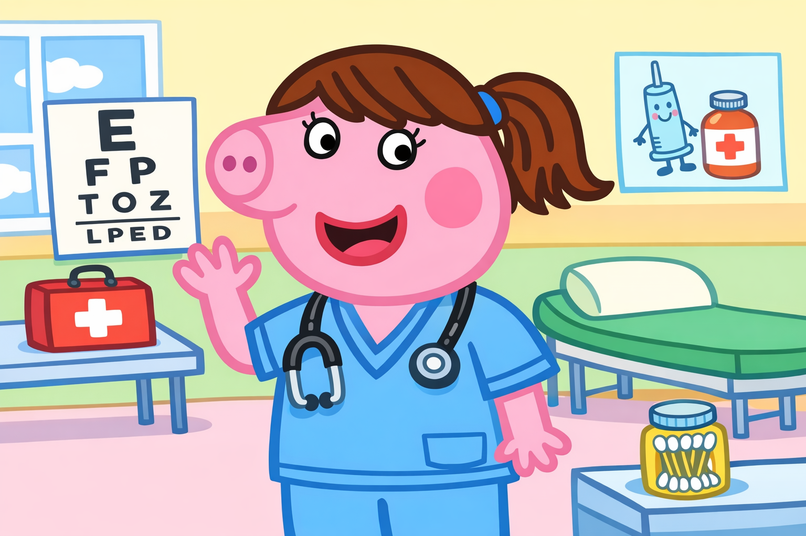

**Text:**
"Hi! I'm Dr. Valerie, and I'm a vascular surgeon. That's a fancy name for a doctor who takes care of your body's special roads!"

---

## 📖 Page 3: The Body's Road System

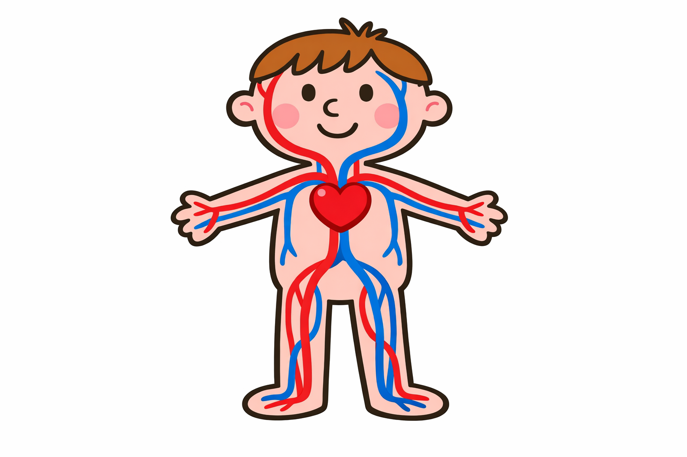

**Text:**
"Inside your body, you have thousands of tiny roads called blood vessels. They carry blood everywhere!"

**Key Visual Elements:**
- Red tubes (arteries) flowing FROM heart
- Blue tubes (veins) flowing TO heart  
- Happy little blood cells traveling on the roads

---

## 📖 Page 4: Meet Your Heart

**Text:**
"Your heart is like a super pump! 
*Thump-thump! Thump-thump!*
It pushes blood through all your roads, all day and all night!"

---

## 📖 Page 5: Red Roads - Arteries

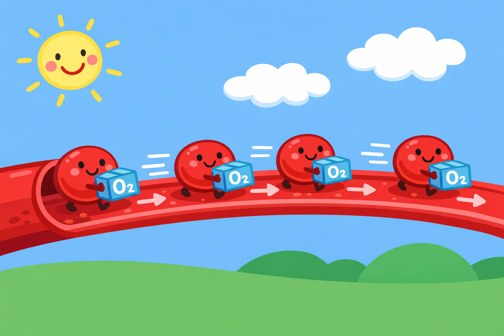

**Text:**
"Red roads (arteries) are like delivery trucks! They carry oxygen and food FROM your heart TO your body parts."

---

## 📖 Page 6: Blue Roads - Veins

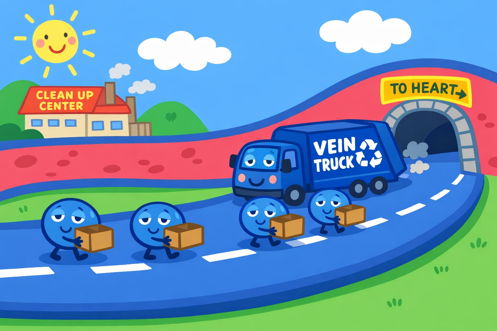

**Text:**
"Blue roads (veins) are like garbage trucks! They bring old blood BACK to your heart to get cleaned up."

---

## 📖 Page 7: Tiny Bridges - Capillaries

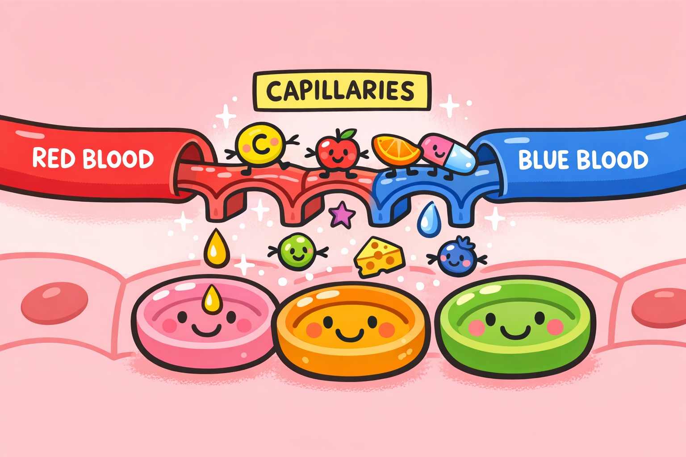

**Text:**
"Where red and blue roads meet, there are tiny tiny bridges called capillaries. They're so small you can't even see them!"

---

## 📖 Page 8: When Roads Have Problems

**Text:**
"Sometimes roads can have problems:
- A blockage (like when toys block a hallway)
- A leak (like a hose with a hole)"

---

## 📖 Page 9: Enter Dr. Valerie!

**Text:**
"That's when Dr. Valerie helps! She has special tools to fix the roads and keep blood flowing smoothly."

---

## 📖 Page 10: The Special Camera

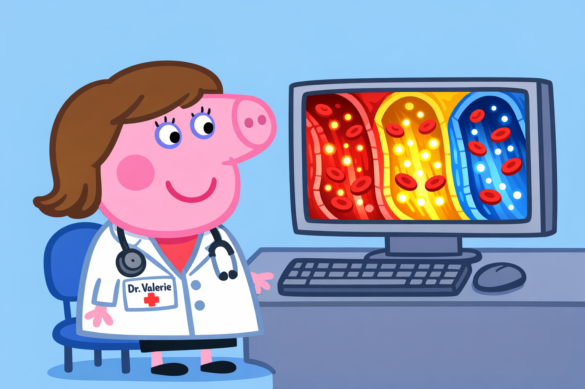

**Text:**
"Dr. Valerie has a tiny camera that can see INSIDE your blood vessels! It's like having X-ray vision!"

---

## 📖 Page 11: Fixing a Blockage

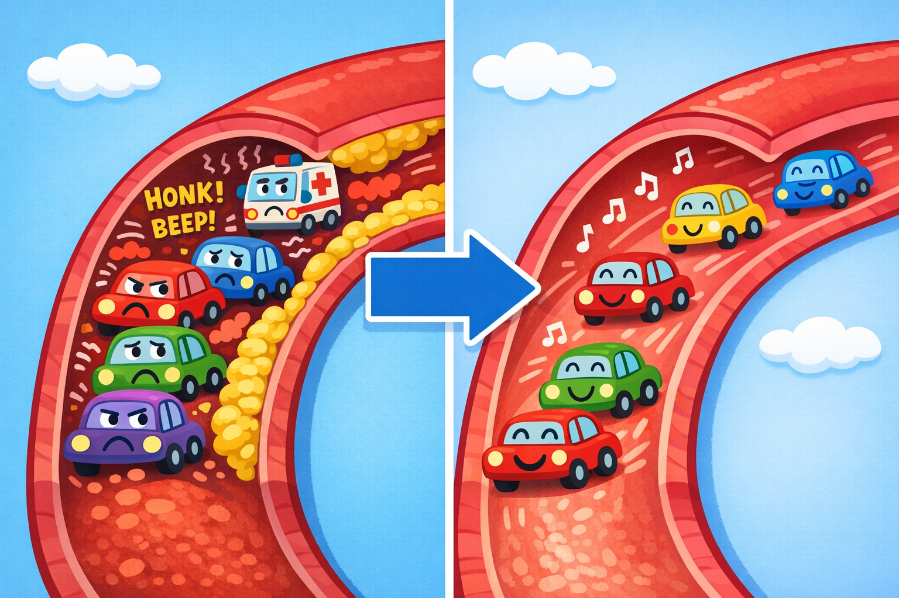

**Text:**
"When a road is blocked, Dr. Valerie can clear it out. It's like clearing a traffic jam so cars can move again!"

---

## 📖 Page 12: Fixing a Leak

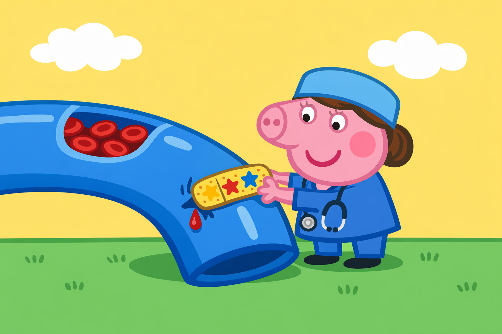

**Text:**
"When a road has a leak, Dr. Valerie can patch it up. It's like putting a bandage on a boo-boo!"

---

## 📖 Page 13: Meet Little Timmy

**Text:**
"One day, Little Timmy's grandpa wasn't feeling well. His leg roads had a blockage!"

---

## 📖 Page 14: Dr. Valerie Helps Grandpa

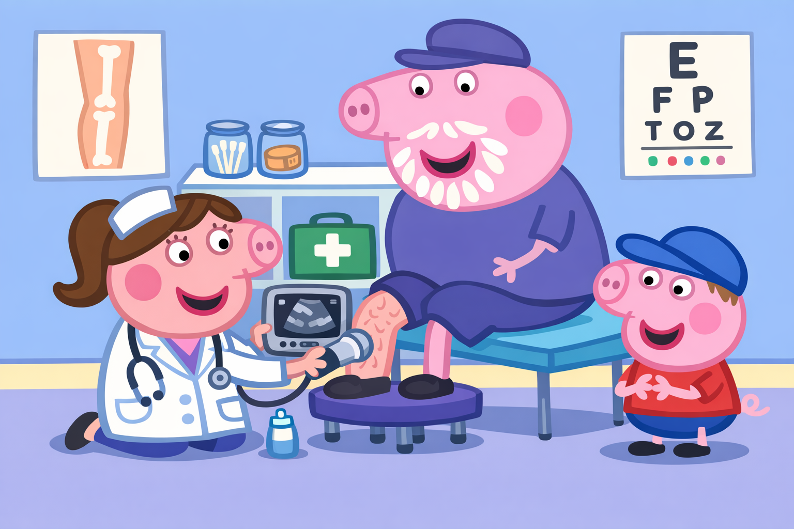

**Text:**
"Dr. Valerie used her special tools to fix Grandpa's leg roads. It didn't hurt at all!"

---

## 📖 Page 15: Grandpa Feels Better!

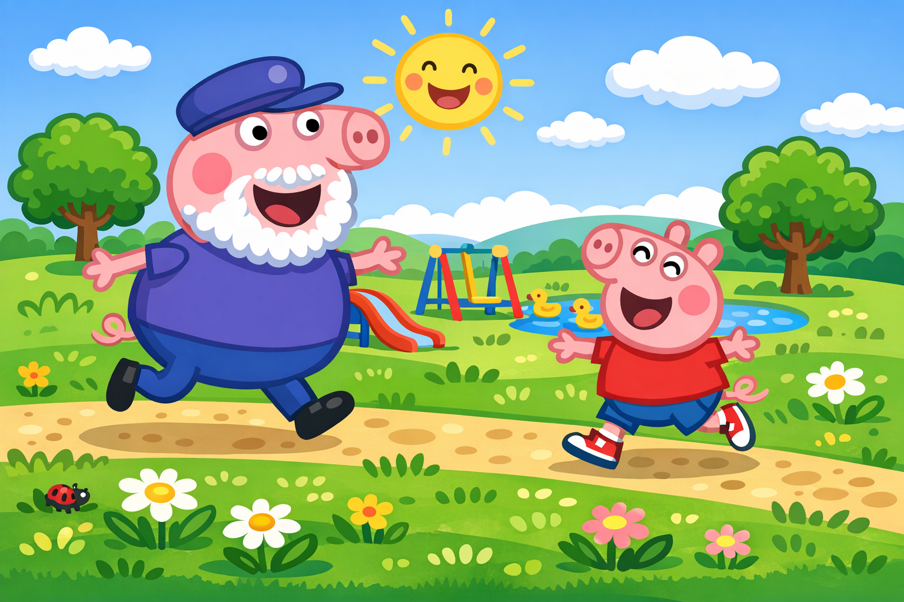

**Text:**
"After Dr. Valerie fixed the roads, Grandpa could walk and play again! His blood flowed smoothly to his legs."

---

## 📖 Page 16: How to Keep Roads Healthy

**Text:**
"You can help your blood vessel roads stay healthy!"

**Panel 1**: Eat colorful fruits and vegetables 🥕🍎
**Panel 2**: Run and play every day 🏃
**Panel 3**: Drink lots of water 💧
**Panel 4**: Sleep well every night 😴

---

## 📖 Page 17: Eat Rainbow Foods

**Text:**
"Eat foods of every color! Red tomatoes, orange carrots, yellow bananas, green broccoli, blue blueberries!"

---

## 📖 Page 18: Move Your Body

**Text:**
"When you move and play, your heart pumps faster! This makes your blood vessel roads stronger!"

---

## 📖 Page 19: Dr. Valerie's Clinic

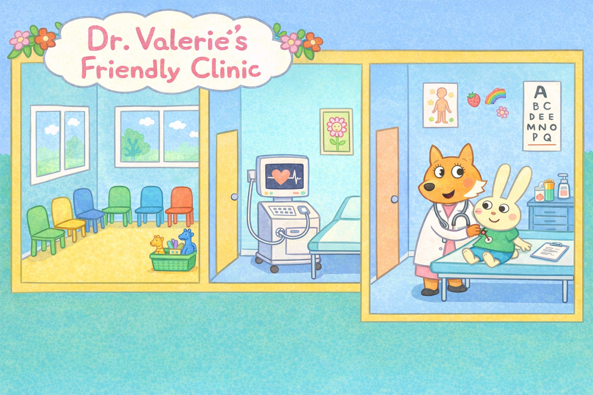

**Text:**
"At Dr. Valerie's clinic, there are special machines that help her see and fix blood vessels. Science is amazing!"

---

## 📖 Page 20: The Blood Vessel Team

**Text:**
"Dr. Valerie works with a whole team! Nurses, technicians, and other doctors all help take care of people's roads."

---

## 📖 Page 21: You're Amazing Inside!

**Text:**
"Your body is AMAZING! Right now, your blood is traveling through all your roads, bringing food and oxygen everywhere!"

---

## 📖 Page 22: Listen to Your Body

**Text:**
"Put your hand on your chest. Feel that *thump-thump*? That's your heart working hard to keep you healthy!"

---

## 📖 Page 23: Thank You, Dr. Valerie!

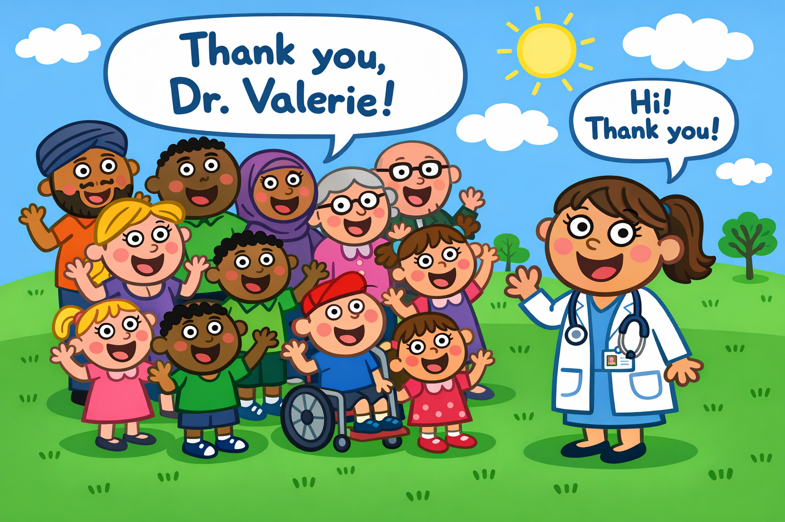

**Text:**
"Thank you, Dr. Valerie, for keeping our blood vessel roads healthy and happy!"

---

## 📖 Page 24: The End - You're a Body Expert Now!

**Text:**
"Now YOU know about blood vessels! You're a body expert!

Remember:
❤️ Your heart pumps blood
🔴 Red roads take blood away
🔵 Blue roads bring blood back
🏃 Stay active and healthy!"

---

## 📚 Parent/Educator Guide

**Cross-References to Medical AKUs:**
- Blood vessel anatomy: `wsmg:health-sciences/medicine/surgery/vascular/foundations/vs-basic-001`
- Vascular pathology: `wsmg:health-sciences/medicine/surgery/vascular/pathology/`
- Vascular surgery basics: `wsmg:health-sciences/medicine/surgery/vascular/foundations/vs-basic-002`

**Learning Objectives:**
1. Identify basic cardiovascular structures (heart, arteries, veins)
2. Understand blood circulation concept
3. Recognize vascular surgeon role
4. Learn healthy habits for cardiovascular health

**Discussion Questions:**
1. "What does your heart do?"
2. "Where does blood go in your body?"
3. "How can we keep our blood vessels healthy?"
4. "What does Dr. Valerie do to help people?"

**Medical Accuracy Notes:**
- Simplified to age-appropriate level while maintaining core accuracy
- "Red roads" and "blue roads" accurately represent arterial/venous systems
- Blockages and leaks correspond to real vascular pathologies
- Vascular surgeon role accurately portrayed

---

**Document Metadata:**
- **Version**: 1.0
- **Created**: 2026-01-04
- **Format**: 24-page comic book
- **Illustration Style**: Peppa Pig-inspired (simple, bright, friendly)
- **Target Age**: 4-6 years
- **Educational Standard**: Age-appropriate health literacy
- **Based on AKUs**: Rigorous medical content from vascular surgery domain
- **License**: CC-BY-4.0
