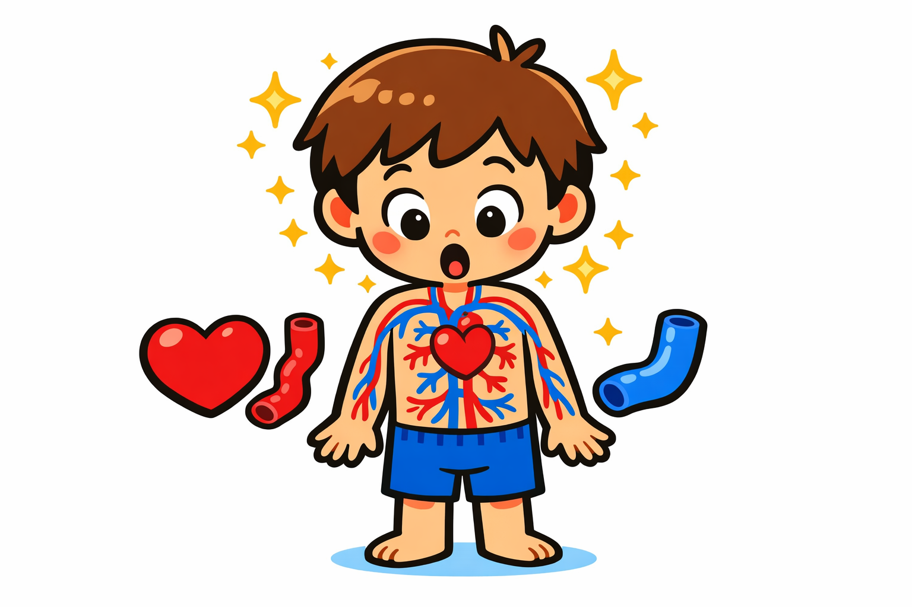
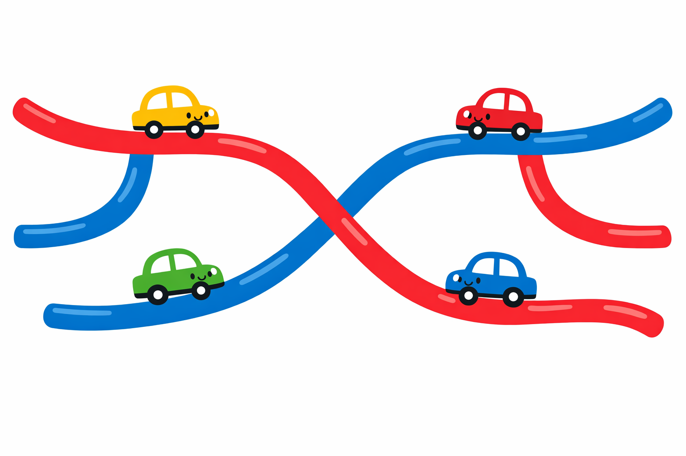
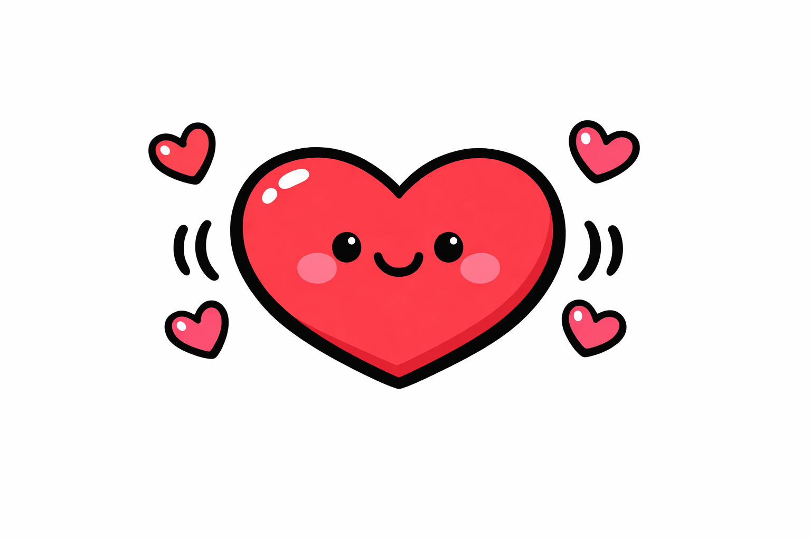
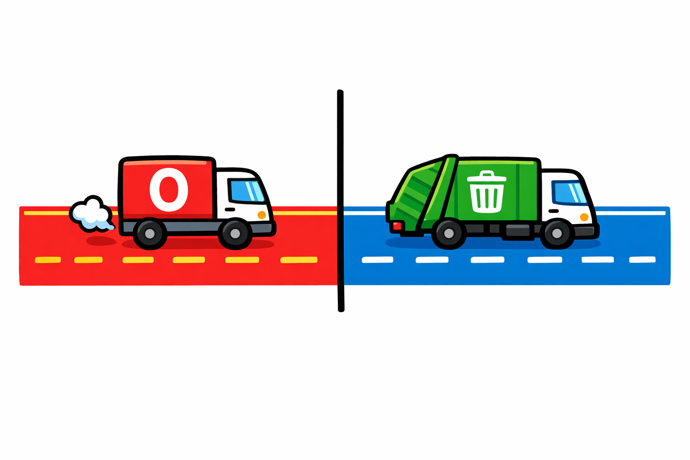
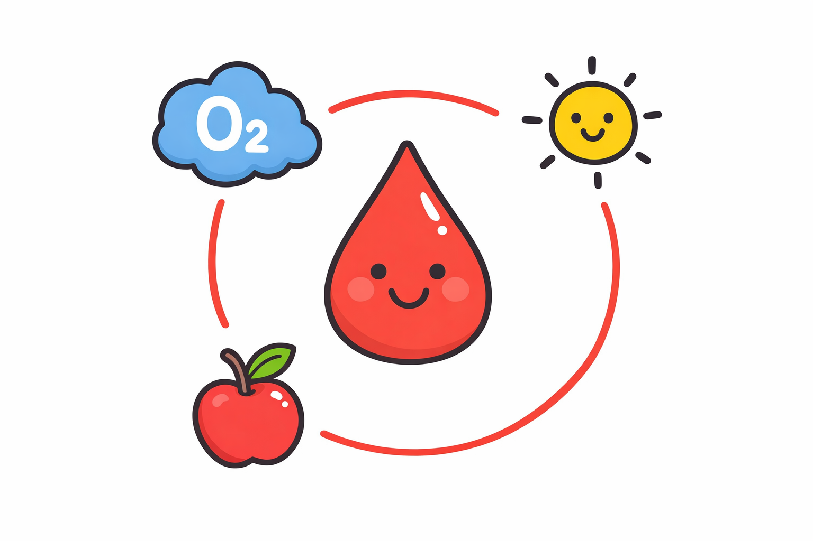
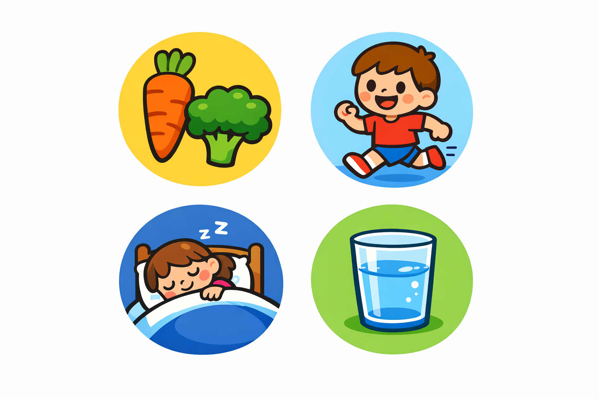

# How Your Body Works: Blood Vessels

**For Ages 4-6** 🎈

> **Based on medical AKUs from**: `health-sciences/medicine/surgery/vascular/`

---

## Your Body is Amazing! 🌟

Your body is like a special machine! Inside you, there are lots of tiny parts all working together to keep you healthy and strong!

---

## What Are Blood Vessels?

Inside your body, you have special tubes called **blood vessels**! 

They're like tiny roads that help your blood travel everywhere.

**Imagine this:**
- Your blood vessels are like little highways 🛣️
- Blood travels on these highways all day long 🚗
- Every part of you needs blood to stay healthy!

---

## Your Amazing Heart 💓

Your heart is like a super pump!

**Thump-thump! Thump-thump!**

Put your hand on your chest. Feel that? That's your heart working!

**Fun Fact:** Your heart beats about 100,000 times every day! That's a LOT of thump-thumps!

---

## Red Roads and Blue Roads 🔴🔵

You have TWO types of blood vessel roads:

**🔴 Red Roads (Arteries)**
- Carry bright red blood with oxygen
- Take blood AWAY from your heart
- Like delivery trucks bringing good stuff!

**🔵 Blue Roads (Veins)**
- Carry dark blue blood
- Bring blood BACK to your heart  
- Like garbage trucks taking stuff away!

---

## Where Does Blood Go? 🗺️

Your blood visits EVERYWHERE in your body:

- 🧠 Your head (so you can think!)
- 👋 Your hands (so you can wave!)
- 🦶 Your feet (so you can run!)
- 🫁 Your tummy (so food can give you energy!)

---

## How Blood Helps You 🌈

Blood is like a helper that brings:

- **Air** (oxygen) so you can breathe and play
- **Food** (energy) so you can run and jump
- **Warmth** so you don't get too cold

And it takes away:
- **Trash** (stuff your body doesn't need)

---

## Keep Your Heart Happy! 🏃‍♂️

You can help your heart and blood vessels stay healthy:

1. **🥕 Eat yummy vegetables** - They make your heart strong!
2. **🏃 Run and play** - Exercise makes your heart happy!
3. **💤 Get good sleep** - Your heart needs rest too!
4. **💧 Drink water** - It helps your blood flow smoothly!

---

## Try This Fun Activity! ✋

**Feel Your Pulse:**

1. Put two fingers on your wrist (near your thumb)
2. Press gently
3. Can you feel the thump-thump-thump?

That's your blood pumping through your blood vessel roads!

---

## You're a Body Expert Now! 🌟

**What did you learn?**

✅ Blood vessels are tiny roads inside you  
✅ Your heart pumps blood around and around  
✅ Red roads carry blood away  
✅ Blue roads bring blood back  
✅ Exercise and healthy food keep your heart happy!

**Great job!** 🎉

---

**Document Metadata:**
- **Version**: 2.0
- **Created**: 2026-01-04
- **Age Range**: 4-6 years
- **Reading Level**: Pre-K to Kindergarten
- **Based on AKUs**: Vascular surgery foundations
- **License**: CC-BY-4.0
