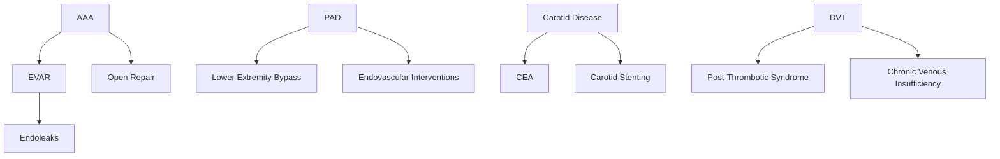

# Vascular Surgery Ontology

> **Version**: 1.0.0  
> **Created**: 2026-01-05T00:40:00.000Z  
> **Last Updated**: 2026-01-05T00:40:00.000Z  
> **Domain Path**: `health-sciences/medicine/surgery/vascular`  
> **Contributors**: copilot-agent, ontology-agent

---

## Overview

Vascular surgery is a surgical specialty focused on the diagnosis and management of diseases affecting the arterial, venous, and lymphatic systems (excluding coronary and intracranial vessels). This ontology provides a comprehensive taxonomy of vascular surgery knowledge, organized into sub-domains with planned Atomic Knowledge Units (AKUs).

## Domain Scope

### Included
- Peripheral arterial disease (PAD)
- Carotid artery disease
- Aortic pathology (aneurysms, dissections)
- Venous disease (DVT, chronic venous insufficiency)
- Mesenteric vascular disease
- Vascular trauma
- Dialysis access
- Vascular malformations
- All vascular surgical and endovascular procedures

### Excluded (Separate Specialties)
- Coronary artery disease → Cardiac Surgery
- Intracranial vascular disease → Neurosurgery
- Pulmonary circulation → Pulmonology/Cardiothoracic Surgery

---

## Ontology Structure

```
vascular/
├── foundations/              # Basic science and anatomy
│   └── akus/                 # 6 AKUs (vs-basic-001 to vs-basic-006)
├── pathology/                # Disease states
│   ├── aaa/                  # Abdominal Aortic Aneurysm
│   ├── thoracic-aortic-aneurysm/
│   ├── aortic-dissection/
│   ├── peripheral-arterial-disease/
│   ├── carotid-disease/
│   ├── mesenteric-ischemia/  # 55+ AKUs (comprehensive)
│   ├── deep-vein-thrombosis/
│   └── venous-insufficiency/
├── procedures/               # Surgical interventions
│   ├── evar/                 # Endovascular Aortic Repair
│   ├── open-aortic-repair/
│   ├── carotid-endarterectomy/
│   ├── lower-extremity-bypass/
│   ├── endovascular-interventions/
│   └── dialysis-access/
├── complications/            # Post-procedural complications
│   ├── endoleaks/            # Types 1-5
│   └── graft-complications/
├── diagnostics/              # Diagnostic modalities
│   └── akus/
├── terminology/              # Standard terminology
└── .renders/                 # Audience-specific renderings
```

---

## Sub-domain Taxonomy

### 1. FOUNDATIONS (Basic Science)

**Purpose**: Foundational anatomy and physiology for vascular surgery

| AKU ID | Title | Status | Description |
|--------|-------|--------|-------------|
| vs-basic-001 | Blood Vessels: Fundamental Anatomy | ✅ Complete | Types of blood vessels |
| vs-basic-002 | Vascular Surgery Role | ✅ Complete | Specialty definition |
| vs-basic-003 | Arterial System | ✅ Complete | Wall layers, types, clinical significance |
| vs-basic-004 | Venous System | ✅ Complete | Deep/superficial, valves, return mechanisms |
| vs-basic-005 | Hemodynamics | ✅ Complete | Poiseuille, Bernoulli, Reynolds |
| vs-basic-006 | Atherosclerosis | ✅ Complete | Pathogenesis, risk factors |
| vs-basic-007 | Vascular Embryology | ⏳ Planned | Development of vascular system |
| vs-basic-008 | Collateral Circulation | ⏳ Planned | Compensatory pathways |
| vs-basic-009 | Vascular Wall Biology | ⏳ Planned | Endothelium, smooth muscle |
| vs-basic-010 | Coagulation Cascade | ⏳ Planned | Hemostasis in vascular context |

---

### 2. PATHOLOGY: ABDOMINAL AORTIC ANEURYSM (AAA)

**Path**: `pathology/aaa/`  
**Priority**: HIGH - Core vascular pathology

| AKU ID | Title | Status | Description |
|--------|-------|--------|-------------|
| aaa-001 | AAA Definition | ⏳ Planned | True aneurysm definition, criteria |
| aaa-002 | Epidemiology | ⏳ Planned | Prevalence, demographics, risk factors |
| aaa-003 | Pathophysiology | ⏳ Planned | Wall degeneration, genetics |
| aaa-004 | Natural History | ⏳ Planned | Growth rate, rupture risk |
| aaa-005 | Clinical Presentation | ⏳ Planned | Asymptomatic vs symptomatic |
| aaa-006 | Rupture Triad | ⏳ Planned | Classic presentation of ruptured AAA |
| aaa-007 | Screening Guidelines | ⏳ Planned | USPSTF recommendations |
| aaa-008 | Imaging Diagnosis | ⏳ Planned | Ultrasound, CT, sizing |
| aaa-009 | Size Thresholds | ⏳ Planned | 5.5cm criteria, growth-based criteria |
| aaa-010 | Surgical Indications | ⏳ Planned | When to intervene |
| aaa-011 | Anatomic Classification | ⏳ Planned | Infrarenal, juxtarenal, suprarenal |
| aaa-012 | Inflammatory AAA | ⏳ Planned | Special pathologic variant |
| aaa-013 | Mycotic Aneurysm | ⏳ Planned | Infected aneurysm |
| aaa-014 | Surveillance Protocols | ⏳ Planned | Monitoring small aneurysms |
| aaa-015 | Risk Stratification | ⏳ Planned | Operative risk assessment |

---

### 3. PATHOLOGY: THORACIC AORTIC ANEURYSM (TAA)

**Path**: `pathology/thoracic-aortic-aneurysm/`  
**Priority**: HIGH

| AKU ID | Title | Status | Description |
|--------|-------|--------|-------------|
| taa-001 | TAA Definition | ⏳ Planned | Definition and classification |
| taa-002 | Crawford Classification | ⏳ Planned | Type I-V thoracoabdominal |
| taa-003 | Ascending Aortic Aneurysm | ⏳ Planned | Root and ascending pathology |
| taa-004 | Aortic Arch Aneurysm | ⏳ Planned | Arch involvement |
| taa-005 | Descending Thoracic | ⏳ Planned | Descending thoracic pathology |
| taa-006 | Genetic Syndromes | ⏳ Planned | Marfan, Loeys-Dietz, Ehlers-Danlos |
| taa-007 | Bicuspid Aortic Valve | ⏳ Planned | BAV-associated aortopathy |
| taa-008 | Size Criteria | ⏳ Planned | Intervention thresholds |
| taa-009 | Growth Surveillance | ⏳ Planned | Monitoring protocols |
| taa-010 | TEVAR Indications | ⏳ Planned | Endovascular repair criteria |

---

### 4. PATHOLOGY: AORTIC DISSECTION

**Path**: `pathology/aortic-dissection/`  
**Priority**: CRITICAL - Life-threatening emergency

| AKU ID | Title | Status | Description |
|--------|-------|--------|-------------|
| diss-001 | Aortic Dissection Definition | ⏳ Planned | Intimal tear, false lumen |
| diss-002 | Stanford Classification | ⏳ Planned | Type A vs Type B |
| diss-003 | DeBakey Classification | ⏳ Planned | Types I, II, III |
| diss-004 | Pathophysiology | ⏳ Planned | Mechanism, propagation |
| diss-005 | Risk Factors | ⏳ Planned | Hypertension, connective tissue |
| diss-006 | Clinical Presentation | ⏳ Planned | Tearing pain, pulse deficits |
| diss-007 | Diagnostic Imaging | ⏳ Planned | CTA, TEE findings |
| diss-008 | Acute Type A Management | ⏳ Planned | Emergency surgical repair |
| diss-009 | Acute Type B Management | ⏳ Planned | Medical vs interventional |
| diss-010 | Complicated Type B | ⏳ Planned | Malperfusion syndromes |
| diss-011 | TEVAR for Dissection | ⏳ Planned | Entry tear coverage |
| diss-012 | Chronic Dissection | ⏳ Planned | Aneurysmal degeneration |
| diss-013 | Intramural Hematoma | ⏳ Planned | Dissection variant |
| diss-014 | Penetrating Aortic Ulcer | ⏳ Planned | PAU management |
| diss-015 | Surveillance Protocols | ⏳ Planned | Long-term follow-up |

---

### 5. PATHOLOGY: PERIPHERAL ARTERIAL DISEASE (PAD)

**Path**: `pathology/peripheral-arterial-disease/`  
**Priority**: HIGH - Most common vascular pathology

| AKU ID | Title | Status | Description |
|--------|-------|--------|-------------|
| pad-001 | PAD Definition | ⏳ Planned | Atherosclerotic occlusive disease |
| pad-002 | Epidemiology | ⏳ Planned | Prevalence, cardiovascular risk |
| pad-003 | Fontaine Classification | ⏳ Planned | Stages I-IV |
| pad-004 | Rutherford Classification | ⏳ Planned | Categories 0-6 |
| pad-005 | WIfI Classification | ⏳ Planned | Wound, Ischemia, foot Infection |
| pad-006 | Clinical Presentation | ⏳ Planned | Claudication, rest pain, tissue loss |
| pad-007 | Ankle-Brachial Index | ⏳ Planned | ABI interpretation |
| pad-008 | Toe Pressures | ⏳ Planned | TBI, absolute toe pressures |
| pad-009 | Segmental Pressures | ⏳ Planned | Localization of disease |
| pad-010 | Arterial Duplex | ⏳ Planned | Ultrasound evaluation |
| pad-011 | CTA/MRA Imaging | ⏳ Planned | Cross-sectional imaging |
| pad-012 | Angiography | ⏳ Planned | Diagnostic and therapeutic |
| pad-013 | Medical Management | ⏳ Planned | Risk factor modification, antiplatelet |
| pad-014 | Exercise Therapy | ⏳ Planned | Supervised exercise programs |
| pad-015 | Endovascular Treatment | ⏳ Planned | Angioplasty, stenting |
| pad-016 | Surgical Bypass | ⏳ Planned | Infrainguinal bypass |
| pad-017 | Aortoiliac Disease | ⏳ Planned | Inflow disease |
| pad-018 | Femoropopliteal Disease | ⏳ Planned | SFA, popliteal disease |
| pad-019 | Infrapopliteal Disease | ⏳ Planned | Tibial artery disease |
| pad-020 | Critical Limb Ischemia | ⏳ Planned | CLI/CLTI definition and management |
| pad-021 | Acute Limb Ischemia | ⏳ Planned | Emergency presentation |
| pad-022 | Amputation | ⏳ Planned | Levels and indications |

---

### 6. PATHOLOGY: CAROTID ARTERY DISEASE

**Path**: `pathology/carotid-disease/`  
**Priority**: HIGH - Stroke prevention

| AKU ID | Title | Status | Description |
|--------|-------|--------|-------------|
| carotid-001 | Carotid Stenosis Definition | ⏳ Planned | Atherosclerotic plaque |
| carotid-002 | Epidemiology | ⏳ Planned | Stroke risk correlation |
| carotid-003 | Symptomatic vs Asymptomatic | ⏳ Planned | Clinical distinction |
| carotid-004 | Plaque Morphology | ⏳ Planned | Stable vs unstable plaque |
| carotid-005 | TIA and Stroke | ⏳ Planned | Clinical syndromes |
| carotid-006 | Duplex Ultrasound | ⏳ Planned | Velocity criteria |
| carotid-007 | CTA/MRA Evaluation | ⏳ Planned | Cross-sectional imaging |
| carotid-008 | Stenosis Grading | ⏳ Planned | NASCET vs ECST methods |
| carotid-009 | Surgical Indications | ⏳ Planned | Evidence-based criteria |
| carotid-010 | Carotid Endarterectomy | ⏳ Planned | Surgical technique |
| carotid-011 | Carotid Stenting | ⏳ Planned | CAS technique |
| carotid-012 | CEA vs CAS Selection | ⏳ Planned | Patient selection |
| carotid-013 | TCAR | ⏳ Planned | TransCarotid Artery Revascularization |
| carotid-014 | Perioperative Stroke | ⏳ Planned | Complication management |
| carotid-015 | Restenosis | ⏳ Planned | Recurrent disease |

---

### 7. PATHOLOGY: DEEP VEIN THROMBOSIS (DVT)

**Path**: `pathology/deep-vein-thrombosis/`  
**Priority**: HIGH

| AKU ID | Title | Status | Description |
|--------|-------|--------|-------------|
| dvt-001 | DVT Definition | ⏳ Planned | Venous thromboembolism |
| dvt-002 | Virchow's Triad | ⏳ Planned | Pathophysiology |
| dvt-003 | Risk Factors | ⏳ Planned | Acquired and inherited |
| dvt-004 | Clinical Presentation | ⏳ Planned | Signs and symptoms |
| dvt-005 | Upper vs Lower Extremity | ⏳ Planned | Location-specific features |
| dvt-006 | Wells Score | ⏳ Planned | Clinical probability |
| dvt-007 | D-Dimer Testing | ⏳ Planned | Laboratory diagnosis |
| dvt-008 | Duplex Ultrasound | ⏳ Planned | Imaging diagnosis |
| dvt-009 | Iliofemoral DVT | ⏳ Planned | Proximal involvement |
| dvt-010 | Phlegmasia | ⏳ Planned | Cerulea/Alba Dolens |
| dvt-011 | Anticoagulation | ⏳ Planned | Medical treatment |
| dvt-012 | Thrombolysis | ⏳ Planned | Catheter-directed therapy |
| dvt-013 | Mechanical Thrombectomy | ⏳ Planned | Interventional options |
| dvt-014 | IVC Filters | ⏳ Planned | Indications and complications |
| dvt-015 | Post-Thrombotic Syndrome | ⏳ Planned | Chronic sequelae |

---

### 8. PATHOLOGY: CHRONIC VENOUS INSUFFICIENCY

**Path**: `pathology/venous-insufficiency/`  
**Priority**: MEDIUM

| AKU ID | Title | Status | Description |
|--------|-------|--------|-------------|
| cvi-001 | CVI Definition | ⏳ Planned | Venous hypertension |
| cvi-002 | CEAP Classification | ⏳ Planned | Clinical classification |
| cvi-003 | Pathophysiology | ⏳ Planned | Valve dysfunction, reflux |
| cvi-004 | Varicose Veins | ⏳ Planned | Superficial venous disease |
| cvi-005 | Venous Ulcers | ⏳ Planned | Chronic wound management |
| cvi-006 | Duplex Evaluation | ⏳ Planned | Reflux testing |
| cvi-007 | Compression Therapy | ⏳ Planned | Conservative management |
| cvi-008 | Endovenous Ablation | ⏳ Planned | Laser and radiofrequency |
| cvi-009 | Sclerotherapy | ⏳ Planned | Chemical ablation |
| cvi-010 | Venous Stenting | ⏳ Planned | Iliac vein obstruction |

---

### 9. PATHOLOGY: MESENTERIC ISCHEMIA

**Path**: `pathology/mesenteric-ischemia/`  
**Status**: ✅ COMPREHENSIVE (55+ AKUs)

This sub-domain is already extensively developed with 55+ AKUs covering:
- Definitions (7 AKUs)
- Epidemiology (2 AKUs)
- Pathophysiology (6 AKUs)
- Diagnosis (8 AKUs)
- Imaging (4 AKUs)
- Treatment (8 AKUs)
- Surgical Dilemmas (9 AKUs)
- Outcomes (5 AKUs)
- Follow-up (3 AKUs)
- Special Situations (3 AKUs)
- Perspectives (3 AKUs)
- Education (1 AKU)

---

### 10. PROCEDURES: ENDOVASCULAR AORTIC REPAIR (EVAR)

**Path**: `procedures/evar/`  
**Priority**: HIGH

| AKU ID | Title | Status | Description |
|--------|-------|--------|-------------|
| evar-001 | EVAR Overview | ⏳ Planned | Minimally invasive approach |
| evar-002 | Anatomic Eligibility | ⏳ Planned | IFU criteria, neck anatomy |
| evar-003 | Device Selection | ⏳ Planned | Stent-graft options |
| evar-004 | Technical Approach | ⏳ Planned | Femoral access, deployment |
| evar-005 | Completion Imaging | ⏳ Planned | Intraoperative assessment |
| evar-006 | EVAR vs Open Repair | ⏳ Planned | Comparative outcomes |
| evar-007 | Complex EVAR | ⏳ Planned | Fenestrated, branched grafts |
| evar-008 | EVAR in Rupture | ⏳ Planned | Emergency EVAR |
| evar-009 | Surveillance Protocol | ⏳ Planned | Post-EVAR follow-up |
| evar-010 | Late Complications | ⏳ Planned | Sac growth, migration |

---

### 11. PROCEDURES: OPEN AORTIC REPAIR

**Path**: `procedures/open-aortic-repair/`  
**Priority**: HIGH

| AKU ID | Title | Status | Description |
|--------|-------|--------|-------------|
| oar-001 | Open Repair Overview | ⏳ Planned | Traditional approach |
| oar-002 | Preoperative Planning | ⏳ Planned | Risk assessment |
| oar-003 | Surgical Approach | ⏳ Planned | Transperitoneal vs retroperitoneal |
| oar-004 | Aortic Cross-Clamping | ⏳ Planned | Clamp positions, physiology |
| oar-005 | Graft Selection | ⏳ Planned | Dacron vs PTFE |
| oar-006 | Anastomotic Technique | ⏳ Planned | Suturing methods |
| oar-007 | Reimplantation | ⏳ Planned | IMA, renal arteries |
| oar-008 | Perioperative Management | ⏳ Planned | ICU care protocols |
| oar-009 | Complications | ⏳ Planned | Bleeding, ischemia, infection |
| oar-010 | Long-term Outcomes | ⏳ Planned | Durability data |

---

### 12. PROCEDURES: CAROTID ENDARTERECTOMY (CEA)

**Path**: `procedures/carotid-endarterectomy/`  
**Priority**: HIGH

| AKU ID | Title | Status | Description |
|--------|-------|--------|-------------|
| cea-001 | CEA Overview | ⏳ Planned | Historical context, evidence |
| cea-002 | Indications | ⏳ Planned | Symptomatic vs asymptomatic |
| cea-003 | Preoperative Assessment | ⏳ Planned | Imaging, cardiac risk |
| cea-004 | Anesthesia Options | ⏳ Planned | General vs regional |
| cea-005 | Surgical Technique | ⏳ Planned | Standard approach |
| cea-006 | Shunt Use | ⏳ Planned | Selective vs routine |
| cea-007 | Patch Closure | ⏳ Planned | Primary vs patch |
| cea-008 | Eversion CEA | ⏳ Planned | Alternative technique |
| cea-009 | Intraoperative Monitoring | ⏳ Planned | EEG, stump pressure |
| cea-010 | Perioperative Stroke | ⏳ Planned | Management strategies |

---

### 13. PROCEDURES: LOWER EXTREMITY BYPASS

**Path**: `procedures/lower-extremity-bypass/`  
**Priority**: HIGH

| AKU ID | Title | Status | Description |
|--------|-------|--------|-------------|
| leb-001 | Bypass Overview | ⏳ Planned | Surgical revascularization |
| leb-002 | Conduit Selection | ⏳ Planned | GSV vs prosthetic |
| leb-003 | Aortofemoral Bypass | ⏳ Planned | Inflow procedures |
| leb-004 | Femoropopliteal Bypass | ⏳ Planned | Above-knee vs below-knee |
| leb-005 | Infrapopliteal Bypass | ⏳ Planned | Tibial and pedal targets |
| leb-006 | Venous Conduit Harvest | ⏳ Planned | Open vs endoscopic |
| leb-007 | Anastomotic Technique | ⏳ Planned | End-to-side, patches |
| leb-008 | Graft Surveillance | ⏳ Planned | Duplex monitoring |
| leb-009 | Graft Failure | ⏳ Planned | Thrombosis, revision |
| leb-010 | Limb Salvage Outcomes | ⏳ Planned | Patency rates |

---

### 14. PROCEDURES: ENDOVASCULAR INTERVENTIONS

**Path**: `procedures/endovascular-interventions/`  
**Priority**: MEDIUM

| AKU ID | Title | Status | Description |
|--------|-------|--------|-------------|
| endo-001 | Angioplasty Overview | ⏳ Planned | Balloon dilation |
| endo-002 | Stent Types | ⏳ Planned | BMS, DES, covered |
| endo-003 | Drug-Coated Technology | ⏳ Planned | DCB and DES |
| endo-004 | Atherectomy | ⏳ Planned | Directional, orbital, laser |
| endo-005 | Thrombolysis | ⏳ Planned | Catheter-directed |
| endo-006 | Access Techniques | ⏳ Planned | Femoral, radial, pedal |
| endo-007 | Complication Management | ⏳ Planned | Dissection, perforation |
| endo-008 | Hybrid Procedures | ⏳ Planned | Combined approaches |

---

### 15. PROCEDURES: DIALYSIS ACCESS

**Path**: `procedures/dialysis-access/`  
**Priority**: MEDIUM

| AKU ID | Title | Status | Description |
|--------|-------|--------|-------------|
| dial-001 | Dialysis Access Overview | ⏳ Planned | AVF vs AVG vs catheter |
| dial-002 | AVF Creation | ⏳ Planned | Fistula first strategy |
| dial-003 | AVG Placement | ⏳ Planned | Graft options |
| dial-004 | Maturation | ⏳ Planned | Fistula development |
| dial-005 | Access Thrombosis | ⏳ Planned | Declotting techniques |
| dial-006 | Stenosis Management | ⏳ Planned | Angioplasty interventions |
| dial-007 | Steal Syndrome | ⏳ Planned | Ischemic complications |
| dial-008 | Infection | ⏳ Planned | Access infection management |
| dial-009 | High-Output Failure | ⏳ Planned | Cardiac consequences |
| dial-010 | Central Venous Stenosis | ⏳ Planned | Long-term complications |

---

### 16. DIAGNOSTICS

**Path**: `diagnostics/`  
**Priority**: MEDIUM

| AKU ID | Title | Status | Description |
|--------|-------|--------|-------------|
| diag-001 | Vascular Physical Exam | ⏳ Planned | Clinical assessment |
| diag-002 | Pulse Examination | ⏳ Planned | Arterial pulses |
| diag-003 | Ankle-Brachial Index | ⏳ Planned | ABI technique and interpretation |
| diag-004 | Toe-Brachial Index | ⏳ Planned | TBI for diabetics |
| diag-005 | Segmental Pressures | ⏳ Planned | Multi-level assessment |
| diag-006 | Pulse Volume Recording | ⏳ Planned | Plethysmography |
| diag-007 | Arterial Duplex | ⏳ Planned | Ultrasound evaluation |
| diag-008 | Venous Duplex | ⏳ Planned | DVT and reflux assessment |
| diag-009 | CTA Principles | ⏳ Planned | CT angiography |
| diag-010 | MRA Principles | ⏳ Planned | MR angiography |
| diag-011 | Conventional Angiography | ⏳ Planned | Catheter-based imaging |
| diag-012 | Carbon Dioxide Angiography | ⏳ Planned | Alternative contrast |
| diag-013 | Transcutaneous Oximetry | ⏳ Planned | TcPO2 measurement |
| diag-014 | Skin Perfusion Pressure | ⏳ Planned | SPP assessment |

---

### 17. COMPLICATIONS: ENDOLEAKS

**Path**: `complications/endoleaks/`  
**Status**: Type 2 Complete, Others Planned

| Sub-domain | Status | AKUs |
|------------|--------|------|
| type-1/ | ⏳ Planned | 5 AKUs planned |
| type-2/ | ✅ Complete | 8 AKUs |
| type-3/ | ⏳ Planned | 5 AKUs planned |
| type-4/ | ⏳ Planned | 3 AKUs planned |
| type-5/ | ⏳ Planned | 3 AKUs planned |

**Type 1 Endoleak (Planned):**
| AKU ID | Title | Description |
|--------|-------|-------------|
| t1-001 | Type 1 Endoleak Definition | Attachment site leak |
| t1-002 | Type 1A vs 1B | Proximal vs distal |
| t1-003 | Diagnosis | Imaging findings |
| t1-004 | Management | Immediate intervention |
| t1-005 | Prevention | Anatomic selection |

**Type 3 Endoleak (Planned):**
| AKU ID | Title | Description |
|--------|-------|-------------|
| t3-001 | Type 3 Endoleak Definition | Graft structural failure |
| t3-002 | Modular Disconnection | Component separation |
| t3-003 | Fabric Tear | Graft defects |
| t3-004 | Diagnosis | Imaging detection |
| t3-005 | Management | Relining strategies |

---

### 18. COMPLICATIONS: GRAFT COMPLICATIONS

**Path**: `complications/graft-complications/`  
**Priority**: MEDIUM

| AKU ID | Title | Status | Description |
|--------|-------|--------|-------------|
| gc-001 | Graft Infection Overview | ⏳ Planned | Classification, organisms |
| gc-002 | Aortic Graft Infection | ⏳ Planned | Life-threatening complication |
| gc-003 | Peripheral Graft Infection | ⏳ Planned | Extremity grafts |
| gc-004 | Graft Thrombosis | ⏳ Planned | Acute and chronic |
| gc-005 | Graft-Enteric Fistula | ⏳ Planned | GI bleeding |
| gc-006 | Anastomotic Pseudoaneurysm | ⏳ Planned | Suture line failure |

---

## Cross-Domain Links

### Within Vascular Surgery


### Cross-Domain References
| Concept | Related Domain | Relationship |
|---------|----------------|--------------|
| Atherosclerosis | Cardiology | Shared pathophysiology |
| Stroke | Neurology | Outcome of carotid disease |
| Renal Artery Stenosis | Nephrology | Renovascular hypertension |
| Pulmonary Embolism | Pulmonology | VTE continuum |
| Wound Healing | Plastic Surgery | Tissue loss management |
| Diabetes Complications | Endocrinology | Risk factor, foot care |

---

## Statistics Summary

> **Last Updated**: 2026-01-05T03:15:00Z

| Category | Existing | Created This Session | Remaining | Total |
|----------|----------|---------------------|-----------|-------|
| Foundations | 6 | 0 | 4 | 10 |
| AAA | 0 | **8** | 7 | 15 |
| TAA | 0 | 0 | 10 | 10 |
| Aortic Dissection | 0 | **5** | 10 | 15 |
| PAD | 0 | **5** | 17 | 22 |
| Carotid Disease | 0 | **2** | 13 | 15 |
| DVT | 0 | **4** | 11 | 15 |
| Venous Insufficiency | 0 | 0 | 10 | 10 |
| Mesenteric Ischemia | 55 | 0 | 0 | 55 |
| EVAR | 0 | **1** | 9 | 10 |
| Open Aortic Repair | 0 | 0 | 10 | 10 |
| CEA | 0 | **1** | 9 | 10 |
| Lower Extremity Bypass | 0 | **1** | 9 | 10 |
| Endovascular Interventions | 0 | 0 | 8 | 8 |
| Dialysis Access | 0 | 0 | 10 | 10 |
| Diagnostics | 0 | 0 | 14 | 14 |
| Type 2 Endoleak | 8 | 0 | 0 | 8 |
| Other Endoleaks | 0 | 0 | 16 | 16 |
| Graft Complications | 0 | 0 | 6 | 6 |
| **TOTAL** | **69** | **27** | **163** | **259** |

**Progress**: 96 of 259 AKUs complete (37%)
**Total AKU files in domain**: 102

---

## Implementation Priority

### Phase 1 (Current Session - 2026-01-05) ✅ COMPLETE
1. ✅ Create ontology document (23KB comprehensive taxonomy)
2. ✅ Create directory structure for all sub-domains
3. ✅ Build AAA sub-domain (8/15 AKUs created)
4. ✅ Build PAD sub-domain (5/22 AKUs created)
5. ✅ Build Aortic Dissection sub-domain (5/15 AKUs)
6. ✅ Build DVT sub-domain (4/15 AKUs)
7. ✅ Build Carotid, EVAR, CEA, Lower Extremity Bypass foundations
8. ✅ Create concept-index.yaml for all new sub-domains
9. ✅ Validate all AKUs

### Phase 2 (Next Session)
1. Complete AAA sub-domain (8 remaining)
2. Complete PAD sub-domain (17 remaining)
3. Build Carotid Disease sub-domain (14 remaining)
4. Build Aortic Dissection sub-domain (12 remaining)

### Phase 3 (Future)
1. Build TAA sub-domain (10 AKUs)
2. Complete DVT sub-domain (13 remaining)
3. Build Venous Insufficiency sub-domain (10 AKUs)

### Phase 4 (Future)
1. Complete Procedures sub-domains
2. Complete Diagnostics sub-domain
3. Complete Complications sub-domains

---

## References

1. Rutherford's Vascular Surgery and Endovascular Therapy, 10th Edition
2. Society for Vascular Surgery Clinical Practice Guidelines
3. European Society for Vascular Surgery Guidelines
4. American Heart Association Guidelines
5. NICE Guidelines for Vascular Conditions

---

*This ontology is a living document. Update as AKUs are created and validated.*
