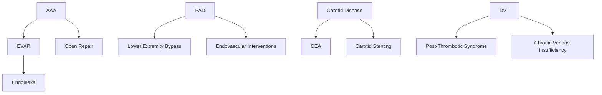

# Vascular Surgery Ontology

> **Version**: 2.0.0  
> **Created**: 2026-01-05T00:40:00.000Z  
> **Last Updated**: 2026-01-05T01:40:00.000Z  
> **Domain Path**: `health-sciences/medicine/surgery/vascular`  
> **Contributors**: copilot-agent, ontology-agent

---

## Overview

Vascular surgery is a surgical specialty focused on the diagnosis and management of diseases affecting the arterial, venous, and lymphatic systems (excluding coronary and intracranial vessels). This ontology provides a comprehensive taxonomy of vascular surgery knowledge, organized into sub-domains with planned Atomic Knowledge Units (AKUs).

## Domain Scope

### Included
- **Arterial Diseases**: PAD, carotid, aortic aneurysms/dissections, mesenteric, renal artery, upper extremity
- **Venous Diseases**: DVT, chronic venous insufficiency, venous compression syndromes, venous tumors
- **Lymphatic Diseases**: Lymphedema, lymphatic malformations, chylous disorders
- **Vascular Malformations**: Arteriovenous malformations, hemangiomas, venous malformations
- **Genetic/Connective Tissue Disorders**: Marfan, Loeys-Dietz, Ehlers-Danlos, FMD, NF1
- **Congenital Vascular Diseases**: Coarctation, vascular rings, persistent sciatic artery
- **Vasculitis**: Takayasu, Giant Cell Arteritis, Buerger's disease, polyarteritis nodosa
- **Vascular Tumors**: Primary and metastatic vascular tumors
- **Venous Compression Syndromes**: May-Thurner, Nutcracker, Thoracic Outlet
- **Vascular Trauma**: Blunt, penetrating, iatrogenic
- **Dialysis Access**: AVF, AVG, catheters, complications
- **Rare Diseases**: Popliteal Entrapment, Cystic Adventitial Disease, Blue Toe Syndrome

### Excluded (Separate Specialties)
- Coronary artery disease → Cardiac Surgery
- Intracranial vascular disease → Neurosurgery
- Pulmonary circulation → Pulmonology/Cardiothoracic Surgery

---

## Ontology Structure

```
vascular/
├── foundations/                    # Basic science and anatomy
│   └── akus/                       # 15 AKUs planned
├── pathology/                      # Disease states
│   ├── arterial/                   # ARTERIAL DISEASES
│   │   ├── aaa/                    # Abdominal Aortic Aneurysm (15 AKUs)
│   │   ├── thoracic-aortic-aneurysm/  # TAA (12 AKUs)
│   │   ├── aortic-dissection/      # Dissection (15 AKUs)
│   │   ├── peripheral-arterial-disease/  # PAD (22 AKUs)
│   │   ├── carotid-disease/        # Carotid (15 AKUs)
│   │   ├── mesenteric-ischemia/    # Mesenteric (55+ AKUs) ✅ COMPLETE
│   │   ├── renal-artery-disease/   # Renovascular (12 AKUs)
│   │   ├── upper-extremity/        # Upper extremity arterial (10 AKUs)
│   │   ├── popliteal-aneurysm/     # Popliteal aneurysm (8 AKUs)
│   │   └── rare-arterial/          # Rare conditions (15 AKUs)
│   ├── venous/                     # VENOUS DISEASES
│   │   ├── deep-vein-thrombosis/   # DVT (15 AKUs)
│   │   ├── venous-insufficiency/   # CVI (12 AKUs)
│   │   ├── compression-syndromes/  # May-Thurner, Nutcracker (18 AKUs)
│   │   ├── superficial-venous/     # Varicose veins, SVT (10 AKUs)
│   │   └── rare-venous/            # Rare venous conditions (8 AKUs)
│   ├── lymphatic/                  # LYMPHATIC DISEASES
│   │   ├── lymphedema/             # Primary and secondary (15 AKUs)
│   │   ├── lymphatic-malformations/ # Congenital (10 AKUs)
│   │   └── chylous-disorders/      # Chylothorax, chylous ascites (8 AKUs)
│   ├── genetic-connective-tissue/  # GENETIC/HEREDITARY DISORDERS
│   │   ├── marfan-syndrome/        # Marfan (10 AKUs)
│   │   ├── loeys-dietz-syndrome/   # Loeys-Dietz (8 AKUs)
│   │   ├── ehlers-danlos-vascular/ # EDS Type IV (10 AKUs)
│   │   ├── fibromuscular-dysplasia/ # FMD (12 AKUs)
│   │   ├── neurofibromatosis/      # NF1 vascular (6 AKUs)
│   │   └── other-genetic/          # Turner, Williams, etc. (10 AKUs)
│   ├── congenital/                 # CONGENITAL VASCULAR DISEASES
│   │   ├── coarctation/            # Aortic coarctation (8 AKUs)
│   │   ├── vascular-rings/         # Vascular rings/slings (8 AKUs)
│   │   ├── persistent-vessels/     # Persistent sciatic artery (6 AKUs)
│   │   └── other-congenital/       # Aberrant vessels (8 AKUs)
│   ├── vasculitis/                 # INFLAMMATORY VASCULAR DISEASES
│   │   ├── takayasu-arteritis/     # Takayasu (12 AKUs)
│   │   ├── giant-cell-arteritis/   # GCA/temporal (10 AKUs)
│   │   ├── buerger-disease/        # Thromboangiitis obliterans (10 AKUs)
│   │   ├── polyarteritis-nodosa/   # PAN (8 AKUs)
│   │   └── other-vasculitis/       # Kawasaki, Behcet, etc. (12 AKUs)
│   ├── vascular-malformations/     # VASCULAR MALFORMATIONS
│   │   ├── arteriovenous-malformations/  # AVMs (12 AKUs)
│   │   ├── venous-malformations/   # VMs (10 AKUs)
│   │   ├── lymphatic-malformations/ # LMs (8 AKUs)
│   │   ├── hemangiomas/            # Infantile hemangiomas (8 AKUs)
│   │   └── combined-malformations/ # KT, Parkes-Weber (10 AKUs)
│   ├── vascular-tumors/            # VASCULAR TUMORS
│   │   ├── primary-tumors/         # Angiosarcoma, etc. (10 AKUs)
│   │   └── tumor-invasion/         # Tumor thrombus (8 AKUs)
│   ├── trauma/                     # VASCULAR TRAUMA
│   │   ├── blunt-trauma/           # Blunt vascular injury (12 AKUs)
│   │   ├── penetrating-trauma/     # Penetrating injury (10 AKUs)
│   │   ├── iatrogenic/             # Catheter, access injury (10 AKUs)
│   │   └── compartment-syndrome/   # Extremity compartment syndrome (8 AKUs)
│   └── rare-syndromes/             # RARE VASCULAR SYNDROMES
│       ├── popliteal-entrapment/   # Popliteal artery entrapment (10 AKUs)
│       ├── cystic-adventitial/     # Cystic adventitial disease (6 AKUs)
│       ├── blue-toe-syndrome/      # Atheroembolism (6 AKUs)
│       ├── thoracic-outlet/        # TOS (15 AKUs)
│       └── other-rare/             # Additional rare conditions (10 AKUs)
├── procedures/                     # Surgical interventions
│   ├── endovascular/               # ENDOVASCULAR PROCEDURES
│   │   ├── evar/                   # Endovascular Aortic Repair (10 AKUs)
│   │   ├── tevar/                  # Thoracic EVAR (10 AKUs)
│   │   ├── fenestrated-branched/   # F/B-EVAR (12 AKUs)
│   │   ├── peripheral-interventions/ # PTA, stenting (12 AKUs)
│   │   ├── carotid-stenting/       # CAS/TCAR (8 AKUs)
│   │   ├── thrombolysis/           # CDT, mechanical (10 AKUs)
│   │   └── venous-interventions/   # Stenting, ablation (12 AKUs)
│   ├── open-surgery/               # OPEN SURGICAL PROCEDURES
│   │   ├── open-aortic-repair/     # Open AAA/TAA repair (12 AKUs)
│   │   ├── carotid-endarterectomy/ # CEA (10 AKUs)
│   │   ├── lower-extremity-bypass/ # Infrainguinal bypass (12 AKUs)
│   │   ├── aortofemoral-bypass/    # Aortoiliac procedures (8 AKUs)
│   │   ├── extra-anatomic-bypass/  # Axillofemoral, etc. (8 AKUs)
│   │   └── venous-surgery/         # Venous reconstruction (10 AKUs)
│   ├── dialysis-access/            # DIALYSIS ACCESS
│   │   ├── avf-creation/           # Arteriovenous fistula (12 AKUs)
│   │   ├── avg-placement/          # Arteriovenous graft (8 AKUs)
│   │   └── access-maintenance/     # Interventions (10 AKUs)
│   ├── lymphatic-surgery/          # LYMPHATIC PROCEDURES
│   │   ├── lva/                    # Lymphovenous anastomosis (8 AKUs)
│   │   ├── lymph-node-transfer/    # VLNT (8 AKUs)
│   │   └── debulking/              # Excisional procedures (6 AKUs)
│   └── hybrid-procedures/          # HYBRID/COMBINED (8 AKUs)
├── complications/                  # Post-procedural complications
│   ├── endoleaks/                  # Types 1-5 (24 AKUs)
│   ├── graft-complications/        # Infection, thrombosis (12 AKUs)
│   ├── access-complications/       # Femoral, radial (8 AKUs)
│   └── neurologic-complications/   # Stroke, SCI (8 AKUs)
├── diagnostics/                    # Diagnostic modalities
│   ├── non-invasive/               # ABI, duplex (16 AKUs)
│   ├── invasive/                   # Angiography (8 AKUs)
│   └── cross-sectional/            # CTA, MRA (10 AKUs)
├── terminology/                    # Standard terminology
└── .renders/                       # Audience-specific renderings
```

---

## Sub-domain Taxonomy

### 1. FOUNDATIONS (Basic Science)

**Purpose**: Foundational anatomy and physiology for vascular surgery

| AKU ID | Title | Status | Description |
|--------|-------|--------|-------------|
| vs-basic-001 | Blood Vessels: Fundamental Anatomy | ✅ Complete | Types of blood vessels |
| vs-basic-002 | Vascular Surgery Role | ✅ Complete | Specialty definition |
| vs-basic-003 | Arterial System | ✅ Complete | Wall layers, types, clinical significance |
| vs-basic-004 | Venous System | ✅ Complete | Deep/superficial, valves, return mechanisms |
| vs-basic-005 | Hemodynamics | ✅ Complete | Poiseuille, Bernoulli, Reynolds |
| vs-basic-006 | Atherosclerosis | ✅ Complete | Pathogenesis, risk factors |
| vs-basic-007 | Vascular Embryology | ⏳ Planned | Development of vascular system |
| vs-basic-008 | Collateral Circulation | ⏳ Planned | Compensatory pathways |
| vs-basic-009 | Vascular Wall Biology | ⏳ Planned | Endothelium, smooth muscle |
| vs-basic-010 | Coagulation Cascade | ⏳ Planned | Hemostasis in vascular context |

---

### 2. PATHOLOGY: ABDOMINAL AORTIC ANEURYSM (AAA)

**Path**: `pathology/aaa/`  
**Priority**: HIGH - Core vascular pathology

| AKU ID | Title | Status | Description |
|--------|-------|--------|-------------|
| aaa-001 | AAA Definition | ⏳ Planned | True aneurysm definition, criteria |
| aaa-002 | Epidemiology | ⏳ Planned | Prevalence, demographics, risk factors |
| aaa-003 | Pathophysiology | ⏳ Planned | Wall degeneration, genetics |
| aaa-004 | Natural History | ⏳ Planned | Growth rate, rupture risk |
| aaa-005 | Clinical Presentation | ⏳ Planned | Asymptomatic vs symptomatic |
| aaa-006 | Rupture Triad | ⏳ Planned | Classic presentation of ruptured AAA |
| aaa-007 | Screening Guidelines | ⏳ Planned | USPSTF recommendations |
| aaa-008 | Imaging Diagnosis | ⏳ Planned | Ultrasound, CT, sizing |
| aaa-009 | Size Thresholds | ⏳ Planned | 5.5cm criteria, growth-based criteria |
| aaa-010 | Surgical Indications | ⏳ Planned | When to intervene |
| aaa-011 | Anatomic Classification | ⏳ Planned | Infrarenal, juxtarenal, suprarenal |
| aaa-012 | Inflammatory AAA | ⏳ Planned | Special pathologic variant |
| aaa-013 | Mycotic Aneurysm | ⏳ Planned | Infected aneurysm |
| aaa-014 | Surveillance Protocols | ⏳ Planned | Monitoring small aneurysms |
| aaa-015 | Risk Stratification | ⏳ Planned | Operative risk assessment |

---

### 3. PATHOLOGY: THORACIC AORTIC ANEURYSM (TAA)

**Path**: `pathology/thoracic-aortic-aneurysm/`  
**Priority**: HIGH

| AKU ID | Title | Status | Description |
|--------|-------|--------|-------------|
| taa-001 | TAA Definition | ⏳ Planned | Definition and classification |
| taa-002 | Crawford Classification | ⏳ Planned | Type I-V thoracoabdominal |
| taa-003 | Ascending Aortic Aneurysm | ⏳ Planned | Root and ascending pathology |
| taa-004 | Aortic Arch Aneurysm | ⏳ Planned | Arch involvement |
| taa-005 | Descending Thoracic | ⏳ Planned | Descending thoracic pathology |
| taa-006 | Genetic Syndromes | ⏳ Planned | Marfan, Loeys-Dietz, Ehlers-Danlos |
| taa-007 | Bicuspid Aortic Valve | ⏳ Planned | BAV-associated aortopathy |
| taa-008 | Size Criteria | ⏳ Planned | Intervention thresholds |
| taa-009 | Growth Surveillance | ⏳ Planned | Monitoring protocols |
| taa-010 | TEVAR Indications | ⏳ Planned | Endovascular repair criteria |

---

### 4. PATHOLOGY: AORTIC DISSECTION

**Path**: `pathology/aortic-dissection/`  
**Priority**: CRITICAL - Life-threatening emergency

| AKU ID | Title | Status | Description |
|--------|-------|--------|-------------|
| diss-001 | Aortic Dissection Definition | ⏳ Planned | Intimal tear, false lumen |
| diss-002 | Stanford Classification | ⏳ Planned | Type A vs Type B |
| diss-003 | DeBakey Classification | ⏳ Planned | Types I, II, III |
| diss-004 | Pathophysiology | ⏳ Planned | Mechanism, propagation |
| diss-005 | Risk Factors | ⏳ Planned | Hypertension, connective tissue |
| diss-006 | Clinical Presentation | ⏳ Planned | Tearing pain, pulse deficits |
| diss-007 | Diagnostic Imaging | ⏳ Planned | CTA, TEE findings |
| diss-008 | Acute Type A Management | ⏳ Planned | Emergency surgical repair |
| diss-009 | Acute Type B Management | ⏳ Planned | Medical vs interventional |
| diss-010 | Complicated Type B | ⏳ Planned | Malperfusion syndromes |
| diss-011 | TEVAR for Dissection | ⏳ Planned | Entry tear coverage |
| diss-012 | Chronic Dissection | ⏳ Planned | Aneurysmal degeneration |
| diss-013 | Intramural Hematoma | ⏳ Planned | Dissection variant |
| diss-014 | Penetrating Aortic Ulcer | ⏳ Planned | PAU management |
| diss-015 | Surveillance Protocols | ⏳ Planned | Long-term follow-up |

---

### 5. PATHOLOGY: PERIPHERAL ARTERIAL DISEASE (PAD)

**Path**: `pathology/peripheral-arterial-disease/`  
**Priority**: HIGH - Most common vascular pathology

| AKU ID | Title | Status | Description |
|--------|-------|--------|-------------|
| pad-001 | PAD Definition | ⏳ Planned | Atherosclerotic occlusive disease |
| pad-002 | Epidemiology | ⏳ Planned | Prevalence, cardiovascular risk |
| pad-003 | Fontaine Classification | ⏳ Planned | Stages I-IV |
| pad-004 | Rutherford Classification | ⏳ Planned | Categories 0-6 |
| pad-005 | WIfI Classification | ⏳ Planned | Wound, Ischemia, foot Infection |
| pad-006 | Clinical Presentation | ⏳ Planned | Claudication, rest pain, tissue loss |
| pad-007 | Ankle-Brachial Index | ⏳ Planned | ABI interpretation |
| pad-008 | Toe Pressures | ⏳ Planned | TBI, absolute toe pressures |
| pad-009 | Segmental Pressures | ⏳ Planned | Localization of disease |
| pad-010 | Arterial Duplex | ⏳ Planned | Ultrasound evaluation |
| pad-011 | CTA/MRA Imaging | ⏳ Planned | Cross-sectional imaging |
| pad-012 | Angiography | ⏳ Planned | Diagnostic and therapeutic |
| pad-013 | Medical Management | ⏳ Planned | Risk factor modification, antiplatelet |
| pad-014 | Exercise Therapy | ⏳ Planned | Supervised exercise programs |
| pad-015 | Endovascular Treatment | ⏳ Planned | Angioplasty, stenting |
| pad-016 | Surgical Bypass | ⏳ Planned | Infrainguinal bypass |
| pad-017 | Aortoiliac Disease | ⏳ Planned | Inflow disease |
| pad-018 | Femoropopliteal Disease | ⏳ Planned | SFA, popliteal disease |
| pad-019 | Infrapopliteal Disease | ⏳ Planned | Tibial artery disease |
| pad-020 | Critical Limb Ischemia | ⏳ Planned | CLI/CLTI definition and management |
| pad-021 | Acute Limb Ischemia | ⏳ Planned | Emergency presentation |
| pad-022 | Amputation | ⏳ Planned | Levels and indications |

---

### 6. PATHOLOGY: CAROTID ARTERY DISEASE

**Path**: `pathology/carotid-disease/`  
**Priority**: HIGH - Stroke prevention

| AKU ID | Title | Status | Description |
|--------|-------|--------|-------------|
| carotid-001 | Carotid Stenosis Definition | ⏳ Planned | Atherosclerotic plaque |
| carotid-002 | Epidemiology | ⏳ Planned | Stroke risk correlation |
| carotid-003 | Symptomatic vs Asymptomatic | ⏳ Planned | Clinical distinction |
| carotid-004 | Plaque Morphology | ⏳ Planned | Stable vs unstable plaque |
| carotid-005 | TIA and Stroke | ⏳ Planned | Clinical syndromes |
| carotid-006 | Duplex Ultrasound | ⏳ Planned | Velocity criteria |
| carotid-007 | CTA/MRA Evaluation | ⏳ Planned | Cross-sectional imaging |
| carotid-008 | Stenosis Grading | ⏳ Planned | NASCET vs ECST methods |
| carotid-009 | Surgical Indications | ⏳ Planned | Evidence-based criteria |
| carotid-010 | Carotid Endarterectomy | ⏳ Planned | Surgical technique |
| carotid-011 | Carotid Stenting | ⏳ Planned | CAS technique |
| carotid-012 | CEA vs CAS Selection | ⏳ Planned | Patient selection |
| carotid-013 | TCAR | ⏳ Planned | TransCarotid Artery Revascularization |
| carotid-014 | Perioperative Stroke | ⏳ Planned | Complication management |
| carotid-015 | Restenosis | ⏳ Planned | Recurrent disease |

---

### 7. PATHOLOGY: DEEP VEIN THROMBOSIS (DVT)

**Path**: `pathology/deep-vein-thrombosis/`  
**Priority**: HIGH

| AKU ID | Title | Status | Description |
|--------|-------|--------|-------------|
| dvt-001 | DVT Definition | ⏳ Planned | Venous thromboembolism |
| dvt-002 | Virchow's Triad | ⏳ Planned | Pathophysiology |
| dvt-003 | Risk Factors | ⏳ Planned | Acquired and inherited |
| dvt-004 | Clinical Presentation | ⏳ Planned | Signs and symptoms |
| dvt-005 | Upper vs Lower Extremity | ⏳ Planned | Location-specific features |
| dvt-006 | Wells Score | ⏳ Planned | Clinical probability |
| dvt-007 | D-Dimer Testing | ⏳ Planned | Laboratory diagnosis |
| dvt-008 | Duplex Ultrasound | ⏳ Planned | Imaging diagnosis |
| dvt-009 | Iliofemoral DVT | ⏳ Planned | Proximal involvement |
| dvt-010 | Phlegmasia | ⏳ Planned | Cerulea/Alba Dolens |
| dvt-011 | Anticoagulation | ⏳ Planned | Medical treatment |
| dvt-012 | Thrombolysis | ⏳ Planned | Catheter-directed therapy |
| dvt-013 | Mechanical Thrombectomy | ⏳ Planned | Interventional options |
| dvt-014 | IVC Filters | ⏳ Planned | Indications and complications |
| dvt-015 | Post-Thrombotic Syndrome | ⏳ Planned | Chronic sequelae |

---

### 8. PATHOLOGY: CHRONIC VENOUS INSUFFICIENCY

**Path**: `pathology/venous-insufficiency/`  
**Priority**: MEDIUM

| AKU ID | Title | Status | Description |
|--------|-------|--------|-------------|
| cvi-001 | CVI Definition | ⏳ Planned | Venous hypertension |
| cvi-002 | CEAP Classification | ⏳ Planned | Clinical classification |
| cvi-003 | Pathophysiology | ⏳ Planned | Valve dysfunction, reflux |
| cvi-004 | Varicose Veins | ⏳ Planned | Superficial venous disease |
| cvi-005 | Venous Ulcers | ⏳ Planned | Chronic wound management |
| cvi-006 | Duplex Evaluation | ⏳ Planned | Reflux testing |
| cvi-007 | Compression Therapy | ⏳ Planned | Conservative management |
| cvi-008 | Endovenous Ablation | ⏳ Planned | Laser and radiofrequency |
| cvi-009 | Sclerotherapy | ⏳ Planned | Chemical ablation |
| cvi-010 | Venous Stenting | ⏳ Planned | Iliac vein obstruction |

---

### 9. PATHOLOGY: MESENTERIC ISCHEMIA

**Path**: `pathology/mesenteric-ischemia/`  
**Status**: ✅ COMPREHENSIVE (55+ AKUs)

This sub-domain is already extensively developed with 55+ AKUs covering:
- Definitions (7 AKUs)
- Epidemiology (2 AKUs)
- Pathophysiology (6 AKUs)
- Diagnosis (8 AKUs)
- Imaging (4 AKUs)
- Treatment (8 AKUs)
- Surgical Dilemmas (9 AKUs)
- Outcomes (5 AKUs)
- Follow-up (3 AKUs)
- Special Situations (3 AKUs)
- Perspectives (3 AKUs)
- Education (1 AKU)

---

### 10. PATHOLOGY: RENAL ARTERY DISEASE

**Path**: `pathology/arterial/renal-artery-disease/`  
**Priority**: MEDIUM

| AKU ID | Title | Status | Description |
|--------|-------|--------|-------------|
| ras-001 | Renal Artery Stenosis Definition | ⏳ Planned | Atherosclerotic vs FMD |
| ras-002 | Renovascular Hypertension | ⏳ Planned | Pathophysiology, RAAS activation |
| ras-003 | Ischemic Nephropathy | ⏳ Planned | Renal atrophy, CKD |
| ras-004 | Clinical Presentation | ⏳ Planned | Resistant HTN, flash pulmonary edema |
| ras-005 | Diagnostic Evaluation | ⏳ Planned | Duplex, CTA, MRA, captopril renogram |
| ras-006 | Medical Management | ⏳ Planned | ACEi, ARB controversy |
| ras-007 | CORAL Trial | ⏳ Planned | Stenting vs medical therapy |
| ras-008 | Indications for Intervention | ⏳ Planned | When to stent |
| ras-009 | Renal Artery Stenting | ⏳ Planned | Technique, embolic protection |
| ras-010 | Surgical Revascularization | ⏳ Planned | Bypass, endarterectomy |
| ras-011 | Renal Artery Aneurysm | ⏳ Planned | True aneurysm, rupture risk |
| ras-012 | Renal Artery Dissection | ⏳ Planned | Spontaneous dissection |

---

### 11. PATHOLOGY: UPPER EXTREMITY ARTERIAL DISEASE

**Path**: `pathology/arterial/upper-extremity/`  
**Priority**: MEDIUM

| AKU ID | Title | Status | Description |
|--------|-------|--------|-------------|
| ue-001 | Upper Extremity Ischemia Overview | ⏳ Planned | Less common than lower extremity |
| ue-002 | Subclavian Artery Stenosis | ⏳ Planned | Atherosclerotic disease |
| ue-003 | Subclavian Steal Syndrome | ⏳ Planned | Vertebrobasilar symptoms |
| ue-004 | Axillary Artery Disease | ⏳ Planned | Trauma, radiation |
| ue-005 | Hand Ischemia | ⏳ Planned | Raynaud's, emboli, trauma |
| ue-006 | Hypothenar Hammer Syndrome | ⏳ Planned | Ulnar artery injury |
| ue-007 | Digital Ischemia | ⏳ Planned | Microemboli, vasospasm |
| ue-008 | Subclavian Aneurysm | ⏳ Planned | Post-stenotic, TOS-related |
| ue-009 | Upper Extremity Bypass | ⏳ Planned | Axilloaxillary, carotid-subclavian |
| ue-010 | Endovascular Treatment | ⏳ Planned | Subclavian stenting |

---

### 12. PATHOLOGY: POPLITEAL ANEURYSM

**Path**: `pathology/arterial/popliteal-aneurysm/`  
**Priority**: MEDIUM

| AKU ID | Title | Status | Description |
|--------|-------|--------|-------------|
| pop-001 | Popliteal Aneurysm Definition | ⏳ Planned | Most common peripheral aneurysm |
| pop-002 | Epidemiology | ⏳ Planned | Male predominance, bilateral, AAA association |
| pop-003 | Pathophysiology | ⏳ Planned | Atherosclerosis, wall degeneration |
| pop-004 | Clinical Presentation | ⏳ Planned | Asymptomatic, thrombosis, embolization |
| pop-005 | Diagnostic Imaging | ⏳ Planned | Duplex, CTA |
| pop-006 | Size Criteria | ⏳ Planned | 2cm threshold, symptoms |
| pop-007 | Open Repair | ⏳ Planned | Medial approach, bypass |
| pop-008 | Endovascular Repair | ⏳ Planned | Covered stent placement |

---

### 13. PROCEDURES: ENDOVASCULAR AORTIC REPAIR (EVAR)

**Path**: `procedures/evar/`  
**Priority**: HIGH

| AKU ID | Title | Status | Description |
|--------|-------|--------|-------------|
| evar-001 | EVAR Overview | ⏳ Planned | Minimally invasive approach |
| evar-002 | Anatomic Eligibility | ⏳ Planned | IFU criteria, neck anatomy |
| evar-003 | Device Selection | ⏳ Planned | Stent-graft options |
| evar-004 | Technical Approach | ⏳ Planned | Femoral access, deployment |
| evar-005 | Completion Imaging | ⏳ Planned | Intraoperative assessment |
| evar-006 | EVAR vs Open Repair | ⏳ Planned | Comparative outcomes |
| evar-007 | Complex EVAR | ⏳ Planned | Fenestrated, branched grafts |
| evar-008 | EVAR in Rupture | ⏳ Planned | Emergency EVAR |
| evar-009 | Surveillance Protocol | ⏳ Planned | Post-EVAR follow-up |
| evar-010 | Late Complications | ⏳ Planned | Sac growth, migration |

---

### 11. PROCEDURES: OPEN AORTIC REPAIR

**Path**: `procedures/open-aortic-repair/`  
**Priority**: HIGH

| AKU ID | Title | Status | Description |
|--------|-------|--------|-------------|
| oar-001 | Open Repair Overview | ⏳ Planned | Traditional approach |
| oar-002 | Preoperative Planning | ⏳ Planned | Risk assessment |
| oar-003 | Surgical Approach | ⏳ Planned | Transperitoneal vs retroperitoneal |
| oar-004 | Aortic Cross-Clamping | ⏳ Planned | Clamp positions, physiology |
| oar-005 | Graft Selection | ⏳ Planned | Dacron vs PTFE |
| oar-006 | Anastomotic Technique | ⏳ Planned | Suturing methods |
| oar-007 | Reimplantation | ⏳ Planned | IMA, renal arteries |
| oar-008 | Perioperative Management | ⏳ Planned | ICU care protocols |
| oar-009 | Complications | ⏳ Planned | Bleeding, ischemia, infection |
| oar-010 | Long-term Outcomes | ⏳ Planned | Durability data |

---

### 12. PROCEDURES: CAROTID ENDARTERECTOMY (CEA)

**Path**: `procedures/carotid-endarterectomy/`  
**Priority**: HIGH

| AKU ID | Title | Status | Description |
|--------|-------|--------|-------------|
| cea-001 | CEA Overview | ⏳ Planned | Historical context, evidence |
| cea-002 | Indications | ⏳ Planned | Symptomatic vs asymptomatic |
| cea-003 | Preoperative Assessment | ⏳ Planned | Imaging, cardiac risk |
| cea-004 | Anesthesia Options | ⏳ Planned | General vs regional |
| cea-005 | Surgical Technique | ⏳ Planned | Standard approach |
| cea-006 | Shunt Use | ⏳ Planned | Selective vs routine |
| cea-007 | Patch Closure | ⏳ Planned | Primary vs patch |
| cea-008 | Eversion CEA | ⏳ Planned | Alternative technique |
| cea-009 | Intraoperative Monitoring | ⏳ Planned | EEG, stump pressure |
| cea-010 | Perioperative Stroke | ⏳ Planned | Management strategies |

---

### 13. PROCEDURES: LOWER EXTREMITY BYPASS

**Path**: `procedures/lower-extremity-bypass/`  
**Priority**: HIGH

| AKU ID | Title | Status | Description |
|--------|-------|--------|-------------|
| leb-001 | Bypass Overview | ⏳ Planned | Surgical revascularization |
| leb-002 | Conduit Selection | ⏳ Planned | GSV vs prosthetic |
| leb-003 | Aortofemoral Bypass | ⏳ Planned | Inflow procedures |
| leb-004 | Femoropopliteal Bypass | ⏳ Planned | Above-knee vs below-knee |
| leb-005 | Infrapopliteal Bypass | ⏳ Planned | Tibial and pedal targets |
| leb-006 | Venous Conduit Harvest | ⏳ Planned | Open vs endoscopic |
| leb-007 | Anastomotic Technique | ⏳ Planned | End-to-side, patches |
| leb-008 | Graft Surveillance | ⏳ Planned | Duplex monitoring |
| leb-009 | Graft Failure | ⏳ Planned | Thrombosis, revision |
| leb-010 | Limb Salvage Outcomes | ⏳ Planned | Patency rates |

---

### 14. PROCEDURES: ENDOVASCULAR INTERVENTIONS

**Path**: `procedures/endovascular-interventions/`  
**Priority**: MEDIUM

| AKU ID | Title | Status | Description |
|--------|-------|--------|-------------|
| endo-001 | Angioplasty Overview | ⏳ Planned | Balloon dilation |
| endo-002 | Stent Types | ⏳ Planned | BMS, DES, covered |
| endo-003 | Drug-Coated Technology | ⏳ Planned | DCB and DES |
| endo-004 | Atherectomy | ⏳ Planned | Directional, orbital, laser |
| endo-005 | Thrombolysis | ⏳ Planned | Catheter-directed |
| endo-006 | Access Techniques | ⏳ Planned | Femoral, radial, pedal |
| endo-007 | Complication Management | ⏳ Planned | Dissection, perforation |
| endo-008 | Hybrid Procedures | ⏳ Planned | Combined approaches |

---

### 15. PROCEDURES: DIALYSIS ACCESS

**Path**: `procedures/dialysis-access/`  
**Priority**: MEDIUM

| AKU ID | Title | Status | Description |
|--------|-------|--------|-------------|
| dial-001 | Dialysis Access Overview | ⏳ Planned | AVF vs AVG vs catheter |
| dial-002 | AVF Creation | ⏳ Planned | Fistula first strategy |
| dial-003 | AVG Placement | ⏳ Planned | Graft options |
| dial-004 | Maturation | ⏳ Planned | Fistula development |
| dial-005 | Access Thrombosis | ⏳ Planned | Declotting techniques |
| dial-006 | Stenosis Management | ⏳ Planned | Angioplasty interventions |
| dial-007 | Steal Syndrome | ⏳ Planned | Ischemic complications |
| dial-008 | Infection | ⏳ Planned | Access infection management |
| dial-009 | High-Output Failure | ⏳ Planned | Cardiac consequences |
| dial-010 | Central Venous Stenosis | ⏳ Planned | Long-term complications |

---

### 16. DIAGNOSTICS

**Path**: `diagnostics/`  
**Priority**: MEDIUM

| AKU ID | Title | Status | Description |
|--------|-------|--------|-------------|
| diag-001 | Vascular Physical Exam | ⏳ Planned | Clinical assessment |
| diag-002 | Pulse Examination | ⏳ Planned | Arterial pulses |
| diag-003 | Ankle-Brachial Index | ⏳ Planned | ABI technique and interpretation |
| diag-004 | Toe-Brachial Index | ⏳ Planned | TBI for diabetics |
| diag-005 | Segmental Pressures | ⏳ Planned | Multi-level assessment |
| diag-006 | Pulse Volume Recording | ⏳ Planned | Plethysmography |
| diag-007 | Arterial Duplex | ⏳ Planned | Ultrasound evaluation |
| diag-008 | Venous Duplex | ⏳ Planned | DVT and reflux assessment |
| diag-009 | CTA Principles | ⏳ Planned | CT angiography |
| diag-010 | MRA Principles | ⏳ Planned | MR angiography |
| diag-011 | Conventional Angiography | ⏳ Planned | Catheter-based imaging |
| diag-012 | Carbon Dioxide Angiography | ⏳ Planned | Alternative contrast |
| diag-013 | Transcutaneous Oximetry | ⏳ Planned | TcPO2 measurement |
| diag-014 | Skin Perfusion Pressure | ⏳ Planned | SPP assessment |

---

### 17. COMPLICATIONS: ENDOLEAKS

**Path**: `complications/endoleaks/`  
**Status**: Type 2 Complete, Others Planned

| Sub-domain | Status | AKUs |
|------------|--------|------|
| type-1/ | ⏳ Planned | 5 AKUs planned |
| type-2/ | ✅ Complete | 8 AKUs |
| type-3/ | ⏳ Planned | 5 AKUs planned |
| type-4/ | ⏳ Planned | 3 AKUs planned |
| type-5/ | ⏳ Planned | 3 AKUs planned |

**Type 1 Endoleak (Planned):**
| AKU ID | Title | Description |
|--------|-------|-------------|
| t1-001 | Type 1 Endoleak Definition | Attachment site leak |
| t1-002 | Type 1A vs 1B | Proximal vs distal |
| t1-003 | Diagnosis | Imaging findings |
| t1-004 | Management | Immediate intervention |
| t1-005 | Prevention | Anatomic selection |

**Type 3 Endoleak (Planned):**
| AKU ID | Title | Description |
|--------|-------|-------------|
| t3-001 | Type 3 Endoleak Definition | Graft structural failure |
| t3-002 | Modular Disconnection | Component separation |
| t3-003 | Fabric Tear | Graft defects |
| t3-004 | Diagnosis | Imaging detection |
| t3-005 | Management | Relining strategies |

---

### 18. COMPLICATIONS: GRAFT COMPLICATIONS

**Path**: `complications/graft-complications/`  
**Priority**: MEDIUM

| AKU ID | Title | Status | Description |
|--------|-------|--------|-------------|
| gc-001 | Graft Infection Overview | ⏳ Planned | Classification, organisms |
| gc-002 | Aortic Graft Infection | ⏳ Planned | Life-threatening complication |
| gc-003 | Peripheral Graft Infection | ⏳ Planned | Extremity grafts |
| gc-004 | Graft Thrombosis | ⏳ Planned | Acute and chronic |
| gc-005 | Graft-Enteric Fistula | ⏳ Planned | GI bleeding |
| gc-006 | Anastomotic Pseudoaneurysm | ⏳ Planned | Suture line failure |

---

### 19. VENOUS COMPRESSION SYNDROMES

**Path**: `pathology/venous/compression-syndromes/`  
**Priority**: HIGH - Often underdiagnosed

#### 19a. May-Thurner Syndrome (Iliac Vein Compression)

| AKU ID | Title | Status | Description |
|--------|-------|--------|-------------|
| mts-001 | May-Thurner Definition | ⏳ Planned | Left CIV compression by right CIA |
| mts-002 | Anatomic Variants | ⏳ Planned | Right-sided, bilateral variants |
| mts-003 | Pathophysiology | ⏳ Planned | Venous spur formation, stenosis |
| mts-004 | Clinical Presentation | ⏳ Planned | DVT, leg swelling, pain |
| mts-005 | Diagnostic Evaluation | ⏳ Planned | IVUS, venography, CT/MRV |
| mts-006 | Conservative Management | ⏳ Planned | Compression, anticoagulation |
| mts-007 | Venous Stenting | ⏳ Planned | Endovascular treatment |
| mts-008 | Outcomes and Follow-up | ⏳ Planned | Patency, symptom relief |

#### 19b. Nutcracker Syndrome (Renal Vein Compression)

| AKU ID | Title | Status | Description |
|--------|-------|--------|-------------|
| ncs-001 | Nutcracker Definition | ⏳ Planned | LRV compression, anterior vs posterior |
| ncs-002 | Anatomic Classification | ⏳ Planned | Anterior (classic) vs posterior |
| ncs-003 | Pathophysiology | ⏳ Planned | Aortomesenteric angle, LRV hypertension |
| ncs-004 | Clinical Manifestations | ⏳ Planned | Hematuria, flank pain, varicocele |
| ncs-005 | Diagnostic Criteria | ⏳ Planned | Doppler, CT, venography findings |
| ncs-006 | Conservative Management | ⏳ Planned | Observation, weight gain in children |
| ncs-007 | Surgical Options | ⏳ Planned | Transposition, bypass, nephrectomy |
| ncs-008 | Endovascular Stenting | ⏳ Planned | LRV stent placement |
| ncs-009 | Outcomes | ⏳ Planned | Long-term results |

#### 19c. Pelvic Congestion Syndrome

| AKU ID | Title | Status | Description |
|--------|-------|--------|-------------|
| pcs-001 | Pelvic Congestion Definition | ⏳ Planned | Ovarian/pelvic venous reflux |
| pcs-002 | Pathophysiology | ⏳ Planned | Venous incompetence, hormonal factors |
| pcs-003 | Clinical Presentation | ⏳ Planned | Chronic pelvic pain, dyspareunia |
| pcs-004 | Diagnostic Imaging | ⏳ Planned | Transvaginal US, MRV, venography |
| pcs-005 | Embolization Treatment | ⏳ Planned | Coil embolization technique |
| pcs-006 | Surgical Options | ⏳ Planned | Ligation, hysterectomy |

---

### 20. THORACIC OUTLET SYNDROME (TOS)

**Path**: `pathology/rare-syndromes/thoracic-outlet/`  
**Priority**: HIGH - Complex, multidisciplinary

| AKU ID | Title | Status | Description |
|--------|-------|--------|-------------|
| tos-001 | TOS Definition and Classification | ⏳ Planned | Neurogenic, arterial, venous types |
| tos-002 | Neurogenic TOS | ⏳ Planned | Most common, brachial plexus compression |
| tos-003 | Venous TOS (Paget-Schroetter) | ⏳ Planned | Effort thrombosis, subclavian vein |
| tos-004 | Arterial TOS | ⏳ Planned | Subclavian artery compression, aneurysm |
| tos-005 | Anatomic Considerations | ⏳ Planned | Cervical rib, scalene muscles, clavicle |
| tos-006 | Clinical Examination | ⏳ Planned | Provocative maneuvers (Adson, Roos) |
| tos-007 | Diagnostic Imaging | ⏳ Planned | Dynamic imaging, EMG/NCS |
| tos-008 | Conservative Treatment | ⏳ Planned | Physical therapy, botox |
| tos-009 | First Rib Resection | ⏳ Planned | Transaxillary, supraclavicular approach |
| tos-010 | Scalenectomy | ⏳ Planned | Anterior scalene muscle release |
| tos-011 | Vascular Reconstruction | ⏳ Planned | Bypass, patch for arterial TOS |
| tos-012 | Venous TOS Management | ⏳ Planned | Thrombolysis, decompression, stent |
| tos-013 | Outcomes and Recurrence | ⏳ Planned | Long-term results |
| tos-014 | Complications | ⏳ Planned | Brachial plexus injury, pneumothorax |
| tos-015 | Multidisciplinary Approach | ⏳ Planned | Vascular, neurology, PT collaboration |

---

### 21. GENETIC AND CONNECTIVE TISSUE DISORDERS

**Path**: `pathology/genetic-connective-tissue/`  
**Priority**: CRITICAL - Affects surgical planning

#### 21a. Marfan Syndrome

| AKU ID | Title | Status | Description |
|--------|-------|--------|-------------|
| marfan-001 | Marfan Syndrome Definition | ⏳ Planned | FBN1 mutation, Ghent criteria |
| marfan-002 | Cardiovascular Manifestations | ⏳ Planned | Aortic root dilation, MVP |
| marfan-003 | Aortic Root Aneurysm | ⏳ Planned | Natural history, rupture risk |
| marfan-004 | Aortic Dissection Risk | ⏳ Planned | Type A dissection, prophylactic surgery |
| marfan-005 | Screening Protocols | ⏳ Planned | Family screening, imaging intervals |
| marfan-006 | Medical Management | ⏳ Planned | Beta-blockers, ARBs, lifestyle |
| marfan-007 | Surgical Indications | ⏳ Planned | Size criteria, growth rate, family history |
| marfan-008 | Valve-Sparing Root Replacement | ⏳ Planned | David, Yacoub procedures |
| marfan-009 | Long-term Surveillance | ⏳ Planned | Whole aorta monitoring |
| marfan-010 | Pregnancy Considerations | ⏳ Planned | Risk stratification, delivery planning |

#### 21b. Loeys-Dietz Syndrome

| AKU ID | Title | Status | Description |
|--------|-------|--------|-------------|
| lds-001 | Loeys-Dietz Definition | ⏳ Planned | TGFBR1/2 mutations, types 1-5 |
| lds-002 | Vascular Phenotype | ⏳ Planned | Arterial tortuosity, widespread aneurysms |
| lds-003 | Dissection at Smaller Sizes | ⏳ Planned | Earlier intervention threshold |
| lds-004 | Multi-vessel Involvement | ⏳ Planned | Beyond aorta: carotid, cerebral, visceral |
| lds-005 | Surgical Considerations | ⏳ Planned | Tissue fragility, staged repairs |
| lds-006 | Screening and Surveillance | ⏳ Planned | Head-to-pelvis imaging |
| lds-007 | Medical Management | ⏳ Planned | Aggressive BP control |
| lds-008 | Pregnancy Management | ⏳ Planned | High-risk obstetric care |

#### 21c. Vascular Ehlers-Danlos Syndrome (Type IV)

| AKU ID | Title | Status | Description |
|--------|-------|--------|-------------|
| eds-001 | Vascular EDS Definition | ⏳ Planned | COL3A1 mutation, diagnosis |
| eds-002 | Arterial Manifestations | ⏳ Planned | Spontaneous dissection, rupture |
| eds-003 | Medium-Vessel Disease | ⏳ Planned | Splenic, hepatic, renal arteries |
| eds-004 | Surgical Challenges | ⏳ Planned | Extreme tissue fragility |
| eds-005 | Conservative Management | ⏳ Planned | Avoid surgery when possible |
| eds-006 | Emergency Surgery | ⏳ Planned | Damage control, buttressed repairs |
| eds-007 | Celiprolol Evidence | ⏳ Planned | Medical therapy trial data |
| eds-008 | Visceral Complications | ⏳ Planned | Bowel rupture, uterine rupture |
| eds-009 | Pregnancy Risks | ⏳ Planned | Maternal mortality, contraindications |
| eds-010 | Genetic Counseling | ⏳ Planned | Inheritance, family screening |

#### 21d. Fibromuscular Dysplasia (FMD)

| AKU ID | Title | Status | Description |
|--------|-------|--------|-------------|
| fmd-001 | FMD Definition | ⏳ Planned | Non-atherosclerotic, non-inflammatory |
| fmd-002 | Histologic Classification | ⏳ Planned | Medial, intimal, adventitial types |
| fmd-003 | Arterial Distribution | ⏳ Planned | Renal > carotid > other vessels |
| fmd-004 | Renal FMD | ⏳ Planned | Renovascular hypertension |
| fmd-005 | Carotid/Vertebral FMD | ⏳ Planned | Stroke, TIA, dissection |
| fmd-006 | "String of Beads" Appearance | ⏳ Planned | Classic angiographic finding |
| fmd-007 | Associated Aneurysms | ⏳ Planned | Intracranial, visceral aneurysms |
| fmd-008 | Screening Recommendations | ⏳ Planned | Multi-vessel imaging |
| fmd-009 | Angioplasty for Renal FMD | ⏳ Planned | Balloon angioplasty (no stent) |
| fmd-010 | Antiplatelet Therapy | ⏳ Planned | Aspirin for symptomatic disease |
| fmd-011 | Pregnancy in FMD | ⏳ Planned | Dissection risk, management |
| fmd-012 | Registry Data | ⏳ Planned | US FMD Registry findings |

#### 21e. Other Genetic Syndromes

| AKU ID | Title | Status | Description |
|--------|-------|--------|-------------|
| gen-001 | Turner Syndrome Vascular | ⏳ Planned | Coarctation, BAV, aortic dissection |
| gen-002 | Williams Syndrome | ⏳ Planned | Supravalvular AS, arterial stenoses |
| gen-003 | Neurofibromatosis Type 1 | ⏳ Planned | Renal artery stenosis, moyamoya |
| gen-004 | Alagille Syndrome | ⏳ Planned | Pulmonary artery stenosis |
| gen-005 | Arterial Tortuosity Syndrome | ⏳ Planned | SLC2A10 mutation, elongated arteries |
| gen-006 | Cutis Laxa | ⏳ Planned | Arterial aneurysms and tortuosity |
| gen-007 | Pseudoxanthoma Elasticum | ⏳ Planned | ABCC6 mutation, PAD, claudication |
| gen-008 | Homocystinuria | ⏳ Planned | Premature atherosclerosis |
| gen-009 | Fabry Disease | ⏳ Planned | Small vessel disease |
| gen-010 | Hereditary Hemorrhagic Telangiectasia | ⏳ Planned | AVMs, epistaxis, GI bleeding |

---

### 22. CONGENITAL VASCULAR DISEASES

**Path**: `pathology/congenital/`  
**Priority**: MEDIUM

#### 22a. Aortic Coarctation

| AKU ID | Title | Status | Description |
|--------|-------|--------|-------------|
| coarc-001 | Coarctation Definition | ⏳ Planned | Discrete narrowing, location |
| coarc-002 | Associated Anomalies | ⏳ Planned | BAV, VSD, PDA, circle of Willis aneurysm |
| coarc-003 | Clinical Presentation | ⏳ Planned | Upper extremity hypertension, claudication |
| coarc-004 | Diagnosis | ⏳ Planned | Imaging, pressure gradients |
| coarc-005 | Surgical Repair | ⏳ Planned | Resection, patch, interposition |
| coarc-006 | Endovascular Treatment | ⏳ Planned | Balloon angioplasty, stenting |
| coarc-007 | Recoarctation | ⏳ Planned | Recurrence, management |
| coarc-008 | Long-term Surveillance | ⏳ Planned | Hypertension, aneurysm formation |

#### 22b. Vascular Rings and Slings

| AKU ID | Title | Status | Description |
|--------|-------|--------|-------------|
| ring-001 | Vascular Ring Definition | ⏳ Planned | Complete vs incomplete rings |
| ring-002 | Double Aortic Arch | ⏳ Planned | Most common complete ring |
| ring-003 | Right Aortic Arch with ALSA | ⏳ Planned | Aberrant left subclavian |
| ring-004 | Pulmonary Artery Sling | ⏳ Planned | Aberrant LPA, airway compression |
| ring-005 | Clinical Presentation | ⏳ Planned | Stridor, dysphagia, respiratory distress |
| ring-006 | Diagnostic Imaging | ⏳ Planned | CT, MRI, bronchoscopy |
| ring-007 | Surgical Division | ⏳ Planned | Ring division, ligamentum arteriosum |
| ring-008 | Outcomes | ⏳ Planned | Symptom resolution, tracheomalacia |

#### 22c. Persistent Vessels

| AKU ID | Title | Status | Description |
|--------|-------|--------|-------------|
| pers-001 | Persistent Sciatic Artery | ⏳ Planned | Embryologic persistence, aneurysm risk |
| pers-002 | Persistent Trigeminal Artery | ⏳ Planned | Carotid-basilar anastomosis |
| pers-003 | Aberrant Right Subclavian | ⏳ Planned | Dysphagia lusoria, surgical management |
| pers-004 | Duplicated IVC | ⏳ Planned | Anatomic variant, surgical implications |
| pers-005 | Left IVC | ⏳ Planned | Embryologic variant |
| pers-006 | Retro-aortic Left Renal Vein | ⏳ Planned | Surgical consideration |

---

### 23. VASCULITIS (INFLAMMATORY VASCULAR DISEASES)

**Path**: `pathology/vasculitis/`  
**Priority**: HIGH - Affects surgical planning

#### 23a. Takayasu Arteritis

| AKU ID | Title | Status | Description |
|--------|-------|--------|-------------|
| tak-001 | Takayasu Definition | ⏳ Planned | Large vessel vasculitis, young women |
| tak-002 | Classification | ⏳ Planned | Numano classification, types I-V |
| tak-003 | Pathophysiology | ⏳ Planned | Granulomatous inflammation |
| tak-004 | Clinical Phases | ⏳ Planned | Systemic vs occlusive phase |
| tak-005 | Clinical Manifestations | ⏳ Planned | Pulseless disease, claudication, HTN |
| tak-006 | Diagnostic Criteria | ⏳ Planned | ACR criteria, imaging findings |
| tak-007 | Activity Assessment | ⏳ Planned | NIH criteria, biomarkers, PET |
| tak-008 | Medical Management | ⏳ Planned | Steroids, immunosuppression, biologics |
| tak-009 | Surgical Indications | ⏳ Planned | Revascularization in quiescent phase |
| tak-010 | Endovascular Treatment | ⏳ Planned | Angioplasty, stenting considerations |
| tak-011 | Pregnancy | ⏳ Planned | Pre-conception counseling, delivery |
| tak-012 | Long-term Outcomes | ⏳ Planned | Survival, morbidity |

#### 23b. Giant Cell Arteritis (Temporal Arteritis)

| AKU ID | Title | Status | Description |
|--------|-------|--------|-------------|
| gca-001 | GCA Definition | ⏳ Planned | Large vessel vasculitis, elderly |
| gca-002 | Cranial vs Large Vessel GCA | ⏳ Planned | Clinical phenotypes |
| gca-003 | Clinical Presentation | ⏳ Planned | Headache, jaw claudication, vision loss |
| gca-004 | Visual Complications | ⏳ Planned | AION, central retinal artery occlusion |
| gca-005 | Aortic Involvement | ⏳ Planned | Aortitis, aneurysm formation |
| gca-006 | Diagnostic Evaluation | ⏳ Planned | ESR, CRP, temporal artery biopsy |
| gca-007 | Temporal Artery Ultrasound | ⏳ Planned | Halo sign, non-invasive diagnosis |
| gca-008 | Medical Management | ⏳ Planned | High-dose steroids, tocilizumab |
| gca-009 | Aortic Surveillance | ⏳ Planned | Annual imaging for aneurysm |
| gca-010 | Surgical Considerations | ⏳ Planned | Active inflammation, tissue quality |

#### 23c. Buerger's Disease (Thromboangiitis Obliterans)

| AKU ID | Title | Status | Description |
|--------|-------|--------|-------------|
| tao-001 | Buerger's Definition | ⏳ Planned | Segmental, non-atherosclerotic vasculitis |
| tao-002 | Epidemiology | ⏳ Planned | Young male smokers, geographic variation |
| tao-003 | Pathophysiology | ⏳ Planned | Inflammatory thrombus, vessel preservation |
| tao-004 | Clinical Presentation | ⏳ Planned | Claudication, rest pain, digital ulcers |
| tao-005 | Upper Extremity Involvement | ⏳ Planned | Hand ischemia, Raynaud's |
| tao-006 | Diagnostic Criteria | ⏳ Planned | Shionoya criteria, angiographic findings |
| tao-007 | "Corkscrew" Collaterals | ⏳ Planned | Characteristic angiographic pattern |
| tao-008 | Smoking Cessation | ⏳ Planned | Absolute requirement for disease arrest |
| tao-009 | Medical Management | ⏳ Planned | Iloprost, cilostazol, antiplatelet |
| tao-010 | Limited Surgical Options | ⏳ Planned | Poor runoff, sympathectomy |

#### 23d. Polyarteritis Nodosa (PAN)

| AKU ID | Title | Status | Description |
|--------|-------|--------|-------------|
| pan-001 | PAN Definition | ⏳ Planned | Medium vessel necrotizing vasculitis |
| pan-002 | Vascular Manifestations | ⏳ Planned | Mesenteric, renal, hepatic aneurysms |
| pan-003 | Microaneurysms | ⏳ Planned | Characteristic angiographic finding |
| pan-004 | Clinical Presentation | ⏳ Planned | Multi-organ involvement |
| pan-005 | Diagnosis | ⏳ Planned | Angiography, biopsy |
| pan-006 | Medical Management | ⏳ Planned | Steroids, cyclophosphamide |
| pan-007 | Aneurysm Rupture | ⏳ Planned | Emergency management |
| pan-008 | HBV-Associated PAN | ⏳ Planned | Antiviral therapy |

#### 23e. Other Vasculitides

| AKU ID | Title | Status | Description |
|--------|-------|--------|-------------|
| vasc-001 | Behçet's Disease | ⏳ Planned | Arterial aneurysms, venous thrombosis |
| vasc-002 | Kawasaki Disease | ⏳ Planned | Coronary aneurysms (pediatric) |
| vasc-003 | IgG4-Related Aortitis | ⏳ Planned | Inflammatory aneurysm, periaortitis |
| vasc-004 | Cogan Syndrome | ⏳ Planned | Aortitis, hearing loss, keratitis |
| vasc-005 | Radiation Arteritis | ⏳ Planned | Post-radiation vascular disease |
| vasc-006 | Infectious Aortitis | ⏳ Planned | Salmonella, mycobacterial |
| vasc-007 | Primary Angiitis of CNS | ⏳ Planned | Overlap with vascular surgery |
| vasc-008 | Drug-Induced Vasculitis | ⏳ Planned | Ergots, cocaine |
| vasc-009 | Syphilitic Aortitis | ⏳ Planned | Tertiary syphilis, ascending aorta |
| vasc-010 | ANCA-Associated Vasculitis | ⏳ Planned | GPA, MPA vascular complications |
| vasc-011 | Relapsing Polychondritis | ⏳ Planned | Aortic involvement |
| vasc-012 | Antiphospholipid Syndrome | ⏳ Planned | Arterial and venous thrombosis |

---

### 24. VASCULAR MALFORMATIONS

**Path**: `pathology/vascular-malformations/`  
**Priority**: MEDIUM - Complex, multidisciplinary

#### 24a. Arteriovenous Malformations (AVMs)

| AKU ID | Title | Status | Description |
|--------|-------|--------|-------------|
| avm-001 | AVM Definition | ⏳ Planned | High-flow lesion, nidus |
| avm-002 | ISSVA Classification | ⏳ Planned | International classification system |
| avm-003 | Schobinger Staging | ⏳ Planned | Clinical staging I-IV |
| avm-004 | Pathophysiology | ⏳ Planned | Shunting, steal phenomenon |
| avm-005 | Clinical Manifestations | ⏳ Planned | Bleeding, pain, cardiac failure |
| avm-006 | High-Output Heart Failure | ⏳ Planned | Cardiac consequences |
| avm-007 | Diagnostic Imaging | ⏳ Planned | Duplex, MRI, angiography |
| avm-008 | Embolization | ⏳ Planned | Ethanol, Onyx, coils |
| avm-009 | Surgical Resection | ⏳ Planned | Complete excision principles |
| avm-010 | Combined Therapy | ⏳ Planned | Embolization + surgery |
| avm-011 | Hereditary Hemorrhagic Telangiectasia | ⏳ Planned | HHT-associated AVMs |
| avm-012 | Pelvic and Uterine AVMs | ⏳ Planned | Hemorrhage management |

#### 24b. Venous Malformations

| AKU ID | Title | Status | Description |
|--------|-------|--------|-------------|
| vm-001 | VM Definition | ⏳ Planned | Low-flow lesion, ectatic veins |
| vm-002 | Clinical Features | ⏳ Planned | Blue discoloration, compressibility |
| vm-003 | Associated Pain | ⏳ Planned | Localized intravascular coagulopathy |
| vm-004 | Phleboliths | ⏳ Planned | Characteristic finding |
| vm-005 | Diagnostic Imaging | ⏳ Planned | MRI characteristics |
| vm-006 | Sclerotherapy | ⏳ Planned | Ethanol, STS, bleomycin |
| vm-007 | Surgical Resection | ⏳ Planned | Indications, debulking |
| vm-008 | Compression Therapy | ⏳ Planned | Symptom management |
| vm-009 | Marginal Vein | ⏳ Planned | Embryonic vein persistence |
| vm-010 | Glomuvenous Malformation | ⏳ Planned | Blue rubber bleb variant |

#### 24c. Lymphatic Malformations

| AKU ID | Title | Status | Description |
|--------|-------|--------|-------------|
| lm-001 | LM Definition | ⏳ Planned | Macrocystic, microcystic, combined |
| lm-002 | Clinical Presentation | ⏳ Planned | Mass, infection, bleeding |
| lm-003 | Diagnostic Imaging | ⏳ Planned | MRI, cystic characteristics |
| lm-004 | Sclerotherapy | ⏳ Planned | Doxycycline, OK-432, bleomycin |
| lm-005 | Surgical Resection | ⏳ Planned | Complete vs debulking |
| lm-006 | Sirolimus Therapy | ⏳ Planned | mTOR inhibitor for diffuse disease |
| lm-007 | Airway Involvement | ⏳ Planned | Emergency management |
| lm-008 | Generalized Lymphatic Anomaly | ⏳ Planned | Multi-organ involvement |

#### 24d. Combined Vascular Malformation Syndromes

| AKU ID | Title | Status | Description |
|--------|-------|--------|-------------|
| comb-001 | Klippel-Trénaunay Syndrome | ⏳ Planned | Capillary-LVM, limb overgrowth |
| comb-002 | Parkes Weber Syndrome | ⏳ Planned | CAVM with limb overgrowth |
| comb-003 | CLOVES Syndrome | ⏳ Planned | PIK3CA mutation, lipomatous overgrowth |
| comb-004 | Proteus Syndrome | ⏳ Planned | AKT1 mutation, mosaic |
| comb-005 | Bannayan-Riley-Ruvalcaba | ⏳ Planned | PTEN mutation, vascular anomalies |
| comb-006 | Blue Rubber Bleb Nevus | ⏳ Planned | Cutaneous and GI venous malformations |
| comb-007 | Maffucci Syndrome | ⏳ Planned | Enchondromas, venous malformations |
| comb-008 | PHACE Syndrome | ⏳ Planned | Hemangioma, arterial anomalies |
| comb-009 | Sturge-Weber Syndrome | ⏳ Planned | Facial capillary malformation |
| comb-010 | PIK3CA-Related Overgrowth | ⏳ Planned | PROS spectrum |

---

### 25. LYMPHATIC DISEASES

**Path**: `pathology/lymphatic/`  
**Priority**: MEDIUM

#### 25a. Lymphedema

| AKU ID | Title | Status | Description |
|--------|-------|--------|-------------|
| lymph-001 | Lymphedema Definition | ⏳ Planned | Primary vs secondary |
| lymph-002 | Primary Lymphedema | ⏳ Planned | Milroy, Meige, lymphedema praecox/tarda |
| lymph-003 | Secondary Lymphedema | ⏳ Planned | Post-surgical, filariasis, malignancy |
| lymph-004 | Pathophysiology | ⏳ Planned | Lymphatic insufficiency, fibrosis |
| lymph-005 | ISL Staging | ⏳ Planned | International staging system |
| lymph-006 | Clinical Assessment | ⏳ Planned | Stemmer sign, measurement |
| lymph-007 | Lymphoscintigraphy | ⏳ Planned | Nuclear medicine imaging |
| lymph-008 | ICG Lymphography | ⏳ Planned | Near-infrared imaging |
| lymph-009 | Complete Decongestive Therapy | ⏳ Planned | MLD, compression, exercise |
| lymph-010 | Compression Garments | ⏳ Planned | Long-term management |
| lymph-011 | Lymphovenous Anastomosis | ⏳ Planned | Microsurgical technique |
| lymph-012 | Vascularized Lymph Node Transfer | ⏳ Planned | VLNT technique |
| lymph-013 | Liposuction | ⏳ Planned | Debulking procedure |
| lymph-014 | Charles Procedure | ⏳ Planned | Skin grafting |
| lymph-015 | Cellulitis in Lymphedema | ⏳ Planned | Prevention, treatment |

#### 25b. Chylous Disorders

| AKU ID | Title | Status | Description |
|--------|-------|--------|-------------|
| chyle-001 | Chylothorax | ⏳ Planned | Thoracic duct injury, malignancy |
| chyle-002 | Chylous Ascites | ⏳ Planned | Causes, diagnosis |
| chyle-003 | Chylopericardium | ⏳ Planned | Rare complication |
| chyle-004 | Diagnosis | ⏳ Planned | Fluid analysis, lymphangiography |
| chyle-005 | Conservative Management | ⏳ Planned | Diet, TPN, octreotide |
| chyle-006 | Thoracic Duct Ligation | ⏳ Planned | Surgical technique |
| chyle-007 | Lymphangiography with Glue | ⏳ Planned | Interventional treatment |
| chyle-008 | Plastic Bronchitis | ⏳ Planned | Lymphatic-bronchial connection |

---

### 26. VASCULAR TRAUMA

**Path**: `pathology/trauma/`  
**Priority**: CRITICAL - Life-threatening

#### 26a. Blunt Vascular Trauma

| AKU ID | Title | Status | Description |
|--------|-------|--------|-------------|
| bvt-001 | Blunt Aortic Injury | ⏳ Planned | Thoracic aorta transection |
| bvt-002 | Mechanism of Injury | ⏳ Planned | Deceleration, shear forces |
| bvt-003 | Grading Systems | ⏳ Planned | SVS grading, management |
| bvt-004 | TEVAR for Blunt Injury | ⏳ Planned | Endovascular repair |
| bvt-005 | Timing of Repair | ⏳ Planned | Delayed vs immediate |
| bvt-006 | Associated Injuries | ⏳ Planned | Multi-trauma management |
| bvt-007 | Blunt Carotid/Vertebral | ⏳ Planned | BCVI screening criteria |
| bvt-008 | Denver Screening Criteria | ⏳ Planned | Who to image |
| bvt-009 | Anticoagulation in BCVI | ⏳ Planned | Stroke prevention |
| bvt-010 | Blunt Abdominal Vascular | ⏳ Planned | Renal, mesenteric injury |
| bvt-011 | Extremity Vascular Trauma | ⏳ Planned | Associated with fractures |
| bvt-012 | Knee Dislocation | ⏳ Planned | Popliteal artery injury |

#### 26b. Penetrating Vascular Trauma

| AKU ID | Title | Status | Description |
|--------|-------|--------|-------------|
| pvt-001 | Penetrating Injury Overview | ⏳ Planned | GSW, stab wounds |
| pvt-002 | Hard vs Soft Signs | ⏳ Planned | Clinical assessment |
| pvt-003 | Zone of Injury (Neck) | ⏳ Planned | Zones I, II, III |
| pvt-004 | Operative Exploration | ⏳ Planned | Surgical approach |
| pvt-005 | Damage Control | ⏳ Planned | Shunting, staged repair |
| pvt-006 | Vascular Repair Techniques | ⏳ Planned | Primary, patch, interposition |
| pvt-007 | Endovascular in Trauma | ⏳ Planned | REBOA, embolization |
| pvt-008 | Venous Injury | ⏳ Planned | Ligation vs repair |
| pvt-009 | Traumatic AV Fistula | ⏳ Planned | Delayed presentation |
| pvt-010 | Traumatic Pseudoaneurysm | ⏳ Planned | Delayed hemorrhage |

#### 26c. Iatrogenic Vascular Injury

| AKU ID | Title | Status | Description |
|--------|-------|--------|-------------|
| iatro-001 | Access Site Injury | ⏳ Planned | Femoral, radial, brachial |
| iatro-002 | Retroperitoneal Hematoma | ⏳ Planned | High puncture complication |
| iatro-003 | Pseudoaneurysm | ⏳ Planned | Post-catheterization |
| iatro-004 | AV Fistula Post-Access | ⏳ Planned | Iatrogenic fistula |
| iatro-005 | Thrombin Injection | ⏳ Planned | PSA treatment |
| iatro-006 | Surgical Exploration | ⏳ Planned | Femoral repair |
| iatro-007 | Closure Device Complications | ⏳ Planned | Angio-Seal, Perclose issues |
| iatro-008 | Catheter-Related Dissection | ⏳ Planned | Coronary, peripheral |
| iatro-009 | Intraoperative Injury | ⏳ Planned | Laparoscopic, orthopedic |
| iatro-010 | Central Line Complications | ⏳ Planned | Arterial cannulation |

#### 26d. Compartment Syndrome

| AKU ID | Title | Status | Description |
|--------|-------|--------|-------------|
| comp-001 | Compartment Syndrome Definition | ⏳ Planned | Elevated compartment pressure |
| comp-002 | Lower Extremity Compartments | ⏳ Planned | Anterior, lateral, posterior |
| comp-003 | Clinical Diagnosis | ⏳ Planned | 6 P's, pain with passive stretch |
| comp-004 | Pressure Measurement | ⏳ Planned | Stryker, delta pressure |
| comp-005 | Fasciotomy Technique | ⏳ Planned | Two-incision, four-compartment |
| comp-006 | Delayed Closure | ⏳ Planned | VAC, skin grafting |
| comp-007 | Chronic Exertional | ⏳ Planned | Exercise-induced, athletes |
| comp-008 | Abdominal Compartment | ⏳ Planned | Post-aortic surgery |

---

### 27. RARE ARTERIAL CONDITIONS

**Path**: `pathology/rare-syndromes/`  
**Priority**: MEDIUM

#### 27a. Popliteal Artery Entrapment Syndrome (PAES)

| AKU ID | Title | Status | Description |
|--------|-------|--------|-------------|
| paes-001 | PAES Definition | ⏳ Planned | Anatomic vs functional |
| paes-002 | Anatomic Classification | ⏳ Planned | Types I-VI (Whelan) |
| paes-003 | Functional PAES | ⏳ Planned | Hypertrophied muscle |
| paes-004 | Clinical Presentation | ⏳ Planned | Young athletes, claudication |
| paes-005 | Provocative Testing | ⏳ Planned | Plantar flexion maneuver |
| paes-006 | Imaging Diagnosis | ⏳ Planned | MRI, dynamic duplex |
| paes-007 | Surgical Release | ⏳ Planned | Myotomy, vessel release |
| paes-008 | Arterial Reconstruction | ⏳ Planned | When aneurysm or occlusion present |
| paes-009 | Bilateral Disease | ⏳ Planned | Screening contralateral side |
| paes-010 | Outcomes | ⏳ Planned | Return to activity |

#### 27b. Cystic Adventitial Disease

| AKU ID | Title | Status | Description |
|--------|-------|--------|-------------|
| cad-001 | CAD Definition | ⏳ Planned | Mucin-containing cyst in adventitia |
| cad-002 | Pathogenesis | ⏳ Planned | Synovial, developmental theories |
| cad-003 | Clinical Presentation | ⏳ Planned | Claudication, positional symptoms |
| cad-004 | "Scimitar Sign" | ⏳ Planned | Classic angiographic finding |
| cad-005 | MRI Diagnosis | ⏳ Planned | Cyst visualization |
| cad-006 | Cyst Aspiration | ⏳ Planned | Temporary relief, recurrence |
| cad-007 | Surgical Excision | ⏳ Planned | Definitive treatment |

#### 27c. Blue Toe Syndrome

| AKU ID | Title | Status | Description |
|--------|-------|--------|-------------|
| bts-001 | Blue Toe Definition | ⏳ Planned | Microembolization, cholesterol emboli |
| bts-002 | Atheroembolic Sources | ⏳ Planned | Aortic plaque, aneurysm |
| bts-003 | Clinical Presentation | ⏳ Planned | Livedo reticularis, painful digits |
| bts-004 | Associated Findings | ⏳ Planned | Renal failure, Hollenhorst plaques |
| bts-005 | Diagnosis | ⏳ Planned | CTA, echocardiography |
| bts-006 | Source Control | ⏳ Planned | Aortic surgery, covered stent |

---

## Cross-Domain Links

### Within Vascular Surgery


### Cross-Domain References
| Concept | Related Domain | Relationship |
|---------|----------------|--------------|
| Atherosclerosis | Cardiology | Shared pathophysiology |
| Stroke | Neurology | Outcome of carotid disease |
| Renal Artery Stenosis | Nephrology | Renovascular hypertension |
| Pulmonary Embolism | Pulmonology | VTE continuum |
| Wound Healing | Plastic Surgery | Tissue loss management |
| Diabetes Complications | Endocrinology | Risk factor, foot care |

---

## Statistics Summary

> **Last Updated**: 2026-01-05T01:45:00Z

### Existing AKUs (Built in PR #32 and Current Session)

| Category | Existing | Created | Total |
|----------|----------|---------|-------|
| Foundations | 6 | 0 | 6 |
| AAA | 0 | **9** | 9 |
| Aortic Dissection | 0 | **5** | 5 |
| PAD | 0 | **6** | 6 |
| Carotid Disease | 0 | **3** | 3 |
| DVT | 0 | **4** | 4 |
| Mesenteric Ischemia | 55 | 0 | 55 |
| Type 2 Endoleak | 8 | 0 | 8 |
| EVAR | 0 | **1** | 1 |
| CEA | 0 | **1** | 1 |
| Lower Extremity Bypass | 0 | **1** | 1 |
| **SUBTOTAL EXISTING** | **69** | **30** | **99** |

### Planned AKUs (Expanded Ontology v2.0)

| Major Category | Sub-domains | Planned AKUs |
|----------------|-------------|--------------|
| **ARTERIAL DISEASES** | | |
| AAA | - | 6 remaining |
| TAA | - | 12 |
| Aortic Dissection | - | 10 remaining |
| PAD | - | 16 remaining |
| Carotid Disease | - | 12 remaining |
| Renal Artery Disease | - | 12 |
| Upper Extremity Arterial | - | 10 |
| Popliteal Aneurysm | - | 8 |
| **VENOUS DISEASES** | | |
| DVT | - | 11 remaining |
| Venous Insufficiency | - | 12 |
| May-Thurner Syndrome | - | 8 |
| Nutcracker Syndrome | - | 9 |
| Pelvic Congestion | - | 6 |
| Superficial Venous | - | 10 |
| **LYMPHATIC DISEASES** | | |
| Lymphedema | - | 15 |
| Chylous Disorders | - | 8 |
| **GENETIC/CONNECTIVE TISSUE** | | |
| Marfan Syndrome | - | 10 |
| Loeys-Dietz Syndrome | - | 8 |
| Vascular EDS (Type IV) | - | 10 |
| Fibromuscular Dysplasia | - | 12 |
| Other Genetic | - | 10 |
| **CONGENITAL** | | |
| Aortic Coarctation | - | 8 |
| Vascular Rings | - | 8 |
| Persistent Vessels | - | 6 |
| **VASCULITIS** | | |
| Takayasu Arteritis | - | 12 |
| Giant Cell Arteritis | - | 10 |
| Buerger's Disease | - | 10 |
| Polyarteritis Nodosa | - | 8 |
| Other Vasculitides | - | 12 |
| **VASCULAR MALFORMATIONS** | | |
| AVMs | - | 12 |
| Venous Malformations | - | 10 |
| Lymphatic Malformations | - | 8 |
| Combined Syndromes (KT, etc) | - | 10 |
| **TRAUMA** | | |
| Blunt Vascular | - | 12 |
| Penetrating Vascular | - | 10 |
| Iatrogenic Injury | - | 10 |
| Compartment Syndrome | - | 8 |
| **RARE CONDITIONS** | | |
| Thoracic Outlet Syndrome | - | 15 |
| Popliteal Entrapment | - | 10 |
| Cystic Adventitial Disease | - | 7 |
| Blue Toe Syndrome | - | 6 |
| **PROCEDURES** | | |
| EVAR | - | 9 remaining |
| TEVAR | - | 10 |
| Fenestrated/Branched | - | 12 |
| Peripheral Interventions | - | 12 |
| Carotid Stenting | - | 8 |
| Thrombolysis | - | 10 |
| Venous Interventions | - | 12 |
| Open Aortic Repair | - | 12 |
| CEA | - | 9 remaining |
| Lower Extremity Bypass | - | 9 remaining |
| Aortofemoral Bypass | - | 8 |
| Extra-anatomic Bypass | - | 8 |
| Venous Surgery | - | 10 |
| Dialysis Access | - | 30 |
| Lymphatic Surgery | - | 22 |
| **DIAGNOSTICS** | | 34 |
| **COMPLICATIONS** | | 52 |
| **GRAND TOTAL PLANNED** | | **~650 AKUs** |

**Current Progress**: 99 of ~650 AKUs (15%)

---

## Implementation Priority

### ✅ Phase 1 (Complete - 2026-01-05)
1. ✅ Create comprehensive ontology document (v2.0 - 40KB+)
2. ✅ Define 27 major sub-domain categories
3. ✅ Plan ~650 AKUs across all sub-domains
4. ✅ Build core AAA, PAD, Aortic Dissection, DVT, Carotid AKUs
5. ✅ Create concept-index.yaml for active sub-domains

### Phase 2: Core Arterial Diseases (Priority: HIGH)
1. Complete AAA sub-domain (6 remaining)
2. Complete PAD sub-domain (16 remaining)
3. Build TAA sub-domain (12 AKUs)
4. Complete Aortic Dissection (10 remaining)
5. Complete Carotid Disease (12 remaining)

### Phase 3: Genetic and Rare Conditions (Priority: HIGH)
1. Build Marfan Syndrome sub-domain (10 AKUs)
2. Build Loeys-Dietz Syndrome (8 AKUs)
3. Build Vascular EDS (10 AKUs)
4. Build FMD sub-domain (12 AKUs)
5. Build Thoracic Outlet Syndrome (15 AKUs)

### Phase 4: Venous Diseases (Priority: MEDIUM-HIGH)
1. Complete DVT sub-domain (11 remaining)
2. Build Venous Insufficiency (12 AKUs)
3. Build May-Thurner Syndrome (8 AKUs)
4. Build Nutcracker Syndrome (9 AKUs)
5. Build Pelvic Congestion Syndrome (6 AKUs)

### Phase 5: Vasculitis (Priority: MEDIUM)
1. Build Takayasu Arteritis (12 AKUs)
2. Build Giant Cell Arteritis (10 AKUs)
3. Build Buerger's Disease (10 AKUs)
4. Build Other Vasculitides (20 AKUs)

### Phase 6: Lymphatic and Malformations (Priority: MEDIUM)
1. Build Lymphedema (15 AKUs)
2. Build Chylous Disorders (8 AKUs)
3. Build AVM sub-domain (12 AKUs)
4. Build Venous Malformations (10 AKUs)
5. Build Combined Syndromes (KT, Parkes-Weber) (10 AKUs)

### Phase 7: Congenital and Pediatric (Priority: MEDIUM)
1. Build Coarctation (8 AKUs)
2. Build Vascular Rings (8 AKUs)
3. Build Persistent Vessels (6 AKUs)

### Phase 8: Trauma (Priority: MEDIUM)
1. Build Blunt Vascular Trauma (12 AKUs)
2. Build Penetrating Trauma (10 AKUs)
3. Build Iatrogenic Injury (10 AKUs)
4. Build Compartment Syndrome (8 AKUs)

### Phase 9: Procedures (Priority: ONGOING)
1. Complete endovascular procedures
2. Complete open surgical procedures
3. Build dialysis access
4. Build lymphatic surgery

### Phase 10: Diagnostics and Complications (Priority: LOW)
1. Complete diagnostics sub-domain
2. Complete endoleaks sub-domain
3. Complete graft complications

---

## References

1. Rutherford's Vascular Surgery and Endovascular Therapy, 10th Edition
2. Society for Vascular Surgery Clinical Practice Guidelines
3. European Society for Vascular Surgery Guidelines
4. American Heart Association Guidelines
5. NICE Guidelines for Vascular Conditions
6. ISSVA Classification of Vascular Anomalies
7. Orphanet: Rare Disease Database
8. GeneReviews: Genetic Conditions Database
9. UpToDate: Vascular Medicine and Surgery
10. Journal of Vascular Surgery Guidelines

---

*This ontology is a living document. Version 2.0 significantly expanded to include rare diseases, genetic conditions, lymphatic diseases, vasculitis, vascular malformations, congenital conditions, and trauma.*
