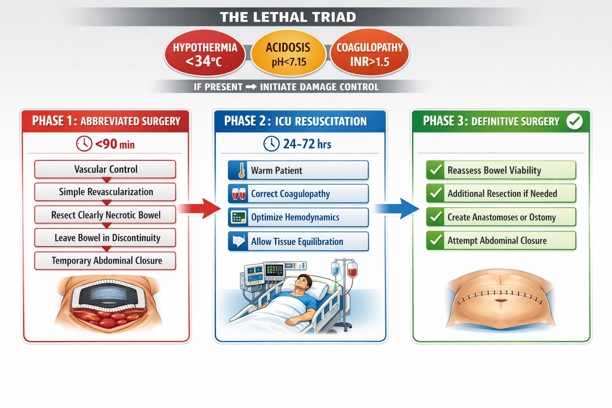

# Mesenteric Ischemia: Navigating the Dilemmas of a Lethal Disease

*Authored from the perspective of an experienced academic vascular surgeon*

---

## Learning Objectives

After reading this chapter, the reader should be able to:

1. Classify mesenteric ischemia by etiology, onset, and affected vessels
2. Recognize the clinical presentations of acute and chronic mesenteric ischemia, including atypical patterns
3. Apply decision algorithms for diagnostic workup, emphasizing the role of CTA
4. Select appropriate treatment modality (open vs. endovascular) based on clinical context
5. Assess bowel viability using clinical and adjunctive methods
6. Apply damage control principles in unstable patients
7. Manage special situations including NOMI, post-aortic surgery ischemia, and MALS
8. Anticipate complications and implement evidence-based follow-up protocols
9. Integrate multi-specialty perspectives into a cohesive management plan

---

## Chapter Overview

Mesenteric ischemia remains one of the most challenging conditions in vascular surgery. Despite advances in imaging, endovascular technology, and critical care, mortality rates for acute mesenteric ischemia (AMI) remain stubbornly high at 50-80%. This chapter explores the clinical dilemmas inherent in managing this condition—from initial suspicion and diagnostic workup through treatment selection, intraoperative decision-making, and long-term management.

The framework of this chapter is organized around six core dilemmas that define mesenteric ischemia management:

1. **The Diagnostic Dilemma**: When to suspect and how to confirm
2. **The Approach Dilemma**: Open versus endovascular treatment
3. **The Viability Dilemma**: What bowel to resect
4. **The Timing Dilemma**: When to intervene
5. **The Resource Dilemma**: Transfer versus treat locally
6. **The Goals Dilemma**: When to pursue palliation

We emphasize the thought processes and judgment calls that define excellence in managing this lethal disease.

---

# PART I: FOUNDATIONS

## 1. Introduction: Epidemiology and Clinical Significance

### 1.1 Definition and Scope

Mesenteric ischemia is a spectrum of disorders characterized by inadequate blood flow to the intestines, resulting from arterial occlusion, venous thrombosis, or hypoperfusion, leading to intestinal hypoxia and potentially irreversible bowel necrosis.

> **Key Insight**: The clinical challenge of mesenteric ischemia lies in its early nonspecific presentation combined with rapid progression to irreversible bowel necrosis. The fundamental surgical dilemma is the race against time: achieving revascularization before irreversible bowel injury while accurately assessing tissue viability to guide resection decisions.

### 1.2 Epidemiology of Acute Mesenteric Ischemia

AMI is rare but increasingly recognized, affecting approximately 0.1% of hospital admissions. Key epidemiologic features include:

- **Incidence**: 1-2 per 100,000 population per year
- **Age distribution**: Median age 70-75 years; >75% of cases in patients >60 years
- **Trend**: Increasing approximately 10% per decade due to aging population
- **Mortality**: Historical rates >90%; current rates 50-70%

**Table 1.1: Etiology of Acute Mesenteric Ischemia**

| Etiology | Frequency | Key Features | Mortality |
|----------|-----------|--------------|-----------|
| Arterial embolism | 40-50% | Sudden onset, cardiac source (AF), lodges 3-10cm from SMA origin | 50-80% |
| Arterial thrombosis | 20-35% | Pre-existing atherosclerosis, may have CMI prodrome | 70-90% |
| NOMI | 20-30% | ICU setting, vasopressors, no mechanical obstruction | 70-90% |
| Venous thrombosis | 5-15% | Insidious onset, hypercoagulable states | 20-50% |

### 1.3 Epidemiology of Chronic Mesenteric Ischemia

CMI is rarer than AMI with distinctive features:

- **Female predominance**: 3:1 female:male ratio
- **Mean age**: 60-70 years
- **Atherosclerosis as cause**: >95% of cases
- **Diagnostic delay**: Average 18-24 months from symptom onset

> **Clinical Pearl**: Autopsy studies show significant (>50%) stenosis of at least one mesenteric vessel in 6-10% of elderly patients, yet symptomatic CMI is rare—demonstrating the robust collateral circulation of the mesenteric system.

### 1.4 Mesenteric Arterial Anatomy

Understanding the anatomic basis is essential for both diagnosis and treatment.

**The Three Major Vessels:**

1. **Celiac Artery** (T12-L1): Supplies foregut (stomach to second duodenum)
2. **Superior Mesenteric Artery** (L1): Supplies midgut—the critical vessel in most AMI
3. **Inferior Mesenteric Artery** (L3): Supplies hindgut (splenic flexure to upper rectum)

**Key Collateral Pathways:**

- **Celiac-SMA**: Pancreaticoduodenal arcades (most important)
- **SMA-IMA**: Marginal artery of Drummond, arc of Riolan (absent in 5-10%)
- **IMA-Hypogastric**: Hemorrhoidal circulation

**Watershed Zones** (vulnerable to low-flow ischemia):
- **Griffith's point**: Splenic flexure (SMA-IMA junction)
- **Sudeck's point**: Rectosigmoid junction

> **Clinical Pearl**: The SMA's acute takeoff angle (45°) from the aorta makes it a prime target for emboli. Emboli lodge 3-10 cm distal to the SMA origin—past the middle colic takeoff—explaining why proximal jejunum is often spared in embolic disease.

---

## 2. Classification and Pathophysiology

### 2.1 Classification by Onset

**Acute Mesenteric Ischemia (AMI):**
- Sudden interruption of intestinal blood flow
- Surgical emergency with narrow treatment window
- Progression to transmural necrosis within 6-12 hours

**Chronic Mesenteric Ischemia (CMI):**
- Gradual reduction in blood flow, typically atherosclerotic
- Symptoms triggered by increased postprandial demand
- The "two-vessel rule": typically requires ≥2 vessel disease

### 2.2 Pathophysiology of Arterial Occlusion

**Arterial Embolism:**
- Source: Cardiac (AF 50-70%, recent MI, valvular disease)
- Location: 3-10 cm distal to SMA origin
- Onset: Sudden, dramatic ("intestinal apoplexy")
- Collaterals: None (sudden occlusion)

**Arterial Thrombosis:**
- Source: In-situ thrombosis on atherosclerotic plaque
- Location: Ostial or proximal SMA
- Onset: May have prodrome (prior CMI symptoms in 30-50%)
- Territory at risk: More extensive (entire SMA territory)

### 2.3 The Ischemic Cascade

| Phase | Time | Pathology | Reversibility |
|-------|------|-----------|---------------|
| 1 | 0-2 hours | Mucosal ischemia | Fully reversible |
| 2 | 2-6 hours | Submucosal injury, bacterial translocation | Partially reversible |
| 3 | 6-12 hours | Transmural necrosis | **Irreversible—requires resection** |
| 4 | >12 hours | Perforation, peritonitis | Often fatal |

> **Clinical Pearl**: The 6-hour window to transmural necrosis drives the urgency. By the time peritoneal signs develop, you are already behind.

### 2.4 Nonocclusive Mesenteric Ischemia (NOMI)

NOMI represents intestinal ischemia without mechanical vascular obstruction—the "stealth killer."

**Pathophysiology:**
- Low cardiac output triggers sympathetic activation
- Splanchnic vasoconstriction redirects blood to vital organs
- Sustained vasoconstriction causes mucosal ischemia
- Unlike occlusive disease, no anatomic lesion to fix

**High-Risk Populations:**
- Post-cardiac surgery: 0.5-2% incidence
- Cardiogenic shock requiring vasopressors
- Septic shock (maldistribution of flow)
- Hemodialysis with intradialytic hypotension

> **Clinical Pearl**: NOMI is the ICU's silent killer. Think of it in any critically ill patient on vasopressors with unexplained deterioration, rising lactate, or feeding intolerance.

### 2.5 Mesenteric Venous Thrombosis (MVT)

MVT represents distinct pathophysiology—blocking the drain rather than the faucet.

**Key Distinctions:**
- More insidious onset (days rather than hours)
- Hemorrhagic infarct (thickened, edematous bowel wall)
- Better prognosis if diagnosed early (20-50% mortality)
- Anticoagulation is cornerstone of treatment

### 2.6 Ischemia-Reperfusion Injury

> **Key Insight**: Restoration of blood flow can paradoxically cause additional injury through oxidative stress and systemic inflammatory response. The patient may deteriorate after apparently successful revascularization.

**Molecular Mechanisms:**

During the ischemic phase, several changes set up subsequent reperfusion injury:
- ATP depletion leads to xanthine dehydrogenase conversion to xanthine oxidase
- Hypoxanthine accumulates as substrate for superoxide generation
- Intracellular calcium rises due to pump failure

Upon reperfusion:
- Oxygen reintroduction generates reactive oxygen species (superoxide, hydrogen peroxide, hydroxyl radicals)
- Endothelial activation leads to adhesion molecule expression
- Neutrophil recruitment and transmigration
- Complement activation
- Cytokine release (TNF-α, IL-1β, IL-6)

**Clinical Timeline:**

*Intraoperative:*
- Bowel color improves but may remain dusky
- Transient hypotension during unclamping
- Acidosis and hyperkalemia with unclamping

*First 24 Hours:*
- High vasopressor requirements
- Fluid shifts and third-spacing
- Respiratory deterioration (early ARDS)
- Oliguria
- Persistent or worsening lactate

*24-72 Hours:*
- ARDS may progress
- Renal failure may require dialysis
- Coagulopathy develops
- Sepsis may supervene

**Clinical Implications:**
- Second-look surgery essential to assess for delayed necrosis
- Anticipate ARDS, AKI, myocardial depression post-operatively
- The sickest time may be after you restore blood flow
- Anticipate hyperkalemia and worsening acidosis with unclamping—have treatment ready

### 2.7 Colonic Ischemia

Colonic ischemia (ischemic colitis) is the most common form of intestinal ischemia, typically affecting watershed areas.

**Anatomic Vulnerability:**
- Splenic flexure (Griffith's point): Junction of SMA and IMA territories (40% of cases)
- Rectosigmoid junction (Sudeck's point): Junction of IMA and hypogastric territories (25%)
- Rectal sparing is characteristic (different blood supply from internal iliacs)

**Etiology:**
- Usually nonocclusive (95%): hypotension, shock, post-cardiac surgery
- Rarely occlusive (5%): IMA thrombosis/embolism, vasculitis
- Post-aortic surgery: 1-7% after AAA repair

**Clinical Spectrum:**

| Severity | Frequency | Presentation | Outcome |
|----------|-----------|--------------|---------|
| Mild mucosal | 80-85% | Mild pain, bloody diarrhea, minimal systemic symptoms | Self-limited |
| Moderate | 10-15% | Moderate pain, fever, leukocytosis | May develop stricture |
| Severe transmural | 5-10% | Peritonitis, sepsis, shock | Requires surgery; 40-60% mortality |

**The Classic Triad:**
- Crampy abdominal pain (left-sided predominant)
- Bloody diarrhea
- Recent hypotensive episode

**Management Principles:**
- Mild-moderate: Bowel rest, IV fluids, antibiotics, serial exams
- Severe (peritonitis): Emergent surgery—Hartmann procedure most common

---

# PART II: THE DIAGNOSTIC CHALLENGE

## 3. Clinical Presentation and Recognition

### 3.1 Acute Mesenteric Ischemia: The Classic Presentation

AMI classically presents with sudden, severe periumbilical abdominal pain that is characteristically "out of proportion" to physical examination findings.

**The Symptom-Sign Gap:**
- Severe visceral pain from ischemic bowel
- Benign abdominal examination (peritoneum not yet inflamed)
- This gap is pathognomonic but present in only 50-75% of cases

**Typical Symptoms:**
- Pain: Severe, crampy or constant, periumbilical or diffuse
- Nausea/vomiting: 75-80%
- Diarrhea: 50-60% (may be bloody in advanced cases)
- Associated: Diaphoresis, restlessness, sense of impending doom

**Early vs. Late Physical Findings:**

| Early | Late (Ominous) |
|-------|----------------|
| Soft abdomen | Guarding, rigidity, rebound |
| Hyperactive bowel sounds | Absent bowel sounds |
| Minimal tenderness | Diffuse peritonitis |
| Normal vital signs | Hypotension, tachycardia, fever |

> **Clinical Pearl**: A normal abdominal exam in a patient with severe pain is ALARMING, not reassuring. The physical exam becomes abnormal when you are already too late.

### 3.2 Presentation by Etiology

**Embolic AMI:**
- Onset: Sudden, dramatic
- History: Atrial fibrillation, recent MI, prior embolic events
- Exam: Often remarkably benign early

**Thrombotic AMI:**
- Onset: May have prodrome of chronic symptoms
- History: Weight loss, food avoidance, known atherosclerosis
- Exam: Cachexia, signs of malnutrition

**NOMI:**
- Onset: Insidious in critically ill patient
- Pain: Often absent (sedated patient)
- Key clues: Rising lactate, abdominal distension, feeding intolerance

**Venous Thrombosis:**
- Onset: Gradual over days
- Pain: Less severe, more diffuse
- Associated: Bloody diarrhea, abdominal distension

---

> **Summary Box: Key Diagnostic Triggers**
> 
> Consider mesenteric ischemia in:
> - **The Classic Pattern**: AF + sudden severe abdominal pain
> - **The Chronic Pattern**: Weight loss + postprandial pain + atherosclerosis
> - **The ICU Pattern**: Vasopressors + unexplained lactate elevation
> - **The Unexplained Acidosis**: Any metabolic acidosis without clear cause

---

### 3.3 Chronic Mesenteric Ischemia: The Classic Triad

CMI presents with the triad of postprandial abdominal pain (intestinal angina), food fear (sitophobia), and unintentional weight loss.

**Postprandial Pain:**
- Timing: 15-60 minutes after meals
- Duration: 1-3 hours
- Character: Crampy, periumbilical or epigastric
- Severity: Worse with larger, fatty meals
- Mechanism: Increased metabolic demand exceeds blood supply capacity

**Food Fear (Sitophobia):**
- Avoidance of eating to prevent pain
- Smaller, more frequent meals
- Anorexia secondary to fear
- Patients may not recognize this pattern—ask specifically

**Weight Loss:**
- Often significant (10-30 kg)
- Progressive over months
- Combination of reduced intake and malabsorption

**Physical Examination:**
- General: Cachectic, malnourished, underweight
- Abdominal: Scaphoid (concave) due to wasting; often non-tender
- Auscultation: Abdominal bruit present in 50-80%
- Vascular: Often diminished peripheral pulses (concurrent PAD in 60-80%)

**The Two-Vessel Rule:**
CMI typically requires significant stenosis or occlusion of at least two of the three major mesenteric vessels before symptoms develop. This is because robust collateral networks provide redundancy, and single-vessel disease is compensated by collaterals.

> **Clinical Pearl**: The pathognomonic feature is the relationship between eating and pain. Unlike most GI disorders where eating relieves symptoms, CMI patients feel worse after eating.

### 3.4 Atypical Presentations

The astute clinician must recognize that classic presentations occur in only 50-75% of cases.

**Atypical Patterns:**
- Acute presentation of CMI (acute-on-chronic thrombosis)—present in 20-30% of AMI cases
- Presentation mimicking other conditions (gastritis, pancreatitis, bowel obstruction)
- Presentation without pain (especially in elderly, diabetic, or sedated patients)
- Confusion or altered mental status as predominant symptom
- Unexplained feeding intolerance in ICU patients

**Special Populations:**

*Elderly Patients:*
- May have blunted pain perception
- Comorbidities obscure presentation
- Higher threshold of suspicion needed

*ICU Patients (NOMI):*
- Cannot communicate symptoms (sedation, intubation)
- Signs: Distension, feeding intolerance, rising lactate
- Requires proactive surveillance

**Diagnostic Delay:**
- Average time from symptom onset to CMI diagnosis: 18-24 months
- Key: Think of CMI in any patient with unexplained weight loss and postprandial pain

### 3.5 Differential Diagnosis

**Commonly Confused Conditions:**

| Condition | Distinguishing Features |
|-----------|------------------------|
| Peptic ulcer disease | Eating often relieves pain; epigastric focus |
| Chronic pancreatitis | Radiates to back; elevated lipase; alcohol history |
| Small bowel obstruction | Distension, vomiting predominate; transition point on CT |
| Diverticulitis | Localized LLQ pain, CT findings |
| Viral gastroenteritis | Usually self-limited, no risk factors |

---

## 4. Diagnostic Evaluation

### 4.1 Laboratory Evaluation

No laboratory test can diagnose or rule out mesenteric ischemia. The laboratory's role is:

1. Establishing baseline for trending
2. Guiding resuscitation
3. Risk stratification
4. Excluding alternative diagnoses

**Key Laboratory Values:**

| Test | Utility | Caveats |
|------|---------|---------|
| Lactate | Rising levels concerning for necrosis | Normal does NOT exclude early ischemia |
| D-dimer | High NPV if normal | Nonspecific; elevated in many conditions |
| WBC | Leukocytosis common; leukopenia ominous | Nonspecific |
| Base excess/deficit | Correlates with severity | Not diagnostic |

> **Clinical Pearl**: A normal lactate should NEVER be used to rule out mesenteric ischemia. Lactate rises late, after irreversible damage. Don't let reassuring labs delay imaging.

### 4.2 Emerging Biomarkers (Evidence Level III)

Several novel biomarkers show promise but are not yet standard of care:

- **Intestinal fatty acid-binding protein (I-FABP)**: Released from damaged enterocytes
- **Citrulline**: Marker of enterocyte mass
- **Alpha-GST**: Marker of intestinal mucosal injury

### 4.3 CT Angiography: The Diagnostic Cornerstone

CTA has revolutionized mesenteric ischemia diagnosis, providing rapid, comprehensive evaluation of both vasculature and bowel.

**Sensitivity/Specificity**: >90% for acute arterial occlusion

**What CTA Reveals:**

*Vascular Findings:*
- Arterial occlusion: filling defect in SMA
- Embolism vs. thrombosis: location and appearance differ
- Venous thrombosis: filling defect in SMV or portal vein
- NOMI: patent main vessels with branch narrowing

*Bowel Findings:*
- Early: Mucosal hyperenhancement, wall thickening
- Established: Wall thickening (venous) or thinning (arterial)
- Necrosis: Pneumatosis intestinalis, portal venous gas
- Perforation: Free air, free fluid

**Table 4.1: CT Signs of Bowel Necrosis**

| Finding | Description | Significance |
|---------|-------------|--------------|
| Pneumatosis intestinalis | Gas within bowel wall | Highly suggestive of necrosis |
| Portal venous gas | Gas in portal vein branches | Ominous sign |
| Mesenteric gas | Extraluminal gas | Indicates perforation or transmural necrosis |
| Absent wall enhancement | Lack of mucosal enhancement | Non-perfused, likely necrotic |
| Paper-thin wall | Markedly thinned wall | Arterial infarction |

> **Clinical Pearl**: The cost of a negative CTA is a few hundred dollars and some contrast; the cost of missing AMI is death. Err on the side of imaging.

### 4.4 Other Imaging Modalities

**Mesenteric Duplex Ultrasound:**
- Non-invasive, no radiation
- PSV >275-300 cm/s in SMA indicates significant stenosis
- Best for screening and follow-up
- Limitations: Operator dependent, bowel gas interference

**Conventional Angiography:**
- Gold standard for resolution
- Allows simultaneous intervention
- Role in NOMI: Both diagnostic (shows spasm) and therapeutic (papaverine infusion)

**MRA:**
- Excellent for CMI workup
- Avoids radiation and iodinated contrast
- Too slow for acute emergencies

---

> **Decision Algorithm: Diagnostic Approach to Suspected AMI**
> 
> ```
> Patient with abdominal pain + risk factors
>           ↓
> Clinical Assessment: AF? Cardiac history? Prior emboli? ICU setting?
>           ↓
> Labs: Lactate, CBC, BMP, coagulation
>           ↓
>     Peritonitis present?
>    ↙               ↘
>  YES               NO
>    ↓                ↓
> OR → Laparotomy    → Urgent CTA
>    ↓                ↓
> ± Preop CTA      CTA findings guide management
> ```

---

## 5. Clinical Decision Algorithms

### 5.1 The Fundamental Principle

> The best "decision algorithm" for mesenteric ischemia is simply to think of it in every high-risk patient with unexplained abdominal pain.

### 5.2 Risk Factor-Based Approach

**Major Risk Factors** (one + compatible symptoms → CTA warranted):
- Atrial fibrillation/flutter
- Recent myocardial infarction (<4 weeks)
- Congestive heart failure
- History of arterial embolism
- Hypercoagulable state

**Minor Risk Factors** (two or more + symptoms → consider CTA):
- Age >60
- Atherosclerotic vascular disease
- Prior aortic surgery
- History of mesenteric ischemia
- Recent hypotensive episode

### 5.3 Hard-Wired Clinical Rules

> **Clinical Pearl**: Atrial fibrillation + unexplained abdominal pain = mesenteric ischemia until proven otherwise. This should be a hardwired clinical rule triggering CTA.

---

# PART III: TREATMENT DILEMMAS

## 6. Initial Management and Resuscitation

### 6.1 Immediate Priorities

Initial management requires aggressive resuscitation and immediate anticoagulation.

**The Resuscitation Bundle:**
1. **Volume resuscitation**: Aggressive IV fluids (crystalloid)
2. **Hemodynamic optimization**: Target MAP >65 mmHg
3. **Anticoagulation**: Heparin immediately upon clinical suspicion
4. **Antibiotics**: Broad-spectrum for bacterial translocation
5. **Nasogastric decompression**: If ileus present
6. **Urgent imaging**: CTA within 60 minutes of suspicion

### 6.2 Anticoagulation

Anticoagulation with heparin should be initiated immediately upon clinical suspicion:

- Prevents thrombus propagation
- Limits ischemic extension
- Essential for all etiologies (arterial, venous, NOMI)

**Dosing**: Unfractionated heparin bolus 80 U/kg, then 18 U/kg/hr infusion

> **Clinical Pearl**: Do not wait for imaging confirmation to start heparin. The risk of propagation while waiting exceeds the risk of anticoagulation.

---

## 7. The Approach Dilemma: Open vs. Endovascular


*Figure 7.1: Decision algorithm for selecting open versus endovascular approach in acute mesenteric ischemia*

### 7.1 The Core Question

The decision between open and endovascular approach hinges on: **Am I confident the bowel is viable, or do I need to directly visualize it?**

### 7.2 Factors Favoring Endovascular Approach

- Stable vital signs
- Absence of peritoneal signs
- No CT evidence of necrosis (pneumatosis, portal gas)
- Early presentation (<6-8 hours)
- Suitable anatomy on CTA
- CMI (elective setting)

### 7.3 Factors Favoring Open Approach

- Peritonitis
- Hemodynamic instability
- CT signs of necrosis
- Failed endovascular attempt
- Need for bowel assessment
- Thrombosis with extensive territory at risk

### 7.4 Endovascular Options (Evidence Level II-III)

**Aspiration Thrombectomy:**
- First-line for acute embolic occlusion
- Rapid revascularization (minutes)
- Lower bleeding risk than thrombolysis

**Catheter-Directed Thrombolysis:**
- Historical mainstay, now less common
- Risk of bleeding, especially if necrosis present
- Slower than aspiration

**Angioplasty and Stenting:**
- First-line for CMI
- Can be used in acute thrombosis after initial clot removal
- Endovascular success rates for CMI: 85-95%

> **Clinical Pearl**: Mechanical thrombectomy can restore flow in minutes, but bowel viability still depends on pre-procedure ischemia time. Even with successful revascularization, bowel resection is often still needed—have surgical backup.

### 7.5 Open Surgical Options

**Embolectomy:**
- For embolic occlusion
- Transverse or longitudinal SMA arteriotomy
- Balloon catheter extraction (Fogarty technique)
- Success rate: 70-90% for fresh emboli
- Location of embolus guides approach (distal emboli may require segmental approach)

**Bypass Grafting:**
- For thrombotic disease (atherosclerotic occlusion)
- Configuration options:
  - Antegrade: Supraceliac aorta to SMA (most common for AMI)
  - Retrograde: Iliac to SMA
- Conduit choice:
  - Autogenous vein preferred (saphenous vein)
  - Prosthetic (PTFE or Dacron) acceptable if vein unavailable
- Patency: 80-90% at 5 years for open bypass

**Endarterectomy:**
- For ostial atherosclerotic disease
- Often combined with transaortic approach
- Aortomesenteric endarterectomy for extensive ostial disease
- Can address celiac and SMA in single procedure

**Retrograde Open Mesenteric Stenting (ROMS):**
- Hybrid technique
- Open exposure of SMA, retrograde wire access
- Allows stenting with direct bowel visualization
- Combines advantages of both approaches

**Technical Considerations:**

*SMA Exposure:*
- Division of ligament of Treitz
- Reflect small bowel to right
- Identify SMA at root of mesentery
- Proximal and distal control

*Inflow Selection:*
- Supraceliac aorta: Best inflow, requires thoracoabdominal exposure
- Infrarenal aorta: More accessible but may be diseased
- Iliac artery: Alternative for retrograde grafts

*Outflow Selection:*
- Main SMA trunk
- May need to go to proximal jejunal branches if SMA severely diseased

### 7.6 The Hybrid Approach

Hybrid approaches combine endovascular revascularization with open surgical assessment.

**Paradigm:**
1. Rapid endovascular revascularization (aspiration thrombectomy or thrombolysis)
2. Immediate or planned laparotomy/laparoscopy for bowel assessment
3. Resection of any non-viable bowel
4. Second-look as indicated

**Advantages:**
- Rapid minimally invasive blood flow restoration
- Maintains capability for immediate bowel assessment
- Reduces time to reperfusion
- Allows conversion to full open if needed

**Ideal Setting:** Hybrid OR with both endovascular and open surgical capabilities

**Practical Approach Without Hybrid OR:**
- Endovascular suite first for revascularization
- Transfer to OR for laparotomy if needed
- Requires close coordination between IR and surgery

### 7.7 Treatment Selection Algorithm


*Figure 7.2: Comparative outcomes for open versus endovascular treatment in acute and chronic mesenteric ischemia*

> **Decision Framework: Open vs. Endovascular**
>
> ```
>                    AMI Confirmed
>                         ↓
>              Peritonitis or CT necrosis signs?
>             ↙                          ↘
>           YES                           NO
>            ↓                             ↓
>     Open Surgery                 Hemodynamically stable?
>  (revascularization +              ↙            ↘
>   bowel assessment)              YES            NO
>                                    ↓              ↓
>                            Endovascular →    Open Surgery
>                              approach        (expedited)
>                                    ↓
>                            Plan second-look
>                              (24-48 hrs)
> ```

---

> **Summary Box: Treatment Selection**
> 
> | Clinical Scenario | Recommended Approach |
> |-------------------|---------------------|
> | AMI, peritonitis | Open surgery |
> | AMI, no peritonitis, stable | Endovascular + planned second look |
> | AMI, NOMI | Medical + papaverine infusion |
> | AMI, MVT | Anticoagulation ± thrombolysis |
> | CMI, elective | Endovascular first-line |
> | CMI, poor anatomy or failed endo | Open bypass |

---

## 8. Intraoperative Decision-Making


*Figure 8.1: Framework for assessing bowel viability - clearly viable, gray zone, and non-viable*

### 8.1 The Viability Dilemma

Intraoperative bowel viability assessment remains one of the most challenging aspects of mesenteric ischemia surgery.

**Clinical Assessment:**

| Sign | Viable | Non-Viable |
|------|--------|------------|
| Color | Pink | Black, green, grey |
| Peristalsis | Present | Absent |
| Bleeding | Brisk from cut edges | Absent or dark ooze |
| Mesenteric pulsation | Present | Absent |
| Wall consistency | Normal | Paper-thin, friable |

### 8.2 Adjunctive Assessment Methods

**Handheld Doppler:**
- Readily available in all ORs
- Assesses arterial flow at antimesenteric border
- Pulsatile signal suggests adequate macrovascular perfusion
- Limitation: Cannot assess microcirculation

**Indocyanine Green (ICG) Fluorescence Angiography:**
- Real-time visualization of mucosal perfusion
- Increasingly standard in vascular and colorectal surgery
- Technique: IV ICG injection, near-infrared camera visualization
- Fluorescent within 30-60 seconds if perfused
- Quantitative assessment possible with newer systems
- Limitation: Shows perfusion at one moment—doesn't guarantee survival

**Intraoperative Duplex Ultrasound:**
- Assesses flow restoration post-revascularization
- Confirms technical success of bypass or thrombectomy
- Can identify residual stenosis or thrombus

**Laser Doppler Flowmetry:**
- Measures microcirculatory blood flow
- Research tool, not widely available clinically

**Visible Light Spectroscopy:**
- Measures tissue oxygen saturation
- Investigational

**The Hierarchy of Assessment:**
1. Clinical inspection remains foundational
2. Adjuncts supplement but don't replace judgment
3. After revascularization, wait 15-20 minutes before final decisions
4. Reperfusion can dramatically improve bowel appearance

> **Clinical Pearl**: When in doubt about viability, preserve the segment and plan a second-look. You can always resect more, but you can't put bowel back. ICG fluorescence shows perfusion at one moment—it doesn't guarantee the bowel will survive, and second-look is still essential.

### 8.3 Second-Look Laparotomy

Second-look laparotomy (planned re-exploration 24-48 hours after initial surgery) is a cornerstone of mesenteric ischemia surgery.

**Indications:**
- Borderline bowel viability at first operation
- Large ischemic territory revascularized
- Ongoing hemodynamic instability
- Anticipated ischemia-reperfusion injury
- Massive contamination requiring abbreviated surgery
- Any uncertainty about viability

**Timing:**
- Typically 24-48 hours after initial surgery
- May be earlier if clinical deterioration
- May be delayed if patient requires stabilization

**Findings at Second-Look:**
- 30-50% have additional necrosis requiring further resection
- Some bowel that appeared questionable may now appear viable
- Reperfusion injury may cause delayed necrosis
- Allows safer anastomosis in stable conditions

**Surgical Approach:**
- Re-enter through same incision
- Systematic inspection of all bowel
- Assess areas of concern from first operation
- Resect any newly necrotic segments
- Decision regarding anastomosis vs. stoma

**When to Perform Anastomosis:**
- Stable patient
- Viable bowel margins
- No significant contamination
- Adequate nutritional status
- If in doubt, leave stapled ends and plan third-look

### 8.4 Damage Control Surgery


*Figure 8.2: Three-phase damage control surgery protocol for mesenteric ischemia*

In unstable patients, abbreviated initial operation focused on:

1. Restoring intestinal blood flow (if possible)
2. Removing obviously necrotic bowel
3. Temporary abdominal closure
4. ICU resuscitation
5. Return to OR after stabilization (24-72 hours)

**Indications for Damage Control:**
- Hemodynamic instability despite resuscitation (MAP <60 despite vasopressors)
- Severe metabolic derangement (pH <7.2, lactate >10 mmol/L)
- Hypothermia (<34°C)
- Coagulopathy (INR >1.5, platelets <50,000)
- Massive transfusion (>10 units PRBC)
- Uncertain bowel viability requiring reassessment

**The "Lethal Triad":**
- Hypothermia
- Acidosis
- Coagulopathy
If present, damage control is mandatory.

**Damage Control Sequence:**

*Phase 1 (OR - 60-90 minutes maximum):*
- Revascularization if feasible (may defer)
- Resection of frankly necrotic bowel only
- Staple bowel ends (no anastomosis)
- Temporary abdominal closure (negative pressure dressing)

*Phase 2 (ICU - 24-72 hours):*
- Aggressive resuscitation
- Correct hypothermia, acidosis, coagulopathy
- Optimize volume status
- Vasopressor wean if possible

*Phase 3 (Return to OR):*
- Reassess bowel viability
- Additional resection if needed
- Anastomosis if conditions favorable
- Fascial closure if possible

**Temporary Abdominal Closure Options:**
- Negative pressure wound therapy (VAC) - preferred
- Bogota bag (IV bag sewn to fascial edges)
- Wittmann patch

### 8.5 Massive Resection Decisions

The discovery of massive bowel necrosis confronts the surgeon with one of the most difficult dilemmas in surgery.

**The Core Question:**
Should we proceed with extensive resection knowing short bowel syndrome is inevitable, or is this futile?

**Factors in Decision:**

*Patient Factors:*
- Baseline functional status and quality of life
- Expressed wishes and advance directives
- Social support system
- Ability to manage TPN at home

*Disease Factors:*
- Length of viable remaining bowel
- Preservation of colon and ileocecal valve
- Potential for intestinal adaptation

*Expected Outcomes:*
- Quality of life on TPN
- Potential for intestinal transplant
- Survival statistics

**Minimum Bowel for Enteral Autonomy:**
- ~100 cm with intact colon and ileocecal valve
- ~150 cm without colon
- ~200 cm if remaining bowel is diseased

**Decision Framework:**

| Remaining Bowel | Colon Preserved | Expected Outcome |
|-----------------|-----------------|------------------|
| >200 cm | Yes | Likely enteral autonomy |
| 100-200 cm | Yes | Possible enteral autonomy |
| <100 cm | Yes | Likely TPN dependent |
| <50 cm | No | Definitely TPN dependent |

**Ethical Considerations:**
- Patient autonomy is paramount
- Family input if patient cannot decide
- May proceed if any reasonable chance of meaningful survival
- Palliation appropriate in some cases

> **Clinical Pearl**: Survival with short bowel syndrome is possible and improving with advances in TPN, GLP-2 analogs (teduglutide), and intestinal transplantation. Do not assume TPN-dependent life is not worth living—involve the patient and family in these profound decisions.

### 8.6 Transfer vs. Treat Locally

The decision to transfer versus operate locally represents a critical systems-level dilemma.

**Factors Favoring Transfer:**
- No vascular surgery or interventional radiology capability locally
- Complex anatomy requiring specialized expertise
- Need for hybrid OR or ECMO support
- Patient stable enough to survive transport

**Factors Favoring Local Operation:**
- Hemodynamic instability
- Peritonitis requiring emergent surgery
- Transport time would exceed ischemia tolerance
- Local capability exists (general surgeon can perform damage control)

**Key Principle:**
Speed of diagnosis matters more than choice of treatment. Sometimes the best decision is damage control locally followed by transfer.

> **Clinical Pearl**: A general surgeon can perform damage control bowel resection. Revascularization can wait if the patient is too unstable to transfer or the necrotic bowel is removed first.

---

## 9. Special Situations

### 9.1 Nonocclusive Mesenteric Ischemia (NOMI)

NOMI is the most lethal (70-90% mortality) and most difficult to diagnose form of mesenteric ischemia.

**Pathophysiology:**
- Splanchnic vasoconstriction without mechanical obstruction
- Occurs in critically ill patients with low cardiac output or on vasopressors
- CTA shows patent main vessels with poor branch filling

**High-Risk Settings:**
- Post-cardiac surgery (especially valve surgery)
- Cardiogenic shock requiring inotropes/vasopressors
- Septic shock
- Post-cardiopulmonary resuscitation
- Hemodialysis with intradialytic hypotension

**Recognition:**
- Unexplained rising lactate in patient on vasopressors
- Abdominal distension and feeding intolerance
- Bloody gastric aspirate or stool
- Clinical deterioration without clear source

**Diagnostic Approach:**
- CTA: Patent vessels, poor bowel enhancement, possible pneumatosis
- Angiography: Narrowed branches, "pruned tree" appearance

**Management Algorithm:**

```
Suspected NOMI in ICU patient
         ↓
CTA: Patent vessels, poor enhancement
         ↓
     Peritonitis?
    ↙           ↘
  YES            NO
   ↓              ↓
Surgery      SMA catheter placement
             Papaverine infusion
             Optimize cardiac output
             Wean vasopressors
                  ↓
          Clinical improvement?
         ↙              ↘
       YES              NO
        ↓                ↓
    Continue tx      Laparotomy
    Serial assess
```

**Papaverine Infusion Protocol:**
- Catheter placed selectively in SMA
- Dose: 30-60 mg/hour continuous infusion
- Duration: 12-24 hours or until improvement
- Monitor for systemic hypotension
- Contraindication: Peritonitis (need surgery)

**Vasopressor Considerations:**
- Problem agents: High-dose norepinephrine, phenylephrine, vasopressin
- Potentially preferable: Dobutamine, milrinone (inotropes with vasodilatory effects)
- Practical reality: Often cannot wean vasopressors in these sick patients

> **Clinical Pearl**: NOMI = mesenteric ischemia without a clot. Vessels are open but vasoconstricted. Think of it in any ICU patient on vasopressors with unexplained deterioration. Papaverine infusion can be life-saving if started before necrosis develops.

### 9.2 Post-Aortic Surgery Mesenteric Ischemia

Mesenteric ischemia following aortic surgery is a distinct entity with high mortality and unique management considerations.

**Incidence:**
- 1-2% after elective open AAA repair
- 2-6% after elective EVAR
- 10-20% after ruptured AAA repair
- Leading cause of death after AAA surgery

**Mechanisms:**
- IMA ligation or coverage (most common in open surgery)
- Atheroemboli to IMA territory
- Hypotension during surgery
- Loss of hypogastric flow (bilateral internal iliac coverage)
- Prolonged cross-clamp time
- Pre-existing collateral insufficiency

**Risk Factors:**
- Ruptured AAA (highest risk)
- Prior colonic resection
- Prolonged clamp time (>2 hours)
- Significant intraoperative blood loss
- Bilateral hypogastric occlusion
- Preoperative renal dysfunction
- Need for suprarenal clamping

**Anatomic Considerations:**
- IMA ligation is common during AAA repair
- Collaterals via marginal artery of Drummond usually adequate
- If arc of Riolan absent (5-10%), higher ischemia risk
- Patent SMA + at least one hypogastric = usually safe IMA ligation

**Clinical Presentation:**
- Bloody diarrhea (most common presenting sign)
- Abdominal distension and pain
- Unexplained sepsis or acidosis
- Clinical deterioration POD 1-3

**Screening Protocol:**
- Many centers perform routine sigmoidoscopy POD 1-3 after open AAA repair
- Evaluate mucosal appearance at splenic flexure level
- Alternative: Clinical monitoring with colonoscopy if symptoms develop

**Colonoscopic Grading:**

| Grade | Findings | Management |
|-------|----------|------------|
| 0 | Normal mucosa | Observe |
| I | Mucosal pallor, petechiae | Bowel rest, serial exams |
| II | Mucosal ulceration | Conservative management, repeat scope |
| III | Full-thickness necrosis | Emergent surgery |

**Management:**
- Grade 0-I: Observation, bowel rest, IV fluids
- Grade II: Conservative management with serial sigmoidoscopy
- Grade III or clinical deterioration: Emergent laparotomy

> **Clinical Pearl**: Bloody diarrhea after aortic surgery is colonic ischemia until proven otherwise. Perform sigmoidoscopy urgently. The sigmoid colon is the most common site due to watershed anatomy.

### 9.3 Median Arcuate Ligament Syndrome (MALS)

MALS is a controversial cause of chronic mesenteric symptoms from extrinsic compression of the celiac artery by the diaphragmatic crus.

**Epidemiology:**
- Typically young, thin women (very different from atherosclerotic CMI)
- Mean age 40-50 years
- Female predominance 4:1

**Pathophysiology:**
- Low celiac artery origin or high median arcuate ligament
- Compression of celiac artery during expiration
- Compression of celiac ganglion may contribute to symptoms
- Controversy: Many asymptomatic individuals have compression

**Clinical Presentation:**
- Postprandial epigastric pain
- Nausea (more prominent than in atherosclerotic CMI)
- Weight loss (usually less severe than CMI)
- Epigastric bruit accentuated by expiration
- Symptoms often vague and nonspecific

**Diagnosis:**
- Must exclude other causes of symptoms (thorough GI workup essential)
- CTA: Shows celiac artery narrowing with characteristic "hooked" appearance
- Dynamic imaging: Expiratory compression (inspiration relieves compression)
- Duplex ultrasound: PSV >350 cm/s with respiration variation
- Diagnosis of exclusion

**Treatment:**
- Laparoscopic or open release of median arcuate ligament
- Division of diaphragmatic crura
- Celiac ganglionectomy may improve outcomes
- ± Celiac artery reconstruction if stenosis persists after release

**Outcomes:**
- 60-80% report symptomatic improvement
- 20-40% have incomplete or no relief
- Recurrence possible

> **Clinical Pearl**: Celiac compression on CT is common (10-25% of population) and usually incidental—do not diagnose MALS based on imaging alone. The diagnosis requires compatible symptoms, imaging findings, AND exclusion of alternative diagnoses. Post-operative symptom relief may be incomplete or delayed—counsel patients accordingly.

### 9.4 Colonic Ischemia: Conservative vs. Surgical Management

Colonic ischemia is the most common form of intestinal ischemia, typically affecting watershed areas, and requires stratified management based on severity.

**Spectrum:**
- Mild mucosal (80-85%): Self-limited
- Moderate (10-15%): May develop stricture
- Severe transmural (5-10%): Requires surgery; 40-60% mortality

**Classic Triad:**
- Crampy abdominal pain
- Bloody diarrhea
- Recent hypotensive episode

**Key Distinction from Small Bowel Ischemia:**
- Usually nonocclusive (low-flow) rather than occlusive
- Often self-limited with conservative management
- Rectal sparing is characteristic (different blood supply)

---

## 10. Mesenteric Venous Thrombosis: Distinct Management

### 10.1 Cornerstone: Anticoagulation

Unlike arterial ischemia, anticoagulation—not revascularization—is the cornerstone of MVT treatment.

**Initial Therapy:**
- Heparin (UFH or LMWH) immediately upon diagnosis
- Transition to warfarin or DOAC

**Duration:**
- At least 6 months
- Lifelong if hypercoagulable state identified

### 10.2 When Surgery is Needed

**Indications for Surgery:**
- Peritonitis
- Failure of medical management
- Hemodynamic instability

**Approach:**
- Resection of necrotic bowel
- Anticoagulation continues post-operatively
- Thrombectomy rarely indicated

### 10.3 Hypercoagulable Workup

An underlying hypercoagulable state is found in 60-80% of MVT cases.

**Essential Tests:**
- Factor V Leiden
- Prothrombin G20210A
- Protein C, Protein S
- Antithrombin III
- Antiphospholipid antibodies
- JAK2 mutation

> **Clinical Pearl**: Always do a hypercoagulable workup in MVT—may find occult malignancy or hereditary disorder affecting anticoagulation duration.

### 10.4 Goals of Care Discussions in Mesenteric Ischemia

One of the most challenging aspects of mesenteric ischemia management is determining when aggressive intervention is appropriate and when palliation is more suitable.

**The Goals Dilemma:**
When a patient presents with extensive bowel necrosis or is elderly with multiple comorbidities, the surgeon faces a profound question: Is intervention in the patient's best interest?

**Factors Favoring Aggressive Intervention:**
- Good baseline functional status
- Clear patient wish to pursue treatment
- Reasonable chance of meaningful recovery
- Limited extent of necrosis
- Reversible underlying cause

**Factors Favoring Palliation:**
- Poor baseline functional status (nursing home dependent)
- Pre-existing terminal illness
- Massive bowel necrosis with inevitable SBS
- Multi-organ failure at presentation
- Patient/family expressed wishes against aggressive measures

**Having the Conversation:**

*Key Elements:*
- Honest assessment of prognosis
- Clear explanation of what surgery involves
- Realistic expectations for recovery
- Quality of life considerations
- Patient's values and goals

*Timing:*
- Ideally before surgery if time permits
- Often must occur with family during surgery
- Reassessment post-operatively based on findings

**Palliation in Mesenteric Ischemia:**

When palliation is chosen:
- Focus on comfort (pain control)
- Allow natural death
- Support family
- May involve intraoperative decision if massive necrosis found

> **Clinical Pearl**: Not every patient with mesenteric ischemia should undergo aggressive surgery. The goals-of-care discussion is as important as technical surgical decision-making.

---

# PART IV: OUTCOMES AND LONG-TERM MANAGEMENT

## 11. Outcomes and Complications

### 11.1 Mortality

Mesenteric ischemia carries among the highest mortality rates of any surgical emergency.

**Table 11.1: Mortality by Etiology and Treatment**

| Condition | Mortality |
|-----------|-----------|
| AMI - Arterial embolism | 50-80% |
| AMI - Arterial thrombosis | 70-90% |
| AMI - NOMI | 70-90% |
| AMI - MVT | 20-50% |
| CMI - Elective revascularization | 5-10% |

**Predictors of Mortality:**
- Delayed diagnosis (strongest predictor)—each hour of delay increases mortality
- Bowel necrosis at surgery
- Multi-organ failure at presentation
- Age and comorbidities
- Need for bowel resection vs. revascularization alone
- Lactate level (>4 mmol/L = poor prognosis)

**Trends Over Time:**
- Historical mortality (pre-CT era): >90%
- Current mortality with modern care: 50-70%
- Improvement due to earlier diagnosis with CTA
- Little change in mortality despite endovascular advances—diagnosis remains the rate-limiting step

### 11.2 Short Bowel Syndrome

SBS results from extensive resection (<200 cm remaining) and is a major cause of long-term morbidity.

**Definition:**
- Intestinal failure resulting from insufficient bowel length
- Requires parenteral nutrition for survival
- Classified by remaining bowel anatomy

**Consequences:**
- Malabsorption requiring parenteral nutrition
- Fluid and electrolyte losses (high stomal output)
- Nutritional deficiencies (fat-soluble vitamins, B12, trace elements)
- Central line complications (infection, thrombosis)
- Metabolic bone disease
- Liver dysfunction (TPN-associated)

**Management:**
- TPN initially
- Intestinal adaptation over 1-2 years
- GLP-2 analogs (teduglutide) may reduce TPN requirements
- Intestinal transplant for severe cases

> **Clinical Pearl**: Early classification as "TPN-dependent" may be premature. Intestinal adaptation takes 1-2 years—consider referral to specialized intestinal failure center.

### 11.3 Quality of Life After Mesenteric Ischemia

Quality of life outcomes vary dramatically based on clinical context and treatment success.

**CMI After Successful Revascularization:**
- Often excellent functional recovery
- Dramatic symptom relief
- Weight regain (10-20 kg typical)
- Return to normal diet
- QoL approaches age-matched norms

**AMI Survivors:**
- Mixed outcomes depending on extent of resection
- Many have good functional recovery if bowel preserved
- Significant psychological morbidity (PTSD, depression, anxiety)
- Survivors report fear of recurrence
- Nutritional issues may persist

**Short Bowel Syndrome:**
- TPN dependence significantly impacts QoL
- Lifestyle restrictions (line care, infusion schedules)
- Many patients adapt well over time
- Do NOT assume TPN-dependent life is not worth living
- Consider intestinal failure center referral for optimization

**Measuring QoL:**
- Weight gain and nutritional recovery are practical surrogates
- Validated QoL instruments (SF-36, disease-specific tools)
- Screen for depression and PTSD in AMI survivors
- Assess functional independence

> **Clinical Pearl**: For CMI patients, quality of life improvement is often the primary treatment goal—successful revascularization can be transformative. AMI survivors often experience significant psychological morbidity—screen and address proactively.

### 11.4 Reintervention Rates

Reintervention rates differ substantially by treatment modality.

**Endovascular Treatment:**
- Primary patency (1 year): 60-80%
- Restenosis rate: 20-40% at 1 year
- Advantage: Procedures are repeatable
- Secondary patency (with reintervention): 80-90%
- Bare metal stents vs. covered stents: Covered may offer improved patency

**Open Bypass:**
- Primary patency (5 years): 80-90%
- Secondary patency (5 years): 90-95%
- More durable but higher initial morbidity
- Preferred for young patients with long life expectancy

**Implications for Counseling:**
- Endovascular patients must understand need for surveillance
- Prepare patients for likely need for reintervention
- Open bypass may be better for patients unable/unwilling to follow up

### 11.5 Procedure-Specific Complications

| Complication | Description | Prevention/Management |
|--------------|-------------|----------------------|
| Rethrombosis | Early graft or stent failure | Anticoagulation, surveillance, reintervention |
| Anastomotic leak | Leak at bowel anastomosis | Damage control, proximal diversion, reoperation |
| Wound complications | Dehiscence, infection | Temporary closure, negative pressure therapy |
| Sepsis | From bacterial translocation | Antibiotics, source control |
| MODS | Multiorgan dysfunction (ARDS, AKI) | ICU support, dialysis, ventilation |
| Recurrent ischemia | Symptom recurrence from restenosis | Surveillance, timely reintervention |

> **Clinical Pearl**: Any clinical deterioration after mesenteric ischemia surgery should raise suspicion for rethrombosis, anastomotic leak, or ongoing sepsis—have a low threshold for imaging. Anastomotic leak after mesenteric ischemia surgery is often subtle initially—fever and tachycardia without clear source should prompt CT.

---

## 12. Long-Term Management

### 12.1 Surveillance Protocols

Surveillance after mesenteric revascularization is essential to detect restenosis before clinical deterioration.

**Post-Endovascular Surveillance:**

| Timepoint | Modality | Focus |
|-----------|----------|-------|
| 1 month | Clinical assessment | Symptom resolution, wound healing |
| 3 months | Mesenteric duplex | Baseline velocities |
| 6 months | Mesenteric duplex | Detect early restenosis |
| 12 months | Mesenteric duplex | Annual assessment begins |
| Annually | Mesenteric duplex | Long-term surveillance |

**Post-Open Bypass Surveillance:**
- Similar schedule, though lower restenosis rates
- Consider CTA if duplex technically inadequate

**Velocity Criteria for Restenosis:**
- SMA PSV >275-300 cm/s: Significant stenosis
- Ratio (PSV stenosis/PSV pre-stenosis) >3.5: Hemodynamically significant
- Absent flow: Occlusion

**Key Principle:**
- Endovascular revascularization should be viewed as "chronic therapy" requiring surveillance and likely reintervention
- Recurrent symptoms after stenting should prompt urgent imaging—restenosis can progress rapidly to occlusion

### 12.2 Secondary Prevention

Patients with mesenteric ischemia have extensive systemic atherosclerosis and high cardiovascular event rates.

**Comprehensive Risk Factor Modification:**

| Intervention | Target | Evidence Level |
|--------------|--------|----------------|
| Smoking cessation | Complete cessation | Level I |
| High-intensity statin | LDL <70 mg/dL | Level I |
| Antiplatelet therapy | Aspirin lifelong after stenting | Level II |
| Blood pressure control | <130/80 mmHg | Level I |
| Diabetes management | HbA1c <7% | Level II |

**Medication Regimen:**
- Aspirin 81 mg daily (lifelong)
- Clopidogrel 75 mg daily (for at least 1 month after stenting, often longer)
- High-intensity statin (atorvastatin 40-80 mg or rosuvastatin 20-40 mg)
- ACE inhibitor or ARB (if tolerated)

> **Clinical Pearl**: Cardiovascular events (MI, stroke) are a leading cause of death in mesenteric ischemia survivors—aggressive secondary prevention is as important as treating the mesenteric disease. Smoking cessation is the single most impactful modifiable risk factor for patency and survival.

### 12.3 Nutritional Management

**Preoperative:**
- Nutritional optimization in severely malnourished CMI patients
- May require TPN or enteral supplementation

**Postoperative:**
- Early enteral feeding when possible ("If the gut works, use it")
- TPN if significant resection or prolonged ileus
- Gradual advancement of diet

**Short Bowel Syndrome Management:**
- Multidisciplinary approach
- Trophic enteral feeds maintain gut integrity
- Consider teduglutide for TPN reduction

---

# PART V: MULTI-SPECIALTY PERSPECTIVES

## 13. The Interventional Radiologist's Perspective

The interventional radiologist plays a critical and often underappreciated role in mesenteric ischemia care.

### 13.1 Role as Diagnostician

The radiologist reading the CTA is often the first to identify mesenteric ischemia:

**Critical Observations:**
- Filling defect in SMA or SMV
- Location and extent of occlusion
- Bowel wall changes suggesting ischemia or necrosis
- Distinguishing embolism from thrombosis based on location

**Communication is Key:**
- Immediate communication to clinical team when AMI identified
- Phone call, not just written report
- May be the first step in saving the patient's life

### 13.2 Role as Interventionalist

**Endovascular Capabilities:**
- Aspiration thrombectomy
- Catheter-directed thrombolysis
- Mechanical thrombectomy
- Angioplasty and stenting
- Papaverine infusion for NOMI

**Technical Considerations:**
- Access: Usually femoral or brachial
- Wire and catheter selection for SMA cannulation
- Thrombectomy device selection
- Completion angiography to assess success

**Collaboration with Vascular Surgery:**
- IR can often achieve rapid revascularization
- But cannot assess bowel viability
- Surgical backup essential
- Hybrid OR environment ideal when available

### 13.3 NOMI Management

IR has a unique role in NOMI:

- Diagnostic angiography confirms the diagnosis
- Papaverine infusion catheter placement
- Serial angiography to assess response
- Close collaboration with critical care team

> **Clinical Pearl**: The radiologist reading the CTA may be the first to diagnose AMI—prompt communication to the clinical team is critical. IR can achieve rapid revascularization, but this doesn't guarantee bowel viability—surgical assessment remains essential.

---

## 14. The Critical Care Perspective

The critical care physician is frontline for NOMI recognition and perioperative management.

### 14.1 NOMI Recognition in the ICU

NOMI is "the intensivist's disease"—it occurs in their patients and they must recognize it.

**High-Risk Patients:**
- On multiple vasopressors (especially norepinephrine + vasopressin)
- Post-cardiac surgery, especially with low cardiac output syndrome
- Post-CPR with prolonged hypotension
- Septic shock (despite high cardiac output—maldistribution)
- ECMO patients

**Surveillance Markers:**
- Serial lactate monitoring (rising despite resuscitation)
- Unexplained feeding intolerance
- Abdominal distension
- Increasing vasopressor requirements without other explanation

**Key Clinical Rule:**
Rising lactate + patient on vasopressors + feeding intolerance = consider NOMI

### 14.2 Perioperative Management

**Preoperative:**
- Aggressive resuscitation (volume, blood products)
- Initiate anticoagulation
- Correct electrolyte abnormalities
- Prepare for massive transfusion if needed

**Postoperative:**
- Anticipate ischemia-reperfusion injury
- Expect high vasopressor requirements
- ARDS is common—low threshold for intubation
- Anticipate AKI requiring dialysis
- Monitor for sepsis from bacterial translocation

### 14.3 Managing the Deteriorating Patient

**Red Flags Post-Operatively:**
- Rising lactate after initial improvement
- New or worsening abdominal distension
- Fever without clear source
- Failure to wean vasopressors
- Worsening acidosis

**Response:**
- Have low threshold for imaging
- Consider return to OR for second-look
- Reassess goals of care if patient not improving

> **Clinical Pearl**: In sedated ICU patients, abdominal distension and feeding intolerance may be the only signs of developing mesenteric ischemia. Rising lactate despite resuscitation in a patient on vasopressors should always prompt consideration of mesenteric ischemia.

---

## 15. The Emergency Medicine Perspective

The emergency physician is often the first clinician to encounter mesenteric ischemia.

### 15.1 The Critical Role

**Responsibilities:**
- Maintain high suspicion in at-risk patients
- Order the right test (CTA, not plain CT)
- Initiate resuscitation and anticoagulation
- Expedite surgical consultation
- Avoid diagnostic anchoring on common conditions

### 15.2 Hard-Wired Clinical Rules

The following presentations should trigger immediate consideration of mesenteric ischemia:

| Clinical Scenario | Trigger |
|-------------------|---------|
| AF + abdominal pain | Think mesenteric embolism |
| Recent MI + abdominal symptoms | Think mesenteric ischemia |
| Known PAD + acute abdomen | Think mesenteric thrombosis |
| ICU patient on pressors deteriorating | Think NOMI |
| Post-aortic surgery + bloody diarrhea | Think colonic ischemia |
| Unexplained metabolic acidosis | Think mesenteric ischemia |

### 15.3 Avoiding Diagnostic Delays

**Common Pitfalls:**
- Attributing symptoms to gastroenteritis or constipation
- Ordering plain CT instead of CTA
- Waiting for peritoneal signs before imaging
- Reassured by normal lactate in early presentation
- Not connecting AF to abdominal symptoms

**Best Practices:**
- Low threshold for CTA in elderly with unexplained abdominal pain
- Mention mesenteric ischemia in differential when ordering CT
- Start heparin before imaging if suspicion is high
- Call surgical consult early, before imaging if peritonitis present

> **Clinical Pearl**: Speed of diagnosis matters more than choice of treatment. The ED physician who thinks of mesenteric ischemia and orders the CTA promptly can save a life. The cost of a negative CTA is minimal; the cost of missing the diagnosis is death.

### 15.4 Communication with Surgery

**When to Call:**
- Any patient with suspected AMI
- Before CTA if peritonitis present
- Immediately upon CTA confirmation

**What to Communicate:**
- Patient age and comorbidities
- Symptom onset and duration
- Vital signs and hemodynamic status
- Lab findings (lactate, WBC)
- CTA findings
- Anticoagulation status

---

# PART VI: CASE-BASED LEARNING AND SUMMARY

## 16. Illustrative Cases

### Case 1: Classic Embolic AMI—The Best-Case Scenario

**Presentation:** 
72-year-old woman with history of atrial fibrillation (on warfarin, subtherapeutic INR 1.4) presents with sudden severe periumbilical pain for 4 hours. She describes the pain as "the worst of my life." Abdomen is soft with minimal tenderness. No peritoneal signs. Heart rate 110, BP 138/82.

**Laboratory:**
- Lactate 2.8 mmol/L (mildly elevated)
- WBC 14,000/μL
- INR 1.4

**Imaging:**
CTA shows filling defect in SMA 5 cm from origin (classic embolic location), past the middle colic artery takeoff. No bowel wall changes. Patent SMV.

**Management:**
- Heparin bolus started immediately in ED
- Vascular surgery and IR consulted emergently
- Decision: Endovascular aspiration thrombectomy
- Successful clot aspiration with restoration of flow
- Laparoscopy performed same day: All bowel viable
- Second-look laparotomy at 24 hours: Bowel remains viable
- Converted to therapeutic warfarin (target INR 2.5-3.5)

**Outcome:** 
Discharged day 7 tolerating regular diet. Long-term anticoagulation with warfarin.

**Learning Points:**
1. Classic presentation (AF + acute pain) led to rapid diagnosis
2. Subtherapeutic INR was the precipitant
3. Normal physical exam in early AMI is expected, not reassuring
4. Mildly elevated lactate indicates early ischemia—don't wait for it to rise
5. Endovascular approach appropriate for stable patient without peritonitis
6. Second-look confirmed viability despite borderline initial lactate
7. Speed of diagnosis was the key to success

---

### Case 2: Delayed Thrombotic AMI—When We're Already Behind

**Presentation:** 
68-year-old man with history of CAD, PAD (prior fem-pop bypass), and type 2 diabetes presents with severe, constant abdominal pain for 18 hours. He reports a 6-month history of postprandial pain and 12 kg weight loss (classic CMI prodrome). Now has diffuse abdominal tenderness with guarding. Heart rate 125, BP 92/60, lactate 8.2 mmol/L.

**Laboratory:**
- Lactate 8.2 mmol/L
- WBC 22,000/μL with left shift
- pH 7.22
- Creatinine 2.4 mg/dL (baseline 1.2)

**Imaging:**
CTA shows ostial SMA occlusion with calcified plaque (thrombotic pattern). Extensive pneumatosis intestinalis of jejunum and ileum. Portal venous gas in liver. Diffuse bowel wall thinning.

**Management:**
- Aggressive fluid resuscitation, massive transfusion protocol activated
- Heparin started
- Emergent laparotomy (peritonitis mandates open approach)
- Findings: Extensive small bowel necrosis from ligament of Treitz to 40 cm from ileocecal valve. Viable proximal jejunum and terminal ileum/cecum.
- SMA bypass performed (supraceliac aorta to distal SMA with reversed saphenous vein)
- Resection of 300 cm necrotic small bowel
- Stapled ends, temporary abdominal closure
- Second-look at 48 hours: Margins viable, jejuno-ileal anastomosis performed
- Residual small bowel: 120 cm jejunum + 40 cm terminal ileum + intact colon

**Outcome:** 
Prolonged ICU course (ARDS, AKI requiring temporary dialysis). Eventually discharged to rehab day 28. Required TPN initially but weaned over 18 months. Now on oral diet with vitamin B12 injections.

**Learning Points:**
1. Prior CMI symptoms indicate thrombotic mechanism—this was acute-on-chronic
2. Delayed presentation (18 hours) led to extensive necrosis
3. Peritonitis mandated open approach—cannot assess bowel endovascularly
4. CTA findings (pneumatosis, portal gas) predicted necrosis
5. Despite massive resection, patient survived with functional outcome
6. Intestinal adaptation occurred over 18 months

---

### Case 3: NOMI in the ICU—The Silent Killer

**Presentation:** 
75-year-old man, POD 2 from 4-vessel CABG. Intraoperatively required IABP for low cardiac output. Currently on norepinephrine 0.15 mcg/kg/min and vasopressin 2.4 units/hr. Lactate initially 3.2, now rising to 6.5 mmol/L. Abdomen distended, no bowel sounds. Unable to tolerate tube feeds (high gastric residuals).

**Laboratory:**
- Lactate rising from 3.2 → 6.5 mmol/L over 12 hours
- WBC 18,000/μL
- pH 7.28

**Imaging:**
CTA shows PATENT SMA and celiac artery. Poor filling of SMA branches with "pruned tree" appearance. Bowel shows diffuse poor enhancement but no pneumatosis.

**Diagnosis:** 
Nonocclusive mesenteric ischemia (NOMI)

**Management:**
- Cardiology optimized cardiac output (milrinone added)
- Vasopressor wean attempted
- IR placed selective SMA catheter
- Papaverine infusion 40 mg/hour
- Serial clinical and laboratory assessment
- Within 24 hours: Lactate improved to 2.4, able to tolerate tube feeds
- Papaverine continued 48 hours total then weaned
- No surgery required

**Outcome:** 
Clinical improvement. IABP removed POD 5, vasopressors weaned POD 7. Discharged POD 14 to cardiac rehab.

**Learning Points:**
1. NOMI occurred in classic high-risk setting (post-CABG, vasopressors, low output)
2. Recognized based on clinical context (rising lactate, vasopressors)
3. CTA showed patent main vessels—this is the key finding in NOMI
4. No peritonitis—medical management appropriate
5. Papaverine infusion was life-saving
6. Cardiac optimization was equally important

---

### Case 4: Mesenteric Venous Thrombosis—The Forgiving Ischemia

**Presentation:** 
45-year-old woman with 5-day history of progressive abdominal pain, nausea, and bloody diarrhea. History of unprovoked DVT 2 years ago (completed 6 months warfarin, now off anticoagulation). No prior abdominal surgery. Abdomen tender but no peritoneal signs.

**Laboratory:**
- Lactate 3.1 mmol/L
- WBC 11,000/μL
- D-dimer markedly elevated

**Imaging:**
CTA shows acute thrombus in SMV extending to portal vein confluence. Small bowel loops show wall thickening and submucosal edema (not thinning). Mesenteric fat stranding. No pneumatosis.

**Diagnosis:**
Mesenteric venous thrombosis (MVT)

**Management:**
- IV heparin initiated immediately
- Supportive care: bowel rest, IV fluids, antibiotics
- Hypercoagulable workup: Factor V Leiden heterozygous positive
- Serial clinical exams and lactate monitoring
- Clinical improvement over 48 hours
- Transitioned to rivaroxaban
- Discharged day 7

**Outcome:**
Full recovery. Lifelong anticoagulation given hereditary thrombophilia. 6-month follow-up CT shows recanalized SMV with residual chronic changes.

**Learning Points:**
1. MVT has more insidious presentation than arterial ischemia
2. Prior VTE history is major red flag
3. CTA findings differ from arterial: thick bowel wall, edema, ascites
4. Anticoagulation is the treatment—not surgery
5. Surgery reserved for peritonitis or failure of medical therapy
6. Hypercoagulable workup is essential
7. MVT has better prognosis than arterial ischemia if caught early

---

### Case 5: CMI—Elective Revascularization Success

**Presentation:** 
62-year-old woman with 8-month history of postprandial epigastric pain, 15 kg weight loss, and "fear of eating." Extensive GI workup negative. CTA obtained shows 90% stenosis of SMA and occluded celiac artery.

**Laboratory:**
- Albumin 2.8 g/dL (malnutrition)
- Prealbumin 12 mg/dL

**Management:**
- Preoperative nutritional optimization with TPN for 2 weeks
- Elective SMA angioplasty and stenting
- Technical success with <20% residual stenosis
- Post-procedure: Immediate improvement in symptoms
- Tolerating regular diet within 48 hours
- Discharged day 3

**Outcome:**
Weight gain of 10 kg over 6 months. Symptom-free at 1 year. Surveillance duplex shows patent stent. On aspirin, statin, and continues smoking cessation.

**Learning Points:**
1. CMI diagnosis requires high suspicion and imaging confirmation
2. Classic triad present: postprandial pain, food fear, weight loss
3. Extensive GI workup often precedes correct diagnosis
4. Endovascular treatment is first-line for CMI
5. Preoperative nutritional optimization improves outcomes
6. Dramatic symptom improvement after successful revascularization
7. Ongoing surveillance essential for restenosis detection

---

## 17. Morbidity and Mortality Conference: Lessons from Failure

### The Missed Diagnosis

**Case Presentation:**
65-year-old woman with history of atrial fibrillation and hypertension presents to ED with 3-day history of vague abdominal pain, attributed by prior provider to gastroenteritis. AF was noted on admission ECG but not connected to presentation. CT abdomen/pelvis (without contrast due to "creatinine 1.3") showed "dilated loops of small bowel consistent with ileus." Patient was admitted for "gastroenteritis with ileus."

**Hospital Course:**
Day 1: Conservative management, NPO, IV fluids
Day 2: Pain slightly improved, still with ileus, started clear liquids
Day 3: Acute deterioration with sudden severe pain, hypotension, peritonitis
Emergency laparotomy: Entire small bowel necrotic, non-salvageable

**Outcome:**
Family meeting held. Comfort care. Patient died later that day.

**M&M Analysis:**

| Issue | Analysis |
|-------|----------|
| Missed AF connection | AF + abdominal pain should trigger AMI consideration |
| Non-contrast CT | Mesenteric ischemia cannot be diagnosed without contrast |
| Attributed to gastroenteritis | Anchoring bias on common diagnosis |
| Normal lactate day 1 | Normal lactate does not exclude early AMI |
| Delayed progression | 3 days from symptoms to necrosis is consistent with subacute thrombosis |

**Systems Improvements:**
1. Clinical decision support: Alert for AF + abdominal pain
2. Radiology protocol: CTA required when mesenteric ischemia in differential
3. Education: Departmental conference on atypical AMI presentations
4. Process change: Vascular surgery consult for any AMI on differential

**Key Takeaways:**
- The best "decision algorithm" is to think of mesenteric ischemia
- AF + abdominal pain = mesenteric ischemia until proven otherwise
- CT without contrast cannot exclude mesenteric vascular disease
- Normal lactate is falsely reassuring in early ischemia

---

## 18. Trainee Resources

### 18.1 Simulation Training

Given the rarity of mesenteric ischemia (most trainees will see only a handful of cases), simulation-based training is essential for developing competency.

**Recommended Training Modalities:**

*CTA Interpretation Workshops:*
- Review library of AMI/CMI/NOMI cases
- Identify key findings: occlusion location, bowel changes
- Distinguish embolism from thrombosis
- Recognize signs of necrosis

*Surgical Simulation:*
- Embolectomy on cadaveric or porcine models
- Bypass anastomosis technique
- Bowel handling and viability assessment

*Decision-Making Scenarios:*
- Case-based discussions with faculty
- Open vs. endovascular decision algorithms
- Goals of care conversations for poor-prognosis cases

*Crisis Resource Management:*
- Managing the unstable patient with mesenteric ischemia
- Multi-team coordination (surgery, IR, ICU)
- Communication during high-stress scenarios

### 18.2 Key Reading

**Essential Guidelines:**
1. Björck M, et al. ESVS Clinical Practice Guidelines on the Management of Acute Mesenteric Ischemia. Eur J Vasc Endovasc Surg. 2017;53(4):460-510.
2. Bala M, et al. Acute mesenteric ischemia: guidelines of WSES. World J Emerg Surg. 2017;12:38.

**Foundational Reviews:**
3. Clair DG, Beach JM. Mesenteric Ischemia. N Engl J Med. 2016;374(10):959-968.
4. Oldenburg WA, et al. Acute mesenteric ischemia: a clinical review. Arch Intern Med. 2004;164(10):1054-62.

**Special Topics:**
5. Brandt LJ, et al. ACG Clinical Guideline on Colon Ischemia. Am J Gastroenterol. 2015;110(1):18-44.
6. Kolkman JJ, Geelkerken RH. Diagnosis and treatment of chronic mesenteric ischemia. Best Pract Res Clin Gastroenterol. 2017.

### 18.3 Procedural Competency Checklist

Use this checklist to track developing competency:

**Diagnostic Skills:**
- [ ] CTA interpretation: Identify occlusion, assess bowel findings
- [ ] Distinguish embolism vs. thrombosis on imaging
- [ ] Recognize CT signs of necrosis
- [ ] Mesenteric duplex interpretation

**Medical Management:**
- [ ] Heparin anticoagulation protocol and monitoring
- [ ] Resuscitation of the mesenteric ischemia patient
- [ ] Papaverine infusion for NOMI

**Open Surgical Techniques:**
- [ ] SMA exposure and control
- [ ] SMA embolectomy (arteriotomy, Fogarty technique)
- [ ] Mesenteric bypass (inflow/outflow selection, anastomosis)
- [ ] Bowel viability assessment (clinical and with ICG)
- [ ] Second-look laparotomy decision-making
- [ ] Damage control techniques

**Endovascular Techniques:**
- [ ] SMA catheterization
- [ ] Aspiration thrombectomy
- [ ] Angioplasty and stenting
- [ ] Completion angiography interpretation

**Communication Skills:**
- [ ] Rapid consultation with ED for suspected AMI
- [ ] Goals of care discussion for poor-prognosis patients
- [ ] Multi-team coordination during acute intervention

---

## 19. Summary and Key Points

### 19.1 Clinical Pearls Summary

> **Box 19.1: Seven Clinical Pearls to Remember**
>
> 1. "Pain out of proportion" is classic but often absent—don't rely on it
> 2. Normal lactate does NOT exclude early AMI
> 3. CTA is the diagnostic cornerstone—order liberally
> 4. Atrial fibrillation + abdominal pain = AMI until proven otherwise
> 5. When in doubt about viability, plan second-look
> 6. Speed of diagnosis matters more than choice of treatment
> 7. NOMI is the silent killer of the ICU

### 19.2 Evidence Gaps

Current evidence is limited by:
- Rarity of disease limiting prospective studies
- No validated decision algorithms
- Limited RCT data comparing treatment strategies
- Lack of validated biomarkers

### 19.3 Future Directions

**Promising Areas:**
- AI-based risk prediction from EMR data
- Novel biomarkers (I-FABP, citrulline)
- Improved imaging techniques
- Pharmacologic mitigation of I-R injury
- Intestinal regenerative medicine for SBS

---

## 20. Self-Assessment Questions

### Diagnostic Scenarios

1. A 70-year-old man with AF presents with sudden severe abdominal pain. Exam shows soft abdomen with minimal tenderness. What is the most appropriate next step?
   a. Observation and serial exams
   b. Plain abdominal radiograph
   c. CT angiography
   d. Diagnostic laparoscopy

2. Which finding on CTA is most specific for intestinal necrosis?
   a. Bowel wall thickening
   b. Mesenteric fat stranding
   c. Portal venous gas
   d. SMA filling defect

3. A 62-year-old woman has lactate of 1.8 mmol/L (normal) with severe abdominal pain and AF. Should this normal lactate reassure you?
   a. Yes, normal lactate rules out mesenteric ischemia
   b. No, lactate is often normal in early mesenteric ischemia
   c. Yes, if lactate is normal, the diagnosis is gastroenteritis
   d. No, but you should wait 6 hours and recheck

### Treatment Selection

4. A 55-year-old woman presents with 6-month history of postprandial pain and 15 kg weight loss. CTA shows 80% stenosis of SMA and occluded celiac artery. What is the first-line treatment?
   a. Open mesenteric bypass
   b. Endovascular angioplasty and stenting
   c. Medical management with anticoagulation
   d. Observation with nutritional support

5. During laparotomy for AMI, you find a segment of bowel that is dusky but not frankly necrotic. Mesenteric pulsations are weak. What is the most appropriate management?
   a. Resect the segment
   b. Leave in place and close abdomen
   c. Leave in place and plan second-look in 24-48 hours
   d. Perform anastomosis now to avoid second operation

6. A patient in the ICU on high-dose norepinephrine develops rising lactate and abdominal distension. CTA shows patent SMA with diffuse branch narrowing. What is the diagnosis and treatment?
   a. SMA embolism – emergent thrombectomy
   b. SMA thrombosis – open bypass
   c. NOMI – papaverine infusion and optimize cardiac output
   d. MVT – anticoagulation

### Special Situations

7. Which statement about mesenteric venous thrombosis is TRUE?
   a. Emergency surgery is the first-line treatment
   b. Anticoagulation is the cornerstone of management
   c. Hypercoagulable workup is rarely positive
   d. Prognosis is worse than arterial occlusion

8. A patient with AF presents with acute abdominal pain. CTA shows SMA occlusion and pneumatosis intestinalis. The patient has peritoneal signs. What is the recommended approach?
   a. Endovascular thrombectomy first
   b. Open surgery for revascularization and bowel assessment
   c. Papaverine infusion
   d. Observation with serial exams

9. A patient is 2 days post-AAA repair and develops bloody diarrhea. What is the most likely diagnosis and next step?
   a. C. difficile colitis – stool studies
   b. Colonic ischemia – sigmoidoscopy
   c. Small bowel ischemia – CTA
   d. Anastomotic bleeding – colonoscopy

10. A 35-year-old thin woman with postprandial epigastric pain has celiac artery compression on CT. What is the next step?
    a. Immediate surgical decompression
    b. Thorough GI workup to exclude other causes
    c. Celiac stenting
    d. Anticoagulation

### Follow-up and Complications

11. What is the recommended surveillance interval after mesenteric stenting?
    a. Every 3-6 months in first year, then annually
    b. Only if symptoms recur
    c. Every 5 years
    d. No follow-up imaging needed

12. Which of the following is a contraindication to endovascular-first approach in AMI?
    a. Age >70
    b. Peritonitis
    c. Embolic occlusion
    d. AF as underlying cause

13. In NOMI, what is the role of papaverine infusion?
    a. Dissolves the clot
    b. Causes splanchnic vasodilation
    c. Prevents bacterial translocation
    d. Reduces portal hypertension

14. A patient had 200 cm of small bowel resected for AMI, with preservation of the entire colon. What is the most likely long-term nutritional outcome?
    a. Complete enteral autonomy
    b. Likely enteral autonomy after intestinal adaptation
    c. Definitely TPN-dependent for life
    d. Intestinal transplant required

15. After successful mesenteric stenting for CMI, what secondary prevention measures are indicated?
    a. Statin therapy only
    b. Aspirin, statin, smoking cessation, blood pressure control
    c. Warfarin anticoagulation
    d. No additional measures needed

**Answer Key:** 

| Q | Answer | Rationale |
|---|--------|-----------|
| 1 | c | CTA is the diagnostic cornerstone for suspected AMI |
| 2 | c | Portal venous gas is highly specific for intestinal necrosis |
| 3 | b | Lactate is often normal in early ischemia—don't be falsely reassured |
| 4 | b | Endovascular angioplasty/stenting is first-line for elective CMI |
| 5 | c | When in doubt about viability, preserve and plan second-look |
| 6 | c | NOMI shows patent vessels with branch narrowing; treat with papaverine |
| 7 | b | Anticoagulation is the cornerstone of MVT treatment |
| 8 | b | Peritonitis mandates open surgery for bowel assessment |
| 9 | b | Bloody diarrhea post-AAA repair = colonic ischemia until proven otherwise |
| 10 | b | MALS is a diagnosis of exclusion requiring thorough GI workup first |
| 11 | a | Surveillance every 3-6 months initially, then annually |
| 12 | b | Peritonitis is a contraindication to endovascular-first approach |
| 13 | b | Papaverine causes splanchnic vasodilation to counter NOMI vasoconstriction |
| 14 | b | 200 cm with colon = likely enteral autonomy after intestinal adaptation |
| 15 | b | Comprehensive secondary prevention is essential for atherosclerotic disease |

---

## References

### Major Clinical Guidelines

1. Björck M, Koelemay M, Acosta S, et al. European Society for Vascular Surgery (ESVS) Clinical Practice Guidelines on the Management of Acute Mesenteric Ischemia. Eur J Vasc Endovasc Surg. 2017;53(4):460-510. doi:10.1016/j.ejvs.2017.01.010

2. Bala M, Kashuk J, Moore EE, et al. Acute mesenteric ischemia: guidelines of the World Society of Emergency Surgery. World J Emerg Surg. 2017;12:38. doi:10.1186/s13017-017-0150-5

3. Brandt LJ, Feuerstadt P, Longstreth GF, Boley SJ. ACG Clinical Guideline: Epidemiology, Risk Factors, Patterns of Presentation, Diagnosis, and Management of Colon Ischemia (CI). Am J Gastroenterol. 2015;110(1):18-44. doi:10.1038/ajg.2014.395

### Foundational Reviews

4. Clair DG, Beach JM. Mesenteric Ischemia. N Engl J Med. 2016;374(10):959-968. doi:10.1056/NEJMra1503884

5. Oldenburg WA, Lau LL, Rodenberg TJ, Edmonds HJ, Burger CD. Acute mesenteric ischemia: a clinical review. Arch Intern Med. 2004;164(10):1054-1062. doi:10.1001/archinte.164.10.1054

6. Kolkman JJ, Geelkerken RH. Diagnosis and treatment of chronic mesenteric ischemia: An update. Best Pract Res Clin Gastroenterol. 2017;31(1):49-57. doi:10.1016/j.bpg.2017.03.001

### Epidemiology

7. Acosta S, Ogren M, Sternby NH, Bergqvist D, Björck M. Incidence of acute thrombo-embolic occlusion of the superior mesenteric artery—a population-based study. Eur J Vasc Endovasc Surg. 2004;27(2):145-150. doi:10.1016/j.ejvs.2003.11.003

8. Kärkkäinen JM, Lehtimäki TT, Manninen H, Paajanen H. Acute Mesenteric Ischemia Is a More Common Cause than Expected of Acute Abdomen in the Elderly. J Gastrointest Surg. 2015;19(8):1407-1414. doi:10.1007/s11605-015-2830-3

### Pathophysiology and Basic Science

9. Mallick IH, Yang W, Winslet MC, Seifalian AM. Ischemia-reperfusion injury of the intestine and protective strategies against injury. Dig Dis Sci. 2004;49(9):1359-1377. doi:10.1023/b:ddas.0000042232.98927.91

10. Granger DN, Kvietys PR. Reperfusion injury and reactive oxygen species: The evolution of a concept. Redox Biol. 2015;6:524-551. doi:10.1016/j.redox.2015.08.020

### Treatment and Outcomes

11. Beaulieu RJ, Arnaoutakis KD, Perler BA, et al. Comparison of open and endovascular treatment of acute mesenteric ischemia. J Vasc Surg. 2014;59(1):159-164. doi:10.1016/j.jvs.2013.06.084

12. Schermerhorn ML, Giles KA, Hamdan AD, Wyers MC, Pomposelli FB. Mesenteric revascularization: management and outcomes in the United States, 1988-2006. J Vasc Surg. 2009;50(2):341-348. doi:10.1016/j.jvs.2009.03.004

13. Oderich GS, Bower TC, Sullivan TM, et al. Open versus endovascular revascularization for chronic mesenteric ischemia: risk-stratified outcomes. J Vasc Surg. 2009;49(6):1472-1479. doi:10.1016/j.jvs.2009.02.006

### Special Situations

14. Trompeter M, Brazda T, Remy CT, et al. Non-occlusive mesenteric ischemia: etiology, diagnosis, and interventional therapy. Eur Radiol. 2002;12(5):1179-1187. doi:10.1007/s00330-001-1220-2

15. Singal AK, Kamath PS, Tefferi A. Mesenteric venous thrombosis. Mayo Clin Proc. 2013;88(3):285-294. doi:10.1016/j.mayocp.2013.01.012

16. Dunschede F, Erber R, Kircher A, et al. Reduction of ischemia reperfusion injury after liver resection and hepatic inflow occlusion by alpha-lipoic acid in humans. World J Gastroenterol. 2006;12(42):6812-6817.

### Nutrition and Short Bowel Syndrome

17. Buchman AL, Scolapio J, Fryer J. AGA technical review on short bowel syndrome and intestinal transplantation. Gastroenterology. 2003;124(4):1111-1134. doi:10.1053/gast.2003.50139

18. Jeppesen PB. Teduglutide, a novel glucagon-like peptide 2 analog, in the treatment of patients with short bowel syndrome. Therap Adv Gastroenterol. 2012;5(3):159-171. doi:10.1177/1756283X11436318

### Imaging

19. Kirkpatrick ID, Kroeker MA, Greenberg HM. Biphasic CT with mesenteric CT angiography in the evaluation of acute mesenteric ischemia: initial experience. Radiology. 2003;229(1):91-98. doi:10.1148/radiol.2291020991

20. Menke J. Diagnostic accuracy of multidetector CT in acute mesenteric ischemia: systematic review and meta-analysis. Radiology. 2010;256(1):93-101. doi:10.1148/radiol.10091938

---

*This chapter was compiled from 55 validated Atomic Knowledge Units covering mesenteric ischemia. The content represents current best practices and evidence-based recommendations for the diagnosis and management of this challenging condition.*

*For questions, feedback, or updates, contact the WorldSMEGraphs project team.*

---

**End of Chapter**
