# 🎨 Functional Theory: Visual Journey
## Or: How I Learned to Stop Worrying and Love the Abstract Nonsense

```
╔══════════════════════════════════════════════════════════════════╗
║                                                                  ║
║    ╭─────────────────────────────────────────────────────────╮   ║
║    │   ███████╗██╗   ██╗███╗   ██╗ ██████╗████████╗         │   ║
║    │   ██╔════╝██║   ██║████╗  ██║██╔════╝╚══██╔══╝         │   ║
║    │   █████╗  ██║   ██║██╔██╗ ██║██║        ██║            │   ║
║    │   ██╔══╝  ██║   ██║██║╚██╗██║██║        ██║            │   ║
║    │   ██║     ╚██████╔╝██║ ╚████║╚██████╗   ██║            │   ║
║    │   ╚═╝      ╚═════╝ ╚═╝  ╚═══╝ ╚═════╝   ╚═╝            │   ║
║    │               THEORY                                    │   ║
║    ╰─────────────────────────────────────────────────────────╯   ║
║                                                                  ║
║         A Visual Journey Through Mathematical Structures         ║
║              (No Burritos Were Harmed in This Making)            ║
║                                                                  ║
║     ┌─────────────┐    ┌─────────────┐    ┌─────────────┐       ║
║     │  Categories │ ──▶│   Functors  │ ──▶│   Monads    │       ║
║     └─────────────┘    └─────────────┘    └─────────────┘       ║
║           │                  │                   │               ║
║           │         "Just    │     "I swear it  │               ║
║           │          arrows" │     makes sense" │               ║
║           ▼                  ▼                   ▼               ║
║                        ┌─────────────┐                           ║
║                        │   Monoids   │                           ║
║                        │ (the easy   │                           ║
║                        │    one!)    │                           ║
║                        └─────────────┘                           ║
║                                                                  ║
╚══════════════════════════════════════════════════════════════════╝
```

> **27 Atomic Knowledge Units** | **4 Core Concepts** | **1 Unified Theory** | **0 Burritos**

**Warning**: This presentation contains actual mathematics. Side effects may include understanding monads.

---

# 📑 Table of Contents

| Slide | Topic | Visual Type | Developer Translation |
|-------|-------|-------------|----------------------|
| 1-2 | Title & TOC | ASCII Banner | "What am I getting into?" |
| 3-5 | Domain Overview | Mermaid Concept Map | "The scary overview" |
| 6-10 | Category Theory | Diagrams & Flowcharts | "Objects and arrows (like OOP but weirder)" |
| 11-15 | Functors | Structure Mappings | "It's just .map()!" |
| 16-19 | Monoids | Algebraic Diagrams | "Reduce/fold explained" |
| 20-25 | Monads | Composition Flows | "The part everyone's scared of" |
| 26-28 | Grand Unification | Connection Diagrams | "Wait, it all connects?!" |
| 29-30 | Summary & Resources | Visual Summary | "What to tell your coworkers" |

### The Developer's FP Journey

```
┌────────────────────────────────────────────────────────────────────┐
│                     THE FUNCTIONAL PROGRAMMING TIMELINE            │
├────────────────────────────────────────────────────────────────────┤
│                                                                    │
│  Week 1: "I'll just learn some Haskell, how hard can it be?"      │
│                                                                    │
│  Week 2: "What's a Functor? Sounds like a deodorant brand."       │
│                                                                    │
│  Week 3: *[Reads 47 monad tutorials]* "...so it's like a burrito?"│
│                                                                    │
│  Week 4: *[Existential crisis intensifies]*                        │
│                                                                    │
│  Week 12: "Oh. OH. It's all just arrows!"                          │
│                                                                    │
│  Week 13: *[Writes yet another monad tutorial]*                    │
│                                                                    │
│  TODAY'S GOAL: Skip weeks 1-11 with actual understanding           │
│                                                                    │
└────────────────────────────────────────────────────────────────────┘
```

---

# 🗺️ Slide 3: Domain Overview - Concept Map

## The Four Pillars of Functional Theory
### (Spoiler: You're already using three of them)

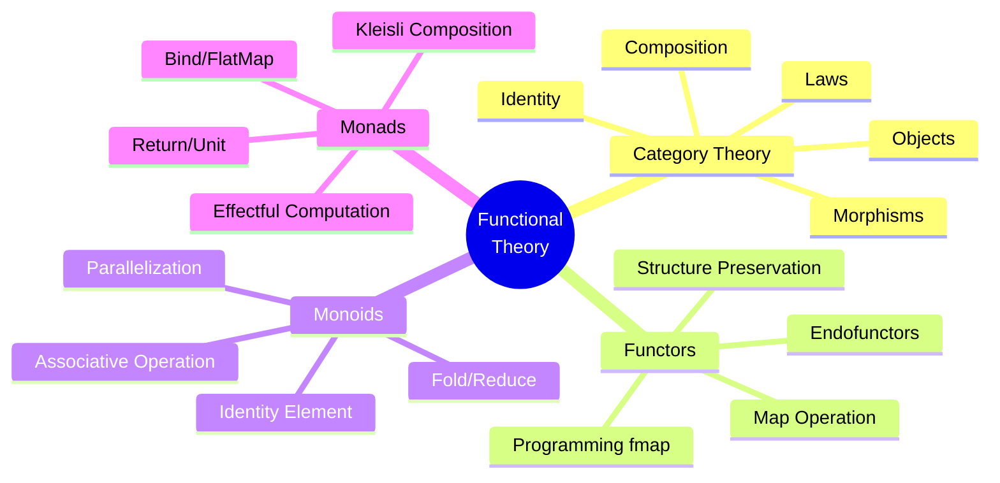

**The Good News:**
- 🟢 **Monoids**: You use `reduce()` every day. That's a monoid. Congrats, you're a mathematician.
- 🟢 **Functors**: `array.map()` is a functor. Promise.then() is a functor. You've been doing this for years.
- 🟡 **Monads**: Optional chaining (`?.`), async/await, Promises - all monads in disguise.
- 🔴 **Category Theory**: OK, this one's new. But it explains WHY the others work.

**Speaker Notes:**
> Start by reassuring the audience: they already know more than they think. Every JavaScript developer who's used .map() and .reduce() has been using category theory concepts for years.

---

# 🗺️ Slide 4: Complete Concept Hierarchy

## All 27 AKUs Organized by Topic

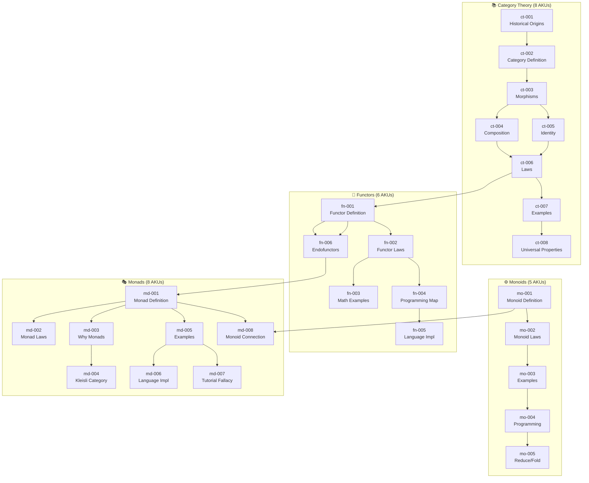

**Visual Legend:**
| Color | Meaning |
|-------|---------|
| 📚 Blue | Category Theory - Foundation |
| 🔄 Green | Functors - Structure Mapping |
| ⚙️ Orange | Monoids - Algebraic Structure |
| 🎭 Purple | Monads - Computation Composition |

---

# 🗺️ Slide 5: Learning Pathways

## Three Routes Through the Material

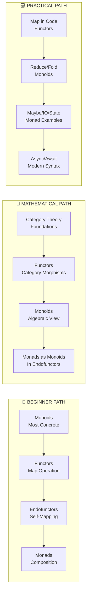

**Speaker Notes:**
> Choose your path based on your background:
> - **Beginner**: Start with concrete examples, work toward abstraction
> - **Mathematical**: Theory-first approach, proper foundations
> - **Practical**: Code-first, immediate applicability

---

# 📚 Slide 6: Category Theory - Core Components

## What IS a Category?
### (Not as scary as mathematicians want you to think)

```
╔═══════════════════════════════════════════════════════════════════╗
║                    A CATEGORY C CONSISTS OF:                       ║
║              (That's it. Just these 4 things. Breathe.)            ║
╠═══════════════════════════════════════════════════════════════════╣
║                                                                    ║
║  ┌─────────────────┐                                               ║
║  │   1. OBJECTS    │  Things (types, sets, groups, spaces...)     ║
║  │    (Don't       │  Pro tip: Forget what objects ARE.           ║
║  │   overthink it) │  Focus on the arrows between them.           ║
║  └─────────────────┘                                               ║
║           │                                                        ║
║           ▼                                                        ║
║  ┌─────────────────┐                                               ║
║  │  2. MORPHISMS   │  Arrows between objects (f: A → B)           ║
║  │   (THE KEY!)    │  Like functions, but more general.           ║
║  └─────────────────┘                                               ║
║           │                                                        ║
║           ▼                                                        ║
║  ┌─────────────────┐                                               ║
║  │ 3. COMPOSITION  │  g ∘ f (chain arrows: A→B→C becomes A→C)     ║
║  │  (Unix pipes!)  │  Sound familiar? cat file | grep x | sort    ║
║  └─────────────────┘                                               ║
║           │                                                        ║
║           ▼                                                        ║
║  ┌─────────────────┐                                               ║
║  │   4. IDENTITY   │  id_A: A → A (every object has self-arrow)   ║
║  │   (do nothing)  │  Like x => x in JavaScript                   ║
║  └─────────────────┘                                               ║
║                                                                    ║
║  "THAT'S IT?!" - Yes. Categories are simpler than your average    ║
║  enterprise Java codebase.                                         ║
║                                                                    ║
╚═══════════════════════════════════════════════════════════════════╝
```

---

# 📚 Slide 7: Category Theory - Composition Diagram

## The Fundamental Insight: It's All About the Arrows

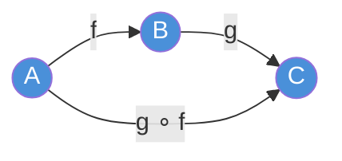

### ASCII Visualization of Composition

```
         f           g
    A ─────────▶ B ─────────▶ C
     \                       ▲
      \                     /
       \       g ∘ f       /
        \                 /
         \               /
          ─────────────▶
         
    "If you can go A→B→C, you can go A→C directly"
```

### Composition Properties

| Property | Diagram | Meaning |
|----------|---------|---------|
| Associativity | `(h∘g)∘f = h∘(g∘f)` | Parentheses don't matter |
| Identity Left | `id_B ∘ f = f` | Doing nothing first does nothing |
| Identity Right | `f ∘ id_A = f` | Doing nothing after does nothing |

---

# 📚 Slide 8: Category Theory - Identity Morphisms

## Every Object Has a Self-Loop

```
    ┌──────────────────────────────────────────┐
    │                                          │
    │      ╭──────╮                            │
    │      │      │ id_A                       │
    │      ▼      │                            │
    │     ┌───┐ ──┘                            │
    │     │ A │                                │
    │     └───┘                                │
    │       │                                  │
    │       │ f                                │
    │       ▼                                  │
    │     ┌───┐ ──╮                            │
    │     │ B │   │ id_B                       │
    │     └───┘ ◀─╯                            │
    │       │                                  │
    │       │ g                                │
    │       ▼                                  │
    │     ┌───┐ ──╮                            │
    │     │ C │   │ id_C                       │
    │     └───┘ ◀─╯                            │
    │                                          │
    └──────────────────────────────────────────┘
```

**Key Insight:** Identity morphisms ensure every object "participates" in the category. They're the neutral element for composition.

---

# 📚 Slide 9: Category Theory - Examples of Categories

## Categories Are Everywhere!

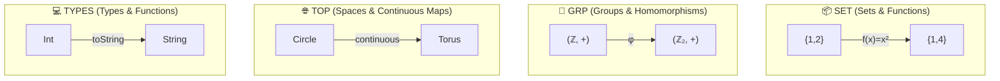

### Comparison Table

| Category | Objects | Morphisms | Identity | Composition |
|----------|---------|-----------|----------|-------------|
| **Set** | Sets | Functions | `id(x) = x` | `(g∘f)(x) = g(f(x))` |
| **Grp** | Groups | Homomorphisms | Identity map | Homomorphism comp. |
| **Top** | Topological spaces | Continuous maps | `id` | Continuous comp. |
| **Types** | Types (Int, String...) | Pure functions | `id x = x` | `(.)` operator |
| **Poset** | Elements | Order relations ≤ | Reflexivity | Transitivity |

---

# 📚 Slide 10: Category Laws - The Axioms

## What Makes a Category Valid

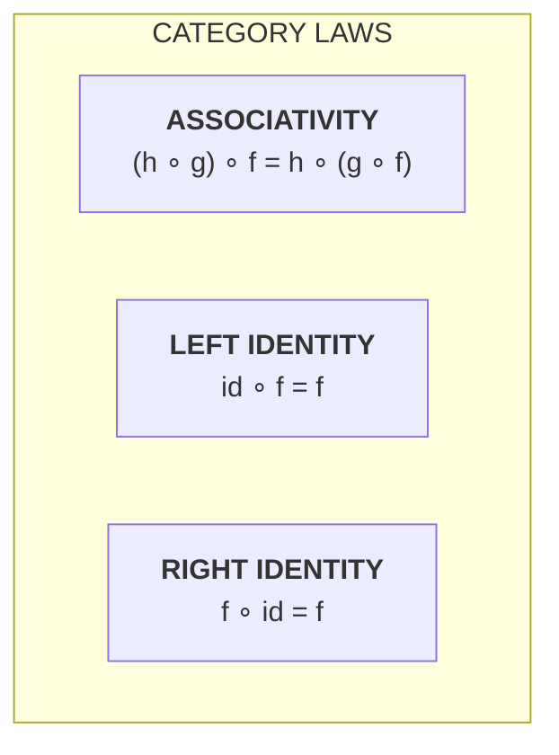

### Associativity Visualized

```
                   ASSOCIATIVITY: (h ∘ g) ∘ f = h ∘ (g ∘ f)
                   
    Left grouping:                Right grouping:
    
         f       g ∘ h                f ∘ g      h
    A ──────▶ B ──────▶ D        A ──────▶ C ──────▶ D
         │       │                    │       │
         │       │                    │       │
         └───────┴────────────────────┴───────┘
                         │
                         ▼
              BOTH = h ∘ g ∘ f (A → D)
```

**Speaker Notes:**
> These laws aren't arbitrary - they're what make categories useful for composition. Associativity lets us compose in any order; identity laws let us insert/remove identity without changing results.

---

# 🔄 Slide 11: Functors - The Big Picture

## Structure-Preserving Maps Between Categories
### (Or: Finally, we talk about .map()!)

```
╔══════════════════════════════════════════════════════════════════╗
║                         FUNCTOR F: C → D                          ║
║        "A way to translate one world into another"                ║
╠══════════════════════════════════════════════════════════════════╣
║                                                                   ║
║   CATEGORY C                          CATEGORY D                  ║
║   (The "before" world)                (The "after" world)         ║
║                                                                   ║
║       ┌───┐                              ┌─────┐                  ║
║       │ A │ ────────────────────────────▶│ F(A)│                  ║
║       └───┘   "F takes A along for      └─────┘                  ║
║         │       the ride"                   │                     ║
║         │ f                                 │ F(f)                ║
║         ▼                                   ▼                     ║
║       ┌───┐                              ┌─────┐                  ║
║       │ B │ ────────────────────────────▶│ F(B)│                  ║
║       └───┘                              └─────┘                  ║
║                                                                   ║
║         F maps BOTH objects AND morphisms!                        ║
║                                                                   ║
║   PROGRAMMER TRANSLATION:                                         ║
║   ═══════════════════════                                         ║
║   • F(A) = List[A], Option[A], Promise<A>, etc.                  ║
║   • F(f) = .map(f) - transforms the value INSIDE the container   ║
║                                                                   ║
║   [1, 2, 3].map(x => x * 2) = [2, 4, 6]                          ║
║   Some(5).map(x => x * 2)   = Some(10)                           ║
║   Promise.resolve(5).then(x => x * 2) = Promise(10)              ║
║                                                                   ║
╚══════════════════════════════════════════════════════════════════╝
```

**Plot twist**: Every time you've called `.map()`, you've been using a functor. You were a functional programmer all along.

---

# 🔄 Slide 12: Functor Laws - Preservation

## Functors Must Preserve Structure

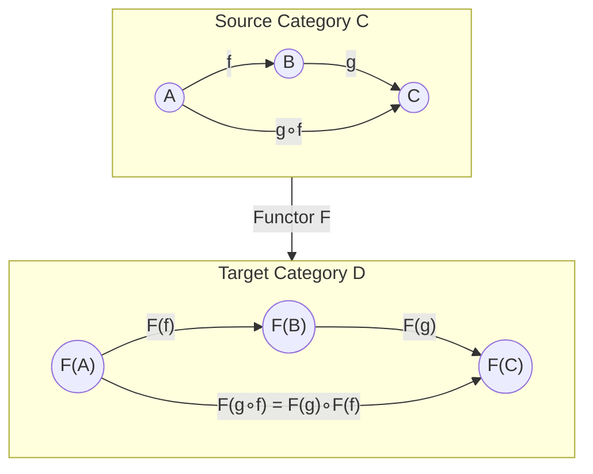

### The Two Functor Laws

```
╭──────────────────────────────────────────────────────╮
│                                                      │
│   LAW 1: IDENTITY PRESERVATION                       │
│   ─────────────────────────────                      │
│   F(id_A) = id_F(A)                                  │
│                                                      │
│   "Mapping identity gives identity"                  │
│                                                      │
│   [1,2,3].map(x => x)  ===  [1,2,3]  ✓              │
│                                                      │
├──────────────────────────────────────────────────────┤
│                                                      │
│   LAW 2: COMPOSITION PRESERVATION                    │
│   ───────────────────────────────                    │
│   F(g ∘ f) = F(g) ∘ F(f)                            │
│                                                      │
│   "Map composed function = compose mapped functions" │
│                                                      │
│   [1,2].map(x => g(f(x))) === [1,2].map(f).map(g)   │
│                                                      │
╰──────────────────────────────────────────────────────╯
```

---

# 🔄 Slide 13: Functors in Programming

## You Already Know This: It's `map`!
### (Congratulations, you've been category theorist this whole time)

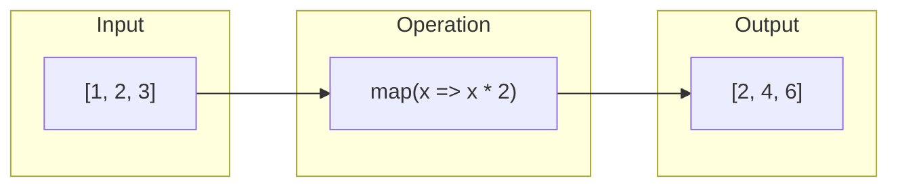

### Visual: How Map Works (It's Not Magic, Just Arrows)

```
    Input:  [  1  ,  2  ,  3  ]      "The box stays a box"
              │      │      │
              │ f    │ f    │ f      where f(x) = x * 2
              ▼      ▼      ▼
    Output: [  2  ,  4  ,  6  ]      "Contents transformed"
    
    
    The STRUCTURE (list) is PRESERVED  ← This is the "functor" part
    The VALUES are TRANSFORMED         ← This is the "map" part
    
    ┌────────────────────────────────────────────────────────┐
    │  FUNCTOR LAW CHECK:                                    │
    │                                                        │
    │  [1,2,3].map(x => x)       ===  [1,2,3]    ✓ Identity │
    │  [1,2].map(x => g(f(x)))  ===  [1,2].map(f).map(g) ✓  │
    │                                                        │
    │  If these didn't hold, .map() would be unpredictable! │
    └────────────────────────────────────────────────────────┘
```

### Language Comparison (Yes, They ALL Have It)

| Language | Functor (type) | Map Operation | Your Reaction |
|----------|----------------|---------------|---------------|
| **Haskell** | `[]`, `Maybe`, `IO` | `fmap f x` | 😰 "So many symbols" |
| **JavaScript** | `Array`, `Promise` | `x.map(f)`, `x.then(f)` | 😊 "Oh I know this!" |
| **Rust** | `Vec`, `Option`, `Result` | `x.iter().map(f)` | 🦀 "Safe AND functional" |
| **Scala** | `List`, `Option`, `Future` | `x.map(f)` | ☕ "Java but cool" |
| **Python** | `list`, ... | `map(f, x)` or `[f(i) for i in x]` | 🐍 "Pythonic!" |

---

# 🔄 Slide 14: Endofunctors - Self-Mapping

## When Source and Target Are the Same

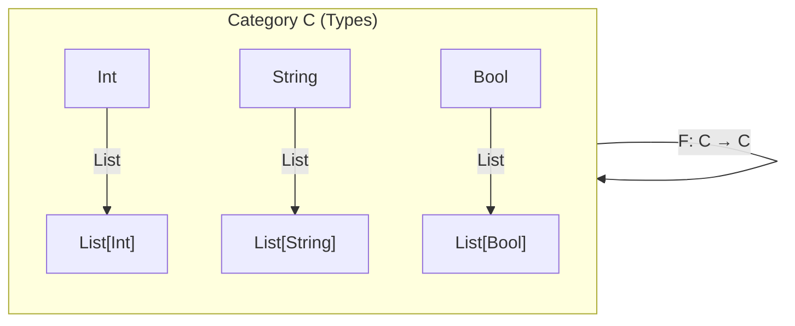

### ASCII: Endofunctor Visualization

```
    ╔═══════════════════════════════════════════════════╗
    ║              ENDOFUNCTOR (F: C → C)               ║
    ╠═══════════════════════════════════════════════════╣
    ║                                                   ║
    ║   Category of Types                               ║
    ║   ╭───────────────────────────────────────────╮   ║
    ║   │                                           │   ║
    ║   │    Int ───┐                               │   ║
    ║   │           │ F                             │   ║
    ║   │           ▼                               │   ║
    ║   │       [Int] ───┐                          │   ║
    ║   │                │ F                        │   ║
    ║   │                ▼                          │   ║
    ║   │           [[Int]] ───▶ ...                │   ║
    ║   │                                           │   ║
    ║   ╰───────────────────────────────────────────╯   ║
    ║                                                   ║
    ║   F maps Types to Types (stays in same category) ║
    ║                                                   ║
    ╚═══════════════════════════════════════════════════╝
```

**Speaker Notes:**
> Endofunctors are crucial because ALL MONADS ARE ENDOFUNCTORS. They map from Types back to Types, which lets us nest and compose them.

---

# 🔄 Slide 15: Mathematical Functor Examples

## Beyond Programming: Mathematical Functors

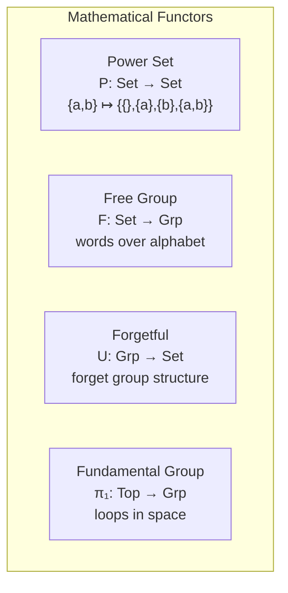

### Visual: Power Set Functor

```
    Set Category                           Set Category
         │                                      │
         ▼                                      ▼
     ┌───────┐         P (Power Set)       ┌────────────────┐
     │{a, b} │  ──────────────────────▶   │ { ∅,           │
     └───────┘                             │   {a},         │
                                           │   {b},         │
                                           │   {a,b} }      │
                                           └────────────────┘
```

**Speaker Notes:**
> These mathematical examples show functors aren't just about programming. The power set functor maps a set to its set of all subsets. The forgetful functor "forgets" structure.

---

# ⚙️ Slide 16: Monoids - The Simplest Algebraic Structure

## Three Components, That's All!
### (If you've ever used reduce(), you already know this)

```
╔═══════════════════════════════════════════════════════════════════╗
║                     MONOID (M, ∙, e)                               ║
║       "The simplest useful algebraic structure"                    ║
║       (Even JavaScript developers can handle this!)                ║
╠═══════════════════════════════════════════════════════════════════╣
║                                                                    ║
║   ┌─────────────────────────────────────────────────────────────┐  ║
║   │  1. SET M        A collection of elements                   │  ║
║   │                  (numbers, strings, functions, whatever)    │  ║
║   └─────────────────────────────────────────────────────────────┘  ║
║                              │                                     ║
║                              ▼                                     ║
║   ┌─────────────────────────────────────────────────────────────┐  ║
║   │  2. OPERATION ∙   Binary operation: M × M → M               │  ║
║   │                   (takes two elements, returns one)         │  ║
║   │                   MUST be associative!                      │  ║
║   │                                                             │  ║
║   │   EXAMPLES:                                                 │  ║
║   │   • Numbers: + (addition), × (multiplication)               │  ║
║   │   • Strings: ++ (concatenation)                             │  ║
║   │   • Arrays:  concat                                         │  ║
║   │   • Booleans: && (and), || (or)                             │  ║
║   └─────────────────────────────────────────────────────────────┘  ║
║                              │                                     ║
║                              ▼                                     ║
║   ┌─────────────────────────────────────────────────────────────┐  ║
║   │  3. IDENTITY e    Neutral element: e ∙ a = a ∙ e = a        │  ║
║   │                   (doesn't change other elements)           │  ║
║   │                                                             │  ║
║   │   EXAMPLES:                                                 │  ║
║   │   • Addition: 0 (because 0 + x = x)                         │  ║
║   │   • Multiplication: 1 (because 1 × x = x)                   │  ║
║   │   • Strings: "" (because "" + "hi" = "hi")                  │  ║
║   │   • Arrays: [] (because [].concat([1,2]) = [1,2])           │  ║
║   └─────────────────────────────────────────────────────────────┘  ║
║                                                                    ║
║   THAT'S IT! You now understand 90% of MapReduce.                  ║
║                                                                    ║
╚═══════════════════════════════════════════════════════════════════╝
```

---

# ⚙️ Slide 17: Monoid Examples Gallery

## You Use Monoids Every Day!

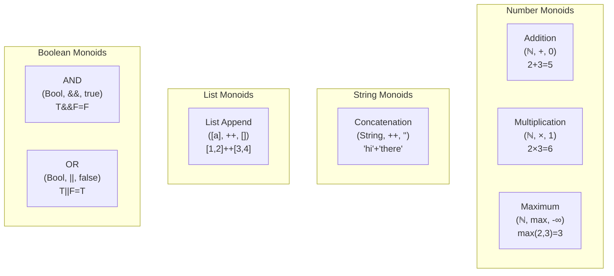

### Comprehensive Monoid Table

| Monoid | Set | Operation (∙) | Identity (e) | Example |
|--------|-----|---------------|--------------|---------|
| **Addition** | ℕ | `+` | `0` | `(2+3)+4 = 2+(3+4) = 9` |
| **Multiplication** | ℕ⁺ | `×` | `1` | `(2×3)×4 = 2×(3×4) = 24` |
| **String** | String | `++` | `""` | `("hi" ++ " ") ++ "there"` |
| **List** | [a] | `++` | `[]` | `[1,2] ++ [3] ++ [4,5]` |
| **AND** | Bool | `&&` | `true` | `true && true && false` |
| **OR** | Bool | `||` | `false` | `false || true || false` |
| **Max** | ℝ∪{-∞} | `max` | `-∞` | `max(3, max(5,2)) = 5` |
| **Functions** | a→a | `∘` | `id` | `(h∘g)∘f = h∘(g∘f)` |

---

# ⚙️ Slide 18: Monoid Laws Visualized

## Associativity Enables Parallelization!

```
                    ASSOCIATIVITY: (a ∙ b) ∙ c = a ∙ (b ∙ c)
                    
    ┌─────────────────────────────────────────────────────────────────┐
    │                                                                 │
    │  Sequential:                                                    │
    │  ((((((( e ∙ 1) ∙ 2) ∙ 3) ∙ 4) ∙ 5) ∙ 6) ∙ 7) ∙ 8             │
    │           ↓                                                     │
    │                                                                 │
    │  Parallel (thanks to associativity!):                          │
    │                                                                 │
    │    Thread 1:         Thread 2:         Thread 3:               │
    │    1 ∙ 2 = 3         3 ∙ 4 = 7         5 ∙ 6 = 11              │
    │         │                 │                 │                   │
    │         └────────┬────────┘                 │                   │
    │                  ▼                          │                   │
    │              3 ∙ 7 = 10                     │                   │
    │                  │                          │                   │
    │                  └───────────┬──────────────┘                   │
    │                              ▼                                  │
    │                          10 ∙ 11 = 21                           │
    │                                                                 │
    └─────────────────────────────────────────────────────────────────┘
    
    THIS IS WHY MAP-REDUCE WORKS!
```

### The Identity Law

```
    Identity Law: e ∙ a = a ∙ e = a
    
    ┌─────────────────────────────────────────┐
    │                                         │
    │   0 + 5 = 5       │    5 + 0 = 5       │
    │   "" + "hi" = "hi"│    "hi" + "" = "hi"│
    │   [] ++ [1,2] = [1,2]│ [1,2] ++ [] = [1,2]│
    │                                         │
    │   Identity does nothing on either side  │
    │                                         │
    └─────────────────────────────────────────┘
```

---

# ⚙️ Slide 19: Monoids → Fold/Reduce

## Every Monoid Gives You a Fold for Free!

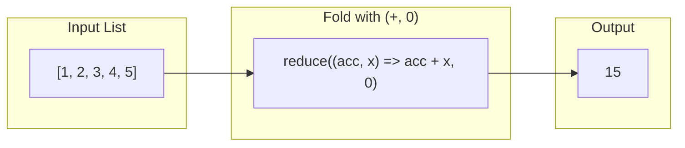

### Visual: Fold Operation

```
    Input:  [1, 2, 3, 4, 5]
    
    Monoid: (ℕ, +, 0)
    
    Fold Process:
    
    Step 0:  acc = 0 (identity)
    Step 1:  0 + 1 = 1
    Step 2:  1 + 2 = 3
    Step 3:  3 + 3 = 6
    Step 4:  6 + 4 = 10
    Step 5:  10 + 5 = 15  ←─── Result!
    
    ┌─────┬─────┬─────┬─────┬─────┐
    │  1  │  2  │  3  │  4  │  5  │
    └──┬──┴──┬──┴──┬──┴──┬──┴──┬──┘
       │     │     │     │     │
       ▼     ▼     ▼     ▼     ▼
      0+1=1 +2=3 +3=6 +4=10 +5=15
```

**Speaker Notes:**
> The monoid abstraction captures the essence of `reduce`/`fold`. Any monoid can be folded over a list. This is the mathematical foundation of aggregation operations.

---

# 🎭 Slide 20: Monads - The Complete Picture

## What Problem Do Monads Solve?
### (Spoiler: It's not about burritos, elephants, or space suits)

```
╔═══════════════════════════════════════════════════════════════════╗
║                    THE MONAD PROBLEM                               ║
║          "Why can't I just compose these functions?!"              ║
╠═══════════════════════════════════════════════════════════════════╣
║                                                                    ║
║   You have functions that return "wrapped" values:                 ║
║                                                                    ║
║   safeDivide : Int → Int → Maybe Int    // Might fail!            ║
║   safeSqrt   : Int → Maybe Int          // Might fail!            ║
║                                                                    ║
║   Problem: Can't compose directly! The types don't match!          ║
║                                                                    ║
║     safeDivide(10, 2) = Just 5                                    ║
║     safeSqrt expects Int, not Maybe Int!  ← 💥 Type error!        ║
║                                                                    ║
║   ┌──────┐     safeDivide     ┌─────────┐     safeSqrt     ???    ║
║   │  10  │ ─────────────────▶ │ Just 5  │ ───────────────▶ 💥     ║
║   └──────┘                    └─────────┘                          ║
║                                    │                               ║
║                           "I'm a Maybe, not an Int!"               ║
║                                                                    ║
║   ═══════════════════════════════════════════════════════════════  ║
║                                                                    ║
║   SOLUTION: Monad bind (>>=) handles the unwrapping!              ║
║                                                                    ║
║   Just 5 >>= safeSqrt = Just 2.236...  ← 🎉 It works!             ║
║   Nothing >>= safeSqrt = Nothing       ← 🛡️ Failure propagates!  ║
║                                                                    ║
║   "A monad is a design pattern for composing functions that       ║
║    return wrapped values, without manually unwrapping them."       ║
║                                                                    ║
╚═══════════════════════════════════════════════════════════════════╝
```

**Reality check**: If you've ever used Promise chaining or optional chaining (`?.`), you've used this pattern.

---

# 🎭 Slide 21: Monad Definition

## Three Components of a Monad

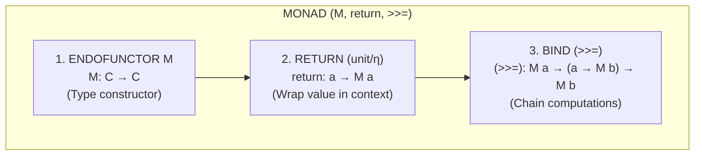

### ASCII: Monad Operations

```
    RETURN (wrap a value):
    ══════════════════════
    
        value: 5
             │
             │ return
             ▼
        ┌─────────┐
        │ Just 5  │     (value wrapped in context)
        └─────────┘
    
    
    BIND (chain computations):
    ══════════════════════════
    
        ┌─────────┐                    ┌─────────┐
        │ Just 5  │ ────▶ (f) ────▶   │ Just 25 │
        └─────────┘   x => Just(x²)   └─────────┘
        
          m a      >>=    (a → m b)        m b
```

---

# 🎭 Slide 22: Monad Bind Operation Flow

## How >>= Actually Works

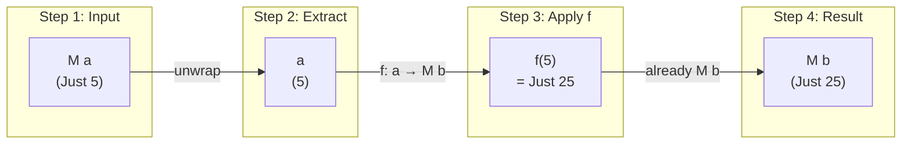

### Visual: Maybe Monad Bind

```
    HAPPY PATH (value exists):
    ══════════════════════════
    
    Just 10 >>= (\x -> safeDivide x 2)  >>= safeSqrt
         │                                    │
         └────▶ Just 5 ─────▶ Just 2.236... ──┘
    
    
    FAILURE PATH (Nothing propagates):
    ══════════════════════════════════
    
    Just 10 >>= (\x -> safeDivide x 0)  >>= safeSqrt
         │                                    │
         └────▶ Nothing ─────▶ Nothing ───────┘
                   │
                   └── Short-circuits! Doesn't call safeSqrt
```

---

# 🎭 Slide 23: Common Monad Examples

## The Monad Zoo
### (You've already met most of these)

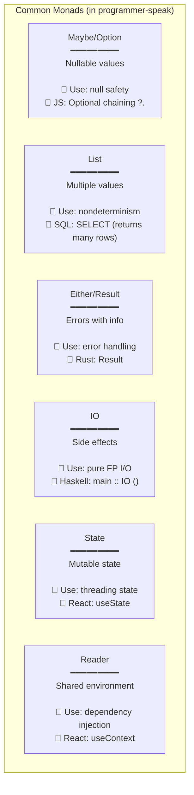

### Monad Comparison Table (The "Which one do I use?" Guide)

| Monad | When You Have... | return wraps as... | bind (>>=) does... | You Know It As... |
|-------|------------------|-------------------|-------------------|-------------------|
| **Maybe** | Possibly missing values | `Just x` | Propagate `Nothing` | Optional, `?.`, `null` checks |
| **List** | Multiple possibilities | `[x]` | Cartesian product | SQL multi-row results |
| **Either** | Errors with details | `Right x` | Propagate `Left err` | Result, try/catch |
| **IO** | Side effects | Pure value | Sequence effects | async/await |
| **State** | Mutable state | `(x, s)` | Thread state | Redux, useState |
| **Reader** | Shared config | `const x` | Pass environment | Context, DI |

**Pro tip**: If you've used Promises, you've used a monad. `.then()` is basically bind.

---

# 🎭 Slide 24: Monad Laws

## The Three Monad Laws

```
╔═══════════════════════════════════════════════════════════════════╗
║                        MONAD LAWS                                  ║
╠═══════════════════════════════════════════════════════════════════╣
║                                                                    ║
║   1. LEFT IDENTITY                                                 ║
║   ────────────────                                                 ║
║   return a >>= f  ≡  f a                                          ║
║                                                                    ║
║   "Wrapping then binding is same as calling directly"             ║
║                                                                    ║
║   ┌─────────────────────────────────────────────────────────┐     ║
║   │  return 5 >>= (\x -> Just (x * 2))  ≡  Just 10         │     ║
║   │  (\x -> Just (x * 2)) 5              ≡  Just 10         │     ║
║   └─────────────────────────────────────────────────────────┘     ║
║                                                                    ║
╠═══════════════════════════════════════════════════════════════════╣
║                                                                    ║
║   2. RIGHT IDENTITY                                                ║
║   ─────────────────                                                ║
║   m >>= return  ≡  m                                              ║
║                                                                    ║
║   "Binding to return gives back the same monad"                   ║
║                                                                    ║
║   ┌─────────────────────────────────────────────────────────┐     ║
║   │  Just 5 >>= return  ≡  Just 5                          │     ║
║   └─────────────────────────────────────────────────────────┘     ║
║                                                                    ║
╠═══════════════════════════════════════════════════════════════════╣
║                                                                    ║
║   3. ASSOCIATIVITY                                                 ║
║   ────────────────                                                 ║
║   (m >>= f) >>= g  ≡  m >>= (\x -> f x >>= g)                    ║
║                                                                    ║
║   "Order of binding doesn't matter (with proper scoping)"         ║
║                                                                    ║
╚═══════════════════════════════════════════════════════════════════╝
```

---

# 🎭 Slide 25: Kleisli Category

## The Secret Arrow Notation

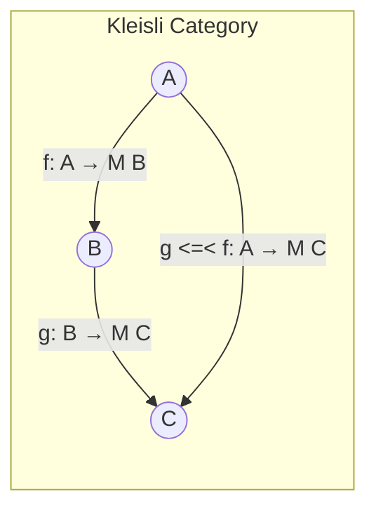

### Kleisli Composition Visualization

```
    Kleisli Arrows: Functions that return monadic values
    ═══════════════════════════════════════════════════
    
    f : A → M B          (e.g., safeDivide : Int → Maybe Int)
    g : B → M C          (e.g., safeSqrt   : Int → Maybe Float)
    
    
    Kleisli Composition (fish operator <=<):
    ════════════════════════════════════════
    
    (g <=< f) : A → M C
    
    Implementation:
    (g <=< f) a = f a >>= g
    
    
    Visual:
    
        A ──────f──────▶ M B ──────▶ B ──────g──────▶ M C
             │                       │
             │         extract       │
             │         (via >>=)     │
             │                       │
             └───────────────────────┘
                    g <=< f
```

**Speaker Notes:**
> The Kleisli category is formed by Kleisli arrows (A → M B) as morphisms. This reveals monads as a way to create a category where effectful computations compose cleanly.

---

# 🔗 Slide 26: The Grand Unification

## How All Concepts Connect
### (The moment when it all clicks)

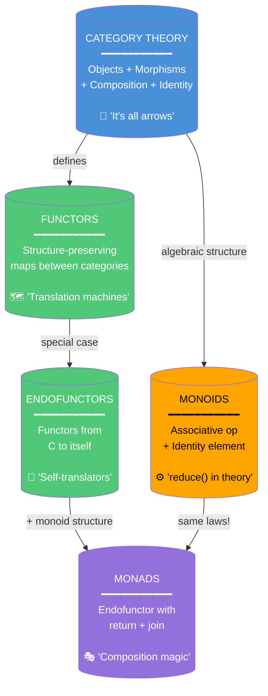

**The Aha! Moment:**
- Categories give us the language (objects, arrows, composition)
- Functors are mappings between categories that preserve structure
- Endofunctors map a category to itself (Type → Type)
- Monoids are sets with an associative operation and identity
- **Monads are endofunctors with a monoid structure** ← THIS IS THE INSIGHT

---

# 🔗 Slide 27: The Famous Quote Decoded

## "A Monad is a Monoid in the Category of Endofunctors"
### (The quote that launches a thousand confused Stack Overflow questions)

```
╔═══════════════════════════════════════════════════════════════════╗
║         DECODING THE FAMOUS PHRASE                                 ║
║         (What it means and why you should care)                    ║
╠═══════════════════════════════════════════════════════════════════╣
║                                                                    ║
║   MONOID in normal categories:                                     ║
║   ════════════════════════════                                     ║
║   • Elements: values in M           (like numbers)                 ║
║   • Operation: · (combines two)     (like addition: +)             ║
║   • Identity: e (neutral element)   (like zero: 0)                 ║
║                                                                    ║
║   MONAD as a MONOID in category of ENDOFUNCTORS:                  ║
║   ══════════════════════════════════════════════                  ║
║   • "Elements": Endofunctor M       (like List, Maybe, IO)         ║
║   • "Operation": join (μ: M∘M → M)  (flatten: [[a]] → [a])        ║
║   • "Identity": return (η: Id → M)  (wrap: a → [a])                ║
║                                                                    ║
║   ┌─────────────────────────────────────────────────────────────┐ ║
║   │                                                             │ ║
║   │     MONOID                     MONAD                        │ ║
║   │     ══════                     ═════                        │ ║
║   │     Elements of M    ↔    Endofunctor M     (List, Maybe)  │ ║
║   │     Operation ∙      ↔    join (μ)          (flatten)      │ ║
║   │     Identity e       ↔    return (η)        (wrap)         │ ║
║   │     Associativity    ↔    Monad assoc law   (order safe)   │ ║
║   │     Identity laws    ↔    Monad id laws     (wrap/unwrap)  │ ║
║   │                                                             │ ║
║   └─────────────────────────────────────────────────────────────┘ ║
║                                                                    ║
║   Same algebraic structure, different abstraction level!          ║
║                                                                    ║
║   ┌─────────────────────────────────────────────────────────────┐ ║
║   │  WHY THIS MATTERS TO YOU:                                   │ ║
║   │                                                             │ ║
║   │  If you understand monoids (reduce, fold), you already      │ ║
║   │  understand the LAWS that govern monads. The only new       │ ║
║   │  thing is that instead of combining VALUES, we're           │ ║
║   │  combining COMPUTATIONAL CONTEXTS.                          │ ║
║   │                                                             │ ║
║   │  [[1,2], [3,4]].flat() = [1,2,3,4]  ← This is join!        │ ║
║   │  [x]                                ← This is return!       │ ║
║   └─────────────────────────────────────────────────────────────┘ ║
║                                                                    ║
╚═══════════════════════════════════════════════════════════════════╝
```

**Next time someone says this quote to sound smart, you can nod and say: "Yes, because join flattens nested functors, which is the monoid operation."**

Then walk away dramatically.

---

# 🔗 Slide 28: Complete Relationship Diagram

## All 27 AKUs and Their Connections

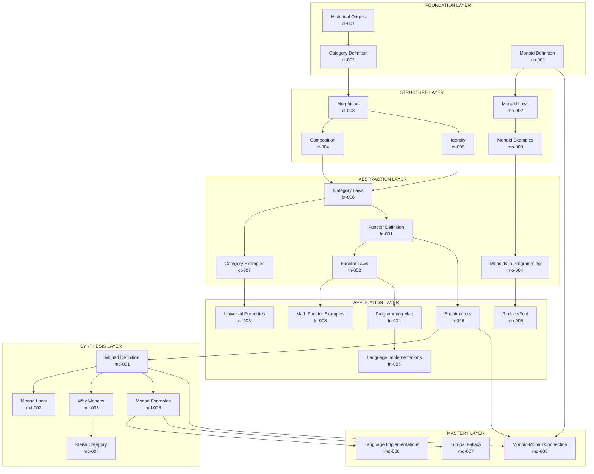

---

# 📊 Slide 29: Visual Summary

## The Four Pillars at a Glance

```
┏━━━━━━━━━━━━━━━━━━━━━━━━━━━━━━━━━━━━━━━━━━━━━━━━━━━━━━━━━━━━━━━━━┓
┃                     FUNCTIONAL THEORY                            ┃
┃                     Visual Summary                               ┃
┣━━━━━━━━━━━━━━━━━┳━━━━━━━━━━━━━━━━━┳━━━━━━━━━━━━━━━━━━━━━━━━━━━━━┫
┃                 ┃                 ┃                              ┃
┃   CATEGORY      ┃    FUNCTORS     ┃    MONOIDS                   ┃
┃   ════════      ┃    ════════     ┃    ═══════                   ┃
┃                 ┃                 ┃                              ┃
┃   Objects       ┃    F: C → D     ┃    (M, ∙, e)                 ┃
┃   Morphisms     ┃    Maps both    ┃    Associative op            ┃
┃   Composition   ┃    objects and  ┃    Identity element          ┃
┃   Identity      ┃    arrows       ┃    Enables fold              ┃
┃                 ┃                 ┃                              ┃
┃   "Structure    ┃   "Translate    ┃   "Combine and              ┃
┃    is in the    ┃    between      ┃    aggregate                 ┃
┃    arrows"      ┃    worlds"      ┃    values"                   ┃
┃                 ┃                 ┃                              ┃
┣━━━━━━━━━━━━━━━━━┻━━━━━━━━━━━━━━━━━┻━━━━━━━━━━━━━━━━━━━━━━━━━━━━━┫
┃                                                                  ┃
┃                          MONADS                                  ┃
┃                          ══════                                  ┃
┃                                                                  ┃
┃           Endofunctor + return + bind (>>=)                     ┃
┃           Compose effectful computations                         ┃
┃           "Monoid in category of endofunctors"                  ┃
┃                                                                  ┃
┃           "Sequence operations that might fail,                  ┃
┃            produce multiple results, have effects,               ┃
┃            or carry state"                                       ┃
┃                                                                  ┃
┗━━━━━━━━━━━━━━━━━━━━━━━━━━━━━━━━━━━━━━━━━━━━━━━━━━━━━━━━━━━━━━━━━┛
```

### Key Relationships

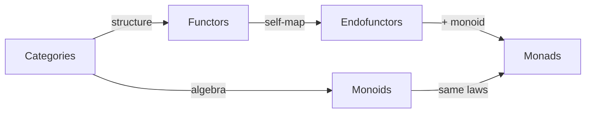

---

# 📚 Slide 30: Resources and Next Steps

## Continue Your Journey
### (Or: What to do after this presentation)

### Learning Paths

```
╭──────────────────────────────────────────────────────────────────╮
│                                                                  │
│   🌱 BEGINNER ("I just want to use this stuff")                 │
│   ─────────────────────────────────────────────                  │
│   Start: mo-001 (Monoid Definition)                             │
│   Path:  Monoids → Functors → Endofunctors → Monads             │
│   Time:  ~4-6 hours                                              │
│   Goal:  Understand why .map() and reduce() work the way        │
│          they do. Start using Maybe/Option confidently.          │
│                                                                  │
├──────────────────────────────────────────────────────────────────┤
│                                                                  │
│   📐 MATHEMATICAL ("I want the full theory")                    │
│   ─────────────────────────────────────────                      │
│   Start: ct-001 (Historical Origins)                            │
│   Path:  Category Theory → Functors → Monoids → Monads          │
│   Time:  ~8-12 hours                                             │
│   Goal:  Understand the abstract structure. Read Haskell        │
│          without crying. Annoy coworkers with math facts.        │
│                                                                  │
├──────────────────────────────────────────────────────────────────┤
│                                                                  │
│   💻 PRACTICAL ("Just show me the code")                        │
│   ───────────────────────────────────────                        │
│   Start: fn-004 (Programming Map)                               │
│   Path:  Map → Reduce/Fold → Maybe/IO → Async/Await            │
│   Time:  ~3-4 hours                                              │
│   Goal:  Write cleaner async code. Handle errors properly.      │
│          Refactor that callback hell you've been avoiding.       │
│                                                                  │
╰──────────────────────────────────────────────────────────────────╯
```

### What to Tell Your Coworkers

| When They Say... | You Can Say... |
|------------------|----------------|
| "What's a functor?" | "It's what .map() is. You've been using them for years." |
| "What's a monoid?" | "It's what makes reduce() work. Associative + identity." |
| "What's a monad?" | "It's a design pattern for composing functions that return wrapped values." |
| "Is this just Haskell nonsense?" | "No, Promises are monads. async/await is monad syntax sugar." |

### Further Reading (In Order of Accessibility)

| Resource | Level | Focus | Time to Grok |
|----------|-------|-------|--------------|
| Professor Frisby's Guide | Beginner | JavaScript FP | 2-4 hours |
| Learn You a Haskell | Beginner | Haskell basics | 10-20 hours |
| Bartosz Milewski's Blog | Intermediate | Category Theory | Ongoing |
| Category Theory for Programmers | Advanced | Deep theory | 40+ hours |
| Categories for Working Mathematician | Expert | Pure math | Several months |

**Final wisdom**: You don't need to understand all of category theory to use monads effectively. Understanding .map(), .flatMap(), and why they compose is 80% of the practical value.

---

# 📎 Appendix: Diagram Legend

## Visual Encoding Reference

### Shapes

| Shape | Meaning |
|-------|---------|
| `(( ))` | Core concept (circle in Mermaid) |
| `[ ]` | AKU or supporting concept |
| `{ }` | Grouping/category |
| `──▶` | Prerequisite/dependency |
| `━━━` | Strong connection |
| `───` | Weak connection |

### Colors

| Color | Meaning |
|-------|---------|
| 🔵 Blue | Category Theory concepts |
| 🟢 Green | Functor concepts |
| 🟠 Orange | Monoid concepts |
| 🟣 Purple | Monad concepts |
| ⚪ White/Gray | Cross-domain or general |

### Diagram Types Used

| Type | Purpose | Tool |
|------|---------|------|
| Flowchart | Process flows, relationships | Mermaid |
| Mind Map | Concept hierarchies | Mermaid |
| ASCII Art | Detailed structures | Unicode box-drawing |
| Tables | Comparisons | Markdown |

---

# 🎤 Speaker Notes Compilation

## Slide-by-Slide Guidance

### Slides 1-2: Title and TOC
- **Time**: 2 minutes
- **Key Point**: Set expectations - promise no burritos, only actual understanding
- **Opening Hook**: Ask "Who here has used .map() or .reduce() this week?" (Everyone raises hand) "Congrats, you're already functional programmers."
- **Interaction**: Poll audience on their FP journey stage (Week 1? Week 4 crisis? Week 12 enlightenment?)

### Slides 3-5: Domain Overview
- **Time**: 5 minutes
- **Key Point**: "You already know 3 of the 4 concepts"
- **Reassurance**: Most developers feel imposter syndrome here. Point out that Promises, Optional, LINQ are all these concepts.
- **Tip**: Reference the mind map frequently throughout as a "you are here" marker

### Slides 6-10: Category Theory
- **Time**: 10 minutes
- **Key Point**: "It's all about the arrows, not the objects" - this is THE insight
- **Analogy**: Categories are like APIs - you care about what functions exist and how they compose, not implementation details
- **Demonstration**: Draw simple category on whiteboard: Int, String, toString arrow, id arrows
- **Joke**: "Categories are simpler than your average enterprise Java codebase"

### Slides 11-15: Functors
- **Time**: 10 minutes
- **Key Point**: "Functors = map() in programming" - this is the payoff
- **Revelation**: "You've been using functors every time you called .map(). Congratulations, you're a category theorist."
- **Code Demo**: Show `.map()` in JavaScript, then Promise.then(), show they're the same pattern

### Slides 16-19: Monoids
- **Time**: 8 minutes
- **Key Point**: "Simplest useful algebraic structure" - this is where MapReduce comes from
- **Practical**: Show how associativity enables parallelization (the slide with Thread 1, 2, 3)
- **Demonstration**: Live code reduce() with different monoids (sum, product, string concat)

### Slides 20-25: Monads
- **Time**: 15 minutes
- **Key Point**: "Composing functions that return wrapped values"
- **WARNING**: Avoid ALL analogies (burritos, elephants, space suits). The Tutorial Fallacy is real!
- **Strategy**: Show the PROBLEM first (types don't match), then the SOLUTION (bind handles unwrapping)
- **Code Demo**: Maybe monad chaining, show what happens with Nothing (short-circuits)
- **Modern**: Point out that async/await IS monad syntax sugar for the Promise monad

### Slides 26-28: Grand Unification
- **Time**: 8 minutes
- **Key Point**: "Same patterns at different abstraction levels"
- **Revelation**: Decode the famous quote - let them finally understand it
- **Mic Drop**: "join flattens nested functors, which is the monoid operation. Now you know what 'monoid in the category of endofunctors' means."

### Slides 29-30: Summary
- **Time**: 2 minutes
- **Key Point**: Provide clear next steps based on goals
- **Empowerment**: "You don't need to understand all of category theory to use these patterns effectively"
- **Call to Action**: "Go refactor that Promise chain with what you've learned"

---

## Accessibility Notes

### Color Alternatives
All diagrams use:
- Shape differentiation (not just color)
- Labels on all elements
- High contrast text

### Screen Reader Compatibility
- All diagrams have text equivalents
- Tables use proper headers
- ASCII art has accompanying descriptions

### Keyboard Navigation
- Slides are numbered sequentially
- TOC provides jump points
- All links are descriptive

---

## Technical Notes

### Rendering Requirements
- **Mermaid**: v9.0+ for mind maps
- **Markdown**: GitHub-flavored for tables
- **Fonts**: Monospace for ASCII art (Consolas, Monaco, or similar)

### Export Formats
This document can be converted to:
- PDF (via Pandoc)
- reveal.js slides
- PowerPoint (with manual diagram recreation)
- HTML for web viewing

---

*Generated by WorldSMEGraphs Visualization Agent*  
*Based on 27 Atomic Knowledge Units*  
*Date: 2026-01-04*
