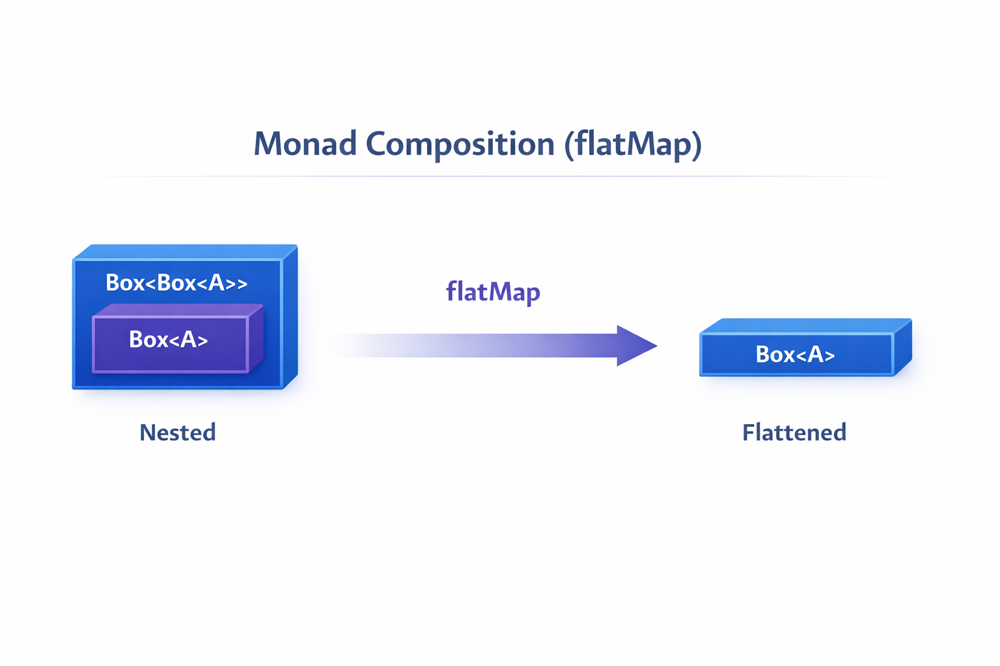
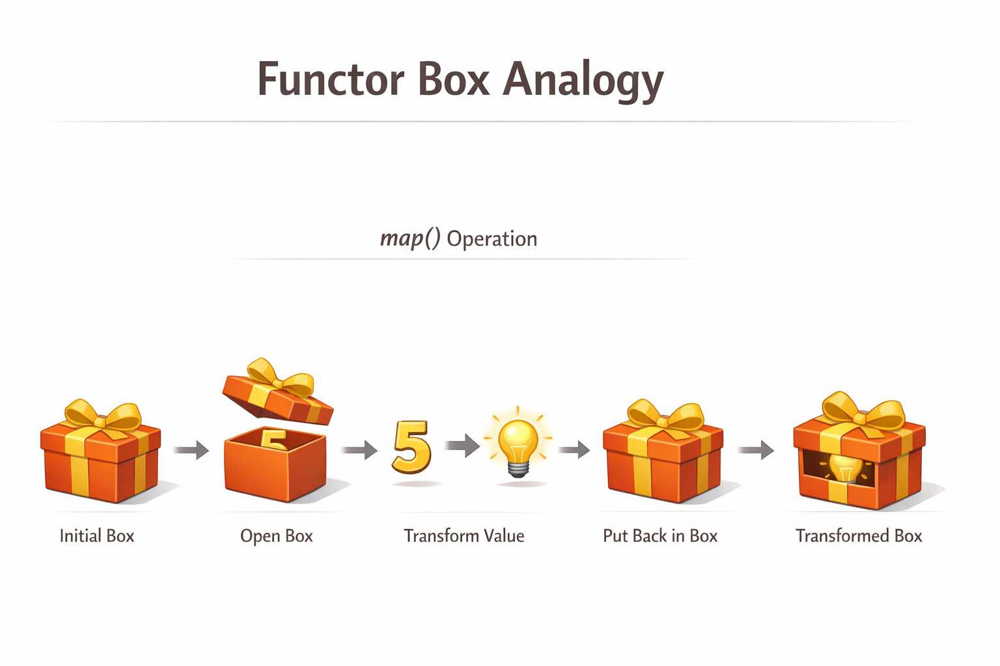
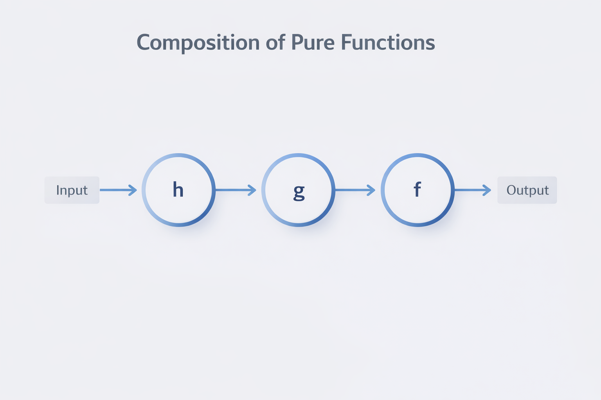

# Functional Programming Developer Adventure

*6-Panel Grid Layout (2 columns × 3 rows per page)*

---

## Page 1 (Images 1-6)

| | |
|:---:|:---:|
|  |  |
|  |  |
|  |  |

---

## Page 2 (Images 7-8)

| | |
|:---:|:---:|
|  |  |

---

**Document Metadata:**
- **Version**: 1.0
- **Format**: 6-panel grid layout (2×3 per page)
- **Reading order**: Left to right, top to bottom
- **Source**: Functional Programming Developer Adventure (8 images)
- **License**: CC-BY-4.0
