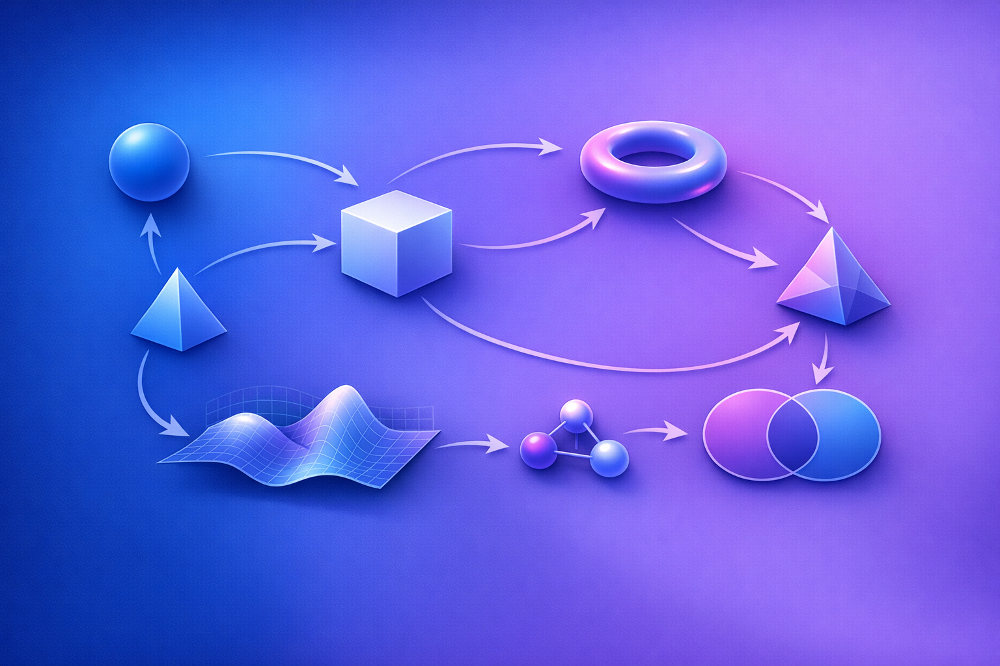

# Functional Programming Visual Guide

*Images speak for themselves*

---

---

---

---

---

---

---

**Document Metadata:**
- **Version**: 1.0
- **Format**: Images-only viewer (no narrative text)
- **Source**: Functional Programming Visual Guide (6 images)
- **License**: CC-BY-4.0
