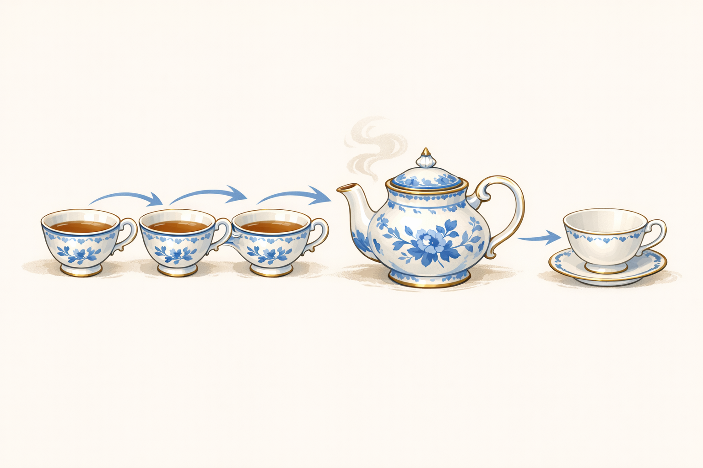

# Functional Programming Presentation

*Images speak for themselves*

---

---

---

---

---

---

---

---

---

---

---

**Document Metadata:**
- **Version**: 1.0
- **Format**: Images-only viewer (no narrative text)
- **Source**: Functional Programming Presentation slides
- **License**: CC-BY-4.0
