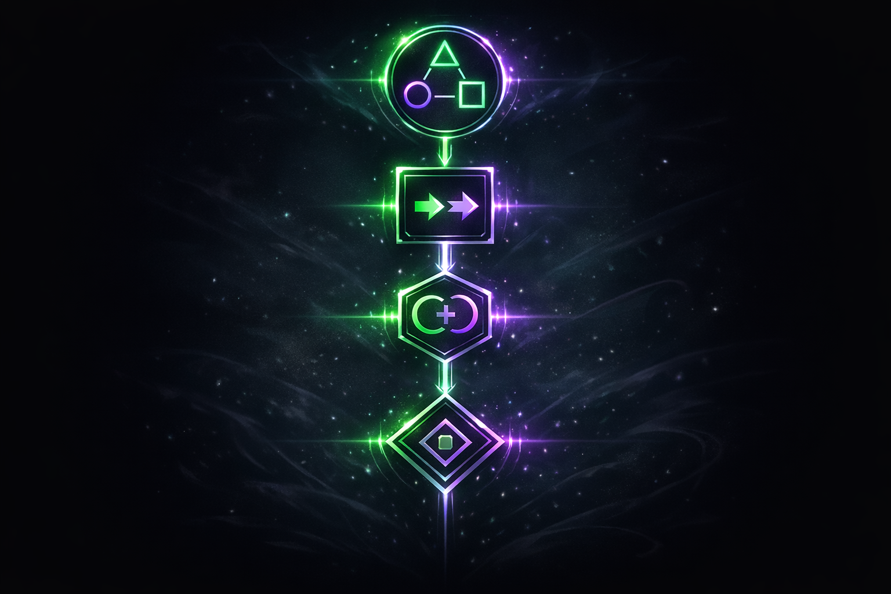
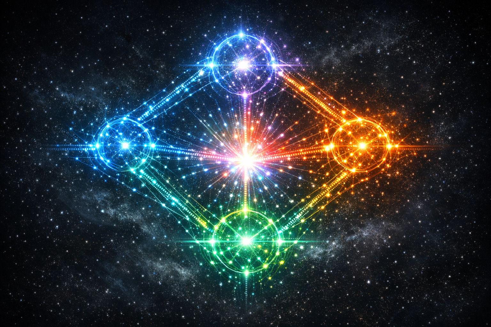
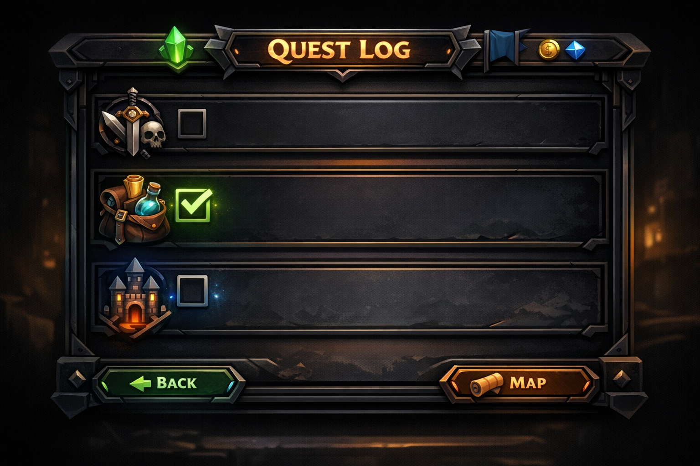

# Functional Programming RPG Presentation (v2)

*Images speak for themselves*

---

---

---

---

---

---

---

---

---

---

---

---

---

**Document Metadata:**
- **Version**: 1.0
- **Format**: Images-only viewer (no narrative text)
- **Source**: Functional Programming RPG Presentation v2 (12 slides)
- **License**: CC-BY-4.0
