# Acute Limb Ischemia: A Race Against Time

**Dr. Young Erben's Emergency Vascular Surgery Story**

*A medical education comic featuring Dr. Young Erben, a Korean-American vascular surgeon*

---

## Page 1: The Emergency Call (Panels 1-6)

### Panel 1: The 3 AM Call

**Scene**: Dr. Erben awakened by emergency phone call  
**Dialogue**: "Dr. Erben? We have a code vascular. 68-year-old male, right leg cold and pale..."

---

### Panel 2: Racing to Hospital

**Scene**: Dr. Erben driving through night  
**Focus**: Time-critical nature of acute limb ischemia

---

### Panel 3: ER Arrival

**Scene**: Dr. Erben arriving in ER, greeting team  
**Dialogue**: "¿Dónde está el paciente?" (Where is the patient?)

---

### Panel 4: Speaking Spanish

**Scene**: Dr. Erben connecting with Venezuelan patient Carlos in Spanish  
**Cultural Connection**: Trust-building through language

---

### Panel 5: The 6 Ps Assessment

**Scene**: Complete clinical assessment of acute limb ischemia  
**Educational**: Pain, Pallor, Pulselessness, Paresthesias, Paralysis, Poikilothermia

---

### Panel 6: Doppler Ultrasound
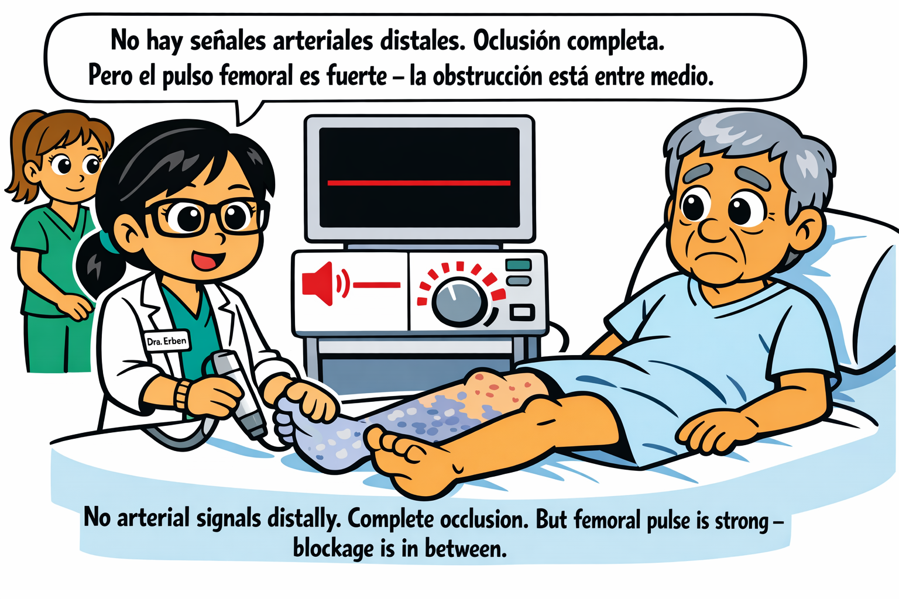

**Scene**: No arterial signals detected in affected limb  
**Diagnosis**: Complete arterial occlusion

---

## Page 2: Diagnosis & Decision (Panels 7-12)

### Panel 7: EKG Shows AFib
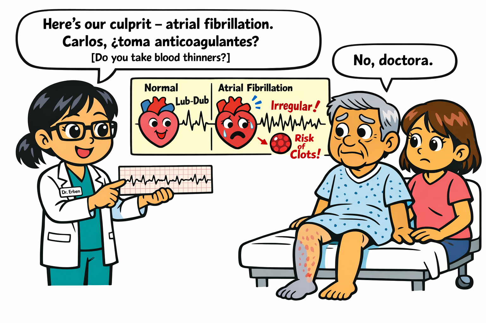

**Scene**: Discovering atrial fibrillation as embolic source  
**Teaching Point**: AFib → clot formation → arterial embolism

---

### Panel 8: Wife's Fear

**Scene**: María expressing fear about Carlos losing his leg  
**Emotional**: Family anxiety in emergency situation

---

### Panel 9: The Race Against Time Explained
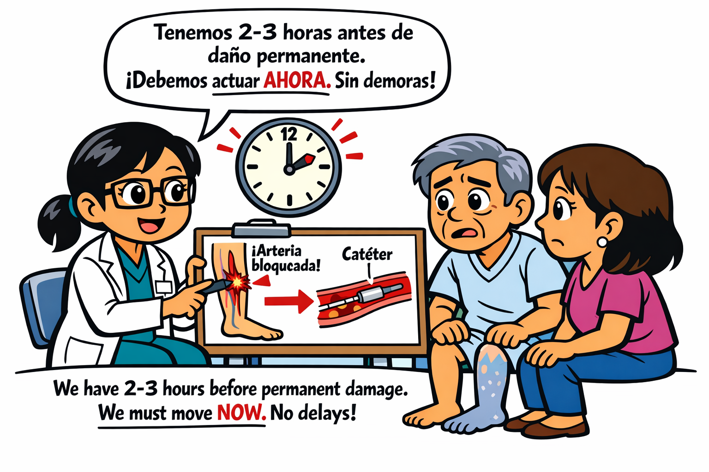

**Scene**: Dr. Erben explaining 6-hour golden window  
**Critical Concept**: Time is muscle

---

### Panel 10: Informed Consent

**Scene**: Obtaining surgical consent with family present  
**Risks**: Bleeding, clot recurrence, compartment syndrome, amputation

---

### Panel 11: Team Mobilization
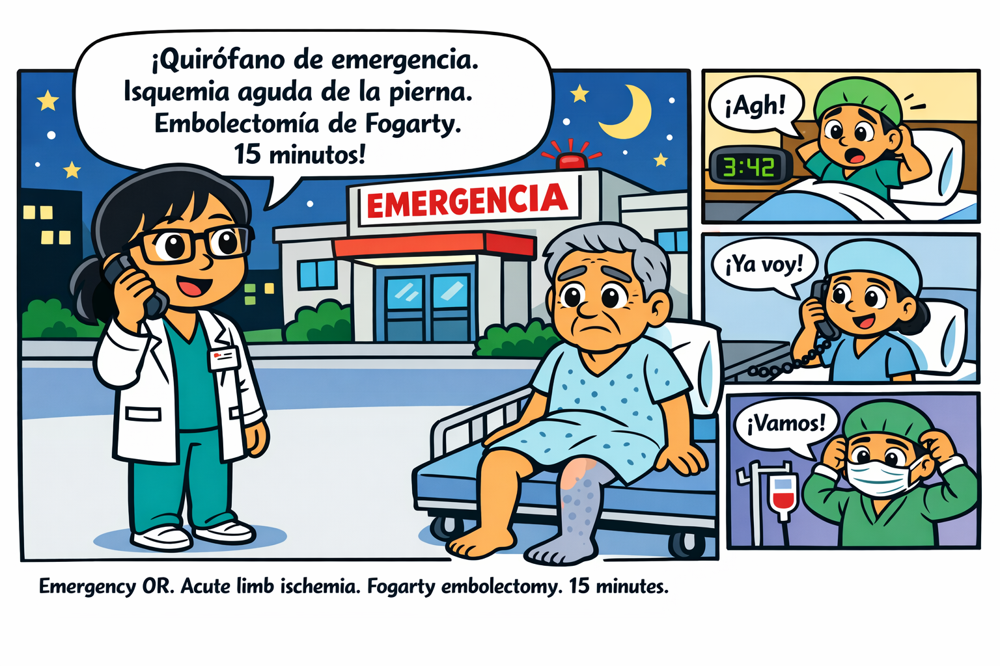

**Scene**: Surgical team assembling rapidly  
**Teamwork**: Anesthesia, nursing, surgical tech coordination

---

### Panel 12: Heparin Bolus

**Scene**: Administering anticoagulation immediately  
**Medical Detail**: 5000 units IV bolus to prevent further clotting

---

## Page 3: Surgical Preparation (Panels 13-18)

### Panel 13: Surgical Diagram
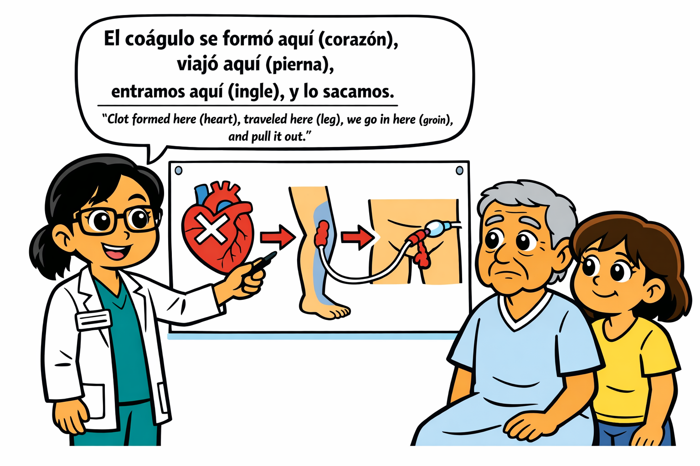

**Scene**: Dr. Erben explaining Fogarty catheter technique  
**Educational**: Balloon thromboembolectomy procedure

---

### Panel 14: Carlos's Fear About Walking

**Scene**: Patient expressing fear of disability  
**Reassurance**: Dr. Erben's compassionate response

---

### Panel 15: Dr. Erben's Reassurance

**Scene**: Building trust, promising best effort  
**Patient-Doctor Bond**: Cultural and linguistic connection

---

### Panel 16: OR Team Assembly

**Scene**: Complete surgical team ready  
**Professional Excellence**: Coordinated preparation

---

### Panel 17: Spinal Anesthesia

**Scene**: Anesthesiologist performing spinal block  
**Advantage**: Patient awake, less cardiac stress

---

### Panel 18: Surgical Prep

**Scene**: Sterile field preparation, surgical draping  
**Sterile Technique**: Betadine prep, blue drapes

---

## Page 4: The Procedure Begins (Panels 19-24)

### Panel 19: Femoral Access Preparation
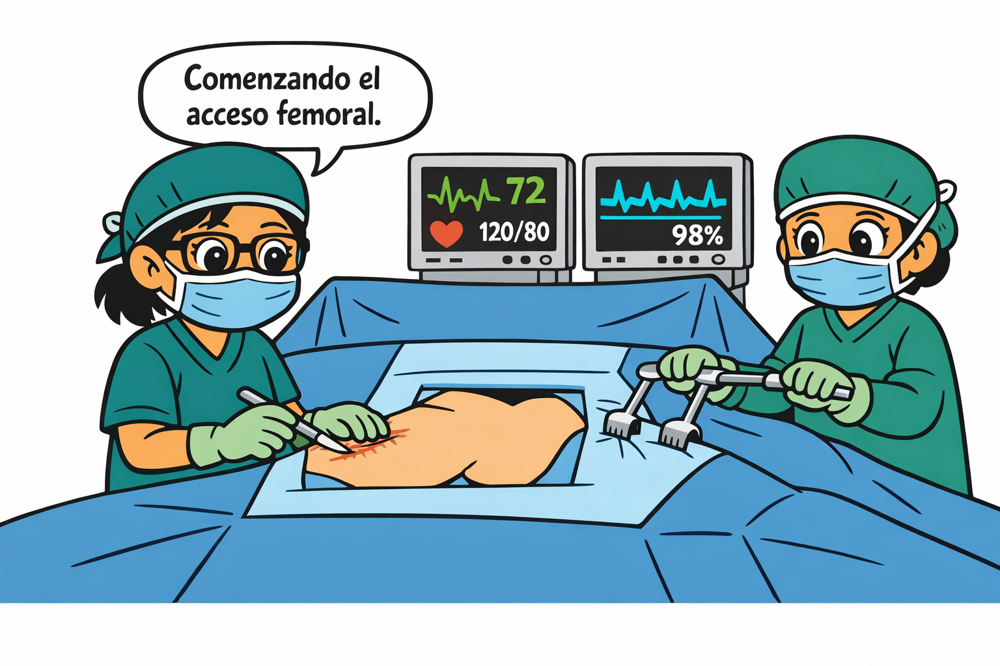

**Scene**: Preparing surgical access site  
**Technique**: Femoral artery approach

---

### Panel 20: Exposing Femoral Artery

**Scene**: Careful dissection to arterial access  
**Surgical Anatomy**: Femoral triangle exposure

---

### Panel 21: Arteriotomy

**Scene**: Making controlled opening in artery  
**Precision**: Small incision for catheter insertion

---

### Panel 22: Fogarty Catheter Insertion
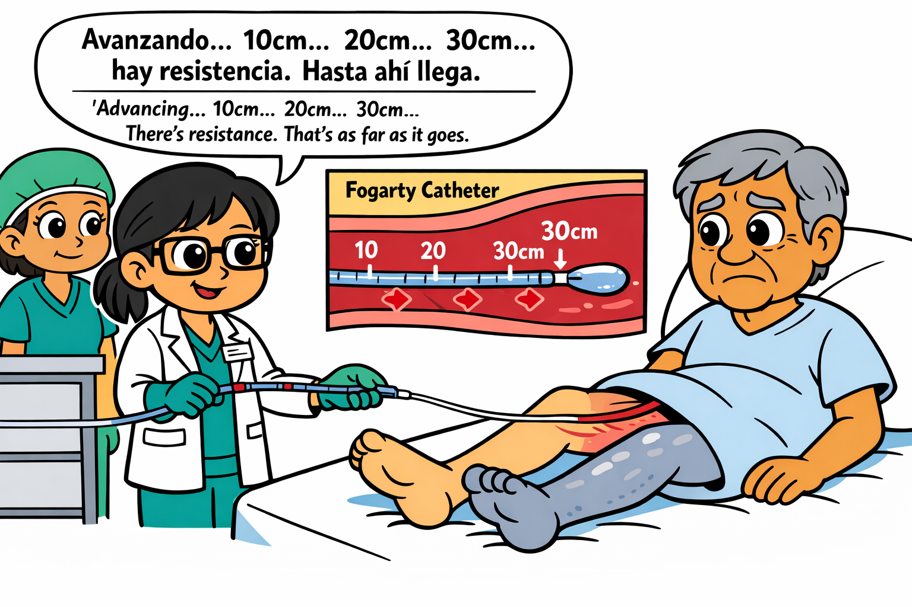

**Scene**: Inserting balloon-tipped catheter  
**Technique**: Advancing catheter through occlusion

---

### Panel 23: Balloon Inflation

**Scene**: Inflating balloon beyond clot  
**Mechanism**: Balloon catches clot for extraction

---

### Panel 24: First Pass Extraction

**Scene**: Pulling out large embolus  
**Success**: Significant clot removed on first pass

---

## Page 5: Completion & Recovery (Panels 25-30)

### Panel 25: Multiple Passes
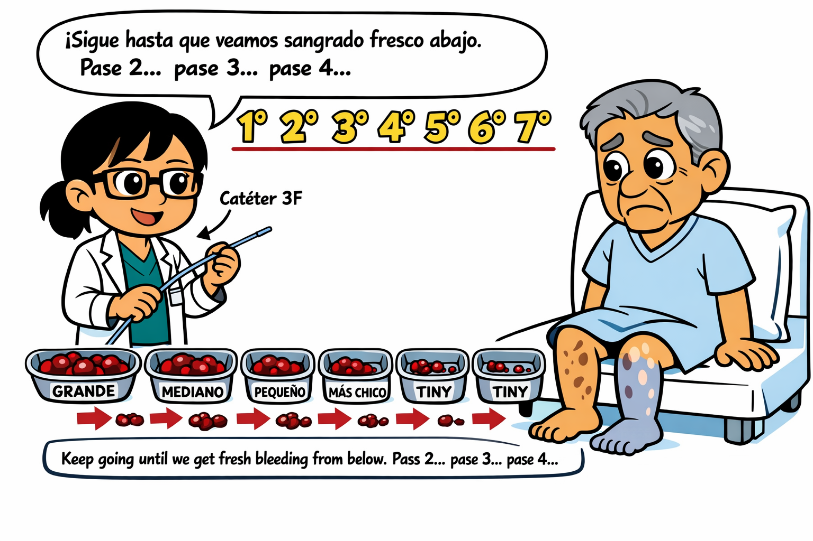

**Scene**: Additional catheter passes for complete clearance  
**Thoroughness**: Ensuring all clot material removed

---

### Panel 26: Fresh Bleeding
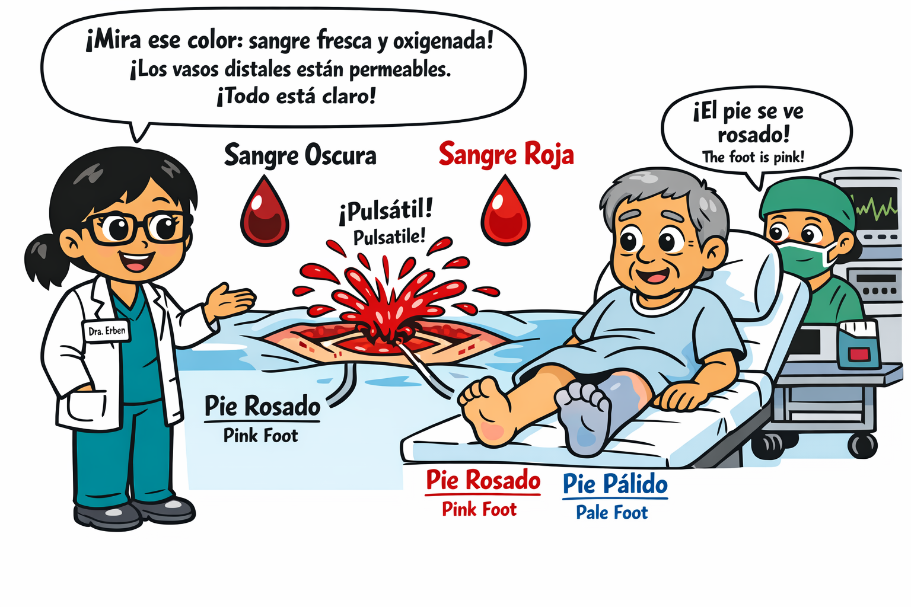

**Scene**: Bright red blood flowing = successful reperfusion  
**Victory Sign**: Arterial flow restored

---

### Panel 27: Patch Angioplasty
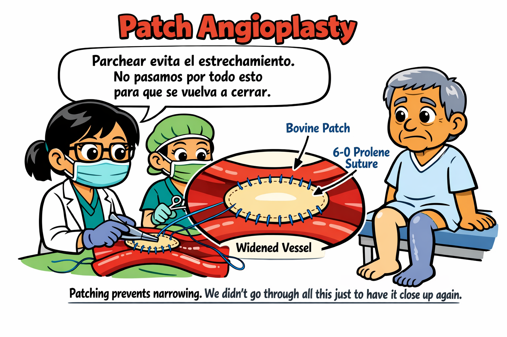

**Scene**: Closing arteriotomy with vein patch  
**Technique**: Preventing narrowing at repair site

---

### Panel 28: Final Check - Foot Pink

**Scene**: Foot color returning, warmth restored  
**Success Marker**: Perfusion reestablished

---

### Panel 29: Wiggling Toes

**Scene**: Carlos able to move toes immediately  
**Neurological Recovery**: Nerve function preserved

---

### Panel 30: Explaining the Source

**Scene**: Dr. Erben explaining AFib as cause  
**Education**: Preventing future emboli

---

## Page 6: Long-Term Care (Panels 31-35)

### Panel 31: Cardiology Consultation
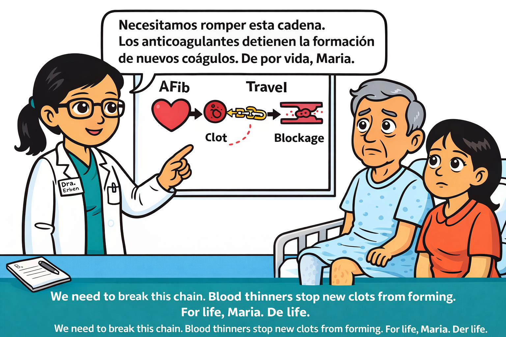

**Scene**: Arranging AFib management with cardiologist  
**Coordination**: Multidisciplinary care

---

### Panel 32: The Critical Question
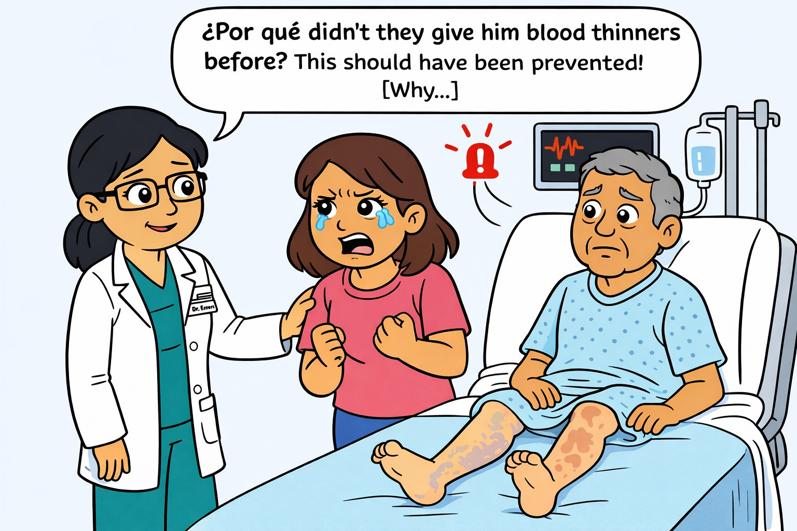

**Scene**: María asking about Carlos's past stroke  
**System Failure**: Lack of anticoagulation despite AFib

---

### Panel 33: Stroke Risk Education
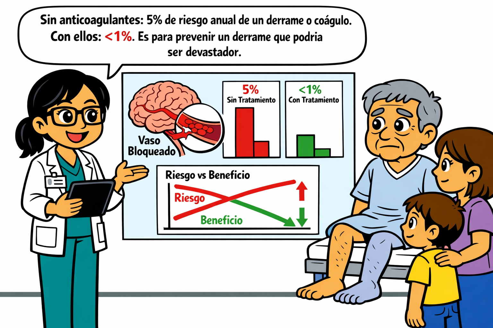

**Scene**: Dr. Erben explaining AFib stroke risks  
**Prevention**: Importance of anticoagulation

---

### Panel 34: Discharge Planning

**Scene**: Setting up follow-up, warfarin education  
**Long-term Management**: Preventing recurrence

---

### Panel 35: Three-Month Follow-Up - Dancing!
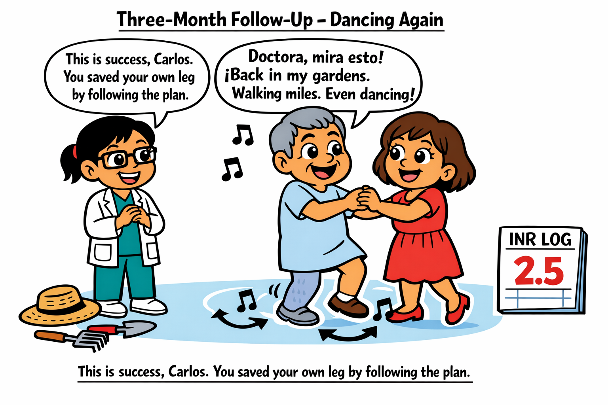

**Scene**: Carlos and María dancing in clinic  
**Success**: Full recovery, quality of life restored

---

## Educational Summary

### Key Learning Points

1. **6 Ps of Acute Limb Ischemia**: Pain, Pallor, Pulselessness, Paresthesias, Paralysis, Poikilothermia
2. **Golden Window**: 6 hours to save limb function
3. **Embolic vs Thrombotic**: AFib → embolism (sudden onset)
4. **Fogarty Technique**: Balloon catheter thromboembolectomy
5. **Anticoagulation**: Immediate heparin, long-term warfarin for AFib
6. **System Advocacy**: Importance of prior anticoagulation in AFib patients

### Medical Accuracy

- Based on AHA/ACC guidelines for acute limb ischemia
- Realistic surgical procedure steps
- Appropriate time course and recovery
- Evidence-based anticoagulation protocols

### Cultural Competence

- Multilingual care (Spanish/English)
- Family-centered communication
- Trust-building across language barriers
- Advocacy for system improvements

---

**Character**: Dr. Young Erben - Korean-American vascular surgeon, multilingual (Spanish/English/German/Korean), culturally competent, technically excellent

**Target Audience**: Medical students, residents, vascular surgery fellows, patients and families

**Educational Value**: Complete case from presentation through long-term management

---

*Part of the WorldSMEGraphs Vascular Surgery Education Series*
