# Type 2 Endoleak Research Comic

Below are the 32 panels in order. A PDF with 6 panels per page is available at `type2-endoleak-comic.pdf`. Each panel reflects the storyboard and embeds the necessary dialogue for self-contained understanding.

## Panels

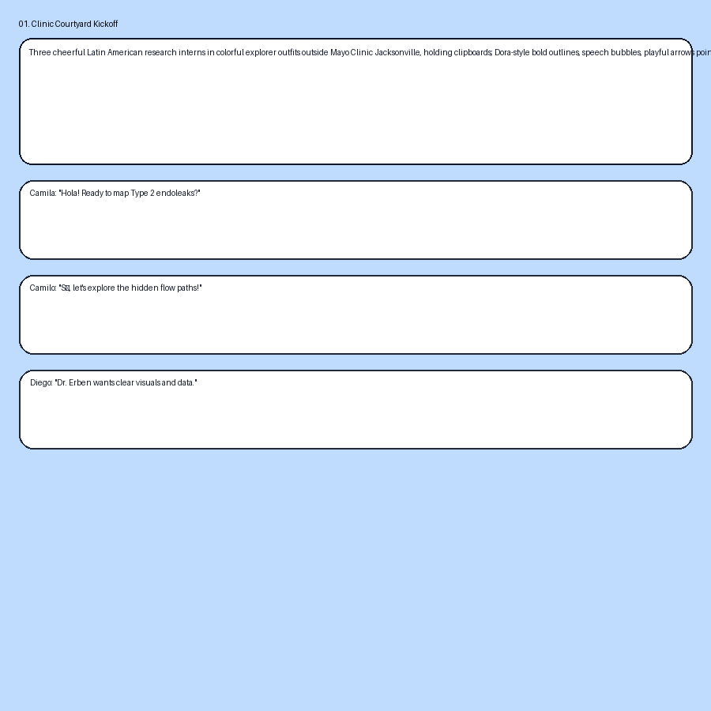
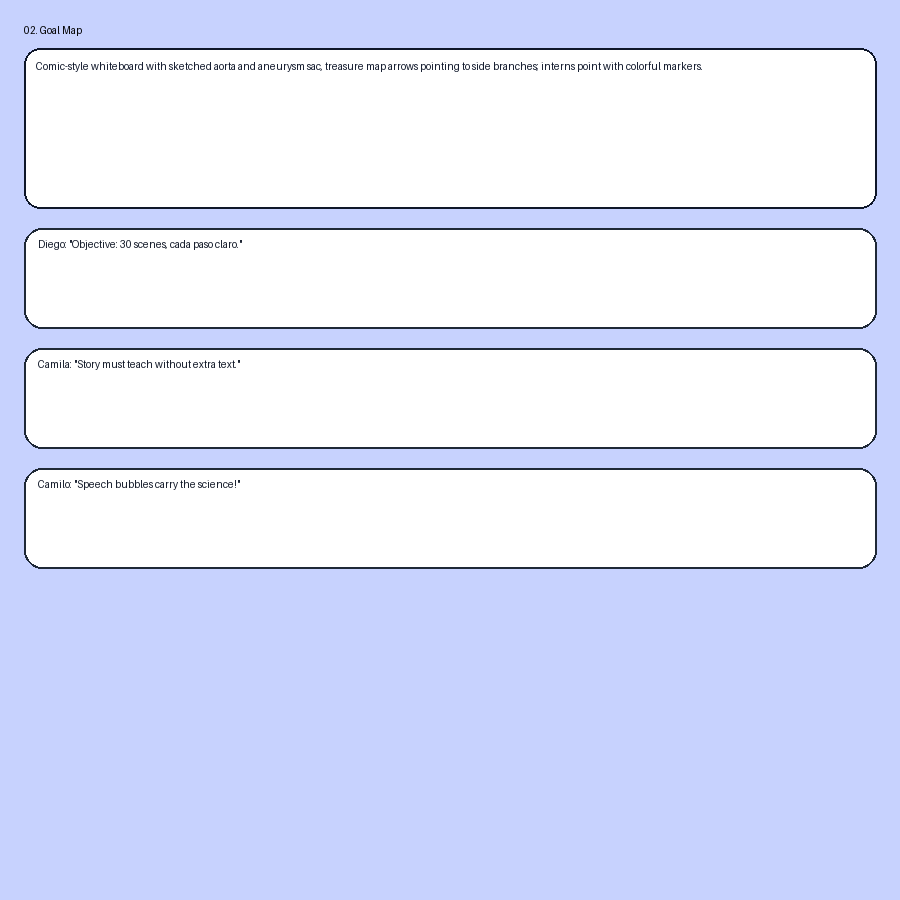

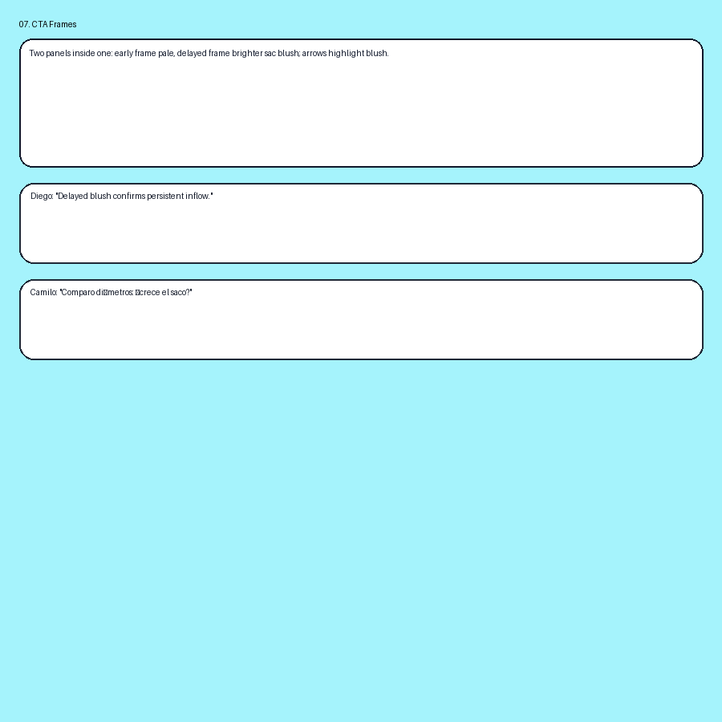

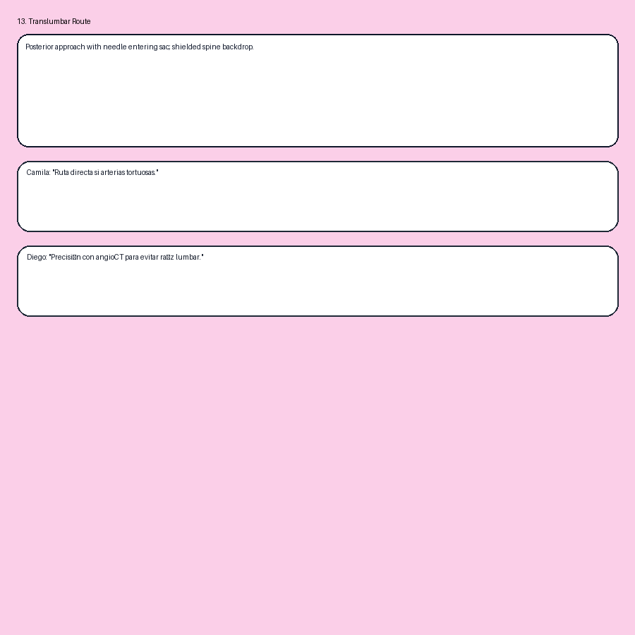
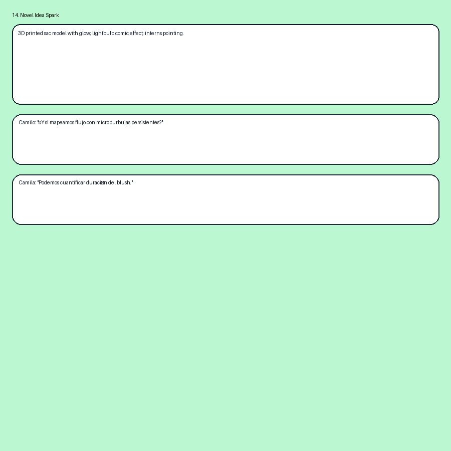

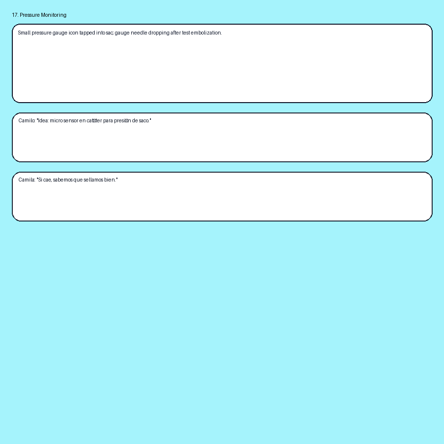
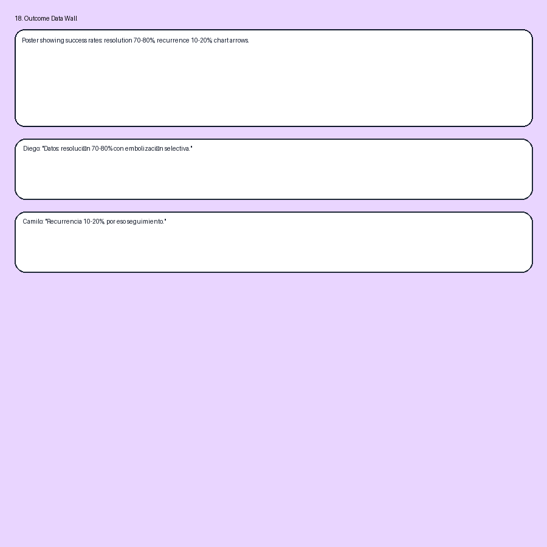

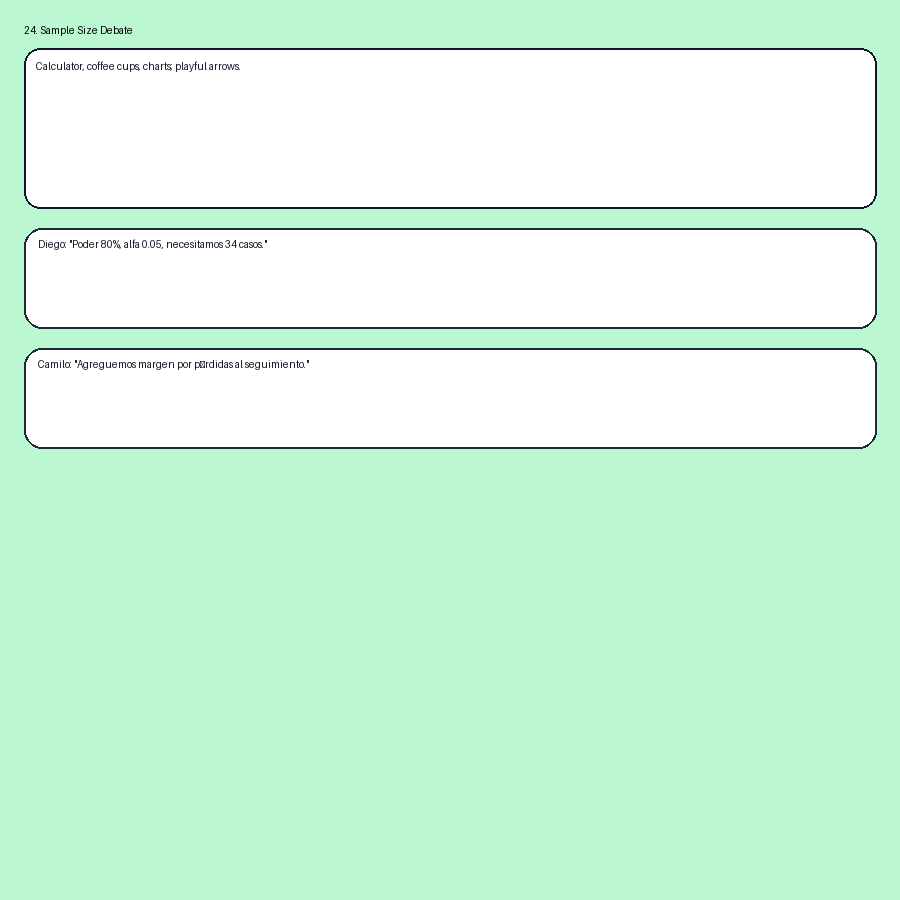

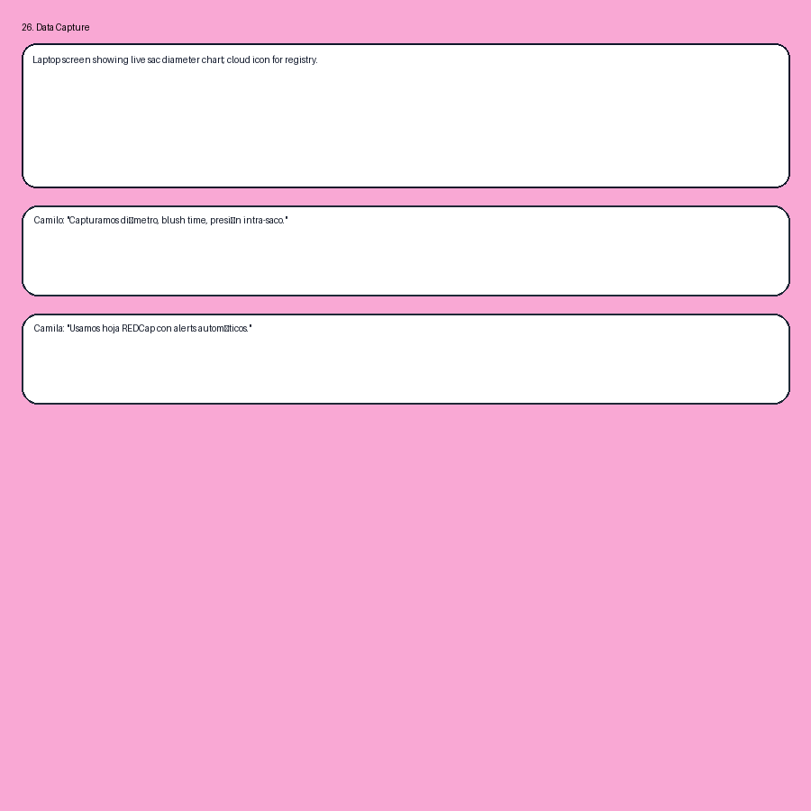
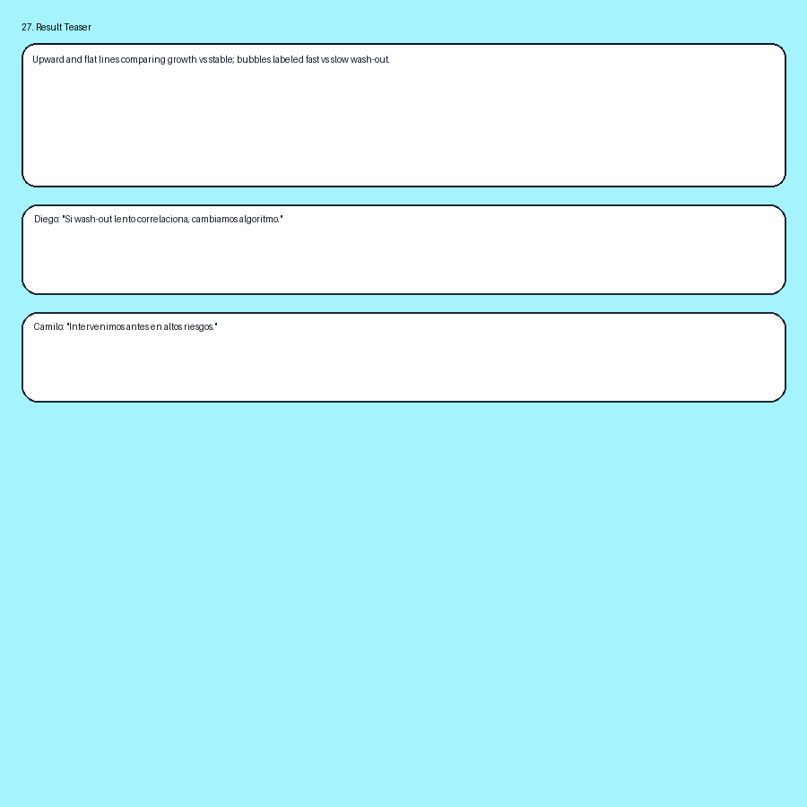
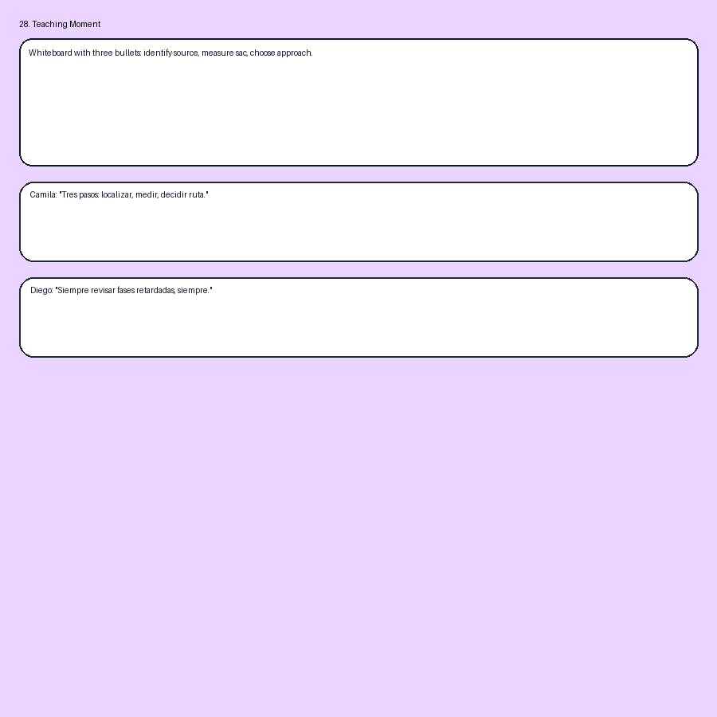

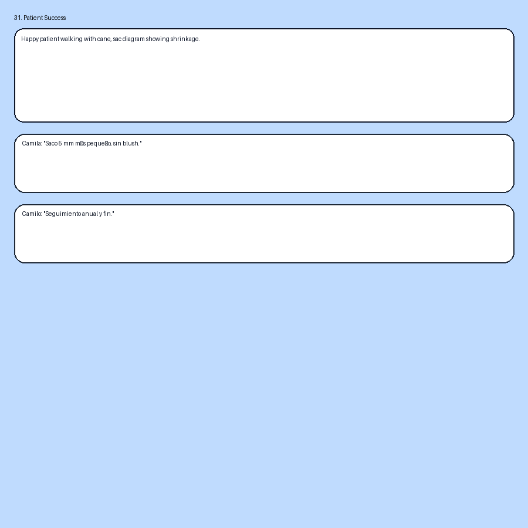

