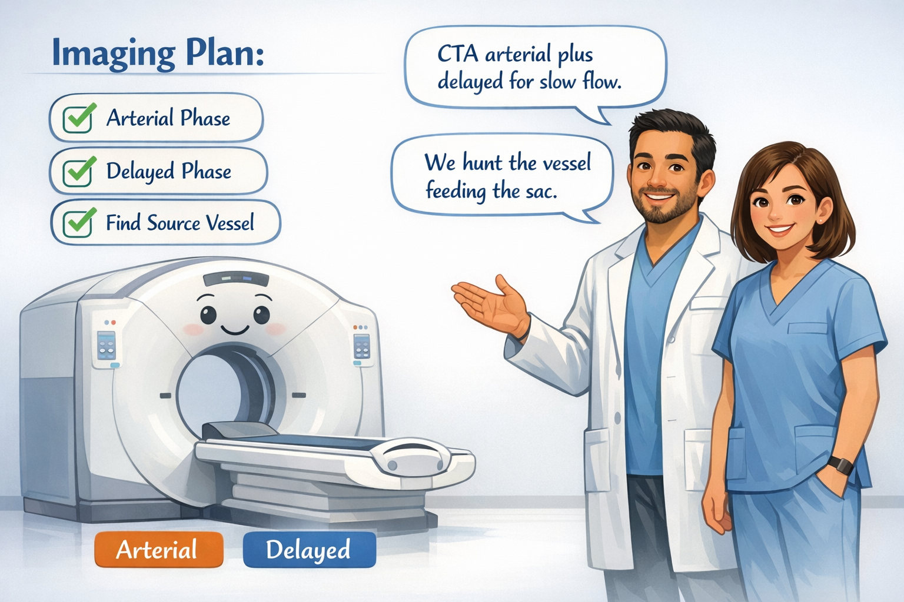
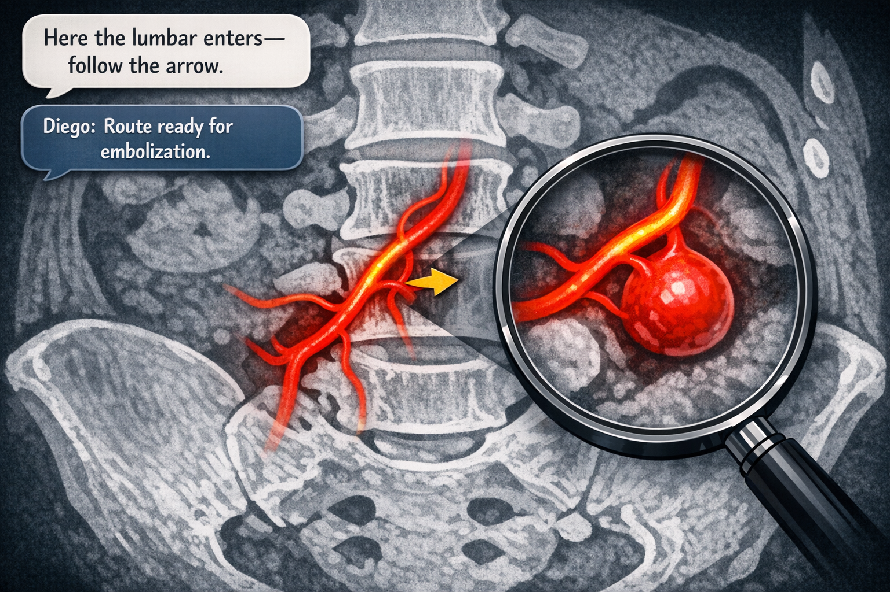
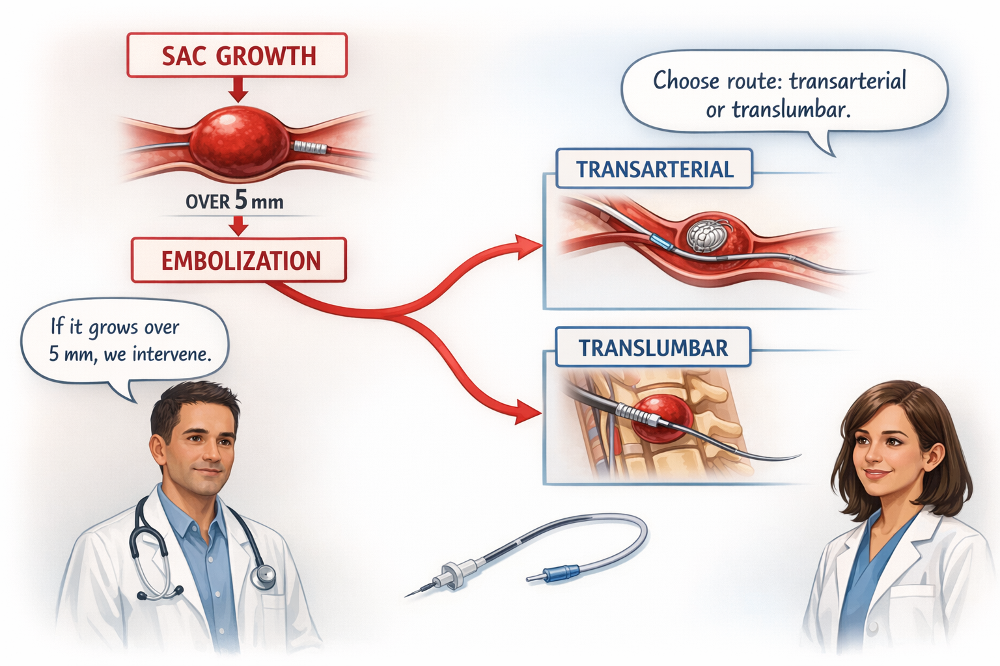
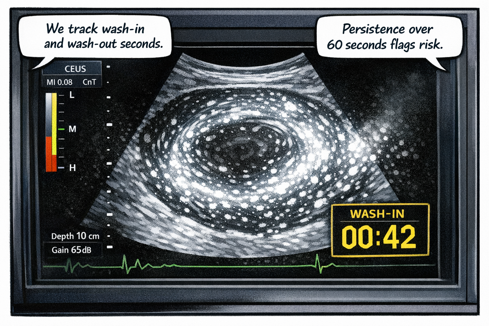
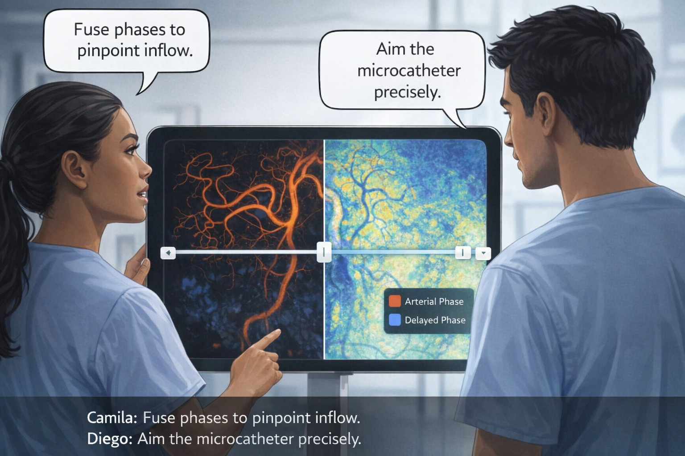
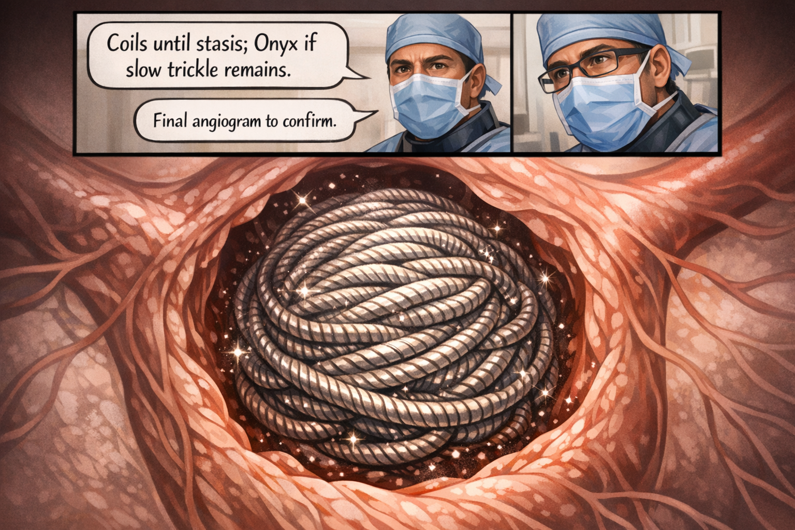
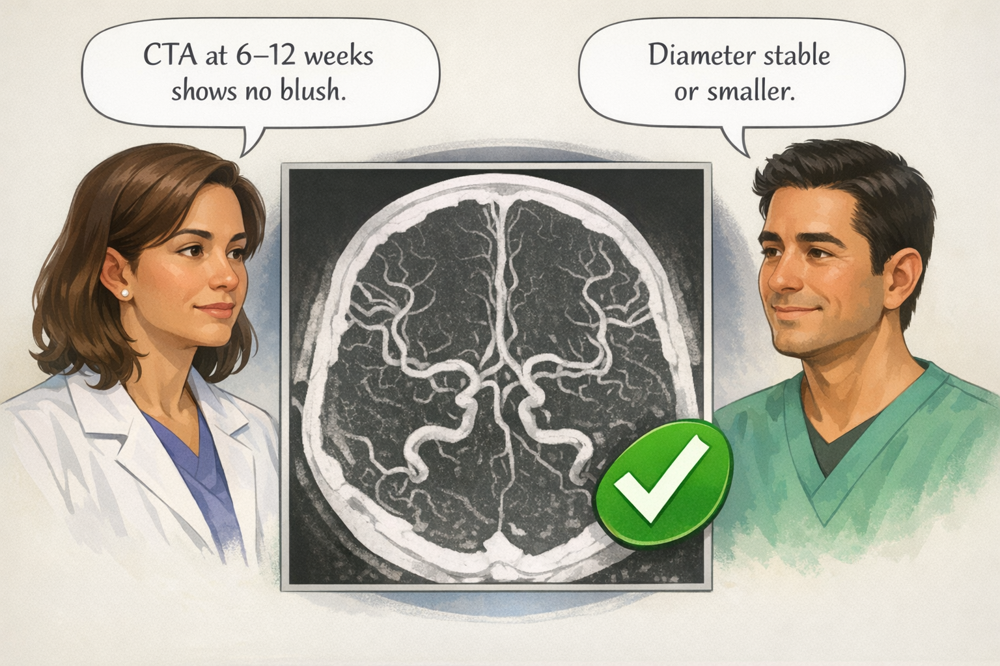
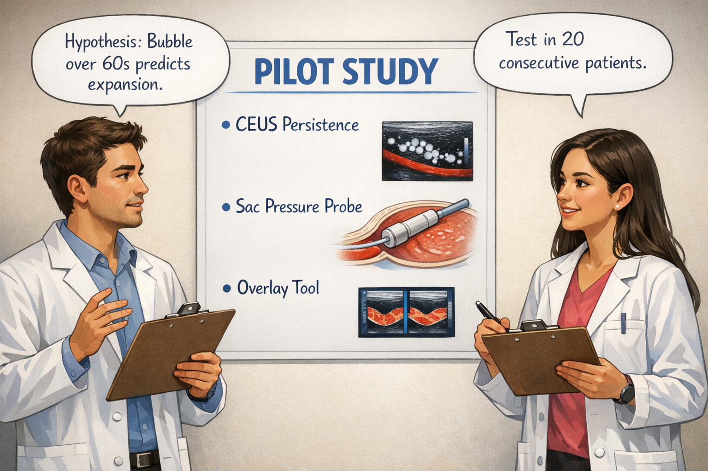
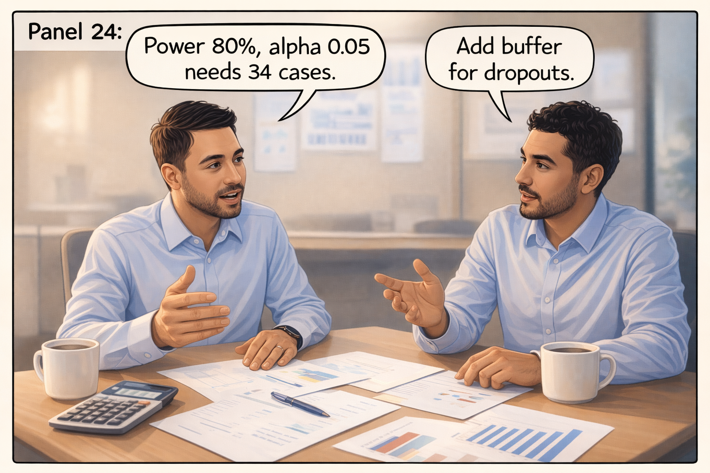

# Type 2 Endoleak Comic

*6-Panel Grid Layout (2 columns × 3 rows per page)*

---

## Page 1 (Panels 1-6)

| | |
|:---:|:---:|
|  |  |
|  |  |
|  |  |

---

## Page 2 (Panels 7-12)

| | |
|:---:|:---:|
|  |  |
|  |  |
|  |  |

---

## Page 3 (Panels 13-18)

| | |
|:---:|:---:|
|  |  |
|  |  |
|  |  |

---

## Page 4 (Panels 19-24)

| | |
|:---:|:---:|
|  |  |
|  |  |
|  |  |

---

## Page 5 (Panels 25-30)

| | |
|:---:|:---:|
|  |  |
|  |  |
|  |  |

---

## Page 6 (Panels 31-32)

| | |
|:---:|:---:|
|  |  |

---

**Document Metadata:**
- **Version**: 1.1
- **Format**: 6-panel grid layout (2×3 per page)
- **Reading order**: Left to right, top to bottom
- **Source**: Type 2 Endoleak Comic panels (32 panels)
- **License**: CC-BY-4.0
