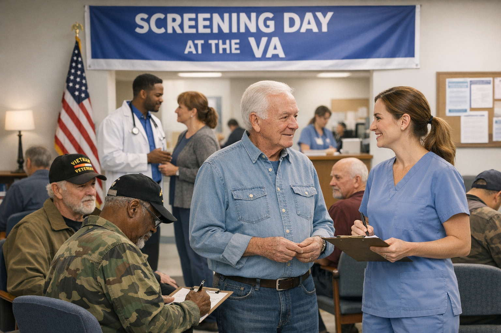
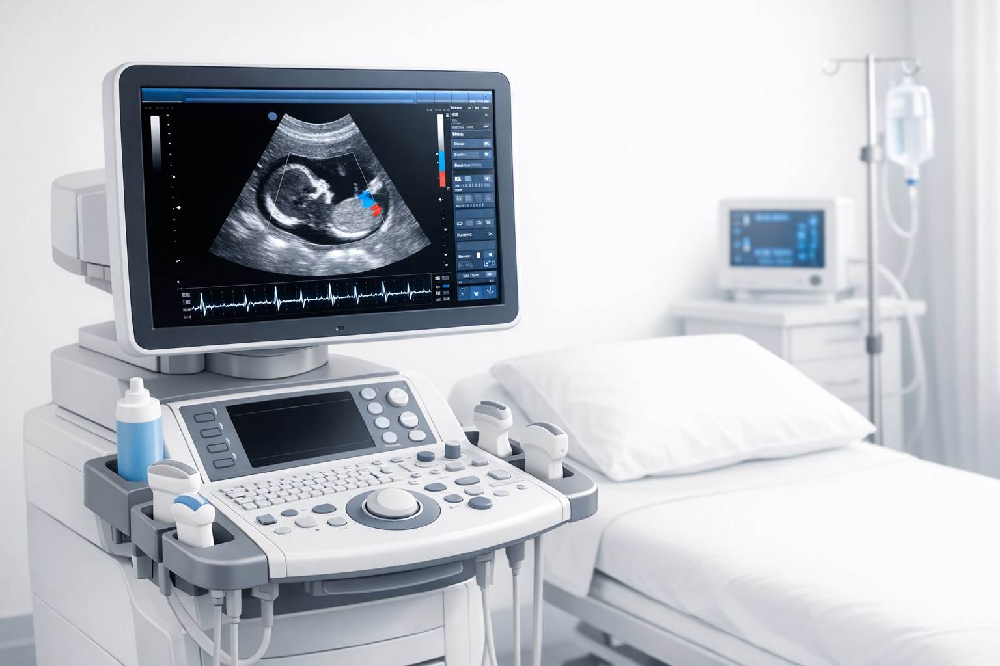

# Medical Educational Comic

## Continuous Story View

Read through the complete story from beginning to end with all panels in sequence.

---

### Panel 1

**Dialogue**: [{'speaker': 'Camila', 'text': 'Mrs. Chen! Welcome to your free AAA screening!'}, {'speaker': 'Mrs. Chen', 'text': 'My doctor said all veterans over 65 should get this. What are we looking for?'}, {'speaker': 'Camila', 'text': 'We check your abdominal aorta - the big artery in your belly. Sometimes it can enlarge like a balloon!'}]

---

### Panel 2

**Dialogue**: [{'speaker': 'Camila', 'text': '(looking at screen) Hmm... Mrs. Chen, I need to measure this carefully...'}, {'speaker': 'Mrs. Chen', 'text': 'Is something wrong? I feel fine!'}, {'speaker': 'Camila', 'text': "That's actually common with aneurysms. Let me get my attending to look at this."}]

---

### Panel 3

**Dialogue**: [{'speaker': 'Camila', 'text': 'Team! I found a 6.2 cm AAA on screening. We need to move fast!'}, {'speaker': 'Camilo', 'text': "6.2?! That's well above surgical threshold. Need CT angio NOW."}, {'speaker': 'Diego', 'text': "I'll prep the patient for imaging. This could rupture any time!"}]

---

### Panel 4

**Dialogue**: [{'speaker': 'Dr. Erben', 'text': 'Great catch, Camila! AAAs are silent killers. Most patients have no symptoms until...'}, {'speaker': 'Diego', 'text': "Until they rupture! Then it's catastrophic bleeding."}, {'speaker': 'Dr. Erben', 'text': "Exactly. Our job: Fix it before it ruptures. But HOW we fix it - that's the art."}]

---

### Panel 5

**Dialogue**: [{'speaker': 'Camilo', 'text': "CTA is back! Let's see the anatomy... Measuring the neck..."}, {'speaker': 'Camila', 'text': 'What are we looking for?'}, {'speaker': 'Camilo', 'text': 'Neck length, angulation, iliac access - determines if we can do EVAR or need open repair.'}]

---

### Panel 6

**Dialogue**: [{'speaker': 'Camilo', 'text': 'Neck length is 15mm - barely adequate. Angle is 45° - acceptable.'}, {'speaker': 'Dr. Erben', 'text': "Iliacs look okay for access. She's a borderline EVAR candidate."}, {'speaker': 'Diego', 'text': 'What about open repair?'}, {'speaker': 'Dr. Erben', 'text': "Higher short-term risk, but more durable. Let's discuss with Mrs. Chen."}]

---

### Panel 7

**Dialogue**: [{'speaker': 'Camila', 'text': 'Mrs. Chen, your aorta has bulged like a weak spot in a garden hose.'}, {'speaker': 'Mrs. Chen', 'text': 'And it could burst?'}, {'speaker': 'Dr. Erben', 'text': 'Yes. We can fix it two ways: through small groin incisions, or one big belly incision.'}]

---

### Panel 8

**Dialogue**: [{'speaker': 'Mrs. Chen', 'text': "Doctor, I survived the Korean War. I want to be tough, but... I'm 73 now."}, {'speaker': 'Mrs. Chen', 'text': 'Can we try the minimally invasive way? I want to recover fast for my grandkids.'}, {'speaker': 'Dr. Erben', 'text': "EVAR it is. We'll monitor you closely. Surgery scheduled for tomorrow!"}]

---

### Panel 9

**Dialogue**: [{'speaker': 'Dr. Erben', 'text': "Let's plan the EVAR. Diego, what endograft size do we need?"}, {'speaker': 'Diego', 'text': 'Main body: 28mm diameter, 150mm length. Limbs: 14mm bilateral.'}, {'speaker': 'Camilo', 'text': 'Neck is our challenge - only 15mm. Need good seal or we get Type 1a endoleak.'}]

---

### Panel 10

**Dialogue**: [{'speaker': 'Diego', 'text': "Here's our endograft - it's like a fabric-covered stent that lines the aneurysm."}, {'speaker': 'Camila', 'text': 'So it redirects blood flow INSIDE this tube, excluding the aneurysm sac?'}, {'speaker': 'Diego', 'text': 'Exactly! The aneurysm shrinks over time when blood pressure is off it.'}]

---

### Panel 11

**Dialogue**: [{'speaker': 'Anesthesiologist', 'text': "Mrs. Chen, we'll use general anesthesia for the EVAR. You'll be completely asleep."}, {'speaker': 'Mrs. Chen', 'text': 'Will I feel anything after?'}, {'speaker': 'Camila', 'text': 'Much less pain than open surgery! Most EVAR patients go home in 1-2 days.'}]

---

### Panel 12

**Dialogue**: [{'speaker': 'Dr. Erben', 'text': 'Everyone, this is a hybrid OR - combines surgery with real-time imaging.'}, {'speaker': 'Diego', 'text': 'That C-arm gives us live X-ray to guide the endograft!'}, {'speaker': 'Camilo', 'text': "Amazing! It's like GPS for the inside of the aorta."}]

---

### Panel 13

**Dialogue**: [{'speaker': 'Dr. Erben', 'text': 'Diego, isolate the common femoral arteries bilaterally. Need good exposure.'}, {'speaker': 'Diego', 'text': 'Right femoral exposed... Now left... Got them both!'}, {'speaker': 'Dr. Erben', 'text': 'Good. Pursestring sutures in place. Time to introduce our wires.'}]

---

### Panel 14

**Dialogue**: [{'speaker': 'Dr. Erben', 'text': 'Stiff wire advancing... through the aneurysm sac... past the renal arteries...'}, {'speaker': 'Camilo', 'text': 'Perfect position on fluoro! Wire tip is in the thoracic aorta.'}, {'speaker': 'Dr. Erben', 'text': 'Now the critical part - positioning the main body endograft.'}]

---

### Panel 15

**Dialogue**: [{'speaker': 'Dr. Erben', 'text': 'Main body advanced over wire... Positioned below renals... Everyone ready?'}, {'speaker': 'Camilo', 'text': 'Fluoro confirms position - looks perfect!'}, {'speaker': 'Dr. Erben', 'text': 'Deploying main body... NOW!'}, {'speaker': 'Diego', 'text': "It's opening! Beautiful deployment!"}]

---

### Panel 16

**Dialogue**: [{'speaker': 'Dr. Erben', 'text': 'Now the tricky part - cannulating the contralateral gate from the left side.'}, {'speaker': 'Diego', 'text': 'Catheter advancing... angling up... got it! Wire through the gate!'}, {'speaker': 'Dr. Erben', 'text': 'Excellent! Now deploy the left limb.'}]

---

### Panel 17

**Dialogue**: [{'speaker': 'Dr. Erben', 'text': "Inject contrast - let's see how we did..."}, {'speaker': 'Camilo', 'text': 'Watching the fluoro... Flow looks good through the graft...'}, {'speaker': 'Camilo', 'text': 'Wait - I see contrast outside the graft at the proximal neck!'}]

---

### Panel 18

**Dialogue**: [{'speaker': 'Dr. Erben', 'text': "That's a Type 1a endoleak - blood flowing between graft and neck. This is serious."}, {'speaker': 'Diego', 'text': 'What does that mean?'}, {'speaker': 'Dr. Erben', 'text': 'Aneurysm sac still under pressure - could rupture! We need to fix this NOW.'}]

---

### Panel 19

**Dialogue**: [{'speaker': 'Dr. Erben', 'text': "Let's try balloon molding first. Diego, advance the compliant balloon."}, {'speaker': 'Diego', 'text': 'Balloon positioned at the proximal neck... Inflating...'}, {'speaker': 'Dr. Erben', 'text': 'Gently! We want to mold the graft to the aortic wall, not rupture the neck.'}]

---

### Panel 20

**Dialogue**: [{'speaker': 'Dr. Erben', 'text': 'Deflating balloon... Now repeat the angiogram...'}, {'speaker': 'Camilo', 'text': 'Injecting contrast... Watching...'}, {'speaker': 'Camilo', 'text': 'No leak! Seal looks perfect now!'}, {'speaker': 'Dr. Erben', 'text': 'Excellent! Aneurysm sac is excluded. Crisis averted.'}]

---

### Panel 21

**Dialogue**: [{'speaker': 'Dr. Erben', 'text': 'Diego, close the arteriotomies carefully. These need to heal perfectly.'}, {'speaker': 'Diego', 'text': 'Prolene suture closing right femoral... Now left...'}, {'speaker': 'Dr. Erben', 'text': 'Good. Total procedure time: 2 hours. Not bad for a complex case!'}]

---

### Panel 22

**Dialogue**: [{'speaker': 'Mrs. Chen', 'text': '(groggily) Is... is it over?'}, {'speaker': 'Camila', 'text': 'Yes! Your aneurysm is fixed! How do you feel?'}, {'speaker': 'Mrs. Chen', 'text': 'Surprisingly good! Just some groin soreness. When can I go home?'}, {'speaker': 'Dr. Erben', 'text': "If all goes well, tomorrow! But you'll need regular imaging check-ups."}]

---

### Panel 23

**Dialogue**: [{'speaker': 'Camila', 'text': 'Great job walking! How does it feel compared to big surgery?'}, {'speaker': 'Mrs. Chen', 'text': 'My neighbor had open AAA repair - he was in the hospital for a week! I feel pretty good!'}, {'speaker': 'Diego', 'text': "That's the advantage of EVAR - faster recovery. But remember, you'll need lifelong surveillance."}]

---

### Panel 24

**Dialogue**: [{'speaker': 'Camilo', 'text': "Mrs. Chen, here's your follow-up schedule: CT scan at 1 month, 6 months, 1 year, then yearly."}, {'speaker': 'Mrs. Chen', 'text': 'Why so many scans?'}, {'speaker': 'Camila', 'text': "We're watching for endoleaks - blood leaking back into the aneurysm sac. If that happens, we fix it!"}]

---

### Panel 25

**Dialogue**: [{'speaker': 'Camilo', 'text': "Mrs. Chen's 1-month CTA is back! Let's review..."}, {'speaker': 'Camila', 'text': 'How does the seal look?'}, {'speaker': 'Camilo', 'text': 'Perfect! No endoleak. Aneurysm sac has already shrunk from 6.2 to 5.8 cm!'}]

---

### Panel 26

**Dialogue**: [{'speaker': 'Mrs. Chen', 'text': 'Camila! Look who I brought to my checkup!'}, {'speaker': 'Grandchild', 'text': 'Grandma says you saved her life!'}, {'speaker': 'Camila', 'text': "We caught it early because she came for screening. That's the key!"}]

---

### Panel 27

**Dialogue**: [{'speaker': 'Dr. Erben', 'text': "Let's discuss the EVAR trials. What did EVAR-1 and DREAM show?"}, {'speaker': 'Diego', 'text': 'Lower 30-day mortality with EVAR, but long-term outcomes similar to open repair.'}, {'speaker': 'Camilo', 'text': 'And EVAR requires reinterventions - about 20% by 5 years.'}, {'speaker': 'Dr. Erben', 'text': 'Right. Trade-offs: lower early risk vs need for surveillance and reinterventions.'}]

---

### Panel 28

**Dialogue**: [{'speaker': 'Dr. Erben', 'text': "We saw a Type 1a endoleak in Mrs. Chen's case. Let's review all five types."}, {'speaker': 'Camila', 'text': 'Type 1 is seal failure - Type 1a at proximal neck, Type 1b at distal seal.'}, {'speaker': 'Diego', 'text': 'Type 2 is from branch vessels - like lumbar or IMA.'}, {'speaker': 'Camilo', 'text': 'Type 3 is graft failure. Type 4 is graft porosity. Type 5 is endotension - pressure with no visible leak!'}]

---

### Panel 29

**Dialogue**: [{'speaker': 'Camila', 'text': 'Free AAA screening today! Quick ultrasound, could save your life!'}, {'speaker': 'Community member', 'text': "I'm 72 and smoked for 40 years. Should I get screened?"}, {'speaker': 'Diego', 'text': "Absolutely! You're exactly who we want to screen. It takes 5 minutes!"}]

---

### Panel 30

**Dialogue**: [{'speaker': 'Camila', 'text': 'Ruptured AAA has 80-90% mortality. But elective repair? Only 1-5% mortality!'}, {'speaker': 'Student', 'text': 'So screening really works?'}, {'speaker': 'Camila', 'text': 'Yes! Studies show AAA screening reduces AAA-related deaths by 40-50% in screened populations!'}]

---

### Panel 31

**Dialogue**: [{'speaker': 'Diego', 'text': 'This case taught me that surgery is just the beginning. Lifelong surveillance is part of EVAR.'}, {'speaker': 'Camilo', 'text': 'And complications can happen - like that Type 1a endoleak. Good thing we caught it intraoperatively!'}, {'speaker': 'Camila', 'text': "The real win? Mrs. Chen came for screening. Prevention and early detection - that's the future!"}]

---

### Panel 32

**Dialogue**: [{'speaker': 'Camila', 'text': '(looking at pager) Uh oh. Code Vascular - ER!'}, {'speaker': 'Diego', 'text': 'What is it?'}, {'speaker': 'Camila', 'text': "55-year-old woman with sudden 'dead leg' - painful, pale, pulseless!"}, {'speaker': 'Camilo', 'text': "Acute limb ischemia! We need to move NOW! Let's go team!"}]

---

### Panel 33

---

### Panel 34

---

### Panel 35

---

### Panel 36

---

### Panel 38

---
