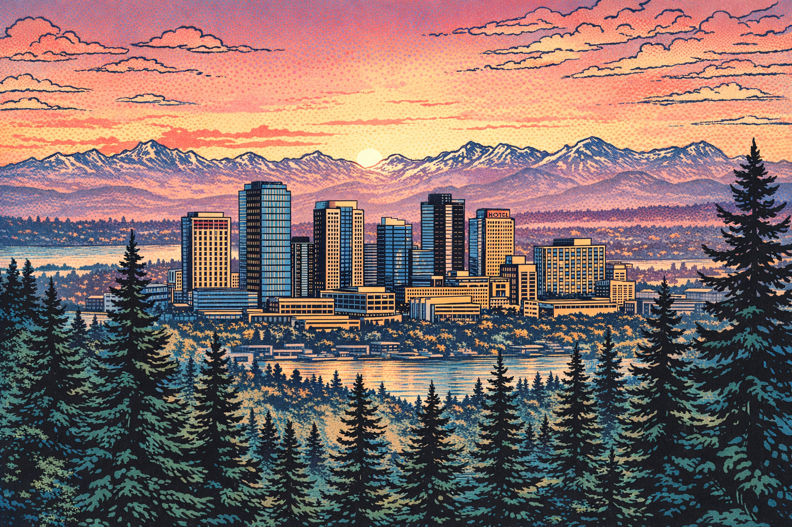
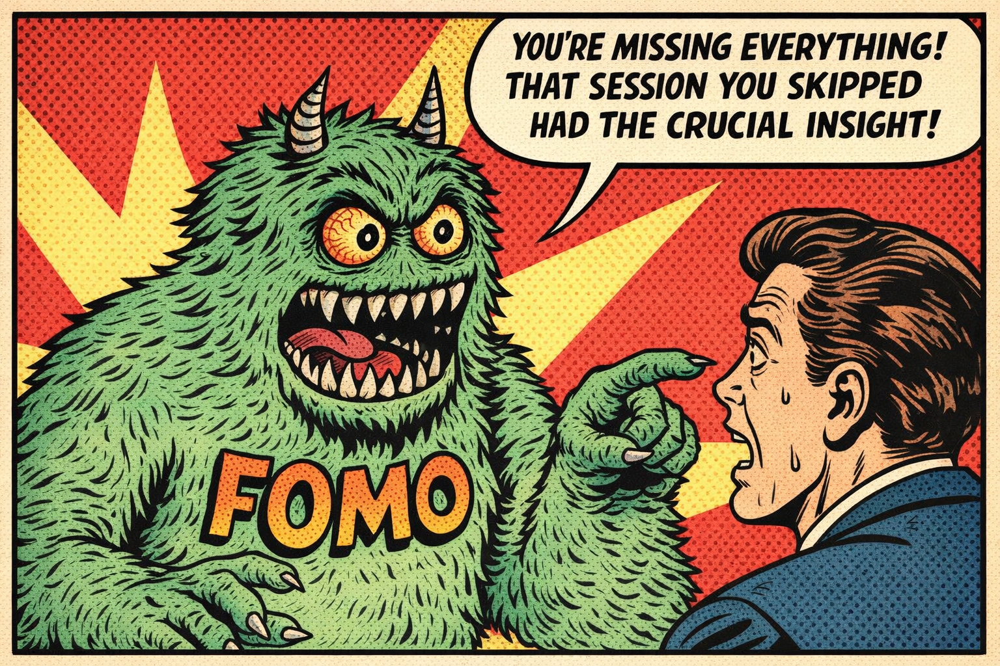
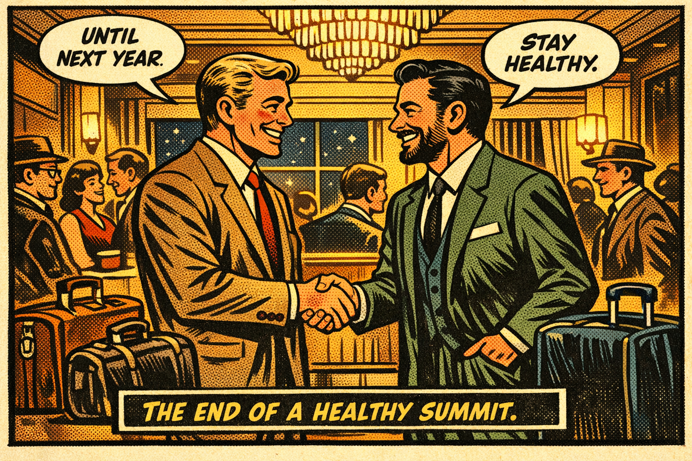

# Healthy Microsoft MVP Summit Comic

> **Four versions of an educational comic about staying healthy at the Microsoft MVP Summit**
> 
> **Style**: 1950s American Comic Book (bold lines, Ben-Day dots, vintage colors)
> **Characters**: Andreas Erben (Microsoft MVP) & Marco Casalaina (Microsoft VP)
> **Theme**: Conference health, wellness, and sustainable engagement

---

## Overview

This project implements [Issue #47](https://github.com/MSDNAndi/WorldSMEGraphs/issues/47) - creating a comic story about the Microsoft MVP Summit focused on health and wellness.

### Story Versions

| Version | Title | Panels | Theme |
|---------|-------|--------|-------|
| **Version 1** | Two Days in Redmond | 48 | Traditional two-day summit journey |
| **Version 2** | Dawn to Dusk | 46 | Single day with mindfulness focus |
| **Version 3** | Survival Handbook | 44 | Educational with flashbacks and infographics |
| **Version 4** | Campus Wisdom | 45-50 | Walking campus tour with 10 AKU topics |

---

## Quick View Links

### Version 1: Two Days in Redmond
- [📖 Continuous Story View](version-1/comic/continuous-story-view.md)
- [🖼️ Pictures Only View](version-1/comic/pictures-only-view.md)
- [📝 Full Narrative](version-1/story-development/02-narrative.md)

### Version 2: Dawn to Dusk
- [📖 Continuous Story View](version-2/comic/continuous-story-view.md)
- [🖼️ Pictures Only View](version-2/comic/pictures-only-view.md)
- [📝 Full Narrative](version-2/story-development/02-narrative.md)

### Version 3: The Summit Survival Handbook
- [📖 Continuous Story View](version-3/comic/continuous-story-view.md)
- [🖼️ Pictures Only View](version-3/comic/pictures-only-view.md)
- [📝 Full Narrative](version-3/story-development/02-narrative.md)

### Version 4: Campus Wisdom (NEW)
- [📖 Version Overview](version-4/README.md) - Summary and next steps
- [📝 Story Idea](version-4/story-development/01-story-idea.md) - Complete story outline
- [📝 Full Narrative](version-4/story-development/02-narrative.md) - Flowing prose story (~2,450 words)
- [📝 Panel Planning](version-4/story-development/03-panel-planning.md) - 48-panel scene-by-scene breakdown
- [📋 Image Prompts](version-4/comic/prompts-single-line.txt) - 48 single-line prompts ready for generation
- *Images coming soon after generation*

### Quick Reference
- [💡 Health Tips Reference](health-tips-reference.md) - All health strategies in one document

---

## Educational Content

All four versions cover essential health topics for conference attendees:

### Physical Health
- 💧 **Hydration** - Water intake strategies
- 🍎 **Nutrition** - Healthy food choices at buffets
- 🚶 **Movement** - Breaking up sitting time
- 👁️ **Eye Care** - Screen fatigue and the 20-20-20 rule
- 🧘 **Posture** - Sitting properly in sessions

### Mental Health
- 😴 **Sleep** - Jet lag management and hotel sleep
- 🔋 **Social Energy** - Introvert/extrovert balance
- 🧠 **Decision Fatigue** - Pre-planning to save energy
- 😰 **FOMO** - Managing fear of missing out

### Conference Strategy
- ☕ **Caffeine** - Strategic coffee consumption
- 🍷 **Alcohol** - Moderation at social events
- 💤 **Power Naps** - Afternoon recovery techniques
- 🤝 **Networking** - Quality over quantity

---

## Characters

### Andreas Erben
- **Role**: Long-time Microsoft MVP, conference veteran
- **Visual**: German, early 50s, grey-brown hair, rectangular glasses, blue blazer
- **Personality**: Warm, experienced, genuinely helpful
- **Dialogue Style**: Practical wisdom from experience

### Marco Casalaina
- **Role**: Microsoft VP, fact-checker with inside knowledge
- **Visual**: Italian-American, late 40s, dark hair, short beard, Microsoft polo
- **Personality**: Slightly snarky but supportive, knows campus secrets
- **Dialogue Style**: Data-driven, gentle corrections, playful teasing

See [Character Descriptions](character-descriptions.md) for full visual specifications.

---

## Directory Structure

```
healthy-mvp-summit/
├── README.md                    # This file
├── character-descriptions.md   # Visual specifications for characters
├── version-1/
│   ├── story-development/
│   │   ├── 01-story-idea.md
│   │   ├── 02-narrative.md      # Full prose story
│   │   └── 03-panel-planning.md
│   └── comic/
│       ├── prompts-single-line.txt
│       ├── panels-gpt/          # 48 generated images
│       ├── continuous-story-view.md
│       └── pictures-only-view.md
├── version-2/
│   └── [same structure - 46 images]
├── version-3/
│   └── [same structure - 44 images]
└── version-4/
    ├── README.md                # Version overview and next steps
    ├── story-development/
    │   ├── 01-story-idea.md     # Story outline
    │   ├── 02-narrative.md      # Full prose story
    │   └── 03-panel-planning.md # 48-panel breakdown
    └── comic/
        └── prompts-single-line.txt  # 48 image generation prompts
```

---

## Technical Details

### Image Generation
- **Tool**: GPT Image 1.5 via Azure AI Foundry
- **Style**: 1950s American comic book (bold outlines, Ben-Day dots)
- **Format**: PNG, landscape orientation
- **Quality**: High
- **Parallel Processing**: 8 concurrent generations

### Workflow
1. Story idea development (no panels)
2. Full narrative writing (flowing prose)
3. Panel planning (scene-to-panel mapping)
4. Prompt engineering (detailed single-line prompts)
5. Parallel image generation
6. Viewing file creation

---

## Related Resources

- [Issue #47](https://github.com/MSDNAndi/WorldSMEGraphs/issues/47) - Original issue
- [PR #44](https://github.com/MSDNAndi/WorldSMEGraphs/pull/44) - Reference comic generation workflow
- [Comic Story Workflow](../../.project/agents/image-generation/COMIC-STORY-WORKFLOW.md) - Story-first process guide

---

## Sample Gallery

Here are some highlights from across the three versions:

### Opening Scene - Bellevue at Dawn (V1, Panel 1)

*The Pacific Northwest skyline at dawn, setting the scene for the summit*

### Strategic Positioning - Conference Hall (V2, Panel 15)

*Andreas scanning the auditorium for optimal seating at 8:00 AM*

### The FOMO Monster (V3, Panel 25)

*A humorous personification of Fear Of Missing Out*

### The Healthy Farewell (V1, Panel 48)

*"Until next year. Stay healthy."*

---

## Statistics

- **Total Images Generated**: 138
- **Version 1**: 48 panels (5,336 words narrative)
- **Version 2**: 46 panels (3,650 words narrative)
- **Version 3**: 44 panels (3,169 words narrative)
- **Total Word Count** (narratives): 12,155 words
- **Total Size**: 1.1 GB

---

*Created: 2026-01-13*
*Style: 1950s American Comic Book*
*Theme: Healthy Conference Attendance*
*Issue: [#47](https://github.com/MSDNAndi/WorldSMEGraphs/issues/47)*
