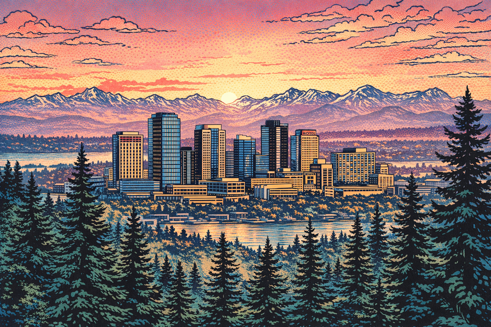
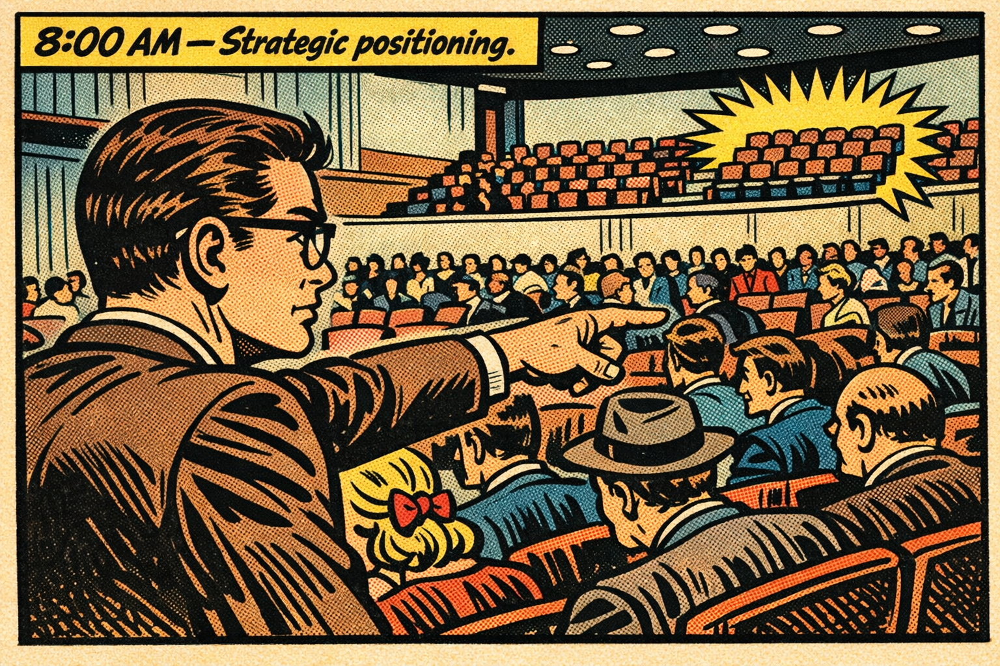
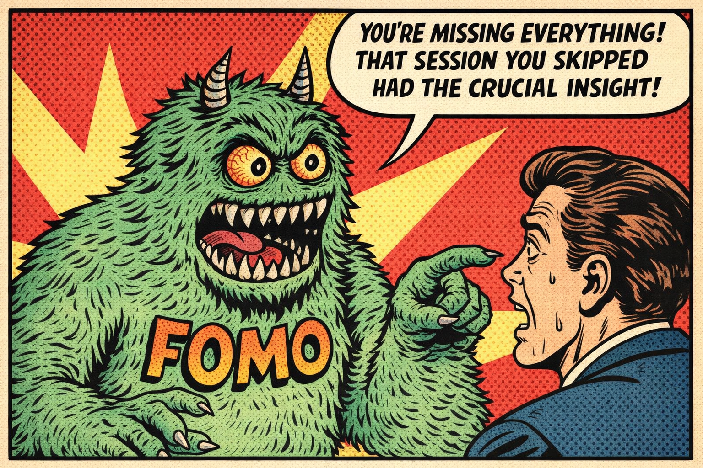
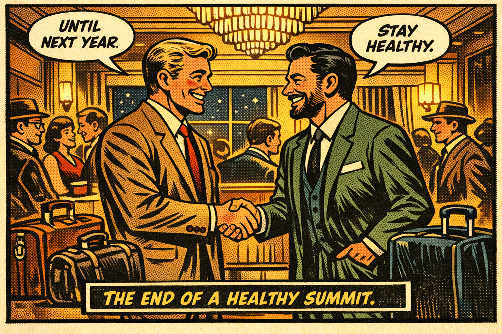
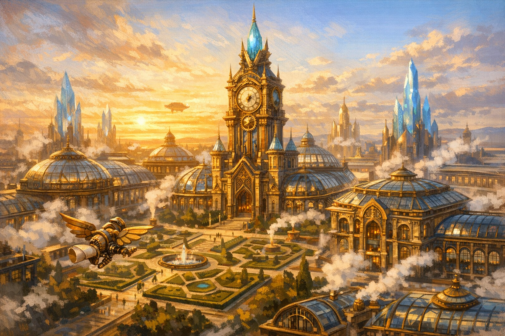
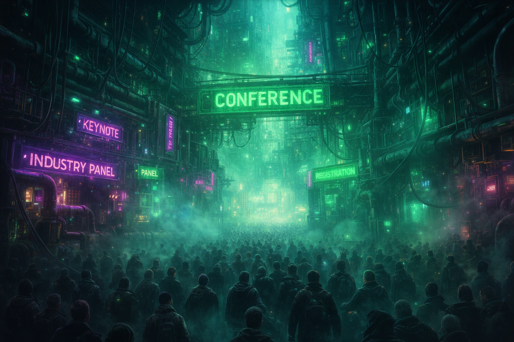

# Healthy Microsoft MVP Summit Comic

> **Expanded comic collection covering health, summit culture, and narrative experiments at the Microsoft MVP Summit**
> 
> **Style**: 1950s American Comic Book (bold lines, Ben-Day dots, vintage colors)
> **Characters**: Andreas Erben (Microsoft MVP) & Marco Casalaina
> **Theme**: Conference health, wellness, and sustainable engagement

---

## Overview

This project implements [Issue #47](https://github.com/MSDNAndi/WorldSMEGraphs/issues/47) - creating a comic story about the Microsoft MVP Summit focused on health and wellness.

### Story Versions

| Version | Title | Panels | Theme |
|---------|-------|--------|-------|
| **Version 1** | Two Days in Redmond | 48 | Traditional two-day summit journey |
| **Version 2** | Dawn to Dusk | 46 | Single day with mindfulness focus |
| **Version 3** | Survival Handbook | 44 | Educational with flashbacks and infographics |
| **Version 4** | Campus Wisdom | 34 | Walking campus tour with 10 AKU topics |
| **Version 5** | The Debugging Human Runtime | 48 | **NERDY** - Body as a computer system (DevOps metaphors) |
| **Version 6** | MVP Summit Survival: Roguelike | 48 | **GAMING** - RPG with health bars, debuffs, skill cooldowns |
| **Version 7** | Science of Summit Optimization | 48 | **DATA** - A/B testing wellness, metrics-driven health |
| **Version 8** | The Wellness Protocol | 48 | Conference wellness journey |
| **Version 9** | Mind Over Summit | 47 | Mental health and mindfulness focus |
| **Version 10** | The Energy Matrix | 46 | Energy management strategies |
| **Version 11** | Summit Sustainability | 44 | Long-term health habits |
| **Version 12** | The Balance Equation | 42 | Work-life balance at conferences |
| **Version 13** | The Multiverse of Wellness | 53 | 🆕 **SCI-FI** - Variant characters from alternate timelines |
| **Version 14** | The Case of the Conference Crasher | 62 | 🆕 **NOIR** - Film noir detective mystery |
| **Version 15** | Summit Safari | 60 | 🆕 **DOCUMENTARY** - Nature documentary parody |
| **Version 16** | The Summit Loop | 62 | 🆕 **TIME LOOP** - Groundhog Day-style repetition |
| **Version 17** | The Summit Recipe | 60 | 🆕 **COOKING** - Cooking show parody with recipes |

### Arcane Style Comics (NEW) ⚡

| Style | Title | Panels | Theme |
|-------|-------|--------|-------|
| **Arcane Style 1** | The Hextech Protocol | 40 | **NEON** - Cyberpunk energy management with hextech UI |
| **Arcane Style 2** | The Piltover Protocol | 40 | **STEAMPUNK** - Victorian inventor wellness engineering |
| **Arcane Style 3** | The Zaun Underground | 40 | **SURVIVAL** - Gritty undercity survival tactics |

---

## Quick View Links

### Version 1: Two Days in Redmond
- [📖 Continuous Story View](version-1/comic/continuous-story-view.md)
- [🖼️ Pictures Only View](version-1/comic/pictures-only-view.md)
- [📚 Comic Book Layout](version-1/comic/comic-book-view.md) (6 panels per page)
- [🌐 Interactive HTML Viewer](version-1/comic/viewer.html) (multiple layouts)
- [📝 Full Narrative](version-1/story-development/02-narrative.md)

### Version 2: Dawn to Dusk
- [📖 Continuous Story View](version-2/comic/continuous-story-view.md)
- [🖼️ Pictures Only View](version-2/comic/pictures-only-view.md)
- [📚 Comic Book Layout](version-2/comic/comic-book-view.md) (6 panels per page)
- [🌐 Interactive HTML Viewer](version-2/comic/viewer.html) (multiple layouts)
- [📝 Full Narrative](version-2/story-development/02-narrative.md)

### Version 3: The Summit Survival Handbook
- [📖 Continuous Story View](version-3/comic/continuous-story-view.md)
- [🖼️ Pictures Only View](version-3/comic/pictures-only-view.md)
- [📚 Comic Book Layout](version-3/comic/comic-book-view.md) (6 panels per page)
- [🌐 Interactive HTML Viewer](version-3/comic/viewer.html) (multiple layouts)
- [📝 Full Narrative](version-3/story-development/02-narrative.md)

### Version 4: Campus Wisdom
- [🖼️ Pictures Only View](version-4/comic/pictures-only-view.md) (34 panels)
- [📚 Comic Book Layout](version-4/comic/comic-book-view.md) (6 panels per page)
- [🌐 Interactive HTML Viewer](version-4/comic/viewer.html) (multiple layouts)
- [📝 Story Idea](version-4/story-development/01-story-idea.md) - Complete story outline

### Version 5: The Debugging Human Runtime 🆕 NERDY
- [🖼️ Pictures Only View](version-5/comic/pictures-only-view.md) (48 panels)
- [📚 Comic Book Layout](version-5/comic/comic-book-view.md) (6 panels per page)
- [🌐 Interactive HTML Viewer](version-5/comic/viewer.html) (multiple layouts)
- [📝 Story Idea](version-5/story-development/01-story-idea.md) - DevOps metaphors for health
- **Theme**: Body as computer system—thermal throttling, garbage collection, CPU exhaustion

### Version 6: MVP Summit Survival: Roguelike 🆕 GAMING
- [🖼️ Pictures Only View](version-6/comic/pictures-only-view.md) (48 panels)
- [📚 Comic Book Layout](version-6/comic/comic-book-view.md) (6 panels per page)
- [🌐 Interactive HTML Viewer](version-6/comic/viewer.html) (multiple layouts)
- [📝 Story Idea](version-6/story-development/01-story-idea.md) - RPG mechanics for wellness
- **Theme**: Life as roguelike—debuffs, skill cooldowns, boss encounters, loot

### Version 7: Science of Summit Optimization 🆕 DATA
- [🖼️ Pictures Only View](version-7/comic/pictures-only-view.md) (48 panels)
- [📚 Comic Book Layout](version-7/comic/comic-book-view.md) (6 panels per page)
- [🌐 Interactive HTML Viewer](version-7/comic/viewer.html) (multiple layouts)
- [📝 Story Idea](version-7/story-development/01-story-idea.md) - Data science approach
- **Theme**: A/B testing wellness—correlation analysis, ROI calculations, metrics dashboards

### Versions 8-12: Additional Stories
- [🖼️ Version 8 Pictures](version-8/comic/pictures-only-view.md) | [📚 Comic](version-8/comic/comic-book-view.md) | [🌐 HTML](version-8/comic/viewer.html) (48 panels)
- [🖼️ Version 9 Pictures](version-9/comic/pictures-only-view.md) | [📚 Comic](version-9/comic/comic-book-view.md) | [🌐 HTML](version-9/comic/viewer.html) (47 panels)
- [🖼️ Version 10 Pictures](version-10/comic/pictures-only-view.md) | [📚 Comic](version-10/comic/comic-book-view.md) | [🌐 HTML](version-10/comic/viewer.html) (46 panels)
- [🖼️ Version 11 Pictures](version-11/comic/pictures-only-view.md) | [📚 Comic](version-11/comic/comic-book-view.md) | [🌐 HTML](version-11/comic/viewer.html) (44 panels)
- [🖼️ Version 12 Pictures](version-12/comic/pictures-only-view.md) | [📚 Comic](version-12/comic/comic-book-view.md) | [🌐 HTML](version-12/comic/viewer.html) (42 panels)

### New Unique Narrative Frameworks (V13-V17) 🆕

| Version | Framework | Theme | Panels |
|---------|-----------|-------|--------|
| **V13** | Sci-Fi Multiverse | Variant characters from alternate timelines show bad choice consequences | 53 |
| **V14** | Film Noir Detective | Health threats as "suspects" to investigate | 62 |
| **V15** | Nature Documentary | Attendee behaviors as "subspecies" to observe | 60 |
| **V16** | Groundhog Day Time Loop | Same day repeated until all lessons learned | 62 |
| **V17** | Cooking Show Parody | Health protocols as "recipes" with ingredients and timing | 60 |

- [📝 V13 Story](version-13/story-development/01-story-idea.md) | [📖 Narrative](version-13/story-development/02-narrative.md) | [🎬 Prompts](version-13/comic/prompts-single-line.txt)
- [📝 V14 Story](version-14/story-development/01-story-idea.md) | [📖 Narrative](version-14/story-development/02-narrative.md)
- [📝 V15 Story](version-15/story-development/01-story-idea.md) | [📖 Narrative](version-15/story-development/02-narrative.md)
- [📝 V16 Story](version-16/story-development/01-story-idea.md) | [📖 Narrative](version-16/story-development/02-narrative.md)
- [📝 V17 Story](version-17/story-development/01-story-idea.md) | [📖 Narrative](version-17/story-development/02-narrative.md)

---

## Arcane Style Comics ⚡ (Netflix League of Legends)

### Arcane Style 1: The Hextech Protocol
- [🖼️ Pictures Only View](arcane-style-1/comic/pictures-only-view.md) (40 panels)
- [📚 Comic Book Layout](arcane-style-1/comic/comic-book-view.md) (6 panels per page)
- [🌐 Interactive HTML Viewer](arcane-style-1/comic/viewer.html) (Arcane theme)
- [📝 Story Idea](arcane-style-1/story-development/01-story-idea.md)
- **Style**: Neon cyberpunk with hextech energy effects
- **Theme**: Energy management as video game power bars

### Arcane Style 2: The Piltover Protocol
- [🖼️ Pictures Only View](arcane-style-2/comic/pictures-only-view.md) (40 panels)
- [📚 Comic Book Layout](arcane-style-2/comic/comic-book-view.md) (6 panels per page)
- [🌐 Interactive HTML Viewer](arcane-style-2/comic/viewer.html) (Arcane theme)
- [📝 Story Idea](arcane-style-2/story-development/01-story-idea.md)
- **Style**: Victorian steampunk with brass and copper elements
- **Theme**: Body as precision machine requiring maintenance

### Arcane Style 3: The Zaun Underground
- [🖼️ Pictures Only View](arcane-style-3/comic/pictures-only-view.md) (40 panels)
- [📚 Comic Book Layout](arcane-style-3/comic/comic-book-view.md) (6 panels per page)
- [🌐 Interactive HTML Viewer](arcane-style-3/comic/viewer.html) (Arcane theme)
- [📝 Story Idea](arcane-style-3/story-development/01-story-idea.md)
- **Style**: Gritty survival with toxic greens and neon accents
- **Theme**: Conference wellness as survival in hostile environment

### Quick Reference
- [💡 Health Tips Reference](health-tips-reference.md) - All health strategies in one document

---

## Educational Content

All four versions cover essential health topics for conference attendees:

### Physical Health
- 💧 **Hydration** - Water intake strategies
- 🍎 **Nutrition** - Healthy food choices at buffets
- 🚶 **Movement** - Breaking up sitting time
- 👁️ **Eye Care** - Screen fatigue and the 20-20-20 rule
- 🧘 **Posture** - Sitting properly in sessions

### Mental Health
- 😴 **Sleep** - Jet lag management and hotel sleep
- 🔋 **Social Energy** - Introvert/extrovert balance
- 🧠 **Decision Fatigue** - Pre-planning to save energy
- 😰 **FOMO** - Managing fear of missing out

### Conference Strategy
- ☕ **Caffeine** - Strategic coffee consumption
- 🍷 **Alcohol** - Moderation at social events
- 💤 **Power Naps** - Afternoon recovery techniques
- 🤝 **Networking** - Quality over quantity

---

## Characters

### Andreas Erben
- **Role**: Long-time Microsoft MVP, conference veteran
- **Visual**: German heritage, early 50s, thinning sandy-blonde hair with M-shaped receding hairline, PROMINENT rectangular dark-framed glasses (most distinctive feature), charcoal quilted vest
- **Personality**: Warm, experienced, genuinely helpful, patient teacher
- **Dialogue Style**: Practical wisdom from experience, occasional German phrases

### Marco Casalaina
- **Role**: Snarky tech professional, talks a lot, comments on everything
- **Visual**: COMPLETELY BALD with smooth shaved head (most distinctive feature), no glasses, navy blue blazer, sheep/lamb lapel pin
- **Personality**: Snarky but good-natured, doesn't always listen, gradually learns
- **Dialogue Style**: Quick commentary, skeptical questions, self-deprecating humor

See [Character Descriptions](character-descriptions.md) for full visual specifications.
See [Character Descriptions from Images](character-descriptions-from-images.md) for hyper-detailed descriptions.

---

## Directory Structure

```
healthy-mvp-summit/
├── README.md                    # This file
├── character-descriptions.md   # Visual specifications for characters
├── character-descriptions-from-images.md  # Hyper-detailed descriptions
├── version-1/
│   ├── story-development/
│   │   ├── 01-story-idea.md
│   │   ├── 02-narrative.md      # Full prose story
│   │   └── 03-panel-planning.md
│   └── comic/
│       ├── prompts-single-line.txt
│       ├── panels-gpt/          # 48 generated images
│       ├── continuous-story-view.md
│       └── pictures-only-view.md
├── version-2/
│   └── [same structure - 46 images]
├── version-3/
│   └── [same structure - 44 images]
├── version-4/
│   ├── story-development/       # Story planning documents
│   └── comic/
│       └── prompts-single-line.txt
├── version-5/ (NEW - NERDY)
│   ├── story-development/
│   │   ├── 01-story-idea.md     # DevOps/computer system theme
│   │   ├── 02-narrative.md      # ~5,800 words
│   │   └── 03-panel-planning.md # 48-panel breakdown
│   └── comic/
│       └── prompts-single-line.txt  # Tech overlays
├── version-6/ (NEW - GAMING)
│   ├── story-development/
│   │   ├── 01-story-idea.md     # RPG/roguelike theme
│   │   ├── 02-narrative.md      # ~5,600 words
│   │   └── 03-panel-planning.md # 48-panel breakdown
│   └── comic/
│       └── prompts-single-line.txt  # RPG UI overlays
└── version-7/ (NEW - DATA)
    ├── story-development/
    │   ├── 01-story-idea.md     # Data science theme
    │   ├── 02-narrative.md      # ~5,700 words
    │   └── 03-panel-planning.md # 48-panel breakdown
    └── comic/
        └── prompts-single-line.txt  # Data viz overlays
```

---

## Technical Details

### Image Generation
- **Tool**: GPT Image 1.5 via Azure AI Foundry
- **Style**: 1950s American comic book (bold outlines, Ben-Day dots)
- **Format**: PNG, landscape orientation
- **Quality**: High
- **Parallel Processing**: 8 concurrent generations

### Workflow
1. Story idea development (no panels)
2. Full narrative writing (flowing prose)
3. Panel planning (scene-to-panel mapping)
4. Prompt engineering (detailed single-line prompts)
5. Parallel image generation
6. Viewing file creation

---

## Related Resources

- [Issue #47](https://github.com/MSDNAndi/WorldSMEGraphs/issues/47) - Original issue
- [PR #44](https://github.com/MSDNAndi/WorldSMEGraphs/pull/44) - Reference comic generation workflow
- [Comic Story Workflow](../../.project/agents/image-generation/COMIC-STORY-WORKFLOW.md) - Story-first process guide

---

## Sample Gallery

Here are some highlights from across the different versions:

### 1950s Style Comics

#### Opening Scene - Bellevue at Dawn (V1, Panel 1)

*The Pacific Northwest skyline at dawn, setting the scene for the summit*

#### Strategic Positioning - Conference Hall (V2, Panel 15)

*Andreas scanning the auditorium for optimal seating at 8:00 AM*

#### The FOMO Monster (V3, Panel 25)

*A humorous personification of Fear Of Missing Out*

#### The Healthy Farewell (V1, Panel 48)

*"Until next year. Stay healthy."*

### Arcane Style Comics ⚡

#### The Hextech Campus (Arcane 1, Panel 1)

*Futuristic Microsoft campus with hextech circuit patterns glowing at dawn*

#### The Piltover Academy (Arcane 2, Panel 1)

*Victorian-tech campus reimagined with brass and steam elements*

#### The Zaun Conference (Arcane 3, Panel 1)

*Conference venue as industrial undercity with neon lights*

---

## Statistics

- **Total Images Generated**: 673 panels across all versions
- **1950s Style (V1-V12)**: 553 panels
  - **Version 1**: 48 panels (5,336 words narrative)
  - **Version 2**: 46 panels (3,650 words narrative)
  - **Version 3**: 44 panels (3,169 words narrative)
  - **Version 4**: 34 panels
  - **Versions 5-8**: 48 panels each
  - **Version 9**: 47 panels
  - **Version 10**: 46 panels
  - **Version 11**: 44 panels
  - **Version 12**: 42 panels
- **Arcane Style (3 stories)**: 120 panels (40 each)
  - **Arcane Style 1**: The Hextech Protocol (Neon cyberpunk)
  - **Arcane Style 2**: The Piltover Protocol (Victorian steampunk)
  - **Arcane Style 3**: The Zaun Underground (Survival aesthetic)

### Viewer Types (All Versions)

| Type | Description | Format |
|------|-------------|--------|
| 🖼️ Pictures Only | Sequential panel display | Markdown |
| 📚 Comic Book | 6 panels per page layout | Markdown (HTML tables) |
| 🌐 Interactive HTML | Multiple layouts, slideshow, keyboard nav | HTML/JS |

### Story Themes

| Version | Theme | Key Metaphor |
|---------|-------|--------------|
| V5 | **Debugging Human Runtime** | Body = computer system |
| V6 | **Roguelike Adventure** | Life = RPG with debuffs |
| V7 | **Summit Optimization** | Health = data science |
| Arcane 1 | **Hextech Protocol** | Energy = video game power |
| Arcane 2 | **Piltover Protocol** | Body = precision machine |
| Arcane 3 | **Zaun Underground** | Conference = survival scenario |

### AKUs Referenced

All stories link to these native domain AKUs:
- `neuro-051`: Dehydration & cognitive impairment
- `neuro-052`: Circadian rhythm & jet lag
- `neuro-053`: Sleep architecture & power naps
- `eye-051`: Digital eye strain (20-20-20 rule)
- `pharm-001`: Alcohol pharmacology & sleep effects
- `pharm-002`: Caffeine pharmacokinetics
- `ph-001`: Sedentary behavior risks
- `psych-001`: Decision fatigue & ego depletion
- `psych-002`: Introversion/extroversion energy
- `psych-003`: FOMO & social comparison

---

*Created: 2026-01-13*
*Updated: 2026-01-14 (Added viewers for all versions, added 3 Arcane-style comics)*
*Styles: 1950s American Comic Book, Arcane (Netflix)*
*Theme: Healthy Conference Attendance*
*Issue: [#47](https://github.com/MSDNAndi/WorldSMEGraphs/issues/47)*


<!-- V33-V42 START -->
## Summit Narrative Expansion (V23–V42)

### Latest Additions: More Complex Summit Stories (V33–V42)

| Version | Title | Visual Style | Panels | Narrative Angle |
|---------|-------|-------------|--------|-----------------|
| **V33** | The Summit Cartographers | Retrofuturist World's Fair Travel Poster | 15 | When the summit schedule app collapses, Marco and Andreas assemble a hallway-track expedition to build the first unofficial living map of the Microsoft campus. |
| **V34** | The Birds-of-a-Feather Job | Franco-Belgian ligne claire adventure comic | 15 | A rumor of an invite-only evening Birds-of-a-Feather session sends Marco and Andreas through a chain of clues that turns the summit into a collaborative caper. |
| **V35** | The Demo of Theseus | German Expressionist silent film poster | 14 | A last-minute summit demo is patched, re-skinned, re-scoped, and philosophically dismantled until nobody knows whether they are still presenting the same product. |
| **V36** | Queue Theory for Heroes | Persian miniature manuscript painting | 12 | Coffee lines, badge help lines, session lines, and shuttle lines overlap into a comic systems problem that only collective queue strategy can solve. |
| **V37** | The Swag Singularity | 1980s airbrushed fantasy van mural | 13 | Marco keeps accepting summit swag until the bag becomes a mythic object with mass, symbolism, and increasingly dangerous implications for mobility. |
| **V38** | The Weather Between Buildings | WPA mural and American social realism poster | 12 | A simple cross-campus walk mutates into a summit-scale weather campaign as attendees create an improvised relay for umbrellas, jackets, and timing. |
| **V39** | The Hallway Parliament | Swiss modernist infographic with isometric architectural cutaways | 12 | One spontaneous hallway conversation grows into an unofficial parliament whose amendments to summit etiquette become more influential than the printed schedule. |
| **V40** | The Masquerade of Product Codenames | Venetian carnival and Rococo theater set | 13 | A night of whispered product codenames turns the summit into a costume farce where rooms, projects, and people become indistinguishable on purpose. |
| **V41** | The Last Shuttle Conspiracy | Paper-cut shadow theater with luminous night color | 13 | Rumors about the very last shuttle of the summit trigger a night-time relay of messages, favors, prototypes, and dinner plans across the campus and Bellevue. |
| **V42** | The Archive of Unasked Questions | Medieval illuminated manuscript and marginalia | 15 | On the summit’s final day, Marco and Andreas help turn the questions people were too shy, tired, or rushed to ask into a communal manuscript of real wisdom. |

Each new version includes:
- `comic/prompts-single-line.txt` for image generation
- `comic/images/` with generated panel art
- `comic/pictures-only-view.md` and `comic/comic-book-view.md` for browsing

<!-- V33-V42 END -->
